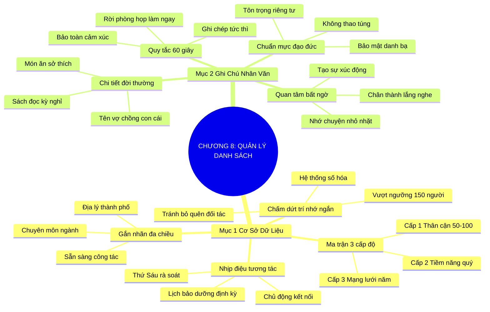

# TÓM TẮT CHƯƠNG SÁCH: CHƯƠNG 8: GHI NHỚ VÀ QUẢN LÝ DANH SÁCH (TAKE NAMES)
* **Thuộc phần**: Phần 2: Bộ Kỹ Năng Thực Chiến (The Skill Set)
* **Tác giả**: Keith Ferrazzi (với Tahl Raz)
* **Chuẩn hóa cấu trúc**: Document Structure-Anchored v2.4

---

## 🌟 THÔNG ĐIỆP CỐT LÕI (CORE MESSAGE)
> Đừng bao giờ tin vào trí nhớ ngắn hạn: Xây dựng cơ sở dữ liệu quan hệ chuyên nghiệp 3 cấp độ kết hợp thói quen ghi chú nhân văn ngay sau mỗi cuộc gặp sẽ biến danh bạ tĩnh thành mạng lưới trợ lực sống động suốt đời.

---

## 📊 LƯỢC ĐỒ PHÂN BỔ CẤU TRÚC TÀI LIỆU
Bảng đối chiếu tỷ lệ và cấu trúc luận điểm bám sát các đề mục thực tế trong tài liệu:

| 📑 Đề Mục Trong Tài Liệu Gốc | 🎯 Số Lượng Luận Điểm Chuyên Sâu |
| :--- | :---: |
| Mục 1: Xây Dựng Cơ Sở Dữ Liệu Quan Hệ Chuyên Nghiệp (Building Your Relationship Database) | 4 |
| Mục 2: Thói Quen Ghi Chú Nhân Văn (The Human Touch Note-Taking) | 4 |
| **Tổng cộng toàn chương** | **8 Luận Điểm** |

---

## 💡 HỆ THỐNG LUẬN ĐIỂM QUAN TRỌNG (KEY TAKEAWAYS)

#### 📑 PHẦN: MỤC 1: XÂY DỰNG CƠ SỞ DỮ LIỆU QUAN HỆ CHUYÊN NGHIỆP (BUILDING YOUR RELATIONSHIP DATABASE)

##### 1. Chấm dứt ảo tưởng về trí nhớ và số hóa mạng lưới quan hệ
* **Phân Tích Chuyên Sâu**: Khi số lượng liên lạc vượt qua mốc 150 người (con số Dunbar), não bộ con người hoàn toàn bất lực trong việc duy trì ngữ cảnh và nhịp độ kết nối nếu không có hệ thống hỗ trợ. Việc dựa dẫm vào trí nhớ ngắn hạn sẽ dẫn tới sự bỏ quên đối tác, nhầm lẫn thông tin và đánh mất các cơ hội chiến lược.
* **Công Cụ / Phương Pháp Đi Kèm**: Hệ thống quản lý quan hệ cá nhân (Personal CRM: Notion, Airtable, HubSpot Cá nhân), Danh bạ số đồng bộ đa thiết bị.
* **Ví Dụ Thực Tế Ứng Dụng**: Keith Ferrazzi quản lý hàng ngàn mối quan hệ bằng cách phân loại chi tiết và đặt lịch nhắc tự động thay vì cố ghi nhớ trong đầu.

##### 2. Mô hình phân tầng danh bạ 3 cấp độ kết nối
* **Phân Tích Chuyên Sâu**: Không phải mọi mối quan hệ đều đòi hỏi mức độ năng lượng như nhau. Một hệ thống hiệu quả cần phân bổ thành 3 cấp độ: Cấp 1 (Thân cận: 50-100 người, liên lạc hàng tháng), Cấp 2 (Tiềm năng & Đồng nghiệp: liên lạc mỗi quý), Cấp 3 (Mạng lưới mở rộng: gửi lời chúc lễ tết hoặc bản tin hàng năm).
* **Công Cụ / Phương Pháp Đi Kèm**: Mô hình ma trận 3 cấp độ danh bạ (Tier 1 - Inner Circle, Tier 2 - Key Contacts, Tier 3 - Broad Network).
* **Ví Dụ Thực Tế Ứng Dụng**: Lập danh sách 50 người bạn và cố vấn quan trọng nhất vào Tier 1 để chủ động gọi điện hoặc hẹn ăn trưa định kỳ mỗi 30 ngày.

##### 3. Thiết lập nhịp điệu tương tác định kỳ chủ động
* **Phân Tích Chuyên Sâu**: Mối quan hệ không tự nhiên duy trì mà cần một 'lịch bảo dưỡng'. Bằng cách gán tần suất tương tác cố định cho từng nhóm, bạn sẽ biến việc chăm sóc mạng lưới thành một quy trình vận hành trơn tru thay vì chờ đợi khi có việc mới cuống cuồng liên lạc.
* **Công Cụ / Phương Pháp Đi Kèm**: Tính năng định kỳ liên lạc (Cadence Schedule), Lịch số Google Calendar / Outlook nhắc nhở.
* **Ví Dụ Thực Tế Ứng Dụng**: Dành sáng thứ Sáu hàng tuần để kiểm tra danh sách Tier 2 và gửi 3 tin nhắn hỏi thăm tiến độ công việc của các đối tác quan trọng.

##### 4. Gắn nhãn định danh và phân loại theo vị trí địa lý
* **Phân Tích Chuyên Sâu**: Khi đi công tác đến bất kỳ thành phố nào, khả năng lọc nhanh danh sách những người quen tại khu vực đó sẽ giúp bạn tối đa hóa từng giờ rảnh rỗi để tổ chức các buổi gặp gỡ bất ngờ đầy giá trị.
* **Công Cụ / Phương Pháp Đi Kèm**: Hệ thống gắn nhãn đa chiều (Tagging System: Thành phố, Lĩnh vực chuyên môn, Sở thích).
* **Ví Dụ Thực Tế Ứng Dụng**: Trước chuyến bay đi Đà Nẵng, lọc danh bạ theo thẻ 'Đà Nẵng' và hẹn trước 2 người bạn cũ cùng dùng bữa tối.

#### 📑 PHẦN: MỤC 2: THÓI QUEN GHI CHÚ NHÂN VĂN (THE HUMAN TOUCH NOTE-TAKING)

##### 5. Quy tắc 1 phút ghi chú tức thì sau cuộc gặp
* **Phân Tích Chuyên Sâu**: Những chi tiết cảm xúc đắt giá nhất thường bị xóa sạch khỏi tâm trí sau 24 giờ. Thói quen dừng lại 60 giây ngay sau khi rời quán cà phê hay phòng họp để ghi lại các thông tin cá nhân vừa được chia sẻ chính là vũ khí bí mật tạo nên sự khác biệt vượt trội.
* **Công Cụ / Phương Pháp Đi Kèm**: Quy tắc ghi chú 60 giây (The 60-Second Post-Meeting Drill), Ứng dụng ghi chú nhanh trên điện thoại (Apple Notes, Google Keep).
* **Ví Dụ Thực Tế Ứng Dụng**: Ngay khi bước vào xe taxi sau bữa tối, Keith ghi nhanh vào điện thoại: 'Vợ tên Mai, con gái thích vẽ tranh, chuẩn bị chuyển nhà sang quận 2'.

##### 6. Ghi nhận toàn diện các thông tin đời tư có ý nghĩa
* **Phân Tích Chuyên Sâu**: Các dữ liệu nhân văn bao gồm: ngày sinh nhật, tên người bạn đời, số lượng con cái, sở thích ẩm thực, cuốn sách đang đọc, hoặc các cột mốc sức khỏe. Đây là chất liệu tạo nên những cuộc trò chuyện xúc động và chân thành trong tương lai.
* **Công Cụ / Phương Pháp Đi Kèm**: Mẫu hồ sơ nhân văn cá nhân (Human Profile Template).
* **Ví Dụ Thực Tế Ứng Dụng**: Ghi nhận đối tác đang hồi phục sau ca phẫu thuật đầu gối để lần tới liên lạc gửi lời hỏi thăm tình hình bình phục của họ.

##### 7. Sức mạnh gây kinh ngạc của sự quan tâm có chủ đích
* **Phân Tích Chuyên Sâu**: Khi bạn nhắn tin sau 4 tháng: 'Chuyến du lịch Sa Pa của gia đình anh tháng trước có vui không?', đối phương sẽ vô cùng bất ngờ và cảm động. Họ hiểu rằng bạn thực sự lắng nghe bằng cả tấm lòng chứ không chỉ đãi bôi xã giao.
* **Công Cụ / Phương Pháp Đi Kèm**: Thông điệp tái kết nối nhân văn (Human Recall Message).
* **Ví Dụ Thực Tế Ứng Dụng**: Gửi lời chúc mừng sinh nhật kèm nhắc lại một kỷ niệm vui mà hai người đã chia sẻ trong lần gặp năm ngoái.

##### 8. Bảo mật và chuẩn mực đạo đức trong quản lý thông tin
* **Phân Tích Chuyên Sâu**: Hệ thống dữ liệu cá nhân phải được xây dựng trên nền tảng thiện chí và tôn trọng tuyệt đối sự riêng tư. Tuyệt đối không dùng thông tin đời tư làm công cụ thao túng hay chia sẻ bừa bãi cho bên thứ ba.
* **Công Cụ / Phương Pháp Đi Kèm**: Quy chuẩn đạo đức kết nối (Integrity Firewall), Bảo mật dữ liệu danh bạ cá nhân.
* **Ví Dụ Thực Tế Ứng Dụng**: Không bao giờ tiết lộ chuyện gia đình tế nhị của đối tác với những người khác trong cùng ngành.

---

## 🎯 KẾ HOẠCH HÀNH ĐỘNG TOÀN DIỆN (ACTION PLAN)
### ⚡ Cấp độ 1: Thói quen vi mô (Micro-habits < 2 phút mỗi ngày)
- [ ] Phân loại toàn bộ danh bạ hiện có thành 3 cấp độ: Thân cận, Tiềm năng, Mở rộng
- [ ] Chọn ra 50 người quan trọng nhất cho danh sách Cấp 1 (Inner Circle)
- [ ] Thiết lập ứng dụng ghi chú nhanh trên màn hình chính điện thoại
- [ ] Dành 1 phút ngay sau cuộc họp hôm nay để ghi lại 2 chi tiết nhân văn về đối tác
- [ ] Thêm các trường 'Tên người bạn đời', 'Sở thích', 'Ngày sinh' vào danh bạ

### 📅 Cấp độ 2: Thói quen tuần & Dự án ngắn hạn (Weekly Habits)
- [ ] Lên lịch cố định 30 phút sáng thứ Sáu để rà soát và tương tác danh sách Cấp 2
- [ ] Gắn thẻ vị trí địa lý (Hà Nội, Sài Gòn, Đà Nẵng...) cho các liên lạc chính
- [ ] Gửi tin nhắn hỏi thăm 1 đối tác dựa trên ghi chú cũ về chuyến đi du lịch của họ
- [ ] Sao lưu cơ sở dữ liệu quan hệ lên đám mây an toàn
- [ ] Xóa hoặc dọn dẹp các số điện thoại rác, không rõ nguồn gốc trong danh bạ

### 🚀 Cấp độ 3: Chiến lược chuyển hóa dài hạn (Long-term Strategy)
- [ ] Đặt lời nhắc sinh nhật của 10 người quan trọng nhất trong mạng lưới
- [ ] Kiểm tra lại danh bạ trước chuyến công tác tuần tới để lên lịch hẹn trước
- [ ] Thực hành thói quen hỏi han tình hình người thân của đối tác khi trò chuyện
- [ ] Viết nhật ký ngắn tóm tắt kết quả các cuộc gặp gỡ cuối ngày
- [ ] Thiết lập bảng tính theo dõi ngày tương tác gần nhất của danh sách Tier 1

---

## ❓ BỘ CÂU HỎI TỰ VẤN & PHẢN TƯ SUY NGẪM (REFLECTION QUESTIONS)
### Nhóm 1: Nhận thức thực tại & Thói quen hiện tại
1. Bạn đang lưu trữ danh sách các mối quan hệ của mình ở đâu, hay chỉ phụ thuộc vào trí nhớ?
2. Khi số lượng liên lạc tăng lên, bạn đã bao giờ vô tình bỏ quên một người bạn hoặc đối tác quan trọng chưa?
3. 50 người nằm trong Vòng tròn Thân cận (Tier 1) của bạn hiện tại gồm những ai?
4. Bao lâu rồi bạn chưa liên lạc với những người bạn thân thiết trong danh sách Cấp 1?
5. Bạn cảm thấy thế nào khi nhận được một tin nhắn hỏi thăm về một chi tiết nhỏ bạn từng buột miệng kể?

### Nhóm 2: Thách thức tâm lý & Rào cản nội tâm
6. Tại sao việc dừng lại 60 giây sau cuộc gặp để ghi chú lại quan trọng hơn việc chạy ngay sang việc khác?
7. Những thông tin nhân văn nào (sở thích, gia đình, thú cưng...) bạn thấy đối tác hay chia sẻ nhất?
8. Làm sao để việc ghi chép thông tin cá nhân giữ được sự chân thành mà không biến thành tính toán cơ hội?
9. Bạn có sẵn sàng đầu tư một công cụ quản lý quan hệ chuyên nghiệp (Notion, Airtable) cho sự nghiệp không?
10. Khi đi công tác xa, bạn có tận dụng danh bạ địa phương để tối ưu hóa thời gian không?

### Nhóm 3: Chiến lược hành động & Ứng dụng thực tế
11. Bạn có nhớ ngày sinh nhật hay sở thích ẩm thực của 5 khách hàng chiến lược nhất không?
12. Điều gì ngăn cản bạn duy trì thói quen ghi chú nhân văn đều đặn mỗi ngày?
13. Bạn phân chia thời gian và năng lượng cho 3 cấp độ danh bạ như thế nào để không bị kiệt sức?
14. Một ghi chú nhân văn tốt nhất mà bạn từng ghi lại về một đối tác là gì?
15. Làm thế nào để đảm bảo dữ liệu quan hệ của bạn luôn được bảo mật tuyệt đối?

### Nhóm 4: Chuyển hóa tư duy & Tầm nhìn dài hạn
16. Bạn có bao giờ cảm thấy ngại ngùng khi hỏi thăm về gia đình đối tác không, và làm sao vượt qua?
17. Tần suất liên lạc lý tưởng cho những người quen tại các hội nghị (Tier 3) theo bạn là bao nhiêu?
18. Việc số hóa danh bạ đã làm thay đổi hiệu quả công việc của bạn như thế nào?
19. Nếu một người bạn cũ bất ngờ gọi điện hỏi thăm sau 2 năm mà nhớ rõ mọi chuyện của bạn, bạn nghĩ gì?
20. Bước đầu tiên bạn sẽ làm tối nay để cấu trúc lại toàn bộ danh bạ của mình là gì?

---

## 🧠 SƠ ĐỒ TƯ DUY TRỰC QUAN (MINDMAP)

