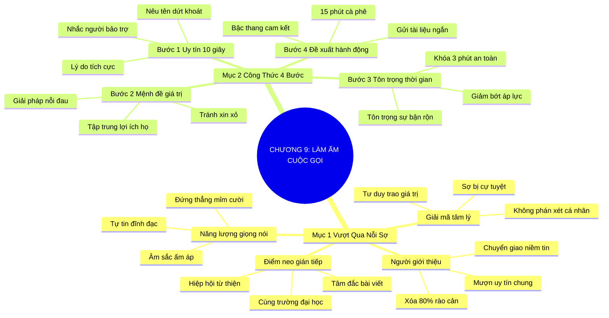

# SƠ ĐỒ TƯ DUY TRỰC QUAN: CHƯƠNG 9: LÀM ẤM CUỘC GỌI TIẾP CẬN NGƯỜI LẠ (WARMING THE COLD CALL)
* **Thuộc phần**: Phần 2: Bộ Kỹ Năng Thực Chiến (The Skill Set)
* **Tác phẩm**: Đừng Bao Giờ Đi Ăn Một Mình (Never Eat Alone) - Keith Ferrazzi
* **Chuẩn hóa**: Document Structure-Anchored v2.4 (Không nhãn meta thừa, phản ánh 100% cấu trúc tài liệu)

---

## 🌳 SƠ ĐỒ TƯ DUY MERMAID (4-5 TẦNG CHI TIẾT)

---

## 🧬 BẢNG PHÂN CẤP TRUY HỒI CHỦ ĐỘNG (ACTIVE RECALL HIERARCHY)
Cấu trúc hóa tri thức theo các nhánh tài liệu phục vụ ôn tập nhanh và khắc sâu trí nhớ:

| 📑 Nhánh Mục Tài Liệu | 🔑 Từ Khóa Vàng / Khái Niệm | 📝 Nội Dung Truy Hồi Chủ Động (Active Recall) |
| :--- | :--- | :--- |
| Mục 1: Vượt Qua Nỗi Ám Ảnh Cuộc Gọi Lạ | **Giải mã nỗi sợ** | Từ chối là dấu hiệu cần chỉnh thời điểm, không phải phán xét phẩm giá cá nhân. |
| Mục 1: Vượt Qua Nỗi Ám Ảnh Cuộc Gọi Lạ | **Người giới thiệu** | Mượn uy tín người bạn chung để xóa tan 80% hàng rào phòng thủ ngay lập tức. |
| Mục 1: Vượt Qua Nỗi Ám Ảnh Cuộc Gọi Lạ | **Năng lượng giọng nói** | Đứng dậy và mỉm cười khi gọi điện giúp giọng nói ấm áp, đĩnh đạc và tự tin. |
| Mục 2: Công Thức 4 Bước Thực Chiến | **Bước 1 & 2: Uy tín & Giá trị** | 10 giây đầu nêu tên và người giới thiệu; lập tức nêu lợi ích mang đến cho họ. |
| Mục 2: Công Thức 4 Bước Thực Chiến | **Bước 3: Tôn trọng thời gian** | Cam kết rõ ràng chỉ xin 3-5 phút trao đổi để người bận rộn an tâm lắng nghe. |
| Mục 2: Công Thức 4 Bước Thực Chiến | **Bước 4: Đề xuất nhẹ nhàng** | Đưa ra hành động cam kết thấp: 15 phút cà phê tiện đường hoặc gửi email tóm tắt. |

---

## ⚡ BẢNG NEO TRÍ NHỚ NHANH (MEMORY ANCHOR CHEAT SHEET)
Tóm tắt cô đọng các công thức và quy tắc hành động của chương:

| 📑 Phần/Mục Tài Liệu | 📌 Khái Niệm Cốt Lõi | ⚖️ Nguyên Lý Vàng | 🚀 Hành Động Chuyển Hóa Ngay |
| :--- | :--- | :--- | :--- |
| Mục 1: Vượt qua nỗi sợ | **Chuyển giao niềm tin** | Mượn tên người bạn chung để mở đầu | Xóa tan 80% nghi ngờ của người lạ |
| Mục 1: Vượt qua nỗi sợ | **Điểm neo gián tiếp** | Trích dẫn bài viết, bài phát biểu của đối tác | Tạo sự chú ý chân thành và thiện cảm |
| Mục 2: Công thức 4 bước | **10 giây đầu & Giá trị** | Nêu tên + người bảo trợ + lợi ích cụ thể cho họ | Thu hút sự chú ý tức thì |
| Mục 2: Công thức 4 bước | **Cam kết thời gian & Đề xuất** | Xin đúng 3 phút + đề xuất 15 phút cà phê | Khiến người nghe dễ dàng gật đầu đồng ý |

