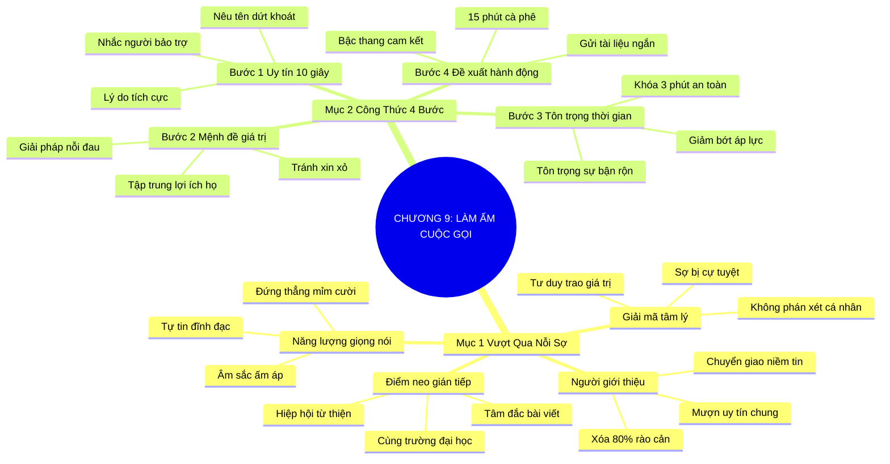

# TÓM TẮT CHƯƠNG SÁCH: CHƯƠNG 9: LÀM ẤM CUỘC GỌI TIẾP CẬN NGƯỜI LẠ (WARMING THE COLD CALL)
* **Thuộc phần**: Phần 2: Bộ Kỹ Năng Thực Chiến (The Skill Set)
* **Tác giả**: Keith Ferrazzi (với Tahl Raz)
* **Chuẩn hóa cấu trúc**: Document Structure-Anchored v2.4

---

## 🌟 THÔNG ĐIỆP CỐT LÕI (CORE MESSAGE)
> Không có cuộc gọi nào thực sự lạnh nếu bạn biết cách làm ấm: Tận dụng uy tín người giới thiệu và công thức 4 bước thần tốc sẽ đập tan 80% rào cản phòng thủ, biến nỗi sợ từ chối thành cơ hội đối thoại giá trị.

---

## 📊 LƯỢC ĐỒ PHÂN BỔ CẤU TRÚC TÀI LIỆU
Bảng đối chiếu tỷ lệ và cấu trúc luận điểm bám sát các đề mục thực tế trong tài liệu:

| 📑 Đề Mục Trong Tài Liệu Gốc | 🎯 Số Lượng Luận Điểm Chuyên Sâu |
| :--- | :---: |
| Mục 1: Vượt Qua Nỗi Ám Ảnh Của Những Cuộc Gọi Lạ (Conquering The Fear Of Cold Calling) | 4 |
| Mục 2: Công Thức Bốn Bước Cho Một Cuộc Gọi Thành Công (The Four Step Call Formula) | 4 |
| **Tổng cộng toàn chương** | **8 Luận Điểm** |

---

## 💡 HỆ THỐNG LUẬN ĐIỂM QUAN TRỌNG (KEY TAKEAWAYS)

#### 📑 PHẦN: MỤC 1: VƯỢT QUA NỖI ÁM ẢNH CỦA NHỮNG CUỘC GỌI LẠ (CONQUERING THE FEAR OF COLD CALLING)

##### 1. Giải mã tâm lý sợ bị từ chối trong giao tiếp người lạ
* **Phân Tích Chuyên Sâu**: Nỗi sợ gọi điện cho người lạ xuất phát từ bản năng sợ bị cự tuyệt và sợ bị coi là kẻ quấy rối phiền toái. Tuy nhiên, trong kinh doanh, từ chối không phải là sự phán xét phẩm giá cá nhân; đó chỉ là dấu hiệu cho thấy thời điểm hoặc cách tiếp cận chưa phù hợp. Khi thay đổi tư duy từ 'xin xỏ' sang 'mang lại giải pháp giá trị', sự sợ hãi sẽ biến mất.
* **Công Cụ / Phương Pháp Đi Kèm**: Tái định khung nhận thức (Cognitive Reframing: Từ kẻ đi xin sang sứ giả trao giá trị), Thống kê xác suất bán hàng.
* **Ví Dụ Thực Tế Ứng Dụng**: Xem mỗi lời từ chối là một bước tiến gần hơn tới cái gật đầu tiếp theo, giữ vững tâm lý hào hứng khi nhấc máy.

##### 2. Vũ khí tối thượng: Mượn uy tín người giới thiệu trung gian
* **Phân Tích Chuyên Sâu**: Không bao giờ thực hiện một cuộc gọi lạnh hoàn toàn. Khi bạn mở đầu bằng việc nhắc tên một người bạn chung đáng kính, 80% rào cản phòng vệ của người nghe lập tức bị vô hiệu hóa. Niềm tin và sự tôn trọng của người bạn chung được chuyển giao trực tiếp sang cho bạn trong tích tắc.
* **Công Cụ / Phương Pháp Đi Kèm**: Cơ chế chuyển giao niềm tin (Trust Transfer Bridge), Câu mở đầu mượn uy tín ('Tôi gọi theo lời gợi ý của anh Ba...').
* **Ví Dụ Thực Tế Ứng Dụng**: Keith gọi cho các tổng giám đốc tập đoàn lớn luôn nhắc tên một giáo sư Harvard hoặc đối tác chung để mở đầu câu chuyện.

##### 3. Khai thác các điểm neo kết nối gián tiếp khi thiếu người giới thiệu
* **Phân Tích Chuyên Sâu**: Nếu không có bạn chung trực tiếp, hãy tìm kiếm các sợi dây liên kết mềm: cùng học chung trường đại học, cùng tham gia một hiệp hội từ thiện, hoặc vừa đọc và tâm đắc sâu sắc với bài viết/bài phát biểu mới nhất của họ.
* **Công Cụ / Phương Pháp Đi Kèm**: Kỹ thuật neo ngữ cảnh gián tiếp (Indirect Context Anchoring), Trích dẫn bài nói chuyện công chúng của đối tác.
* **Ví Dụ Thực Tế Ứng Dụng**: 'Chào chị, tôi vừa nghe bài phát biểu truyền cảm hứng của chị tại diễn đàn kinh tế tuần trước và rất tâm đắc với luận điểm về chuyển đổi số...'

##### 4. Tạo nhiệt lượng cảm xúc trước khi bấm số
* **Phân Tích Chuyên Sâu**: Giọng nói truyền tải năng lượng và thái độ nhanh hơn từ ngữ. Đứng dậy, mỉm cười và hít thở sâu trước khi bấm máy sẽ giúp giọng đọc của bạn toát lên sự tự tin, ấm áp và đĩnh đạc, khiến người ở đầu dây bên kia cảm thấy dễ chịu.
* **Công Cụ / Phương Pháp Đi Kèm**: Quy trình kích hoạt trạng thái đỉnh cao (State Management Drill: Đứng thẳng, mỉm cười, phát âm rõ ràng).
* **Ví Dụ Thực Tế Ứng Dụng**: Đứng dậy khi nói chuyện điện thoại với đối tác cấp cao để giọng nói có độ vang và uy lực tự nhiên.

#### 📑 PHẦN: MỤC 2: CÔNG THỨC BỐN BƯỚC CHO MỘT CUỘC GỌI THÀNH CÔNG (THE FOUR STEP CALL FORMULA)

##### 5. Bước 1: Thiết lập sự tin cậy trong 10 giây đầu tiên
* **Phân Tích Chuyên Sâu**: Mười giây đầu tiên quyết định người nghe sẽ tiếp tục lắng nghe hay cúp máy. Bạn phải nêu ngay tên mình, người giới thiệu hoặc lý do tích cực và cụ thể khiến bạn chủ động tìm đến họ một cách dứt khoát, không ấp úng.
* **Công Cụ / Phương Pháp Đi Kèm**: Mẫu câu 10 giây thiết lập uy tín (The 10-Second Credibility Hook).
* **Ví Dụ Thực Tế Ứng Dụng**: 'Chào anh Tuấn, tôi là Hoàng Anh, tôi gọi cho anh theo lời khuyên của chị Lan bên phòng chiến lược...'

##### 6. Bước 2: Nêu bật mệnh đề giá trị mang lại cho họ
* **Phân Tích Chuyên Sâu**: Không ai quan tâm bạn muốn gì; họ chỉ quan tâm bạn mang lại điều gì cho họ. Hãy nói thẳng vào giải pháp hoặc giá trị cụ thể có thể hỗ trợ mục tiêu của họ, tuyệt đối cấm kỵ việc mở đầu bằng nhờ vả hay kể lể về bản thân.
* **Công Cụ / Phương Pháp Đi Kèm**: Mệnh đề giá trị sắc bén (Value Proposition Pitch: 'Tôi muốn chia sẻ một giải pháp giúp tối ưu 20% chi phí vận hành...').
* **Ví Dụ Thực Tế Ứng Dụng**: Nhấn mạnh ngay cơ hội kết nối đối tác mới mà công ty họ đang tìm kiếm thay vì xin một cuộc hẹn giới thiệu dịch vụ chung chung.

##### 7. Bước 3: Tôn trọng thời gian và thể hiện tính khẩn trương
* **Phân Tích Chuyên Sâu**: Những người bận rộn rất sợ bị mắc kẹt vào các cuộc gọi kéo dài vô tận. Việc cam kết rõ ràng: 'Tôi biết anh vô cùng bận rộn, tôi chỉ xin phép trò chuyện ngắn gọn trong 3 phút' sẽ giúp họ cảm thấy an tâm và sẵn sàng lắng nghe.
* **Công Cụ / Phương Pháp Đi Kèm**: Khóa thời gian an toàn (Time-Lock Agreement: Cam kết 3-5 phút ngắn gọn).
* **Ví Dụ Thực Tế Ứng Dụng**: 'Tôi biết sáng nay anh đang có lịch họp liên tục, tôi chỉ xin đúng 2 phút để trao đổi nhanh điểm mấu chốt này...'

##### 8. Bước 4: Đưa ra đề xuất hành động nhẹ nhàng, dễ chấp nhận
* **Phân Tích Chuyên Sâu**: Đừng đòi hỏi một cuộc gặp kéo dài 1 tiếng hay một hợp đồng ngay lập tức. Hãy đề xuất một bước đi nhỏ nhất có thể: 15 phút cà phê tiện đường, một cuộc gọi zoom ngắn vào tuần sau hoặc gửi bản tóm tắt qua email.
* **Công Cụ / Phương Pháp Đi Kèm**: Kỹ thuật bậc thang cam kết (Low-Barrier Action Proposal: Micro-commitment).
* **Ví Dụ Thực Tế Ứng Dụng**: 'Nếu anh thấy hữu ích, tuần tới tôi có thể ghé qua văn phòng anh 10 phút lúc tiện đường, hoặc tôi gửi bản tóm tắt 1 trang vào email cho anh?'

---

## 🎯 KẾ HOẠCH HÀNH ĐỘNG TOÀN DIỆN (ACTION PLAN)
### ⚡ Cấp độ 1: Thói quen vi mô (Micro-habits < 2 phút mỗi ngày)
- [ ] Liệt kê danh sách 5 người bạn muốn tiếp cận và tìm kiếm người bạn chung của họ
- [ ] Xin phép người bạn chung trước khi lấy tên họ làm lời giới thiệu cuộc gọi
- [ ] Soạn sẵn kịch bản 4 bước ra giấy trước khi bấm số gọi người lạ
- [ ] Đứng thẳng người và mỉm cười trước gương khi thực hiện cuộc gọi
- [ ] Giới hạn lời mở đầu giới thiệu bản thân và người bảo trợ trong 10 giây

### 📅 Cấp độ 2: Thói quen tuần & Dự án ngắn hạn (Weekly Habits)
- [ ] Chuẩn bị một mệnh đề giá trị rõ ràng giải quyết đúng nỗi đau của đối tác
- [ ] Cam kết thời lượng cuộc gọi không quá 3-5 phút ngay từ đầu
- [ ] Đưa ra đề xuất hẹn gặp 15 phút cà phê nhẹ nhàng thay vì cuộc họp dài
- [ ] Gửi ngay email cảm ơn tóm tắt nội dung sau khi kết thúc cuộc gọi
- [ ] Tìm đọc 1 bài phát biểu của đối tác để lấy cảm hứng mở đầu nếu không có bạn chung

### 🚀 Cấp độ 3: Chiến lược chuyển hóa dài hạn (Long-term Strategy)
- [ ] Rèn luyện tâm lý xem lời từ chối là dữ liệu để cải thiện kịch bản tiếp cận
- [ ] Tuyệt đối không dùng những câu hỏi sáo rỗng như 'Anh có đang rảnh không?'
- [ ] Đặt mục tiêu thực hiện 3 cuộc gọi làm ấm mỗi tuần để rèn luyện bản lĩnh
- [ ] Ghi chú phản hồi của người nghe vào nhật ký cuộc gọi để rút kinh nghiệm
- [ ] Thử nghiệm phương thức tiếp cận qua tin nhắn LinkedIn ấm áp trước khi gọi điện

---

## ❓ BỘ CÂU HỎI TỰ VẤN & PHẢN TƯ SUY NGẪM (REFLECTION QUESTIONS)
### Nhóm 1: Nhận thức thực tại & Thói quen hiện tại
1. Cảm giác lớn nhất ngăn cản bạn nhấc máy gọi cho một người lạ quan trọng là gì?
2. Bạn đã từng có trải nghiệm tuyệt vời nào bắt đầu từ một cuộc gọi tiếp cận người lạ chưa?
3. Tại sao việc mượn uy tín người bạn chung lại có thể xóa bỏ tới 80% rào cản tâm lý?
4. Bạn sẽ nói gì trong 10 giây đầu tiên để người nghe không cúp máy?
5. Mệnh đề giá trị của bạn đã thực sự tập trung vào lợi ích của họ hay vẫn đang nói về bạn?

### Nhóm 2: Thách thức tâm lý & Rào cản nội tâm
6. Tại sao việc cam kết thời gian ngắn (3 phút) lại khiến người bận rộn dễ mở lòng hơn?
7. Bạn xử lý thế nào khi đối phương từ chối thẳng thừng ở giây thứ 15?
8. Bạn có chuẩn bị sẵn kịch bản trước khi gọi hay thường nói chuyện tùy hứng?
9. Năng lượng và nụ cười trong giọng nói ảnh hưởng thế nào đến người nghe qua điện thoại?
10. Khi không có người giới thiệu, điểm neo gián tiếp nào bạn thấy hiệu quả nhất?

### Nhóm 3: Chiến lược hành động & Ứng dụng thực tế
11. Bạn có thường xuyên xin phép người bạn chung trước khi mượn tên họ không?
12. Làm sao để lời đề xuất gặp gỡ trở nên tự nhiên và không tạo áp lực cho đối phương?
13. Bạn phân biệt thế nào giữa một cuộc gọi 'làm ấm' thông minh và cuộc gọi bán hàng quấy rối (Spam)?
14. Cần chuẩn bị những gì trước khi gọi cho một nhân vật có tầm ảnh hưởng lớn trong ngành?
15. Sau bao nhiêu lần bị từ chối thì bạn sẽ dừng lại hoặc chuyển hướng tiếp cận?

### Nhóm 4: Chuyển hóa tư duy & Tầm nhìn dài hạn
16. Bạn có gửi tin nhắn hoặc email follow-up ngay sau cuộc gọi không?
17. Tốc độ nói và tông giọng của bạn trong cuộc gọi lạ thường như thế nào?
18. Điều tồi tệ nhất có thể xảy ra khi bạn gọi điện cho một người lạ là gì, và nó có thực sự nguy hiểm?
19. Làm thế nào để biến kỹ năng gọi điện tiếp cận thành một thói quen tự nhiên không còn sợ hãi?
20. Ai là người quan trọng nhất bạn sẽ lên kế hoạch 'làm ấm' và gọi điện trong tuần này?

---

## 🧠 SƠ ĐỒ TƯ DUY TRỰC QUAN (MINDMAP)

