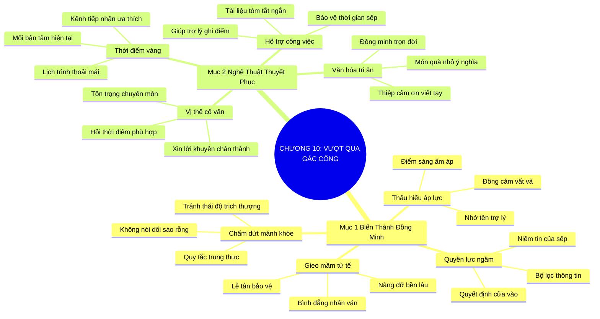

# SƠ ĐỒ TƯ DUY TRỰC QUAN: CHƯƠNG 10: VƯỢT QUA NGƯỜI GÁC CỔNG MỘT CÁCH NGHỆ THUẬT (MANAGING THE GATEKEEPER ARTFULLY)
* **Thuộc phần**: Phần 2: Bộ Kỹ Năng Thực Chiến (The Skill Set)
* **Tác phẩm**: Đừng Bao Giờ Đi Ăn Một Mình (Never Eat Alone) - Keith Ferrazzi
* **Chuẩn hóa**: Document Structure-Anchored v2.4 (Không nhãn meta thừa, phản ánh 100% cấu trúc tài liệu)

---

## 🌳 SƠ ĐỒ TƯ DUY MERMAID (4-5 TẦNG CHI TIẾT)

---

## 🧬 BẢNG PHÂN CẤP TRUY HỒI CHỦ ĐỘNG (ACTIVE RECALL HIERARCHY)
Cấu trúc hóa tri thức theo các nhánh tài liệu phục vụ ôn tập nhanh và khắc sâu trí nhớ:

| 📑 Nhánh Mục Tài Liệu | 🔑 Từ Khóa Vàng / Khái Niệm | 📝 Nội Dung Truy Hồi Chủ Động (Active Recall) |
| :--- | :--- | :--- |
| Mục 1: Biến Người Gác Cổng Thành Đồng Minh | **Quyền lực ngầm** | Trợ lý là tai mắt và bộ não thứ hai của sếp; không thể tiếp cận sếp nếu trợ lý không tin tưởng. |
| Mục 1: Biến Người Gác Cổng Thành Đồng Minh | **Chấm dứt mánh khóe** | Nói dối hay trịch thượng là sai lầm tự sát; phải trung thực và tôn trọng tuyệt đối. |
| Mục 1: Biến Người Gác Cổng Thành Đồng Minh | **Gieo mầm tử tế** | Nhớ tên và đối xử tử tế với lễ tân, bảo vệ, trợ lý tạo nên luồng sinh khí nâng đỡ sự nghiệp. |
| Mục 2: Nghệ Thuật Thuyết Phục Trợ Lý | **Vị thế cố vấn** | Chân thành xin ý kiến trợ lý về thời điểm và cách thức tiếp cận sếp hiệu quả nhất. |
| Mục 2: Nghệ Thuật Thuyết Phục Trợ Lý | **Hỗ trợ công việc** | Cung cấp bản tóm tắt 1 trang cực ngắn giúp trợ lý dễ dàng trình sếp mà không mất thời gian. |
| Mục 2: Nghệ Thuật Thuyết Phục Trợ Lý | **Văn hóa tri ân** | Gửi thiệp cảm ơn và duy trì sự quan tâm chân thành biến trợ lý thành đồng minh lâu dài. |

---

## ⚡ BẢNG NEO TRÍ NHỚ NHANH (MEMORY ANCHOR CHEAT SHEET)
Tóm tắt cô đọng các công thức và quy tắc hành động của chương:

| 📑 Phần/Mục Tài Liệu | 📌 Khái Niệm Cốt Lõi | ⚖️ Nguyên Lý Vàng | 🚀 Hành Động Chuyển Hóa Ngay |
| :--- | :--- | :--- | :--- |
| Mục 1: Biến thành đồng minh | **Quyền lực ngầm** | Trợ lý nắm giữ niềm tin tối cao của sếp | Đối xử bằng sự tôn trọng và biết ơn |
| Mục 1: Biến thành đồng minh | **Nhớ tên & Đồng cảm** | Hỏi han áp lực công việc và nhớ rõ tên họ | Trở thành người khách lịch sự nhất |
| Mục 2: Nghệ thuật thuyết phục | **Vị thế cố vấn** | Xin lời khuyên của trợ lý về thời điểm trình sếp | Biến người gác cổng thành người dẫn đường |
| Mục 2: Nghệ thuật thuyết phục | **Văn hóa tri ân** | Gửi thiệp cảm ơn sau khi cuộc họp thành công | Xây dựng tình đồng minh vững chắc qua năm tháng |

