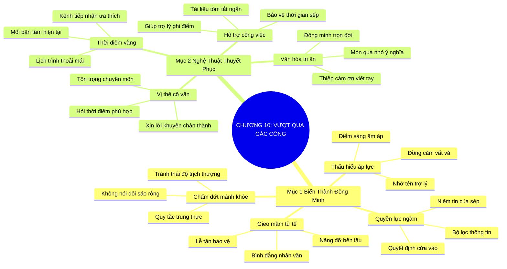

# TÓM TẮT CHƯƠNG SÁCH: CHƯƠNG 10: VƯỢT QUA NGƯỜI GÁC CỔNG MỘT CÁCH NGHỆ THUẬT (MANAGING THE GATEKEEPER ARTFULLY)
* **Thuộc phần**: Phần 2: Bộ Kỹ Năng Thực Chiến (The Skill Set)
* **Tác giả**: Keith Ferrazzi (với Tahl Raz)
* **Chuẩn hóa cấu trúc**: Document Structure-Anchored v2.4

---

## 🌟 THÔNG ĐIỆP CỐT LÕI (CORE MESSAGE)
> Người gác cổng không phải chướng ngại vật mà là đồng minh chiến lược: Đối xử với trợ lý bằng sự tôn trọng, lòng biết ơn và đặt họ vào vai trò cố vấn sẽ mở toang cánh cửa bước vào văn phòng quyền lực nhất.

---

## 📊 LƯỢC ĐỒ PHÂN BỔ CẤU TRÚC TÀI LIỆU
Bảng đối chiếu tỷ lệ và cấu trúc luận điểm bám sát các đề mục thực tế trong tài liệu:

| 📑 Đề Mục Trong Tài Liệu Gốc | 🎯 Số Lượng Luận Điểm Chuyên Sâu |
| :--- | :---: |
| Mục 1: Biến Người Gác Cổng Thành Đồng Minh Thân Cận Nhất (Turning Gatekeepers Into Allies) | 4 |
| Mục 2: Nghệ Thuật Thuyết Phục Và Tôn Trọng Vai Trò Của Trợ Lý (Artful Persuasion) | 4 |
| **Tổng cộng toàn chương** | **8 Luận Điểm** |

---

## 💡 HỆ THỐNG LUẬN ĐIỂM QUAN TRỌNG (KEY TAKEAWAYS)

#### 📑 PHẦN: MỤC 1: BIẾN NGƯỜI GÁC CỔNG THÀNH ĐỒNG MINH THÂN CẬN NHẤT (TURNING GATEKEEPERS INTO ALLIES)

##### 1. Nhận thức đúng về vị thế quyền lực ngầm của trợ lý
* **Phân Tích Chuyên Sâu**: Trợ lý điều hành, thư ký riêng không đơn thuần là người nhấc máy hay xếp lịch. Họ là người nắm giữ niềm tin tuyệt đối của sếp, là tai mắt, bộ lọc thông tin và đôi khi là bộ não thứ hai quyết định ai được phép bước vào văn phòng. Nếu người trợ lý không thích bạn, bạn sẽ vĩnh viễn bị chặn đứng ngoài cửa.
* **Công Cụ / Phương Pháp Đi Kèm**: Nhận thức quyền lực ngầm (The Shadow Power Awareness), Bản đồ ảnh hưởng nội bộ.
* **Ví Dụ Thực Tế Ứng Dụng**: Nhiều giám đốc điều hành luôn hỏi ý kiến trợ lý riêng sau khi gặp khách: 'Em thấy người này thế nào?' và quyết định dựa trên cảm nhận đó.

##### 2. Chấm dứt thái độ kẻ cả và các mánh khóe qua mặt thô thiển
* **Phân Tích Chuyên Sâu**: Những kẻ nghiệp dư thường dùng mưu mẹo, nói dối về mức độ khẩn cấp, hoặc tỏ thái độ hách dịch trịch thượng nhằm đe dọa người trợ lý. Đây là sai lầm tự sát trong giao tiếp. Người trợ lý đã đối phó với hàng ngàn mánh khóe như vậy và sẽ lập tức đưa bạn vào 'danh sách đen'.
* **Công Cụ / Phương Pháp Đi Kèm**: Quy tắc trung thực và tôn trọng (Zero-Deception Rule), Nhận diện rủi ro danh tiếng.
* **Ví Dụ Thực Tế Ứng Dụng**: Nói dối 'Tôi là bạn thân của sếp' trong khi thực tế chưa từng gặp mặt sẽ khiến trợ lý lập tức từ chối mọi cuộc gọi sau này.

##### 3. Ghi nhớ tên và thấu hiểu khối lượng áp lực của trợ lý
* **Phân Tích Chuyên Sâu**: Người trợ lý luôn phải chịu áp lực nặng nề từ việc cân đối lịch trình và từ chối hàng trăm yêu cầu mỗi ngày. Khi bạn nhớ rõ tên họ, chân thành hỏi thăm sức khỏe và đồng cảm với sự vất vả của họ, bạn trở thành điểm sáng ấm áp hiếm hoi trong ngày làm việc của họ.
* **Công Cụ / Phương Pháp Đi Kèm**: Ghi nhớ danh xưng trợ lý (Assistant Name & Care Protocol), Thói quen chào hỏi ân cần.
* **Ví Dụ Thực Tế Ứng Dụng**: Keith Ferrazzi luôn ghi nhớ tên mọi trợ lý, gửi hoa hoặc thiệp cảm ơn chân thành mỗi khi họ hỗ trợ ông xếp lịch thành công.

##### 4. Gieo hạt giống tử tế bền vững trên mọi chặng đường
* **Phân Tích Chuyên Sâu**: Lòng tốt không bao giờ bị lãng phí. Khi bạn đối xử tử tế với nhân viên lễ tân, bảo vệ, tài xế hay trợ lý, sự ấm áp đó sẽ lan tỏa khắp tổ chức và tạo ra một luồng sinh khí nâng đỡ sự nghiệp của bạn một cách kỳ diệu.
* **Công Cụ / Phương Pháp Đi Kèm**: Quy tắc đối xử bình đẳng nhân văn (Universal Kindness Rule).
* **Ví Dụ Thực Tế Ứng Dụng**: Luôn chào hỏi niềm nở và cảm ơn bảo vệ tòa nhà, lễ tân mỗi khi đến làm việc tại trụ sở đối tác.

#### 📑 PHẦN: MỤC 2: NGHỆ THUẬT THUYẾT PHỤC VÀ TÔN TRỌNG VAI TRÒ CỦA TRỢ LÝ (ARTFUL PERSUASION)

##### 5. Đặt trợ lý vào vị thế người cố vấn nội bộ đáng tin cậy
* **Phân Tích Chuyên Sâu**: Thay vì giấu giếm mục đích, hãy thẳng thắn chia sẻ giải pháp của bạn và chân thành xin lời khuyên từ người trợ lý: 'Chị là người hiểu rõ nhất ưu tiên của anh John, theo chị thời điểm này tôi nên gửi tài liệu tóm tắt thế nào để thuận tiện nhất cho anh ấy?'. Khi được tôn trọng chuyên môn, họ sẽ sẵn lòng dẫn đường cho bạn.
* **Công Cụ / Phương Pháp Đi Kèm**: Kỹ thuật tham vấn chuyên môn trợ lý (Consultative Ally Positioning).
* **Ví Dụ Thực Tế Ứng Dụng**: 'Chào chị Sarah, tôi có bản nghiên cứu giúp tối ưu chuỗi cung ứng, tôi rất cần sự tư vấn của chị xem đề tài này có đúng mối bận tâm hiện tại của sếp không?'

##### 6. Tìm hiểu thời điểm vàng và phong cách tiếp nhận của sếp
* **Phân Tích Chuyên Sâu**: Một người trợ lý thân thiện sẽ tiết lộ cho bạn những thông tin vàng: Sếp thích đọc email ngắn hay nghe điện thoại? Sếp thoải mái nhất vào sáng thứ Ba hay chiều thứ Năm? Đâu là chủ đề sếp đang đặc biệt quan tâm trong tuần này?
* **Công Cụ / Phương Pháp Đi Kèm**: Bộ câu hỏi khai thác bối cảnh lịch trình (Executive Schedule Intelligence).
* **Ví Dụ Thực Tế Ứng Dụng**: Nhờ trợ lý gợi ý nên gọi vào 7h30 sáng trước giờ giao ban, giúp bạn kết nối trực tiếp với vị tổng giám đốc mà không bị gián đoạn.

##### 7. Giúp người trợ lý hoàn thành xuất sắc nhiệm vụ của họ
* **Phân Tích Chuyên Sâu**: Nhiệm vụ của trợ lý là bảo vệ thời gian của sếp và mang về những thông tin có giá trị thực sự. Khi bạn cung cấp cho họ một tài liệu súc tích, chuyên nghiệp giúp sếp giải quyết vấn đề, bạn đang giúp người trợ lý ghi điểm trong mắt lãnh đạo.
* **Công Cụ / Phương Pháp Đi Kèm**: Tài liệu tóm tắt hỗ trợ trợ lý (Executive Briefing Kit for Assistants).
* **Ví Dụ Thực Tế Ứng Dụng**: Gửi một bản tóm tắt 5 gạch đầu dòng cực kỳ rõ ràng để trợ lý có thể dễ dàng kẹp vào kẹp trình ký hàng ngày của sếp.

##### 8. Tri ân và duy trì tình đồng minh dài lâu
* **Phân Tích Chuyên Sâu**: Đừng chỉ nhớ đến trợ lý khi cần xin lịch hẹn. Hãy gửi lời chúc mừng ngày lễ, một món quà nhỏ ý nghĩa hay lời cảm ơn chân thành sau khi cuộc gặp hoàn tất. Một trợ lý thân thiết sẽ là đồng minh bảo vệ bạn qua nhiều thế hệ lãnh đạo.
* **Công Cụ / Phương Pháp Đi Kèm**: Văn hóa tri ân trợ lý (Administrative Professional Gratitude Habit).
* **Ví Dụ Thực Tế Ứng Dụng**: Gửi một hộp bánh ngọt kèm thiệp viết tay cảm ơn người trợ lý đã vất vả sắp xếp lại lịch họp khẩn cấp cho bạn.

---

## 🎯 KẾ HOẠCH HÀNH ĐỘNG TOÀN DIỆN (ACTION PLAN)
### ⚡ Cấp độ 1: Thói quen vi mô (Micro-habits < 2 phút mỗi ngày)
- [ ] Luôn hỏi tên và ghi nhớ danh tính của người trợ lý ngay trong câu chào đầu tiên
- [ ] Thêm tên và ngày sinh của các trợ lý quan trọng vào hệ thống danh bạ cá nhân
- [ ] Soạn lời thoại tham vấn ý kiến trợ lý thay vì ép họ chuyển máy cho sếp
- [ ] Hỏi thăm khối lượng công việc và thể hiện sự đồng cảm với áp lực của trợ lý
- [ ] Chuẩn bị bản tóm tắt 1 trang cực kỳ ngắn gọn để trợ lý dễ dàng trình sếp

### 📅 Cấp độ 2: Thói quen tuần & Dự án ngắn hạn (Weekly Habits)
- [ ] Hỏi người trợ lý về thời điểm sếp thường có tâm trạng thoải mái nhất trong tuần
- [ ] Tuyệt đối không nói dối hoặc phóng đại mức độ khẩn cấp khi nói chuyện với trợ lý
- [ ] Gửi thiệp cảm ơn viết tay hoặc tin nhắn tri ân sau khi cuộc họp với sếp diễn ra
- [ ] Chào hỏi thân thiện và cảm ơn nhân viên lễ tân, bảo vệ mỗi khi đến công ty đối tác
- [ ] Nhớ ngày Quốc tế Trợ lý (Administrative Professionals Day) để gửi lời chúc

### 🚀 Cấp độ 3: Chiến lược chuyển hóa dài hạn (Long-term Strategy)
- [ ] Lắng nghe kỹ lời khuyên của trợ lý về chủ đề sếp đang quan tâm để chỉnh sửa đề xuất
- [ ] Không bao giờ tỏ thái độ sốt ruột hay cáu gắt khi trợ lý yêu cầu chờ đợi
- [ ] Tìm hiểu sở thích hoặc điểm chung với người trợ lý nếu có dịp trò chuyện
- [ ] Tôn trọng tuyệt đối quyết định từ chối của trợ lý và lịch sự xin hướng dẫn tiếp theo
- [ ] Xây dựng mối quan hệ bạn bè chân thành với trợ lý độc lập với mối quan hệ với sếp

---

## ❓ BỘ CÂU HỎI TỰ VẤN & PHẢN TƯ SUY NGẪM (REFLECTION QUESTIONS)
### Nhóm 1: Nhận thức thực tại & Thói quen hiện tại
1. Bạn từng xem người trợ lý là chướng ngại vật cần vượt qua hay là một đồng minh chiến lược?
2. Bạn có nhớ được tên của 3 người trợ lý của các khách hàng/đối tác quan trọng nhất không?
3. Thái độ của bạn đối với nhân viên lễ tân hay bảo vệ thể hiện điều gì về nhân cách của bạn?
4. Tại sao những mánh khóe lừa dối trợ lý luôn dẫn đến thất bại thảm hại trong dài hạn?
5. Bạn cảm thấy thế nào khi được ai đó hỏi xin lời khuyên chuyên môn chân thành?

### Nhóm 2: Thách thức tâm lý & Rào cản nội tâm
6. Làm sao để biến cuộc đối thoại với trợ lý thành một cuộc tham vấn tôn trọng thay vì bán hàng?
7. Những thông tin quý giá nào người trợ lý có thể cung cấp giúp bạn chuẩn bị cuộc gặp tốt hơn?
8. Bạn có từng bị một trợ lý từ chối thẳng thừng chưa, và bạn đã rút ra bài học gì?
9. Tại sao người lãnh đạo lại đặt niềm tin lớn như vậy vào cảm nhận của người trợ lý?
10. Việc gửi một tấm thiệp cảm ơn đến người trợ lý có tốn nhiều thời gian không, và giá trị nó mang lại là gì?

### Nhóm 3: Chiến lược hành động & Ứng dụng thực tế
11. Bạn xử lý thế nào khi người trợ lý tỏ ra lạnh lùng và khắt khe ngay từ đầu?
12. Làm sao để giúp người trợ lý cảm thấy an tâm rằng bạn sẽ không làm lãng phí thời gian của sếp?
13. Bạn có duy trì mối quan hệ với người trợ lý sau khi hợp đồng với công ty họ đã hoàn tất không?
14. Điều gì tạo nên sự khác biệt giữa sự tôn trọng chân thành và sự nịnh bợ giả tạo đối với trợ lý?
15. Khi một vị sếp chuyển công tác, mối quan hệ tốt với người trợ lý cũ sẽ giúp ích gì cho bạn?

### Nhóm 4: Chuyển hóa tư duy & Tầm nhìn dài hạn
16. Bạn có bao giờ lắng nghe những trăn trở về công việc của một người thư ký chưa?
17. Cách bạn chào hỏi người gác cổng ở cổng tòa nhà có ảnh hưởng đến tâm lý tự tin của bạn không?
18. Tại sao nói: 'Lòng tốt và sự tôn trọng không bao giờ bị lãng phí' trong môi trường kinh doanh?
19. Bạn sẽ nói câu gì vào sáng mai khi gọi điện đến văn phòng của một đối tác quan trọng?
20. Kế hoạch tri ân các trợ lý thân cận đã hỗ trợ bạn suốt thời gian qua của bạn là gì?

---

## 🧠 SƠ ĐỒ TƯ DUY TRỰC QUAN (MINDMAP)

