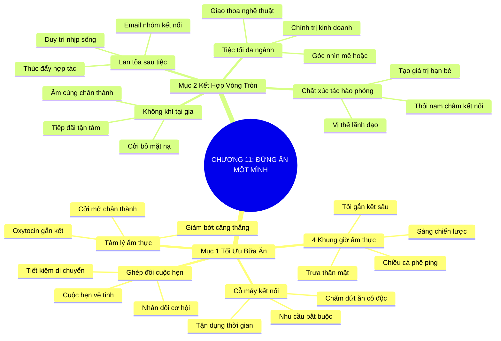

# SƠ ĐỒ TƯ DUY TRỰC QUAN: CHƯƠNG 11: ĐỪNG BAO GIỜ ĐI ĂN MỘT MÌNH (NEVER EAT ALONE)
* **Thuộc phần**: Phần 2: Bộ Kỹ Năng Thực Chiến (The Skill Set)
* **Tác phẩm**: Đừng Bao Giờ Đi Ăn Một Mình (Never Eat Alone) - Keith Ferrazzi
* **Chuẩn hóa**: Document Structure-Anchored v2.4 (Không nhãn meta thừa, phản ánh 100% cấu trúc tài liệu)

---

## 🌳 SƠ ĐỒ TƯ DUY MERMAID (4-5 TẦNG CHI TIẾT)

---

## 🧬 BẢNG PHÂN CẤP TRUY HỒI CHỦ ĐỘNG (ACTIVE RECALL HIERARCHY)
Cấu trúc hóa tri thức theo các nhánh tài liệu phục vụ ôn tập nhanh và khắc sâu trí nhớ:

| 📑 Nhánh Mục Tài Liệu | 🔑 Từ Khóa Vàng / Khái Niệm | 📝 Nội Dung Truy Hồi Chủ Động (Active Recall) |
| :--- | :--- | :--- |
| Mục 1: Tối Ưu Hóa Bữa Ăn Thường Nhật | **Cỗ máy kết nối** | Ăn uống là nhu cầu bắt buộc; biến bữa ăn thành cơ hội mở rộng quan hệ thay vì ăn một mình. |
| Mục 1: Tối Ưu Hóa Bữa Ăn Thường Nhật | **4 Khung giờ ẩm thực** | Sáng (Chiến lược), Trưa (Thân mật), Chiều (Cà phê cập nhật), Tối (Tri kỷ sâu sắc). |
| Mục 1: Tối Ưu Hóa Bữa Ăn Thường Nhật | **Ghép đôi cuộc hẹn** | Tối ưu hóa hành trình bằng cách sắp xếp cuộc hẹn vệ tinh trước/sau bữa ăn chính. |
| Mục 2: Chiến Lược Kết Hợp Vòng Tròn Quan Hệ | **Tiệc tối đa ngành** | Mời các cá nhân từ nghệ thuật, kinh doanh, học thuật cùng ngồi ăn để tạo đột phá đối thoại. |
| Mục 2: Chiến Lược Kết Hợp Vòng Tròn Quan Hệ | **Chất xúc tác hào phóng** | Người đứng ra quy tụ và mang lại giá trị cho người khác sẽ tự nhiên trở thành lãnh đạo kết nối. |
| Mục 2: Chiến Lược Kết Hợp Vòng Tròn Quan Hệ | **Tiếp đãi tại gia** | Bữa tối ấm cúng tại nhà giúp mọi người cởi bỏ mặt nạ xã giao và gắn kết bền chặt. |

---

## ⚡ BẢNG NEO TRÍ NHỚ NHANH (MEMORY ANCHOR CHEAT SHEET)
Tóm tắt cô đọng các công thức và quy tắc hành động của chương:

| 📑 Phần/Mục Tài Liệu | 📌 Khái Niệm Cốt Lõi | ⚖️ Nguyên Lý Vàng | 🚀 Hành Động Chuyển Hóa Ngay |
| :--- | :--- | :--- | :--- |
| Mục 1: Tối ưu bữa ăn | **4 Khung giờ kết nối** | Sáng (Chiến lược), Trưa (Khám phá), Chiều (Ping), Tối (Sâu sắc) | Lên lịch ăn uống cùng đối tác suốt tuần |
| Mục 1: Tối ưu bữa ăn | **Ghép đôi cuộc hẹn** | Xếp thêm cà phê 20 phút cạnh điểm hẹn trưa | Nhân đôi hiệu quả mỗi chuyến đi |
| Mục 2: Kết hợp vòng tròn | **Tiệc tối đa ngành** | Mời bạn bè từ nhiều lĩnh vực khác nhau cùng ăn tối | Tạo sự va chạm góc nhìn đầy cảm hứng |
| Mục 2: Kết hợp vòng tròn | **Tiếp đãi tại gia** | Nấu ăn tại nhà để tạo không khí thân mật cởi mở | Biến người quen thành bạn tri kỷ |

