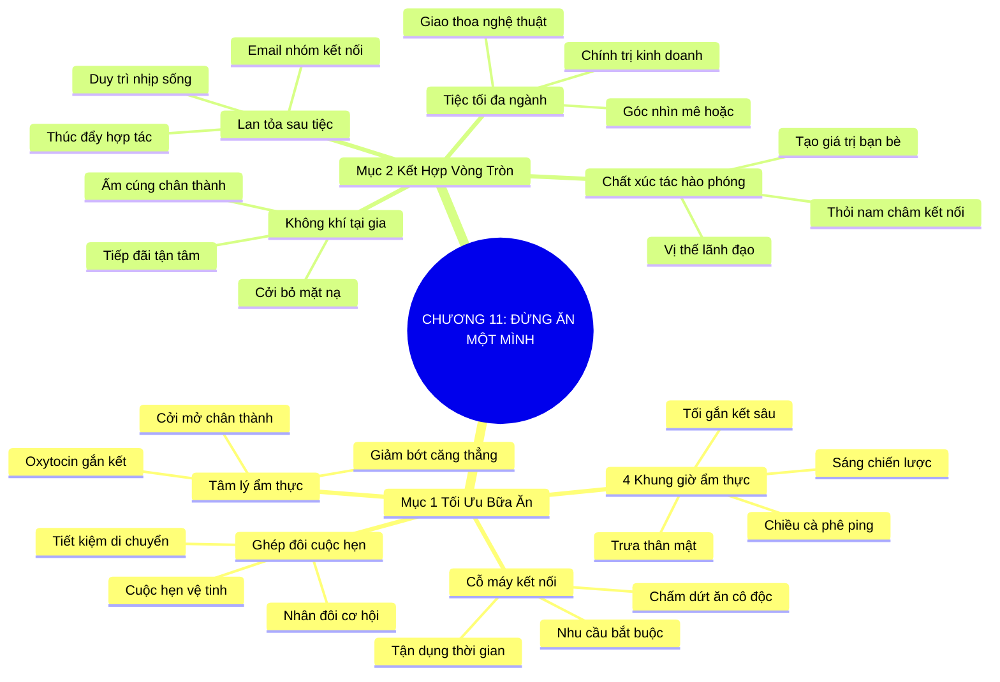

# TÓM TẮT CHƯƠNG SÁCH: CHƯƠNG 11: ĐỪNG BAO GIỜ ĐI ĂN MỘT MÌNH (NEVER EAT ALONE)
* **Thuộc phần**: Phần 2: Bộ Kỹ Năng Thực Chiến (The Skill Set)
* **Tác giả**: Keith Ferrazzi (với Tahl Raz)
* **Chuẩn hóa cấu trúc**: Document Structure-Anchored v2.4

---

## 🌟 THÔNG ĐIỆP CỐT LÕI (CORE MESSAGE)
> Tận dụng triệt để từng bữa ăn để kết nối: Biến lịch trình sinh hoạt hàng ngày thành cỗ máy xây dựng quan hệ và phối hợp các vòng tròn quan hệ khác nhau quanh bàn tiệc tối sẽ nhân bội sức mạnh mạng lưới của bạn.

---

## 📊 LƯỢC ĐỒ PHÂN BỔ CẤU TRÚC TÀI LIỆU
Bảng đối chiếu tỷ lệ và cấu trúc luận điểm bám sát các đề mục thực tế trong tài liệu:

| 📑 Đề Mục Trong Tài Liệu Gốc | 🎯 Số Lượng Luận Điểm Chuyên Sâu |
| :--- | :---: |
| Mục 1: Tối Ưu Hóa Thời Gian Và Năng Lượng Kết Nối (Maximizing Mealtime Networking) | 4 |
| Mục 2: Chiến Lược Kết Hợp Nhiều Vòng Tròn Quan Hệ (Connecting Different Circles) | 4 |
| **Tổng cộng toàn chương** | **8 Luận Điểm** |

---

## 💡 HỆ THỐNG LUẬN ĐIỂM QUAN TRỌNG (KEY TAKEAWAYS)

#### 📑 PHẦN: MỤC 1: TỐI ƯU HÓA THỜI GIAN VÀ NĂNG LƯỢNG KẾT NỐI (MAXIMIZING MEALTIME NETWORKING)

##### 1. Biến bữa ăn thường nhật thành cơ hội kết nối vàng
* **Phân Tích Chuyên Sâu**: Ăn uống là nhu cầu sinh học bắt buộc mỗi ngày của con người. Ngồi ăn một mình trước màn hình máy tính hay trong sự cô độc là sự lãng phí tài nguyên thời gian kết nối lớn nhất. Việc tận dụng bữa sáng, bữa trưa, cà phê chiều và bữa tối để gặp gỡ sẽ giúp bạn xây dựng mạng lưới mà không cần tốn thêm thời gian ngoài công việc.
* **Công Cụ / Phương Pháp Đi Kèm**: Lịch trình kết nối ẩm thực (Mealtime Calendar Integration), Khái niệm cỗ máy kết nối không nghỉ.
* **Ví Dụ Thực Tế Ứng Dụng**: Keith Ferrazzi không bao giờ ăn trưa một mình; ông luôn lên lịch trước cho các bữa ăn với đồng nghiệp, khách hàng hoặc bạn bè.

##### 2. Phân bổ mục tiêu chiến lược theo 4 khung giờ ẩm thực
* **Phân Tích Chuyên Sâu**: Mỗi bữa ăn có một tính chất năng lượng riêng: Bữa sáng lý tưởng cho định hướng chiến lược nhanh với người bận rộn; Bữa trưa thích hợp trò chuyện thân mật, tìm hiểu nhu cầu; Cà phê chiều hoàn hảo để duy trì nhịp thở và cập nhật nhanh; Bữa tối là không gian đỉnh cao để làm sâu sắc tình tri kỷ.
* **Công Cụ / Phương Pháp Đi Kèm**: Ma trận 4 khung giờ kết nối (Breakfast Strategy, Lunch Discovery, Afternoon Coffee Ping, Dinner Intimacy).
* **Ví Dụ Thực Tế Ứng Dụng**: Hẹn ăn sáng lúc 7h với một CEO bận rộn trước giờ hành chính của họ để bàn định hướng hợp tác.

##### 3. Kỹ thuật 'Ghép đôi cuộc hẹn' (Anchor & Satellite Meetings)
* **Phân Tích Chuyên Sâu**: Để tối ưu hóa thời gian di chuyển, khi hẹn gặp một đối tác lớn ăn trưa, hãy sắp xếp thêm một buổi cà phê nhanh ngay gần đó với một người bạn khác trước hoặc sau bữa ăn, biến một chuyến đi thành nhiều cơ hội tương tác.
* **Công Cụ / Phương Pháp Đi Kèm**: Chiến lược cuộc hẹn vệ tinh (Cluster Scheduling / Satellite Pings).
* **Ví Dụ Thực Tế Ứng Dụng**: Hẹn ăn trưa tại trung tâm quận 1 và hẹn thêm một đồng nghiệp cũ uống cà phê 20 phút ngay tại sảnh khách sạn sau bữa trưa.

##### 4. Tâm lý thoải mái và cởi mở quanh bàn ăn
* **Phân Tích Chuyên Sâu**: Hành vi cùng nhau chia sẻ thức ăn kích thích sản sinh oxytocin, làm giảm căng thẳng và tạo ra bầu không khí thân thiện tự nhiên, giúp con người dễ dàng bộc lộ cảm xúc thật và lắng nghe nhau hơn so với phòng họp nghiêm túc.
* **Công Cụ / Phương Pháp Đi Kèm**: Tâm lý học ẩm thực (Dining Psychology / Oxytocin Release).
* **Ví Dụ Thực Tế Ứng Dụng**: Những thỏa thuận hợp tác khó khăn nhất thường được giải tỏa nhẹ nhàng khi hai bên cùng thưởng thức một món ăn ngon.

#### 📑 PHẦN: MỤC 2: CHIẾN LƯỢC KẾT HỢP NHIỀU VÒNG TRÒN QUAN HỆ (CONNECTING DIFFERENT CIRCLES)

##### 5. Tổ chức tiệc tối đa văn hóa và liên ngành
* **Phân Tích Chuyên Sâu**: Kỹ thuật kết nối đỉnh cao của Keith là mời những người thuộc các lĩnh vực hoàn toàn xa lạ cùng ngồi lại quanh một bàn tiệc: một nghệ sĩ, một chính trị gia, một doanh nhân công nghệ và một nhà nghiên cứu. Sự va chạm giữa các góc nhìn khác biệt tạo nên cuộc đối thoại mê hoặc.
* **Công Cụ / Phương Pháp Đi Kèm**: Mô hình tiệc tối giao thoa (Cross-Pollination Dinner Party), Lựa chọn khách mời đa dạng.
* **Ví Dụ Thực Tế Ứng Dụng**: Tổ chức bữa tối ấm cúng tại nhà gồm một bác sĩ tim mạch, một nhà sáng lập công nghệ và một nhà văn, tạo nên cuộc tranh luận thú vị về tương lai con người.

##### 6. Vị thế trung tâm của chất xúc tác hào phóng
* **Phân Tích Chuyên Sâu**: Khi bạn là người quy tụ những con người xuất chúng lại với nhau và giúp họ mở rộng tầm mắt, bạn tự nhiên xác lập vị thế của một 'nhà kết nối lãnh đạo' (Super-Connector) trong mắt cộng đồng mà không cần phô trương quyền lực.
* **Công Cụ / Phương Pháp Đi Kèm**: Vị thế thỏi nam châm kết nối (Magnet Host Positioning), Vai trò người điều phối cảm xúc.
* **Ví Dụ Thực Tế Ứng Dụng**: Các vị khách cảm ơn bạn vì bữa tối đã giúp họ tìm được một đối tác đầu tư hoặc một người bạn tâm giao mới.

##### 7. Nghệ thuật điều phối không khí ấm cúng tại gia
* **Phân Tích Chuyên Sâu**: Một bữa tiệc tại nhà với sự chuẩn bị chân thành, âm nhạc nhẹ nhàng và món ăn giản dị mang lại cảm giác thân mật gấp mười lần nhà hàng sang trọng ồn ào. Đó là nơi mọi người cởi bỏ mặt nạ xã giao để trở về với con người thật.
* **Công Cụ / Phương Pháp Đi Kèm**: Quy chuẩn tiếp đãi tại gia (Home Hosting Protocol: Ánh sáng ấm, nhạc nền cổ điển, chia sẻ cởi mở).
* **Ví Dụ Thực Tế Ứng Dụng**: Tự tay nấu một món ăn đặc sản mời bạn bè đến nhà thưởng thức vào tối thứ Bảy.

##### 8. Lan tỏa giá trị gia tăng liên tục sau bữa tiệc
* **Phân Tích Chuyên Sâu**: Sau bữa tối thành công, hãy gửi email nhóm kết nối tất cả mọi người, đính kèm thông tin liên lạc và nhắc lại những ý tưởng đột phá đã được thảo luận, giúp các mối liên kết mới tiếp tục nảy nở.
* **Công Cụ / Phương Pháp Đi Kèm**: Email tổng kết kết nối (Post-Dinner Cohort Ping), Chia sẻ thông tin liên lạc minh bạch.
* **Ví Dụ Thực Tế Ứng Dụng**: Gửi email cảm ơn chung cho 6 vị khách sáng hôm sau, kết nối các dự án tiềm năng mà họ vừa nảy ra đêm qua.

---

## 🎯 KẾ HOẠCH HÀNH ĐỘNG TOÀN DIỆN (ACTION PLAN)
### ⚡ Cấp độ 1: Thói quen vi mô (Micro-habits < 2 phút mỗi ngày)
- [ ] Rà soát lịch tuần tới và điền kín ít nhất 3 bữa trưa với đồng nghiệp hoặc đối tác
- [ ] Thử nghiệm 1 cuộc hẹn ăn sáng chiến lược với một đối tác bận rộn lúc 7h30
- [ ] Lên kế hoạch tổ chức một bữa tối ấm cúng tại nhà với 4-6 người bạn từ các lĩnh vực khác nhau
- [ ] Chọn ra 1 người nghệ sĩ hoặc chuyên gia trái ngành để mời tham gia buổi gặp mặt
- [ ] Tránh tuyệt đối việc ngồi ăn trưa một mình trước màn hình máy tính làm việc

### 📅 Cấp độ 2: Thói quen tuần & Dự án ngắn hạn (Weekly Habits)
- [ ] Thực hành kỹ thuật ghép đôi cuộc hẹn: hẹn thêm 1 buổi cà phê 20 phút gần điểm ăn trưa
- [ ] Ghi nhớ món ăn yêu thích hoặc kiêng cữ của khách mời trước khi chọn nhà hàng
- [ ] Tạo danh sách 10 nhà hàng có không gian yên tĩnh, lịch sự phù hợp trò chuyện
- [ ] Đóng vai trò người mở lời giới thiệu các điểm mạnh của từng vị khách trong bữa tiệc
- [ ] Gửi tin nhắn hoặc email nhóm cảm ơn tất cả các khách mời sau bữa tối kết hợp

### 🚀 Cấp độ 3: Chiến lược chuyển hóa dài hạn (Long-term Strategy)
- [ ] Khơi gợi một chủ đề thảo luận sâu sắc thay vì chỉ bàn tán chuyện thời sự giật gân
- [ ] Mời một người bạn mới quen tham gia vào nhóm bạn cũ để mở rộng mạng lưới
- [ ] Tự chuẩn bị một món ăn hoặc thức uống đặc biệt để thể hiện sự hiếu khách
- [ ] Theo dõi và hỗ trợ những ý tưởng hợp tác nảy sinh giữa các vị khách sau bữa tiệc
- [ ] Đánh giá cảm xúc và mức độ gắn kết của mọi người sau mỗi sự kiện ẩm thực

---

## ❓ BỘ CÂU HỎI TỰ VẤN & PHẢN TƯ SUY NGẪM (REFLECTION QUESTIONS)
### Nhóm 1: Nhận thức thực tại & Thói quen hiện tại
1. Trong tuần vừa qua, bạn đã có bao nhiêu bữa ăn một mình trong cô độc?
2. Điều gì ngăn cản bạn chủ động rủ một đồng nghiệp hoặc đối tác cùng đi ăn trưa?
3. Tại sao không gian bàn ăn lại giúp con người dễ dàng cởi mở và tin tưởng nhau hơn?
4. Bạn đã từng thử hẹn ăn sáng với một nhân vật cấp cao bận rộn chưa?
5. Bạn có những người bạn thuộc các lĩnh vực hoàn toàn khác nhau (nghệ thuật, kinh doanh, khoa học) không?

### Nhóm 2: Thách thức tâm lý & Rào cản nội tâm
6. Cảm giác của bạn sẽ thế nào nếu được mời đến một bữa tối quy tụ những con người thú vị đa ngành?
7. Làm sao để bạn trở thành người chủ trì (host) hào phóng kết nối mọi người lại với nhau?
8. Một bữa tiệc tại nhà ấm cúng mang lại lợi thế gì so với một bữa ăn đắt tiền ở nhà hàng?
9. Bạn chọn chủ đề gì để khơi mào cho một cuộc đối thoại sôi nổi giữa những người lần đầu gặp nhau?
10. Khi hai người khách của bạn tìm được tiếng nói chung và hợp tác thành công, bạn cảm thấy ra sao?

### Nhóm 3: Chiến lược hành động & Ứng dụng thực tế
11. Làm thế nào để điều phối bữa ăn không biến thành một cuộc đàm phán thương mại căng thẳng?
12. Bạn có thói quen gửi email kết nối nhóm cho các vị khách sau bữa ăn không?
13. Bạn xử lý thế nào nếu trong bàn ăn có một người nói quá nhiều và lấn át người khác?
14. Việc chia sẻ thức ăn có ý nghĩa tâm lý như thế nào đối với sự tin cậy lẫn nhau?
15. Làm sao để việc mời ăn uống không bị hiểu lầm là mua chuộc hay hối lộ?

### Nhóm 4: Chuyển hóa tư duy & Tầm nhìn dài hạn
16. Bạn có danh sách những quán ăn có không gian yên tĩnh để trò chuyện công việc chưa?
17. Tại sao kỹ thuật 'ghép đôi cuộc hẹn' lại giúp tiết kiệm thời gian di chuyển vượt bậc?
18. Một kỷ niệm kết nối thành công nhất của bạn quanh bàn ăn là gì?
19. Nếu một người từ chối lời mời ăn trưa, bạn sẽ tiếp tục mời vào dịp khác hay dừng lại?
20. Ai là 4 người đầu tiên bạn muốn mời tham dự bữa tối kết hợp đặc biệt vào tháng tới?

---

## 🧠 SƠ ĐỒ TƯ DUY TRỰC QUAN (MINDMAP)

