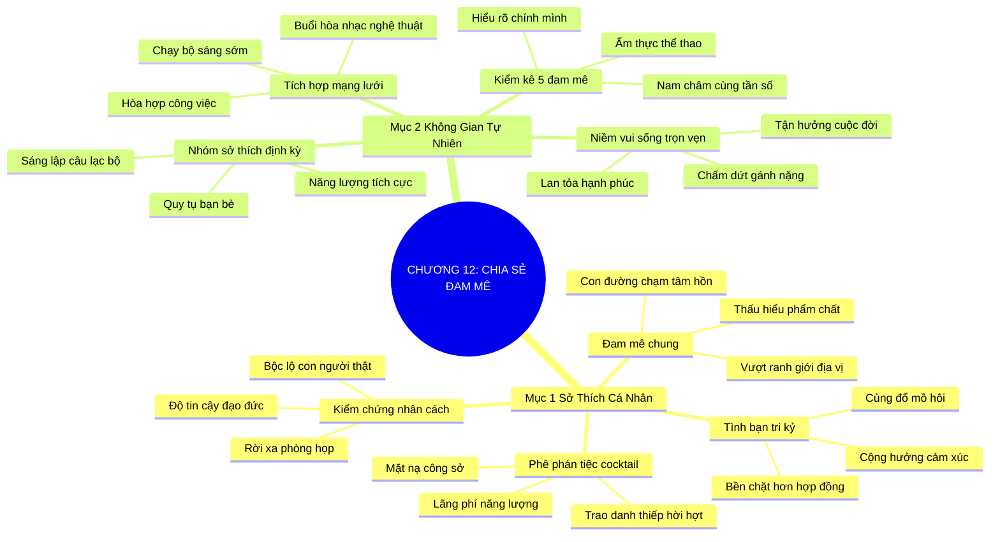

# SƠ ĐỒ TƯ DUY TRỰC QUAN: CHƯƠNG 12: CHIA SẺ NIỀM ĐAM MÊ (SHARE YOUR PASSIONS)
* **Thuộc phần**: Phần 2: Bộ Kỹ Năng Thực Chiến (The Skill Set)
* **Tác phẩm**: Đừng Bao Giờ Đi Ăn Một Mình (Never Eat Alone) - Keith Ferrazzi
* **Chuẩn hóa**: Document Structure-Anchored v2.4 (Không nhãn meta thừa, phản ánh 100% cấu trúc tài liệu)

---

## 🌳 SƠ ĐỒ TƯ DUY MERMAID (4-5 TẦNG CHI TIẾT)

---

## 🧬 BẢNG PHÂN CẤP TRUY HỒI CHỦ ĐỘNG (ACTIVE RECALL HIERARCHY)
Cấu trúc hóa tri thức theo các nhánh tài liệu phục vụ ôn tập nhanh và khắc sâu trí nhớ:

| 📑 Nhánh Mục Tài Liệu | 🔑 Từ Khóa Vàng / Khái Niệm | 📝 Nội Dung Truy Hồi Chủ Động (Active Recall) |
| :--- | :--- | :--- |
| Mục 1: Xây Dựng Quan Hệ Dựa Trên Sở Thích | **Phê phán tiệc cocktail** | Các buổi tiệc cocktail thương mại chỉ tạo ra sự hời hợt; cần chuyển sang kết nối đam mê. |
| Mục 1: Xây Dựng Quan Hệ Dựa Trên Sở Thích | **Đam mê chung** | Cùng chia sẻ sở thích thể thao, nghệ thuật giúp nhìn thấy phẩm chất thực chất của nhau. |
| Mục 1: Xây Dựng Quan Hệ Dựa Trên Sở Thích | **Tình bạn tri kỷ** | Tình bạn nảy nở từ trải nghiệm cảm xúc chân thực bền vững gấp trăm lần hợp đồng kinh tế. |
| Mục 2: Biến Đam Mê Thành Không Gian Tự Nhiên | **Kiểm kê 5 đam mê** | Xác định 5 sở thích cốt lõi của bản thân để làm nam châm thu hút người cùng tần số. |
| Mục 2: Biến Đam Mê Thành Không Gian Tự Nhiên | **Tích hợp mạng lưới** | Mời đối tác cùng chạy bộ, leo núi thay vì họp phòng lạnh ngột ngạt. |
| Mục 2: Biến Đam Mê Thành Không Gian Tự Nhiên | **Hòa hợp cuộc sống** | Khi công việc hòa làm một với đam mê, kết nối trở thành nguồn vui sống bất tận. |

---

## ⚡ BẢNG NEO TRÍ NHỚ NHANH (MEMORY ANCHOR CHEAT SHEET)
Tóm tắt cô đọng các công thức và quy tắc hành động của chương:

| 📑 Phần/Mục Tài Liệu | 📌 Khái Niệm Cốt Lõi | ⚖️ Nguyên Lý Vàng | 🚀 Hành Động Chuyển Hóa Ngay |
| :--- | :--- | :--- | :--- |
| Mục 1: Sở thích cá nhân | **Phê phán tiệc cocktail** | Tránh các buổi tiệc trao danh thiếp sáo rỗng | Tập trung xây dựng chiều sâu gắn kết |
| Mục 1: Sở thích cá nhân | **Đam mê chung** | Kết nối qua thể thao, nghệ thuật, thiện nguyện | Xóa bỏ rào cản chức danh công sở |
| Mục 2: Không gian tự nhiên | **5 Đam mê cốt lõi** | Liệt kê 5 sở thích lớn nhất của bản thân | Tìm kiếm điểm tương đồng với đối tác |
| Mục 2: Không gian tự nhiên | **Tích hợp hoạt động** | Mời đối tác chạy bộ ven hồ thay vì họp phòng kín | Biến kết nối thành niềm vui sống trọn vẹn |

