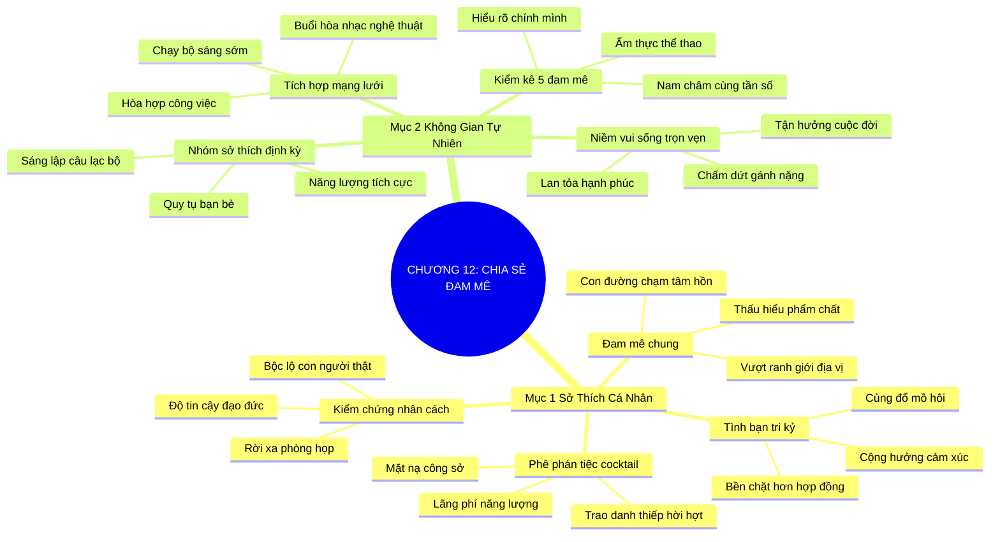

# TÓM TẮT CHƯƠNG SÁCH: CHƯƠNG 12: CHIA SẺ NIỀM ĐAM MÊ (SHARE YOUR PASSIONS)
* **Thuộc phần**: Phần 2: Bộ Kỹ Năng Thực Chiến (The Skill Set)
* **Tác giả**: Keith Ferrazzi (với Tahl Raz)
* **Chuẩn hóa cấu trúc**: Document Structure-Anchored v2.4

---

## 🌟 THÔNG ĐIỆP CỐT LÕI (CORE MESSAGE)
> Vượt ra ngoài những bữa tiệc cocktail giả tạo: Kết nối thông qua đam mê chung (thể thao, nghệ thuật, thiện nguyện) sẽ xóa bỏ mọi ranh giới chức danh, xây dựng tình bạn tri kỷ bền vững gấp trăm lần hợp đồng thương mại.

---

## 📊 LƯỢC ĐỒ PHÂN BỔ CẤU TRÚC TÀI LIỆU
Bảng đối chiếu tỷ lệ và cấu trúc luận điểm bám sát các đề mục thực tế trong tài liệu:

| 📑 Đề Mục Trong Tài Liệu Gốc | 🎯 Số Lượng Luận Điểm Chuyên Sâu |
| :--- | :---: |
| Mục 1: Xây Dựng Mối Quan Hệ Dựa Trên Sở Thích Cá Nhân (Connecting Through Shared Passions) | 4 |
| Mục 2: Biến Đam Mê Thành Không Gian Kết Nối Tự Nhiên (Turning Passion Into Connection) | 4 |
| **Tổng cộng toàn chương** | **8 Luận Điểm** |

---

## 💡 HỆ THỐNG LUẬN ĐIỂM QUAN TRỌNG (KEY TAKEAWAYS)

#### 📑 PHẦN: MỤC 1: XÂY DỰNG MỐI QUAN HỆ DỰA TRÊN SỞ THÍCH CÁ NHÂN (CONNECTING THROUGH SHARED PASSIONS)

##### 1. Sự vô nghĩa của các bữa tiệc cocktail thương mại hình thức
* **Phân Tích Chuyên Sâu**: Những buổi tiệc cocktail đông đúc nơi hàng trăm người trong bộ vest gượng gạo trao đổi danh thiếp thường chỉ mang lại các mối quan hệ hời hợt, giả tạo và nhanh chóng rơi vào quên lãng. Không ai xây dựng được tình bạn tri kỷ chỉ qua vài câu xã giao ồn ào.
* **Công Cụ / Phương Pháp Đi Kèm**: Phê phán tiệc cocktail hình thức (Superficial Networking Critique), Bộ lọc chất lượng kết nối.
* **Ví Dụ Thực Tế Ứng Dụng**: Keith Ferrazzi thừa nhận ông ghét các buổi tiệc cocktail thương mại vì chúng tốn năng lượng mà không tạo ra chiều sâu gắn kết.

##### 2. Đam mê chung: Con đường ngắn nhất chạm tới tâm hồn
* **Phân Tích Chuyên Sâu**: Khi hai người cùng chia sẻ một sở thích—dù là chạy bộ đường dài, leo núi, thưởng thức nhạc cổ điển hay hoạt động thiện nguyện—họ nhìn thấy con người thực chất của nhau: sự kiên trì, lòng trung thực, khiếu hài hước và tinh thần đồng đội vượt qua mọi rào cản địa vị xã hội.
* **Công Cụ / Phương Pháp Đi Kèm**: Điểm neo đam mê chung (Shared Passion Anchor), Kết nối vượt ranh giới chức danh.
* **Ví Dụ Thực Tế Ứng Dụng**: Cùng nhau đổ mồ hôi trên đường chạy marathon 21km tạo ra sự thấu hiểu và tin tưởng mà 10 cuộc họp phòng lạnh không thể có được.

##### 3. Trải nghiệm cảm xúc chia sẻ kiến tạo tình bạn tri kỷ
* **Phân Tích Chuyên Sâu**: Tình bạn nảy nở từ những khó khăn hoặc niềm vui chung ngoài đời sống có sức mạnh gắn kết gấp hàng trăm lần các thỏa thuận kinh tế khô khan. Khi có tình cảm chân thành, việc hợp tác kinh doanh sau đó sẽ diễn ra vô cùng suôn sẻ và bền chặt.
* **Công Cụ / Phương Pháp Đi Kèm**: Cộng hưởng cảm xúc đỉnh cao (Emotional Resonance Bonding).
* **Ví Dụ Thực Tế Ứng Dụng**: Hai doanh nhân từng cùng tham gia chiến dịch cứu trợ bão lũ sau đó trở thành đối tác chiến lược tin cậy trọn đời.

##### 4. Tính xác thực của nhân cách khi rời xa công sở
* **Phân Tích Chuyên Sâu**: Trong môi trường công việc, con người thường đeo mặt nạ tự vệ. Chỉ khi tham gia vào các hoạt động đam mê yêu thích, tính cách thực sự mới bộc lộ trọn vẹn, giúp bạn đánh giá chính xác độ tin cậy và đạo đức của đối tác.
* **Công Cụ / Phương Pháp Đi Kèm**: Kiểm chứng nhân cách ngoài công sở (Authenticity Stress Test).
* **Ví Dụ Thực Tế Ứng Dụng**: Quan sát cách một đối tác đối xử với caddie trên sân golf hoặc cách họ kiên nhẫn khi bị lạc đường khi leo núi để hiểu rõ tính cách của họ.

#### 📑 PHẦN: MỤC 2: BIẾN ĐAM MÊ THÀNH KHÔNG GIAN KẾT NỐI TỰ NHIÊN (TURNING PASSION INTO CONNECTION)

##### 5. Lập danh sách 5 niềm đam mê lớn nhất của bản thân
* **Phân Tích Chuyên Sâu**: Bước đầu tiên là phải hiểu rõ chính mình: Bạn say mê ẩm thực, điền kinh, đọc sách lịch sử, nghệ thuật hội họa hay hoạt động bảo vệ động vật? Đam mê thực sự của bạn chính là nam châm tự nhiên thu hút những người cùng tần số.
* **Công Cụ / Phương Pháp Đi Kèm**: Bảng kiểm kê 5 niềm đam mê cốt lõi (Top 5 Passions Inventory).
* **Ví Dụ Thực Tế Ứng Dụng**: Liệt kê rõ ràng: 1. Chạy bộ cự ly dài; 2. Nấu ăn món Ý; 3. Đọc sách phát triển bản thân; 4. Du lịch trải nghiệm; 5. Dạy học tình nguyện.

##### 6. Lồng ghép mạng lưới quan hệ vào hoạt động đam mê
* **Phân Tích Chuyên Sâu**: Thay vì mời đối tác vào phòng họp ngột ngạt, hãy mời họ tham gia một buổi chạy bộ ven hồ lúc sáng sớm, một buổi đạp xe cuối tuần, hoặc cùng thưởng thức một buổi hòa nhạc cổ điển. Công việc khi đó hòa làm một với niềm vui sống.
* **Công Cụ / Phương Pháp Đi Kèm**: Mô hình kết nối tích hợp đam mê (Passion-Driven Activity Integration).
* **Ví Dụ Thực Tế Ứng Dụng**: Mời một khách hàng tiềm năng cùng tham gia câu lạc bộ chạy bộ sáng Chủ Nhật thay vì hẹn gặp tại văn phòng.

##### 7. Chấm dứt sự phân tách khiên cưỡng giữa công việc và đời sống
* **Phân Tích Chuyên Sâu**: Khi kết nối dựa trên niềm đam mê, bạn không còn cảm thấy việc giao tiếp là một gánh nặng xã giao mệt mỏi. Kết nối trở thành cách bạn tận hưởng cuộc đời, chia sẻ năng lượng tích cực và lan tỏa niềm hạnh phúc đến mọi người.
* **Công Cụ / Phương Pháp Đi Kèm**: Triết lý sống hòa hợp trọn vẹn (Life-Work Harmony Philosophy).
* **Ví Dụ Thực Tế Ứng Dụng**: Biến các buổi sinh hoạt câu lạc bộ nhiếp ảnh thành không gian kết bạn tự nhiên với các chuyên gia đầu ngành.

##### 8. Tổ chức các sự kiện đam mê theo nhóm định kỳ
* **Phân Tích Chuyên Sâu**: Tự tay sáng lập hoặc chủ trì một nhóm sở thích nhỏ (CLB đọc sách, nhóm chạy bộ, hội yêu thích ẩm thực) giúp bạn định kỳ quy tụ các đối tác và bạn bè trong một không gian tràn ngập năng lượng tích cực.
* **Công Cụ / Phương Pháp Đi Kèm**: Nhóm sở thích định kỳ (Recurring Passion Hub).
* **Ví Dụ Thực Tế Ứng Dụng**: Sáng lập nhóm 'Chạy bộ doanh nhân' gặp nhau vào 6h sáng thứ Bảy hàng tuần để rèn luyện sức khỏe và chia sẻ ý tưởng.

---

## 🎯 KẾ HOẠCH HÀNH ĐỘNG TOÀN DIỆN (ACTION PLAN)
### ⚡ Cấp độ 1: Thói quen vi mô (Micro-habits < 2 phút mỗi ngày)
- [ ] Viết ra giấy danh sách 5 niềm đam mê và sở thích cá nhân lớn nhất của bạn
- [ ] Tìm hiểu xem trong số các đối tác quan trọng, ai có cùng sở thích với bạn
- [ ] Thay thế 1 cuộc họp phòng lạnh tuần tới bằng một buổi đi bộ hoặc chạy bộ thể thao
- [ ] Mời một người bạn/đối tác cùng tham gia một sự kiện nghệ thuật hoặc thể thao cuối tuần
- [ ] Từ chối hoặc giảm bớt việc tham gia các buổi tiệc cocktail thương mại ồn ào hời hợt

### 📅 Cấp độ 2: Thói quen tuần & Dự án ngắn hạn (Weekly Habits)
- [ ] Tham gia hoặc sáng lập một câu lạc bộ sở thích (chạy bộ, đọc sách, leo núi)
- [ ] Chia sẻ một bài viết hay hoặc trải nghiệm về đam mê của bạn lên trang cá nhân
- [ ] Quan sát cách ứng xử của đối tác trong các hoạt động ngoại khóa để hiểu tính cách
- [ ] Rủ một đồng nghiệp cùng tham gia một hoạt động từ thiện cộng đồng
- [ ] Tìm kiếm các giải chạy hoặc sự kiện thể thao sắp diễn ra để rủ bạn bè cùng tham gia

### 🚀 Cấp độ 3: Chiến lược chuyển hóa dài hạn (Long-term Strategy)
- [ ] Tổ chức một buổi nấu ăn giao lưu tại nhà dựa trên niềm đam mê ẩm thực chung
- [ ] Tặng đối tác một cuốn sách thuộc chủ đề đam mê chung của cả hai người
- [ ] Lên kế hoạch cho chuyến trekking hoặc dã ngoại cuối tuần cùng một vài người bạn chiến lược
- [ ] Tận hưởng niềm vui kết nối một cách chân thực, không toan tính vụ lợi trong các hoạt động sở thích
- [ ] Ghi chú sở thích đặc biệt của các đối tác mới quen vào hồ sơ quan hệ

---

## ❓ BỘ CÂU HỎI TỰ VẤN & PHẢN TƯ SUY NGẪM (REFLECTION QUESTIONS)
### Nhóm 1: Nhận thức thực tại & Thói quen hiện tại
1. 5 niềm đam mê lớn nhất hiện tại của bạn là gì, và bạn có thường chia sẻ nó không?
2. Bạn cảm thấy thế nào khi tham gia các buổi tiệc cocktail trao đổi danh thiếp truyền thống?
3. Tại sao việc cùng đổ mồ hôi trên sân tập lại tạo ra sự gắn kết mạnh hơn các cuộc họp trang trọng?
4. Bạn đã bao giờ mời một đối tác quan trọng đi chạy bộ, leo núi hay xem ca nhạc chưa?
5. Những rào cản chức danh xã hội biến mất như thế nào khi hai người cùng chia sẻ một sở thích?

### Nhóm 2: Thách thức tâm lý & Rào cản nội tâm
6. Bạn quan sát được những phẩm chất gì của một người khi cùng họ tham gia hoạt động thể thao?
7. Làm thế nào để việc chia sẻ đam mê không bị biến thành một chiêu trò bán hàng trá hình?
8. Bạn có đang phân tách rạch ròi giữa 'bạn bè đam mê' và 'đối tác làm ăn' không, tại sao?
9. Một hoạt động thiện nguyện chung có thể kiến tạo sự tin cậy sâu sắc đến mức nào?
10. Khi công việc hòa làm một với niềm đam mê sống, cảm xúc hàng ngày của bạn thay đổi ra sao?

### Nhóm 3: Chiến lược hành động & Ứng dụng thực tế
11. Bạn có sẵn sàng thử một môn thể thao mới chỉ vì đối tác quan trọng của bạn rất yêu thích nó không?
12. Làm sao để xây dựng một câu lạc bộ sở thích quy tụ những người bạn xuất chúng?
13. Tính cách thật của bạn bộc lộ rõ nhất trong hoạt động giải trí hay sở thích nào?
14. Bạn cảm nhận thế nào khi một người lạ chủ động rủ bạn tham gia một hoạt động mà bạn vô cùng đam mê?
15. Tại sao sự chân thành là điều kiện tiên quyết trong kết nối qua sở thích?

### Nhóm 4: Chuyển hóa tư duy & Tầm nhìn dài hạn
16. Bạn có thể kết hợp sở thích đọc sách để kết nối với những người cùng chí hướng như thế nào?
17. Một kỷ niệm kết nối đáng nhớ nhất của bạn xuất phát từ một niềm đam mê chung là gì?
18. Việc chia sẻ sở thích cá nhân có khiến bạn cảm thấy dễ bị tổn thương không, và tại sao đó lại là sức mạnh?
19. Làm thế nào để duy trì ngọn lửa đam mê cá nhân giữa bộn bề công việc kinh doanh?
20. Ai là người bạn sẽ chủ động rủ cùng tham gia hoạt động đam mê vào cuối tuần này?

---

## 🧠 SƠ ĐỒ TƯ DUY TRỰC QUAN (MINDMAP)

