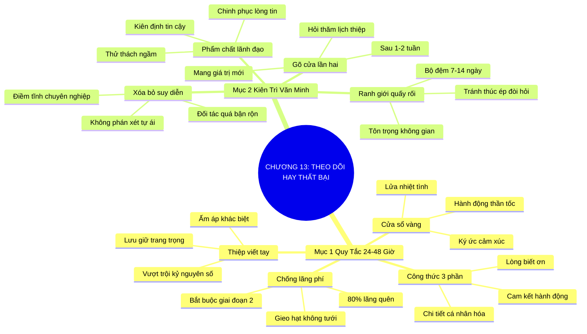

# SƠ ĐỒ TƯ DUY TRỰC QUAN: CHƯƠNG 13: THEO DÕI HAY LÀ THẤT BẠI (FOLLOW UP OR FAIL)
* **Thuộc phần**: Phần 2: Bộ Kỹ Năng Thực Chiến (The Skill Set)
* **Tác phẩm**: Đừng Bao Giờ Đi Ăn Một Mình (Never Eat Alone) - Keith Ferrazzi
* **Chuẩn hóa**: Document Structure-Anchored v2.4 (Không nhãn meta thừa, phản ánh 100% cấu trúc tài liệu)

---

## 🌳 SƠ ĐỒ TƯ DUY MERMAID (4-5 TẦNG CHI TIẾT)

---

## 🧬 BẢNG PHÂN CẤP TRUY HỒI CHỦ ĐỘNG (ACTIVE RECALL HIERARCHY)
Cấu trúc hóa tri thức theo các nhánh tài liệu phục vụ ôn tập nhanh và khắc sâu trí nhớ:

| 📑 Nhánh Mục Tài Liệu | 🔑 Từ Khóa Vàng / Khái Niệm | 📝 Nội Dung Truy Hồi Chủ Động (Active Recall) |
| :--- | :--- | :--- |
| Mục 1: Quy Tắc Vàng 24 Đến 48 Giờ | **Chống lãng phí** | Gặp gỡ chỉ là bước khởi đầu; không theo dõi đồng nghĩa với việc lãng phí 100% cơ hội. |
| Mục 1: Quy Tắc Vàng 24 Đến 48 Giờ | **Khung 24-48h** | Gửi thông điệp khi ấn tượng còn tươi mới để neo giữ cảm xúc tích cực. |
| Mục 1: Quy Tắc Vàng 24 Đến 48 Giờ | **Công thức 3 phần** | Biết ơn chân thành + Nhắc chi tiết cá nhân + Đưa ra hành động tiếp theo cụ thể. |
| Mục 2: Sự Kiên Trì Văn Minh Và Bền Bỉ | **Xóa bỏ suy diễn** | Đối tác im lặng vì bận rộn chứ không phải coi thường; giữ vững tâm thế chuyên nghiệp. |
| Mục 2: Sự Kiên Trì Văn Minh Và Bền Bỉ | **Gõ cửa lần hai** | Nhẹ nhàng hỏi thăm sau 1-2 tuần kèm theo thông tin hữu ích mới để duy trì kết nối. |
| Mục 2: Sự Kiên Trì Văn Minh Và Bền Bỉ | **Phẩm chất kiên định** | Kiên trì lịch thiệp là phẩm chất của nhà lãnh đạo, giúp vượt qua các thử thách ngầm. |

---

## ⚡ BẢNG NEO TRÍ NHỚ NHANH (MEMORY ANCHOR CHEAT SHEET)
Tóm tắt cô đọng các công thức và quy tắc hành động của chương:

| 📑 Phần/Mục Tài Liệu | 📌 Khái Niệm Cốt Lõi | ⚖️ Nguyên Lý Vàng | 🚀 Hành Động Chuyển Hóa Ngay |
| :--- | :--- | :--- | :--- |
| Mục 1: Quy tắc 24-48h | **Cửa sổ vàng** | Gửi thông điệp trong vòng 24-48 giờ sau cuộc gặp | Khắc sâu ấn tượng khi cảm xúc còn nguyên vẹn |
| Mục 1: Quy tắc 24-48h | **Công thức 3 phần** | Biết ơn + Điểm chung cá nhân + Cam kết cụ thể | Tránh email mẫu sáo rỗng vô hồn |
| Mục 2: Kiên trì văn minh | **Xóa bỏ suy diễn** | Hiểu rằng người thành đạt luôn bận rộn | Không tự ái hay nản lòng khi chưa được hồi âm |
| Mục 2: Kiên trì văn minh | **Gõ cửa kèm giá trị** | Nhắn lại sau 10 ngày với tài liệu hữu ích mới | Duy trì ranh giới lịch sự không quấy rối |

