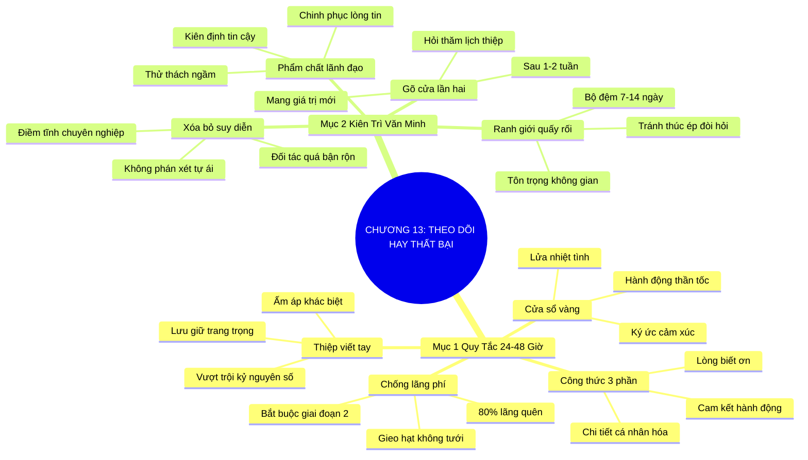

# TÓM TẮT CHƯƠNG SÁCH: CHƯƠNG 13: THEO DÕI HAY LÀ THẤT BẠI (FOLLOW UP OR FAIL)
* **Thuộc phần**: Phần 2: Bộ Kỹ Năng Thực Chiến (The Skill Set)
* **Tác giả**: Keith Ferrazzi (với Tahl Raz)
* **Chuẩn hóa cấu trúc**: Document Structure-Anchored v2.4

---

## 🌟 THÔNG ĐIỆP CỐT LÕI (CORE MESSAGE)
> Gặp gỡ chỉ là gieo hạt, hành động theo dõi (follow-up) mới là tưới nước: Phản hồi trong 24-48 giờ với chi tiết cá nhân hóa và sự kiên trì lịch thiệp sẽ biến 80% người quen lãng quên thành đối tác chiến lược trọn đời.

---

## 📊 LƯỢC ĐỒ PHÂN BỔ CẤU TRÚC TÀI LIỆU
Bảng đối chiếu tỷ lệ và cấu trúc luận điểm bám sát các đề mục thực tế trong tài liệu:

| 📑 Đề Mục Trong Tài Liệu Gốc | 🎯 Số Lượng Luận Điểm Chuyên Sâu |
| :--- | :---: |
| Mục 1: Quy Tắc Vàng Hai Mươi Bốn Đến Bốn Mươi Tám Giờ (The Golden Rules of Follow-Up) | 4 |
| Mục 2: Sự Kiên Trì Văn Minh Và Bền Bỉ (Persistence with Grace) | 4 |
| **Tổng cộng toàn chương** | **8 Luận Điểm** |

---

## 💡 HỆ THỐNG LUẬN ĐIỂM QUAN TRỌNG (KEY TAKEAWAYS)

#### 📑 PHẦN: MỤC 1: QUY TẮC VÀNG HAI MƯƠI BỐN ĐẾN BỐN MƯƠI TÁM GIỜ (THE GOLDEN RULES OF FOLLOW-UP)

##### 1. Sự lãng phí tột cùng của việc im lặng sau cuộc gặp
* **Phân Tích Chuyên Sâu**: Hơn 80% người tham dự hội thảo hay gặp gỡ đối tác sẽ nhanh chóng lãng quên nhau chỉ sau vài ngày nếu không có hành động duy trì kết nối. Gặp gỡ mà không theo dõi cũng giống như gieo hạt xuống đất rồi bỏ mặc nó chết khô; bạn đã lãng phí toàn bộ thời gian, tiền bạc và năng lượng của cả hai bên.
* **Công Cụ / Phương Pháp Đi Kèm**: Quy tắc chống lãng phí quan hệ (Post-Meeting Anti-Waste Rule), Tư duy xem follow-up là giai đoạn 2 bắt buộc của cuộc gặp.
* **Ví Dụ Thực Tế Ứng Dụng**: Nhiều người thu thập hàng trăm danh thiếp sau triển lãm nhưng để mốc meo trong ngăn kéo thay vì gửi thư kết nối ngay ngày hôm sau.

##### 2. Khung thời gian vàng 24-48 giờ quyết định ấn tượng
* **Phân Tích Chuyên Sâu**: Ký ức cảm xúc và sự hào hứng của đối tác sẽ giảm đi một nửa sau mỗi 24 giờ trôi qua. Gửi thông điệp theo dõi trong vòng 24 đến 48 giờ sau cuộc gặp là tiêu chuẩn vàng để khắc sâu ấn tượng trong tâm trí họ khi ngọn lửa nhiệt tình vẫn đang cháy.
* **Công Cụ / Phương Pháp Đi Kèm**: Cửa sổ vàng tương tác (The 24-48 Hour Window Protocol), Cài đặt nhắc nhở tự động trên điện thoại.
* **Ví Dụ Thực Tế Ứng Dụng**: Keith Ferrazzi luôn gửi email cảm ơn hoặc tin nhắn vào sáng hôm sau ngay sau khi kết thúc bữa tối làm việc.

##### 3. Công thức 3 yếu tố cốt lõi của một thông điệp theo dõi chuẩn mực
* **Phân Tích Chuyên Sâu**: Một thông điệp follow-up chuyên nghiệp bắt buộc phải có 3 thành phần: 1. Lòng biết ơn chân thành về thời gian của họ; 2. Nhắc lại một chi tiết cá nhân thú vị hoặc ý tưởng độc đáo hai bên đã bàn luận (chứng minh bạn lắng nghe thực sự); 3. Đưa ra một cam kết hành động cụ thể tiếp theo.
* **Công Cụ / Phương Pháp Đi Kèm**: Công thức follow-up 3 phần (Gratitude + Specific Recall + Concrete Next Step).
* **Ví Dụ Thực Tế Ứng Dụng**: 'Cảm ơn anh Minh đã dành thời gian ăn trưa; tôi rất tâm đắc với chia sẻ của anh về cách đào tạo nhân viên gen Z; tôi gửi kèm bài báo về mô hình mentor mà chúng ta đã nhắc tới...'

##### 4. Sức mạnh khác biệt của thiệp viết tay và tin nhắn ấm áp
* **Phân Tích Chuyên Sâu**: Trong kỷ nguyên số nơi hộp thư tràn ngập hàng trăm email mẫu sao chép vô hồn, một tấm bưu thiếp viết tay gửi qua bưu điện hoặc một tin nhắn thoại chân thành mang lại giá trị cảm xúc vượt bậc, giúp bạn nổi bật hoàn toàn so với mọi đối thủ cạnh tranh.
* **Công Cụ / Phương Pháp Đi Kèm**: Nghệ thuật thiệp viết tay (Handwritten Note Magic), Thiệp cá nhân in sẵn chữ ký.
* **Ví Dụ Thực Tế Ứng Dụng**: Gửi một tấm bưu thiếp ngắn viết bằng bút mực chúc mừng dự án mới của đối tác, được họ đặt trang trọng trên bàn làm việc suốt nhiều năm.

#### 📑 PHẦN: MỤC 2: SỰ KIÊN TRÌ VĂN MINH VÀ BỀN BỈ (PERSISTENCE WITH GRACE)

##### 5. Giải tỏa tâm lý suy diễn tiêu cực khi không nhận được phản hồi
* **Phân Tích Chuyên Sâu**: Khi gửi thư theo dõi mà đối phương im lặng, hầu hết mọi người vội vàng nản lòng và suy diễn rằng họ coi thường mình. Sự thật là những người thành đạt luôn phải xử lý hàng trăm công việc mỗi ngày; sự chậm trễ của họ chỉ đơn thuần vì họ đang quá bận rộn chứ không mang tính thù ghét cá nhân.
* **Công Cụ / Phương Pháp Đi Kèm**: Tư duy miễn nhiễm suy diễn (Zero-Assumption Mindset), Phân định giữa 'bận rộn' và 'từ chối'.
* **Ví Dụ Thực Tế Ứng Dụng**: Không bao giờ tự ái khi một CEO không trả lời email sau 3 ngày; kiên nhẫn hiểu rằng họ đang phải điều hành doanh nghiệp hàng ngàn người.

##### 6. Quy tắc kiên trì lịch thiệp (Persistence with Grace)
* **Phân Tích Chuyên Sâu**: Sau 1 đến 2 tuần im lặng, hãy gửi một lời nhắn ngắn gọn hỏi thăm sức khỏe, nhắc lại lời đề nghị trước đó một cách nhẹ nhàng kèm theo một thông tin hữu ích mới (bài báo, liên kết hay). Sự kiên trì văn minh chứng minh sự nghiêm túc và bền bỉ của bạn.
* **Công Cụ / Phương Pháp Đi Kèm**: Chiến lược gõ cửa lần hai (The Value-Added Gentle Ping: Hỏi thăm + Giá trị mới).
* **Ví Dụ Thực Tế Ứng Dụng**: 'Chào anh Tuấn, tôi biết anh đang trong đợt cao điểm dự án; tôi vừa đọc được nghiên cứu này rất sát với trăn trở tuần trước của anh nên gửi anh tham khảo khi rảnh...'

##### 7. Ranh giới mong manh giữa kiên trì và quấy rối (Spam)
* **Phân Tích Chuyên Sâu**: Kiên trì là tiếp tục mang lại giá trị và sự tôn trọng; quấy rối là liên tục đòi hỏi, hối thúc và làm phiền khi chưa được phép. Luôn giữ khoảng cách thời gian hợp lý (ít nhất 7-10 ngày) và chỉ liên lạc lại khi bạn có điều gì đó hữu ích để đóng góp cho họ.
* **Công Cụ / Phương Pháp Đi Kèm**: Bộ đệm thời gian an toàn (Follow-up Safety Buffer: 7-14 ngày), Thước đo giá trị gia tăng (Value Check).
* **Ví Dụ Thực Tế Ứng Dụng**: Không nhắn tin dồn dập mỗi ngày hỏi 'Anh đã xem đề xuất của em chưa?'; thay vào đó chia sẻ thông tin thị trường mới sau 10 ngày.

##### 8. Tôn vinh sự kiên định như một phẩm chất lãnh đạo
* **Phân Tích Chuyên Sâu**: Các nhà lãnh đạo cấp cao thường ngầm thử thách lòng kiên trì của người khác bằng sự im lặng ban đầu. Người duy trì được sự kiên nhẫn, lịch thiệp và không bỏ cuộc sau 2-3 lần tiếp cận sẽ giành được sự tôn trọng tuyệt đối của họ.
* **Công Cụ / Phương Pháp Đi Kèm**: Thử thách lòng kiên định ngầm (The Unspoken Persistence Test).
* **Ví Dụ Thực Tế Ứng Dụng**: Nhiều thương vụ hợp tác lớn chỉ được ký kết sau lần theo dõi thứ 4 hoặc thứ 5 với thái độ điềm tĩnh và chuyên nghiệp.

---

## 🎯 KẾ HOẠCH HÀNH ĐỘNG TOÀN DIỆN (ACTION PLAN)
### ⚡ Cấp độ 1: Thói quen vi mô (Micro-habits < 2 phút mỗi ngày)
- [ ] Gửi ngay thông điệp follow-up cho người bạn gặp gần nhất trong vòng 24 giờ
- [ ] Chuẩn bị sẵn tập bưu thiếp cá nhân và tem thư trên bàn làm việc
- [ ] Viết email theo dõi áp dụng đúng công thức 3 phần: Biết ơn + Điểm chung + Cam kết
- [ ] Đặt lịch nhắc nhở follow-up lần hai sau 10 ngày nếu đối tác chưa phản hồi
- [ ] Tuyệt đối không gửi email mẫu sao chép chung chung cho nhiều người

### 📅 Cấp độ 2: Thói quen tuần & Dự án ngắn hạn (Weekly Habits)
- [ ] Gửi kèm một đường link bài viết hữu ích về chủ đề đối tác đang quan tâm
- [ ] Rà soát lại hộp thư gửi đi xem có cuộc gặp nào tuần trước bị quên follow-up không
- [ ] Thay đổi suy nghĩ: xem việc đối tác im lặng là vì họ bận rộn chứ không phải ghét bỏ
- [ ] Thử nghiệm gửi một tin nhắn thoại ấm áp 30 giây thay vì tin nhắn văn bản khô khan
- [ ] Lưu lại ngày thực hiện follow-up vào hồ sơ quản lý quan hệ cá nhân

### 🚀 Cấp độ 3: Chiến lược chuyển hóa dài hạn (Long-term Strategy)
- [ ] Thực hiện cam kết (gửi sách, tài liệu...) đúng hạn như đã hứa trong cuộc gặp
- [ ] Giữ khoảng cách ít nhất 7 ngày trước khi gửi tin nhắn nhắc nhở lần tiếp theo
- [ ] Luyện tập thói quen viết thiệp cảm ơn tay cho 3 người đã giúp đỡ bạn tuần qua
- [ ] Xóa bỏ cảm giác tự ái khi bị từ chối hoặc chưa được hồi âm
- [ ] Đánh giá tỷ lệ phản hồi của các thông điệp theo dõi để cải tiến nội dung

---

## ❓ BỘ CÂU HỎI TỰ VẤN & PHẢN TƯ SUY NGẪM (REFLECTION QUESTIONS)
### Nhóm 1: Nhận thức thực tại & Thói quen hiện tại
1. Có bao nhiêu mối quan hệ tiềm năng của bạn đã chết yểu chỉ vì bạn quên gửi tin nhắn theo dõi?
2. Tại sao quy tắc 24-48 giờ lại có tính chất sống còn đối với ký ức cảm xúc của người đối diện?
3. Khi nhận được một email mẫu sao chép hàng loạt sau sự kiện, cảm giác của bạn như thế nào?
4. Lần gần nhất bạn nhận được một tấm thiệp viết tay chân thành là khi nào, và bạn có nhớ nó không?
5. Bạn phản ứng ra sao khi gửi thư mà không thấy đối tác trả lời sau 3 ngày?

### Nhóm 2: Thách thức tâm lý & Rào cản nội tâm
6. Làm sao để phân biệt giữa sự kiên trì văn minh (persistence with grace) và sự quấy rối phiền toái?
7. Những thông tin hay giá trị nào bạn có thể mang lại khi thực hiện follow-up lần thứ hai?
8. Bạn có cảm thấy ngại ngùng khi phải chủ động nhắc lại một đề xuất cũ không, tại sao?
9. Tại sao các CEO thành đạt lại thường đánh giá cao những người biết kiên trì theo dõi?
10. Bạn đã bao giờ hoàn thành đúng những lời hứa nhỏ (gửi link, gửi sách) sau bữa ăn chưa?

### Nhóm 3: Chiến lược hành động & Ứng dụng thực tế
11. Một thông điệp follow-up tốt nhất mà bạn từng gửi đi có nội dung như thế nào?
12. Làm thế nào để việc viết thiệp tay trở thành một niềm vui thay vì nghĩa vụ phiền toái?
13. Bạn xử lý thế nào nếu sau 3 lần theo dõi lịch thiệp đối phương vẫn hoàn toàn im lặng?
14. Khoảng cách thời gian lý tưởng giữa các lần ping nhắc nhở đối tác theo bạn là bao lâu?
15. Sự kiên trì bền bỉ nói lên điều gì về nhân cách và độ tin cậy trong kinh doanh của bạn?

### Nhóm 4: Chuyển hóa tư duy & Tầm nhìn dài hạn
16. Bạn có lưu trữ lịch trình follow-up vào một hệ thống quản lý bài bản không?
17. Làm sao để thông điệp theo dõi thể hiện sự tôn trọng thời gian của người nhận một cách tối đa?
18. Một thương vụ hay cơ hội lớn nào của bạn đã thành công nhờ sự kiên trì theo dõi đến cùng?
19. Tại sao nói: 'Gặp gỡ chỉ là gieo hạt, theo dõi mới là chăm sóc để hạt nảy mầm'?
20. Ai là người bạn cần phải gửi ngay một bức thư theo dõi trước 17h chiều nay?

---

## 🧠 SƠ ĐỒ TƯ DUY TRỰC QUAN (MINDMAP)

