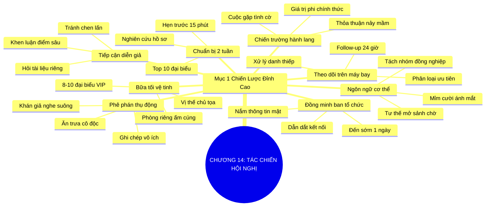

# SƠ ĐỒ TƯ DUY TRỰC QUAN: CHƯƠNG 14: BIỆT ĐỘI TÁC CHIẾN HỘI NGHỊ (BE A CONFERENCE COMMANDO)
* **Thuộc phần**: Phần 2: Bộ Kỹ Năng Thực Chiến (The Skill Set)
* **Tác phẩm**: Đừng Bao Giờ Đi Ăn Một Mình (Never Eat Alone) - Keith Ferrazzi
* **Chuẩn hóa**: Document Structure-Anchored v2.4 (Không nhãn meta thừa, phản ánh 100% cấu trúc tài liệu)

---

## 🌳 SƠ ĐỒ TƯ DUY MERMAID (4-5 TẦNG CHI TIẾT)

---

## 🧬 BẢNG PHÂN CẤP TRUY HỒI CHỦ ĐỘNG (ACTIVE RECALL HIERARCHY)
Cấu trúc hóa tri thức theo các nhánh tài liệu phục vụ ôn tập nhanh và khắc sâu trí nhớ:

| 📑 Nhánh Mục Tài Liệu | 🔑 Từ Khóa Vàng / Khái Niệm | 📝 Nội Dung Truy Hồi Chủ Động (Active Recall) |
| :--- | :--- | :--- |
| Mục 1: Chiến Lược Đỉnh Cao Khi Tham Gia Hội Thảo | **Phê phán thụ động** | Ngồi nghe thụ động là lãng phí tài nguyên; giá trị cốt lõi nằm ở kết nối hành lang. |
| Mục 1: Chiến Lược Đỉnh Cao Khi Tham Gia Hội Thảo | **Chuẩn bị trước 2 tuần** | Lập danh sách Top 10 mục tiêu và hẹn trước lịch cà phê 15 phút từ sớm. |
| Mục 1: Chiến Lược Đỉnh Cao Khi Tham Gia Hội Thảo | **Đồng minh ban tổ chức** | Đến sớm làm quen với ban tổ chức để nhận thông tin mật và được giới thiệu VIP. |
| Mục 1: Chiến Lược Đỉnh Cao Khi Tham Gia Hội Thảo | **Bữa tối vệ tinh** | Tổ chức tiệc tối riêng cho 8-10 người xuất chúng để xác lập vị thế chủ trì tinh hoa. |
| Mục 1: Chiến Lược Đỉnh Cao Khi Tham Gia Hội Thảo | **Tiếp cận diễn giả** | Tiếp cận bằng câu hỏi sâu sắc về nội dung bài phát biểu thay vì khen sáo rỗng. |
| Mục 1: Chiến Lược Đỉnh Cao Khi Tham Gia Hội Thảo | **Follow-up thần tốc** | Phân loại danh thiếp và hoàn thành thư theo dõi ngay trên đường trở về. |

---

## ⚡ BẢNG NEO TRÍ NHỚ NHANH (MEMORY ANCHOR CHEAT SHEET)
Tóm tắt cô đọng các công thức và quy tắc hành động của chương:

| 📑 Phần/Mục Tài Liệu | 📌 Khái Niệm Cốt Lõi | ⚖️ Nguyên Lý Vàng | 🚀 Hành Động Chuyển Hóa Ngay |
| :--- | :--- | :--- | :--- |
| Mục 1: Tác chiến hội nghị | **Chiến trường hành lang** | Tập trung năng lượng vào sảnh giải lao và bàn tiệc | Chuyển từ khán giả sang nhà kết nối chủ động |
| Mục 1: Tác chiến hội nghị | **Chuẩn bị 14 ngày** | Nghiên cứu danh sách đại biểu và hẹn trước 15 phút | Định đoạt kết quả trước ngày khai mạc |
| Mục 1: Tác chiến hội nghị | **Bữa tối vệ tinh** | Tổ chức tiệc tối riêng cho 8-10 đại biểu hàng đầu | Trở thành trung tâm kết nối tinh hoa |
| Mục 1: Tác chiến hội nghị | **Đồng minh ban tổ chức** | Kết thân ban tổ chức để tiếp cận các khách VIP | Mở rộng quyền tiếp cận thông tin độc quyền |

