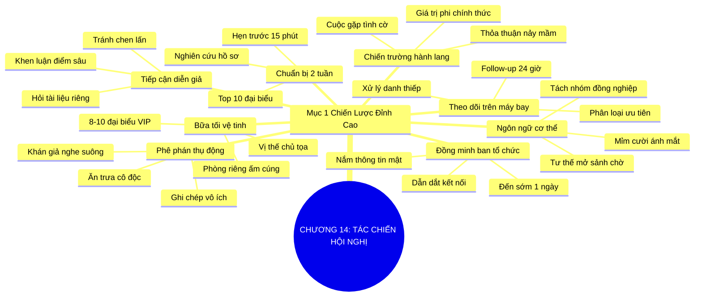

# TÓM TẮT CHƯƠNG SÁCH: CHƯƠNG 14: BIỆT ĐỘI TÁC CHIẾN HỘI NGHỊ (BE A CONFERENCE COMMANDO)
* **Thuộc phần**: Phần 2: Bộ Kỹ Năng Thực Chiến (The Skill Set)
* **Tác giả**: Keith Ferrazzi (với Tahl Raz)
* **Chuẩn hóa cấu trúc**: Document Structure-Anchored v2.4

---

## 🌟 THÔNG ĐIỆP CỐT LÕI (CORE MESSAGE)
> Chiến thắng được định đoạt trước khi khai hỏa: Thay vì ngồi nghe thụ động, hãy biến mình thành 'Biệt đội tác chiến' nghiên cứu đại biểu trước 2 tuần, kết thân ban tổ chức và chủ trì bàn tiệc tinh hoa bên hành lang.

---

## 📊 LƯỢC ĐỒ PHÂN BỔ CẤU TRÚC TÀI LIỆU
Bảng đối chiếu tỷ lệ và cấu trúc luận điểm bám sát các đề mục thực tế trong tài liệu:

| 📑 Đề Mục Trong Tài Liệu Gốc | 🎯 Số Lượng Luận Điểm Chuyên Sâu |
| :--- | :---: |
| Mục 1: Chiến Lược Đỉnh Cao Khi Tham Gia Hội Thảo (The Art of The Conference Commando) | 8 |
| **Tổng cộng toàn chương** | **8 Luận Điểm** |

---

## 💡 HỆ THỐNG LUẬN ĐIỂM QUAN TRỌNG (KEY TAKEAWAYS)

#### 📑 PHẦN: MỤC 1: CHIẾN LƯỢC ĐỈNH CAO KHI THAM GIA HỘI THẢO (THE ART OF THE CONFERENCE COMMANDO)

##### 1. Sự thụ động lãng phí của người tham dự thông thường
* **Phân Tích Chuyên Sâu**: Đa số mọi người đi hội nghị như những khán giả thụ động: ngồi im nghe thuyết trình dài dòng, ghi chép vài trang sổ tay, lúng túng đi dạo giờ giải lao và ăn trưa một mình ở góc phòng. Đó là sự lãng phí tiền vé máy bay, khách sạn và thời gian vô ích nhất.
* **Công Cụ / Phương Pháp Đi Kèm**: Phê phán tư duy khán giả thụ động (Passive Attendee Critique), Nhận diện chi phí cơ hội.
* **Ví Dụ Thực Tế Ứng Dụng**: Tham dự hội nghị công nghệ 3 ngày tốn hàng ngàn đô la nhưng không làm quen được ai ngoài những người cùng công ty đi chung.

##### 2. Chiến trường thực sự nằm ở hành lang và bàn tiệc tối
* **Phân Tích Chuyên Sâu**: Những bài phát biểu trên sân khấu chính thường là thông tin công khai có thể đọc lại sau. Giá trị vô giá của hội nghị nằm ở các cuộc gặp gỡ tình cờ bên hành lang, những tách cà phê 15 phút giờ giải lao và các bữa tiệc tối riêng tư nơi các thỏa thuận lớn thực sự được nảy mầm.
* **Công Cụ / Phương Pháp Đi Kèm**: Nguyên lý hành lang hội nghị (Hallway Track Strategy), Khai thác không gian phi chính thức.
* **Ví Dụ Thực Tế Ứng Dụng**: Keith Ferrazzi hiếm khi ngồi trọn vẹn trong hội trường; ông dành phần lớn thời gian ở khu vực sảnh để kết nối trực tiếp với các diễn giả và lãnh đạo.

##### 3. Nghiên cứu danh sách đại biểu 2 tuần trước giờ khai mạc
* **Phân Tích Chuyên Sâu**: Giống như các chiến lược gia quân sự, trận đánh hội nghị phải được chuẩn bị từ trước. Hãy xin danh sách đại biểu trước 14 ngày, chọn ra 10 nhân vật trọng điểm bắt buộc phải gặp, tìm hiểu sâu về họ và chủ động gửi email đặt lịch cà phê 15 phút từ trước.
* **Công Cụ / Phương Pháp Đi Kèm**: Kế hoạch tác chiến trước hội nghị (Pre-Conference Target List: Top 10 mục tiêu), Mẫu email hẹn trước 15 phút.
* **Ví Dụ Thực Tế Ứng Dụng**: 'Chào anh David, tôi biết anh sẽ dự Diễn đàn Davos tuần tới; tôi rất mong có dịp mời anh tách cà phê 15 phút để trao đổi về xu hướng AI...'

##### 4. Biến ban tổ chức hội nghị thành đồng minh chiến lược
* **Phân Tích Chuyên Sâu**: Hãy đến sớm trước một ngày và làm quen thân thiết với đội ngũ ban tổ chức. Họ nắm giữ toàn bộ thông tin nội bộ quý giá nhất: ai vừa hạ cánh, ai ở khách sạn nào, diễn giả nào đang rảnh và sẵn sàng dắt tay bạn đến giới thiệu với những nhân vật quyền lực nhất.
* **Công Cụ / Phương Pháp Đi Kèm**: Đồng minh ban tổ chức (Organizer Ally Protocol), Hỗ trợ ban tổ chức để xây dựng lòng tin.
* **Ví Dụ Thực Tế Ứng Dụng**: Đến sớm giúp ban tổ chức sắp xếp tài liệu và được người trưởng ban dẫn thẳng vào phòng VIP giới thiệu với diễn giả chính.

##### 5. Tổ chức bữa tiệc tối tinh hoa vệ tinh (Satellite Dinner)
* **Phân Tích Chuyên Sâu**: Thay vì tham dự các bữa tiệc buffet ồn ào hỗn loạn của ban tổ chức, hãy thuê một phòng ăn riêng ấm cúng tại nhà hàng gần đó và mời 8-10 đại biểu xuất chúng nhất cùng dùng bữa tối. Bạn lập tức chuyển hóa vị thế từ người tham dự mờ nhạt thành chủ tọa một diễn đàn tinh hoa.
* **Công Cụ / Phương Pháp Đi Kèm**: Chiến lược bữa tối vệ tinh (The Satellite VIP Dinner), Điều phối không gian đối thoại đỉnh cao.
* **Ví Dụ Thực Tế Ứng Dụng**: Tại Diễn đàn Kinh tế Thế giới, Keith tổ chức bữa tối riêng quy tụ các CEO công nghệ hàng đầu, tạo nên điểm nhấn kết nối ấn tượng nhất sự kiện.

##### 6. Kỹ thuật tiếp cận diễn giả ngay sau bài phát biểu
* **Phân Tích Chuyên Sâu**: Không nên chen lấn trong đám đông vây quanh sân khấu ngay sau bài nói. Hãy đợi họ bước ra hành lang hoặc tiếp cận họ tại khu vực VIP bằng một câu hỏi cụ thể, sâu sắc liên quan trực tiếp đến một luận điểm độc đáo trong bài phát biểu của họ.
* **Công Cụ / Phương Pháp Đi Kèm**: Kỹ thuật tiếp cận diễn giả thông minh (Speaker Approach Protocol: Lời khen cụ thể + Câu hỏi chiều sâu).
* **Ví Dụ Thực Tế Ứng Dụng**: Thay vì khen chung chung 'Bài nói hay quá', hãy nói: 'Tôi rất tâm đắc cách tiếp cận của anh ở slide số 8 về rủi ro thanh khoản, liệu tôi có thể gửi email xin thêm tài liệu nghiên cứu này?'

##### 7. Làm chủ ngôn ngữ cơ thể và tư thế mở tại khu vực giải lao
* **Phân Tích Chuyên Sâu**: Đứng ở vị trí trung tâm dòng người qua lại với tư thế mở (hai tay thả lỏng, mắt hướng về phía trước, mỉm cười thân thiện). Tuyệt đối tránh cắm mặt vào điện thoại hay đứng túm tụm với đồng nghiệp công ty cũ.
* **Công Cụ / Phương Pháp Đi Kèm**: Ngôn ngữ cơ thể đón nhận (Open Body Stance & Eye Contact), Vị trí chiến lược sảnh hội nghị.
* **Ví Dụ Thực Tế Ứng Dụng**: Đứng gần khu vực quầy trà/cà phê với nụ cười cởi mở, sẵn sàng bắt chuyện với người đứng xếp hàng bên cạnh.

##### 8. Chiến dịch follow-up thần tốc ngay trên chuyến bay về
* **Phân Tích Chuyên Sâu**: Ngay khi bước lên máy bay trở về, hãy mở máy tính và phân loại toàn bộ danh thiếp thu thập được. Soạn sẵn email theo dõi cho từng người trước khi máy bay hạ cánh để gửi đi ngay sáng hôm sau.
* **Công Cụ / Phương Pháp Đi Kèm**: Quy trình xử lý danh thiếp chuyến bay (In-Flight Contact Processing), Quét danh thiếp bằng phần mềm CamCard/Notion.
* **Ví Dụ Thực Tế Ứng Dụng**: Phân loại 30 danh thiếp thành 3 nhóm ưu tiên trên chuyến bay từ Singapore về Hà Nội và lên lịch gửi email trong 24 giờ.

---

## 🎯 KẾ HOẠCH HÀNH ĐỘNG TOÀN DIỆN (ACTION PLAN)
### ⚡ Cấp độ 1: Thói quen vi mô (Micro-habits < 2 phút mỗi ngày)
- [ ] Xin danh sách đại biểu tham dự trước 2 tuần đối với bất kỳ hội nghị nào sắp tới
- [ ] Lập danh sách Top 10 nhân vật bắt buộc phải tiếp cận tại sự kiện
- [ ] Gửi email hẹn trước 15 phút cà phê cho ít nhất 3 đại biểu quan trọng
- [ ] Đến sớm trước 1 ngày để làm quen và kết thân với đội ngũ ban tổ chức
- [ ] Đặt trước một phòng ăn riêng tại nhà hàng gần sự kiện để tổ chức bữa tối vệ tinh

### 📅 Cấp độ 2: Thói quen tuần & Dự án ngắn hạn (Weekly Habits)
- [ ] Mời 6-8 nhân vật thú vị nhất cùng tham gia bữa tối riêng ấm cúng
- [ ] Hạn chế ngồi nghe trọn vẹn các phiên thuyết trình dài nếu có thể xem lại tài liệu
- [ ] Dành ít nhất 60% thời gian hội nghị tại khu vực hành lang và sảnh giao lưu
- [ ] Đứng ở tư thế mở, mỉm cười và tuyệt đối không cắm mặt vào màn hình điện thoại
- [ ] Tách khỏi nhóm đồng nghiệp cùng công ty để chủ động làm quen với người mới

### 🚀 Cấp độ 3: Chiến lược chuyển hóa dài hạn (Long-term Strategy)
- [ ] Đặt câu hỏi chất lượng cao trong phiên hỏi đáp (Q&A) để cả hội trường biết đến bạn
- [ ] Tiếp cận diễn giả bằng một bình luận sâu sắc về một luận điểm cụ thể trong bài nói
- [ ] Quét và số hóa toàn bộ danh thiếp thu thập được ngay cuối mỗi ngày hội nghị
- [ ] Viết ghi chú nhanh về bối cảnh gặp gỡ lên mặt sau của danh thiếp
- [ ] Hoàn thành 100% email follow-up trong vòng 24 giờ sau khi sự kiện bế mạc

---

## ❓ BỘ CÂU HỎI TỰ VẤN & PHẢN TƯ SUY NGẪM (REFLECTION QUESTIONS)
### Nhóm 1: Nhận thức thực tại & Thói quen hiện tại
1. Bạn thường đóng vai một khán giả thụ động hay một biệt đội tác chiến khi đi hội nghị?
2. Tại sao giá trị lớn nhất của hội thảo lại nằm ở hành lang chứ không phải trên sân khấu?
3. Bạn đã bao giờ chủ động xin danh sách đại biểu và đặt lịch hẹn trước 2 tuần chưa?
4. Cảm giác của bạn thế nào khi bước vào một khán phòng đông đúc mà không quen biết ai?
5. Ban tổ chức hội nghị có thể mang lại những trợ lực đặc quyền nào cho bạn?

### Nhóm 2: Thách thức tâm lý & Rào cản nội tâm
6. Tại sao việc tổ chức một bữa tối vệ tinh nhỏ lại hiệu quả gấp mười lần tiệc buffet chung?
7. Làm sao để vượt qua sự cám dỗ muốn tụ tập với các đồng nghiệp quen thuộc đi cùng?
8. Ngôn ngữ cơ thể của bạn tại sảnh tiệc trà gửi đi thông điệp cởi mở hay khép kín?
9. Bạn chuẩn bị câu hỏi gì để gây ấn tượng với toàn bộ khán phòng trong phiên Q&A?
10. Cách tiếp cận diễn giả nào khiến họ ghi nhớ bạn nhất trong hàng chục người vây quanh?

### Nhóm 3: Chiến lược hành động & Ứng dụng thực tế
11. Bạn có thường xuyên cắm mặt vào điện thoại khi cảm thấy lúng túng giữa đám đông không?
12. Làm thế nào để ghi nhớ thông tin của 20 người bạn mới quen trong một ngày hội nghị?
13. Chi phí thực sự (thời gian, tiền bạc, cơ hội) của một chuyến đi hội nghị là bao nhiêu?
14. Bạn xử lý các tập danh thiếp sau hội thảo như thế nào, hay để chúng bám bụi?
15. Một bữa ăn tối vệ tinh thành công đòi hỏi những kỹ năng điều phối bàn tiệc nào?

### Nhóm 4: Chuyển hóa tư duy & Tầm nhìn dài hạn
16. Bạn có sẵn sàng đầu tư tiền túi để thuê phòng ăn riêng chiêu đãi các đại biểu VIP không?
17. Làm sao để lời mời cà phê 15 phút trước hội nghị nhận được phản hồi đồng ý?
18. Điểm khác biệt lớn nhất giữa một 'kẻ săn danh thiếp' và một 'biệt đội tác chiến' là gì?
19. Sau một kỳ hội thảo thành công nhất, bạn đã chuyển hóa được bao nhiêu mối quan hệ thành hợp đồng?
20. Kế hoạch tác chiến cụ thể cho hội nghị tiếp theo trong lịch làm việc của bạn là gì?

---

## 🧠 SƠ ĐỒ TƯ DUY TRỰC QUAN (MINDMAP)

