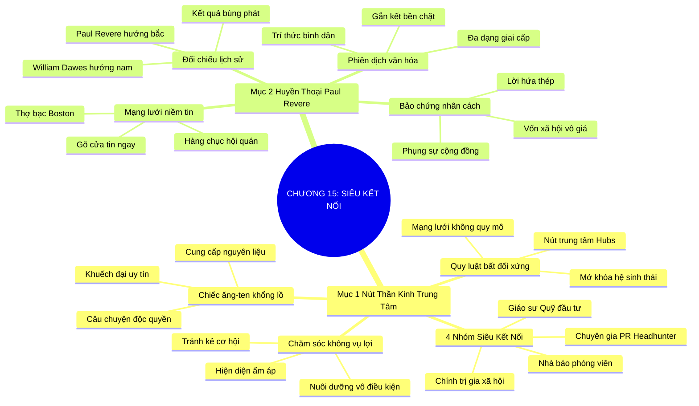

# SƠ ĐỒ TƯ DUY TRỰC QUAN: CHƯƠNG 15: KẾT NỐI VỚI NHỮNG SIÊU KẾT NỐI (CONNECTING WITH CONNECTORS)
* **Thuộc phần**: Phần 2: Bộ Kỹ Năng Thực Chiến (The Skill Set)
* **Tác phẩm**: Đừng Bao Giờ Đi Ăn Một Mình (Never Eat Alone) - Keith Ferrazzi
* **Chuẩn hóa**: Document Structure-Anchored v2.4 (Không nhãn meta thừa, phản ánh 100% cấu trúc tài liệu)

---

## 🌳 SƠ ĐỒ TƯ DUY MERMAID (4-5 TẦNG CHI TIẾT)

---

## 🧬 BẢNG PHÂN CẤP TRUY HỒI CHỦ ĐỘNG (ACTIVE RECALL HIERARCHY)
Cấu trúc hóa tri thức theo các nhánh tài liệu phục vụ ôn tập nhanh và khắc sâu trí nhớ:

| 📑 Nhánh Mục Tài Liệu | 🔑 Từ Khóa Vàng / Khái Niệm | 📝 Nội Dung Truy Hồi Chủ Động (Active Recall) |
| :--- | :--- | :--- |
| Mục 1: Tầm Quan Trọng Của Nút Thần Kinh Trung Tâm | **Quy luật Hubs** | Mạng lưới xã hội phân bổ theo quy luật trung tâm; tiếp cận một Siêu Kết Nối giúp mở khóa cả hệ sinh thái. |
| Mục 1: Tầm Quan Trọng Của Nút Thần Kinh Trung Tâm | **4 Nhóm Siêu Kết Nối** | Nhà báo, Chuyên gia PR/Headhunter, Chính trị gia, Giáo sư/Nhà đầu tư mạo hiểm. |
| Mục 1: Tầm Quan Trọng Của Nút Thần Kinh Trung Tâm | **Cung cấp nguyên liệu** | Thu phục Siêu Kết Nối bằng cách cung cấp câu chuyện độc quyền hoặc hỗ trợ mục tiêu của họ. |
| Mục 2: Huyền Thoại Nhà Kết Nối Paul Revere | **Bài học đối chiếu** | Paul Revere chiến thắng William Dawes nhờ mạng lưới niềm tin chứ không phải tốc độ ngựa. |
| Mục 2: Huyền Thoại Nhà Kết Nối Paul Revere | **Vốn xã hội tích lũy** | Tham gia nhiều câu lạc bộ, hội nhóm giúp xây dựng niềm tin xã hội sâu rộng suốt đời. |
| Mục 2: Huyền Thoại Nhà Kết Nối Paul Revere | **Bảo chứng nhân cách** | Uy tín cá nhân và sự phụng sự là bệ phóng giúp thông điệp kích hoạt hành động tức thời. |

---

## ⚡ BẢNG NEO TRÍ NHỚ NHANH (MEMORY ANCHOR CHEAT SHEET)
Tóm tắt cô đọng các công thức và quy tắc hành động của chương:

| 📑 Phần/Mục Tài Liệu | 📌 Khái Niệm Cốt Lõi | ⚖️ Nguyên Lý Vàng | 🚀 Hành Động Chuyển Hóa Ngay |
| :--- | :--- | :--- | :--- |
| Mục 1: Nút thần kinh trung tâm | **Quy luật Hubs** | Kết nối qua các nút mạng trung tâm để lan tỏa nhanh | Tiếp cận 1 người mở khóa 1.000 người |
| Mục 1: Nút thần kinh trung tâm | **4 Nhóm quyền lực** | Nhà báo, PR/Headhunter, Chính trị gia, Quỹ đầu tư | Xác định và xây dựng quan hệ chiến lược |
| Mục 2: Huyền thoại Paul Revere | **Bài học Paul Revere** | Mạng lưới niềm tin tạo nên cuộc tổng khởi nghĩa | Đầu tư vào uy tín cộng đồng dài hạn |
| Mục 2: Huyền thoại Paul Revere | **Cầu nối văn hóa** | Giao tiếp hòa đồng với mọi giai cấp xã hội | Trở thành mắt xích gắn kết đáng tin cậy |

