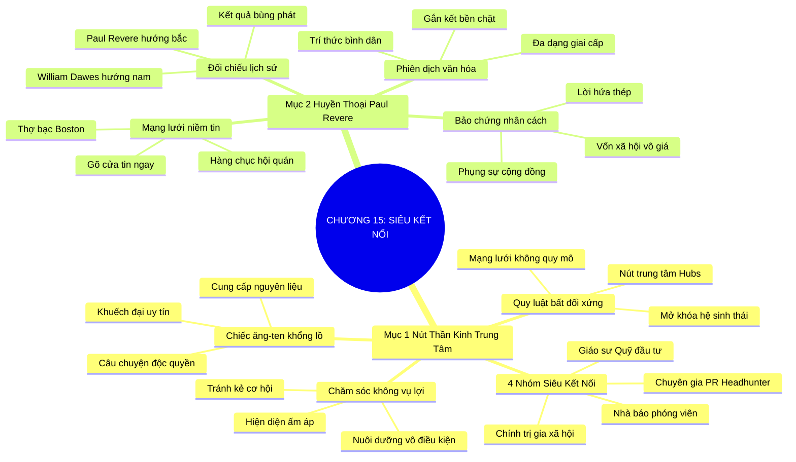

# TÓM TẮT CHƯƠNG SÁCH: CHƯƠNG 15: KẾT NỐI VỚI NHỮNG SIÊU KẾT NỐI (CONNECTING WITH CONNECTORS)
* **Thuộc phần**: Phần 2: Bộ Kỹ Năng Thực Chiến (The Skill Set)
* **Tác giả**: Keith Ferrazzi (với Tahl Raz)
* **Chuẩn hóa cấu trúc**: Document Structure-Anchored v2.4

---

## 🌟 THÔNG ĐIỆP CỐT LÕI (CORE MESSAGE)
> Không cần tìm kiếm từng người đơn lẻ: Kết nối và giành được niềm tin của các 'Siêu Kết Nối' (nhà báo, PR, chính trị gia, quỹ đầu tư) sẽ kích hoạt mạng lưới niềm tin xã hội vô giá, khuếch đại thông điệp của bạn tới hàng ngàn người như huyền thoại Paul Revere.

---

## 📊 LƯỢC ĐỒ PHÂN BỔ CẤU TRÚC TÀI LIỆU
Bảng đối chiếu tỷ lệ và cấu trúc luận điểm bám sát các đề mục thực tế trong tài liệu:

| 📑 Đề Mục Trong Tài Liệu Gốc | 🎯 Số Lượng Luận Điểm Chuyên Sâu |
| :--- | :---: |
| Mục 1: Tầm Quan Trọng Của Các Nút Thần Kinh Trung Tâm Trong Mạng Lưới (Super Connectors) | 4 |
| Mục 2: Hồ Sơ Đại Sảnh Danh Vọng Nhà Kết Nối: Huyền Thoại Paul Revere (Connectors Hall of Fame Profile Paul Revere) | 4 |
| **Tổng cộng toàn chương** | **8 Luận Điểm** |

---

## 💡 HỆ THỐNG LUẬN ĐIỂM QUAN TRỌNG (KEY TAKEAWAYS)

#### 📑 PHẦN: MỤC 1: TẦM QUAN TRỌNG CỦA CÁC NÚT THẦN KINH TRUNG TÂM TRONG MẠNG LƯỚI (SUPER CONNECTORS)

##### 1. Quy luật phân bổ bất đối xứng và các nút mạng trung tâm
* **Phân Tích Chuyên Sâu**: Mạng lưới xã hội không phân bổ đồng đều theo đường thẳng mà tuân theo quy luật mạng lưới không quy mô (Scale-Free Network). Phần lớn mọi người chỉ kết nối với số ít người quen, nhưng một nhóm nhỏ các 'Siêu Kết Nối' lại nắm giữ hàng ngàn mối liên kết đan xen khắp các tầng lớp. Tiếp cận được một nút trung tâm tương đương với việc mở khóa toàn bộ một hệ sinh thái.
* **Công Cụ / Phương Pháp Đi Kèm**: Lý thuyết đồ thị mạng lưới (Network Graph Theory / Hub Nodes), Định vị nút thần kinh trung tâm.
* **Ví Dụ Thực Tế Ứng Dụng**: Thay vì tìm gặp 100 nhà đầu tư thiên thần, hãy kết nối với một giám đốc vườn ươm khởi nghiệp uy tín có quan hệ với toàn bộ các quỹ đó.

##### 2. Nhận diện 4 nhóm Siêu Kết Nối quyền lực trong xã hội
* **Phân Tích Chuyên Sâu**: Có 4 ngành nghề tự nhiên sản sinh ra các Siêu Kết Nối: 1. Nhà báo & Phóng viên (khao khát tin hay, sở hữu loa phóng thanh truyền thông); 2. Chuyên gia PR & Headhunter (sống bằng việc kết nối nhân tài và thương hiệu); 3. Chính trị gia & Nhà hoạt động xã hội (sống bằng liên minh cộng đồng); 4. Giáo sư đại học & Nhà đầu tư mạo hiểm (cầu nối vốn và chất xám).
* **Công Cụ / Phương Pháp Đi Kèm**: Bản đồ 4 nhóm Siêu Kết Nối (Journalists, PR/Headhunters, Politicians, Investors/Professors).
* **Ví Dụ Thực Tế Ứng Dụng**: Xây dựng mối quan hệ thân thiết với một phóng viên kinh tế hàng đầu để khi có sản phẩm đột phá, tin tức lập tức được lan tỏa trên các mặt báo lớn.

##### 3. Nguyên lý biến chiếc ăng-ten khổng lồ thành người ủng hộ
* **Phân Tích Chuyên Sâu**: Siêu Kết Nối giống như những trạm phát sóng cực mạnh. Cách để thu phục họ không phải là xin xỏ mà là cung cấp cho họ nguyên liệu quý giá: câu chuyện độc quyền cho nhà báo, ứng viên xuất sắc cho headhunter, hoặc giải pháp cộng đồng cho chính trị gia. Khi bạn giúp họ hoàn thành sứ mệnh, họ sẽ tự động khuếch đại uy tín của bạn.
* **Công Cụ / Phương Pháp Đi Kèm**: Chiến lược cung cấp nguyên liệu độc quyền (The Content Provider Strategy).
* **Ví Dụ Thực Tế Ứng Dụng**: Cung cấp số liệu phân tích thị trường độc quyền cho một phóng viên chuyên mục tài chính, giúp họ có bài viết trang nhất xuất sắc.

##### 4. Chăm sóc bền bỉ và giữ mối liên hệ không vụ lợi
* **Phân Tích Chuyên Sâu**: Siêu Kết Nối rất nhạy cảm với những kẻ cơ hội chỉ tìm đến khi cần nhờ vả. Bạn phải duy trì sự hiện diện ấm áp, thường xuyên chúc mừng thành tựu và hỗ trợ các dự án của họ ngay cả khi bạn chưa cần bất kỳ sự giúp đỡ nào.
* **Công Cụ / Phương Pháp Đi Kèm**: Chăm sóc vô điều kiện (Unconditional Hub Maintenance).
* **Ví Dụ Thực Tế Ứng Dụng**: Thường xuyên gửi phản hồi khen ngợi các bài viết mới của nhà báo mà không đòi hỏi bất kỳ bài PR nào cho cá nhân.

#### 📑 PHẦN: MỤC 2: HỒ SƠ ĐẠI SẢNH DANH VỌNG NHÀ KẾT NỐI: HUYỀN THOẠI PAUL REVERE (CONNECTORS HALL OF FAME PROFILE PAUL REVERE)

##### 5. Bài học lịch sử đối chiếu: Paul Revere vs. William Dawes
* **Phân Tích Chuyên Sâu**: Đêm 18/4/1775, hai người đưa thư cùng phi ngựa báo động quân Anh tiến đánh: William Dawes đi hướng nam và các thị trấn vẫn ngủ say; Paul Revere đi hướng bắc và hàng ngàn dân quân đã cầm súng sẵn sàng. Sự khác biệt sống còn không nằm ở tốc độ con ngựa mà nằm ở vị thế Siêu Kết Nối của Paul Revere.
* **Công Cụ / Phương Pháp Đi Kèm**: Điểm bùng phát xã hội học (The Tipping Point Law of the Few - Malcolm Gladwell).
* **Ví Dụ Thực Tế Ứng Dụng**: Cùng một thông điệp khẩn cấp nhưng được truyền đi bởi một Siêu Kết Nối có uy tín sẽ kích hoạt hành động tức thời trên diện rộng.

##### 6. Mạng lưới niềm tin xã hội tích lũy suốt cả cuộc đời
* **Phân Tích Chuyên Sâu**: Paul Revere là thợ bạc nhưng tham gia hàng chục hội đồng hương, câu lạc bộ thợ thủ công, hội quán tôn giáo và hội kín yêu nước. Ông biết đích danh từng vị mục sư, chủ quán trọ và thủ lĩnh làng. Khi ông gõ cửa trong đêm, người dân tin tưởng tuyệt đối vào lời nói của ông.
* **Công Cụ / Phương Pháp Đi Kèm**: Vốn xã hội tích lũy (Social Capital Accumulation), Tín nhiệm cộng đồng.
* **Ví Dụ Thực Tế Ứng Dụng**: Tích cực tham gia các hoạt động hội cựu sinh viên, câu lạc bộ sở thích để xây dựng vốn niềm tin đa dạng trước khi khởi nghiệp.

##### 7. Đặc tính đa năng của chiếc cầu nối văn hóa xã hội
* **Phân Tích Chuyên Sâu**: Một Siêu Kết Nối thực thụ không tự giới hạn mình trong một giai cấp hẹp hòi. Họ có khả năng giao tiếp thoải mái từ giới tinh hoa học giả đến người lao động bình dân, đóng vai trò phiên dịch viên văn hóa giữa các thế giới khác biệt.
* **Công Cụ / Phương Pháp Đi Kèm**: Khả năng thấu cảm đa văn hóa (Cross-Cultural Fluency).
* **Ví Dụ Thực Tế Ứng Dụng**: Vừa có thể trò chuyện học thuật với giáo sư tiến sĩ, vừa hòa đồng thân ái với các bạn sinh viên tình nguyện trẻ tuổi.

##### 8. Sức mạnh của thông điệp được bảo chứng bằng nhân cách
* **Phân Tích Chuyên Sâu**: Thông điệp chỉ có sức mạnh khi người truyền tải nó có độ tín nhiệm cao. Đầu tư vào nhân cách, giữ trọn lời hứa và phụng sự cộng đồng chính là con đường duy nhất để trở thành một Paul Revere trong ngành nghề của bạn.
* **Công Cụ / Phương Pháp Đi Kèm**: Uy tín cá nhân bất biến (Personal Credibility Asset).
* **Ví Dụ Thực Tế Ứng Dụng**: Khi một chuyên gia có đạo đức nghề nghiệp lên tiếng cảnh báo rủi ro thị trường, toàn bộ cộng đồng lập tức điều chỉnh chiến lược an toàn.

---

## 🎯 KẾ HOẠCH HÀNH ĐỘNG TOÀN DIỆN (ACTION PLAN)
### ⚡ Cấp độ 1: Thói quen vi mô (Micro-habits < 2 phút mỗi ngày)
- [ ] Xác định 3 Siêu Kết Nối (phóng viên, chuyên gia PR, headhunter) hàng đầu trong ngành của bạn
- [ ] Theo dõi và tương tác có giá trị với các bài viết của họ trên mạng xã hội tuần này
- [ ] Chuẩn bị một nguồn tin hoặc góc nhìn độc quyền để chia sẻ cho một nhà báo uy tín
- [ ] Giới thiệu một ứng viên tài năng xuất chúng cho một chuyên gia săn đầu người (Headhunter)
- [ ] Tham gia vào một hiệp hội ngành nghề hoặc câu lạc bộ cộng đồng mới trong tháng tới

### 📅 Cấp độ 2: Thói quen tuần & Dự án ngắn hạn (Weekly Habits)
- [ ] Đóng góp công sức và tài trợ cho các sự kiện của cựu sinh viên trường cũ
- [ ] Gửi lời chúc mừng chân thành đến một Siêu Kết Nối vừa đạt được giải thưởng lớn
- [ ] Đọc cuốn sách 'Điểm Bùng Phát' của Malcolm Gladwell để hiểu sâu về vai trò kết nối
- [ ] Tuyệt đối không đòi hỏi sự đền đáp ngay lập tức khi hỗ trợ một Siêu Kết Nối
- [ ] Xây dựng danh sách 'Ăng-ten truyền thông' gồm các phóng viên phụ trách lĩnh vực của bạn

### 🚀 Cấp độ 3: Chiến lược chuyển hóa dài hạn (Long-term Strategy)
- [ ] Tình nguyện tham gia ban điều hành của một câu lạc bộ chuyên môn để mở rộng quan hệ
- [ ] Rèn luyện khả năng giao tiếp hòa đồng với mọi tầng lớp xã hội khác nhau
- [ ] Giữ chữ tín tuyệt đối trong mọi lời cam kết nhỏ nhất với cộng đồng
- [ ] Trở thành người chia sẻ các thông tin chất lượng cao cho mạng lưới bạn bè
- [ ] Tự đánh giá xem bạn đang ở gần hình mẫu Paul Revere hay William Dawes

---

## ❓ BỘ CÂU HỎI TỰ VẤN & PHẢN TƯ SUY NGẪM (REFLECTION QUESTIONS)
### Nhóm 1: Nhận thức thực tại & Thói quen hiện tại
1. Trong lĩnh vực của bạn, ai là những người sở hữu khả năng kết nối hàng ngàn người (Siêu Kết Nối)?
2. Bạn đang kết nối trực tiếp với từng khách hàng đơn lẻ hay đã tiếp cận các nút trung tâm?
3. Tại sao câu chuyện của Paul Revere và William Dawes lại là bài học kinh điển về vốn xã hội?
4. Bạn có quen biết thân thiết với nhà báo, phóng viên hay chuyên gia truyền thông nào không?
5. Giá trị độc quyền nào bạn có thể cung cấp để một Siêu Kết Nối sẵn lòng lắng nghe bạn?

### Nhóm 2: Thách thức tâm lý & Rào cản nội tâm
6. Làm thế nào để một người bình thường có thể kết bạn được với các nhân vật trung tâm quyền lực?
7. Bạn tham gia bao nhiêu hội nhóm, câu lạc bộ ngoài công việc chuyên môn hiện tại?
8. Khi bạn gõ cửa hay gửi lời nhắn, người khác có lập tức tin tưởng và hành động như với Paul Revere không?
9. Điều gì khiến các chuyên gia săn đầu người (Headhunter) trở thành những người bạn đắc lực?
10. Làm sao để phân biệt giữa việc xây dựng mối quan hệ chân thành với hành vi lợi dụng truyền thông?

### Nhóm 3: Chiến lược hành động & Ứng dụng thực tế
11. Bạn có khả năng trò chuyện thoải mái với những người thuộc tầng lớp xã hội hoàn toàn khác bạn không?
12. Nếu cần lan tỏa một chiến dịch ý nghĩa trong 24 giờ tới, ai là 3 người đầu tiên bạn sẽ gọi?
13. Tại sao sự tích lũy niềm tin qua nhiều năm lại quan trọng hơn tốc độ truyền tin tức thời?
14. Bạn cảm thấy thế nào khi đóng vai trò là chiếc cầu nối giới thiệu hai người bạn xuất chúng với nhau?
15. Những sai lầm phổ biến nhất khi tiếp cận các nhà báo và phóng viên là gì?

### Nhóm 4: Chuyển hóa tư duy & Tầm nhìn dài hạn
16. Vốn xã hội (Social Capital) của bạn hiện tại đang giàu có hay nghèo nàn?
17. Làm thế nào để một Siêu Kết Nối luôn nhớ đến bạn mỗi khi họ có cơ hội công việc tốt?
18. Phẩm chất đạo đức nào là cốt lõi để giữ vững uy tín của một người kết nối?
19. Bạn có muốn trở thành một 'Paul Revere' trong cộng đồng chuyên môn của mình không?
20. Bước đầu tiên bạn sẽ thực hiện để kết nối với một Siêu Kết Nối trong tuần này là gì?

---

## 🧠 SƠ ĐỒ TƯ DUY TRỰC QUAN (MINDMAP)

