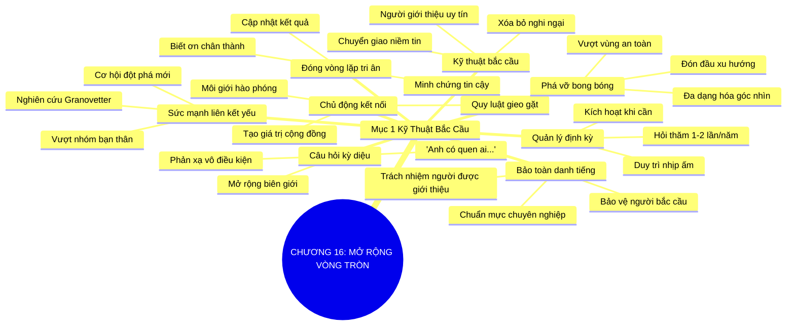

# SƠ ĐỒ TƯ DUY TRỰC QUAN: CHƯƠNG 16: MỞ RỘNG VÒNG TRÒN QUAN HỆ (EXPANDING YOUR CIRCLE)
* **Thuộc phần**: Phần 2: Bộ Kỹ Năng Thực Chiến (The Skill Set)
* **Tác phẩm**: Đừng Bao Giờ Đi Ăn Một Mình (Never Eat Alone) - Keith Ferrazzi
* **Chuẩn hóa**: Document Structure-Anchored v2.4 (Không nhãn meta thừa, phản ánh 100% cấu trúc tài liệu)

---

## 🌳 SƠ ĐỒ TƯ DUY MERMAID (4-5 TẦNG CHI TIẾT)

---

## 🧬 BẢNG PHÂN CẤP TRUY HỒI CHỦ ĐỘNG (ACTIVE RECALL HIERARCHY)
Cấu trúc hóa tri thức theo các nhánh tài liệu phục vụ ôn tập nhanh và khắc sâu trí nhớ:

| 📑 Nhánh Mục Tài Liệu | 🔑 Từ Khóa Vàng / Khái Niệm | 📝 Nội Dung Truy Hồi Chủ Động (Active Recall) |
| :--- | :--- | :--- |
| Mục 1: Kỹ Thuật Bắc Cầu Qua Bạn Của Bạn | **Liên kết yếu** | Cơ hội đột phá hiếm khi đến từ bạn thân; chúng đến từ những mối liên kết yếu (bạn của bạn). |
| Mục 1: Kỹ Thuật Bắc Cầu Qua Bạn Của Bạn | **Kỹ thuật bắc cầu** | Tiếp cận đối tác mới thông qua người giới thiệu uy tín giúp xóa tan rào cản nghi ngờ ban đầu. |
| Mục 1: Kỹ Thuật Bắc Cầu Qua Bạn Của Bạn | **Câu hỏi kỳ diệu** | Luôn hỏi 'Anh có quen ai trong mảng này...' để mở rộng mạng lưới theo cấp số nhân. |
| Mục 1: Kỹ Thuật Bắc Cầu Qua Bạn Của Bạn | **Đóng vòng lặp phản hồi** | Luôn báo cáo kết quả và cảm ơn người giới thiệu để củng cố uy tín và lòng tin vững chắc. |
| Mục 1: Kỹ Thuật Bắc Cầu Qua Bạn Của Bạn | **Môi giới hào phóng** | Chủ động kết nối bạn bè với nhau sẽ nhận lại vô số cơ hội chất lượng từ cộng đồng. |
| Mục 1: Kỹ Thuật Bắc Cầu Qua Bạn Của Bạn | **Phá vỡ bong bóng** | Bước ra ngoài nhóm quen thuộc để đa dạng hóa tư duy và đón đầu các cơ hội mới. |

---

## ⚡ BẢNG NEO TRÍ NHỚ NHANH (MEMORY ANCHOR CHEAT SHEET)
Tóm tắt cô đọng các công thức và quy tắc hành động của chương:

| 📑 Phần/Mục Tài Liệu | 📌 Khái Niệm Cốt Lõi | ⚖️ Nguyên Lý Vàng | 🚀 Hành Động Chuyển Hóa Ngay |
| :--- | :--- | :--- | :--- |
| Mục 1: Kỹ thuật bắc cầu | **Sức mạnh liên kết yếu** | Cơ hội đột phá đến từ bạn của bạn | Mở rộng tiếp cận ra ngoài vòng tròn quen thuộc |
| Mục 1: Kỹ thuật bắc cầu | **Câu hỏi mở rộng** | Luôn hỏi xin lời giới thiệu ở cuối cuộc gặp | Nhân bội mạng lưới quan hệ tự nhiên |
| Mục 1: Kỹ thuật bắc cầu | **Đóng vòng lặp** | Báo cáo kết quả và tri ân người bắc cầu | Chứng minh sự tôn trọng và chuyên nghiệp |
| Mục 1: Kỹ thuật bắc cầu | **Môi giới hào phóng** | Chủ động giới thiệu cơ hội cho người khác | Xây dựng bệ phóng uy tín vững chắc |

