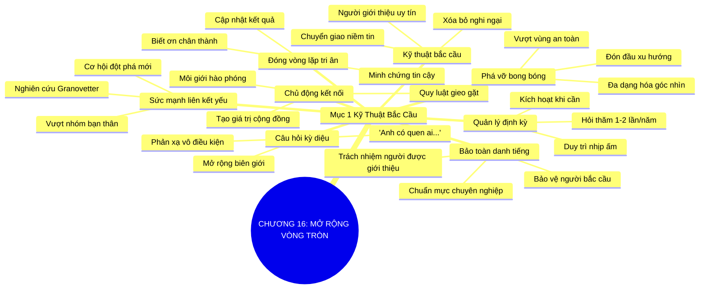

# TÓM TẮT CHƯƠNG SÁCH: CHƯƠNG 16: MỞ RỘNG VÒNG TRÒN QUAN HỆ (EXPANDING YOUR CIRCLE)
* **Thuộc phần**: Phần 2: Bộ Kỹ Năng Thực Chiến (The Skill Set)
* **Tác giả**: Keith Ferrazzi (với Tahl Raz)
* **Chuẩn hóa cấu trúc**: Document Structure-Anchored v2.4

---

## 🌟 THÔNG ĐIỆP CỐT LÕI (CORE MESSAGE)
> Khai thác sức mạnh của những mối liên kết yếu: Các cơ hội đột phá nhất không đến từ bạn thân mà đến từ 'bạn của bạn'; liên tục đặt câu hỏi bắc cầu kết nối sẽ đưa bạn bước vào những thế giới cơ hội hoàn toàn mới lạ.

---

## 📊 LƯỢC ĐỒ PHÂN BỔ CẤU TRÚC TÀI LIỆU
Bảng đối chiếu tỷ lệ và cấu trúc luận điểm bám sát các đề mục thực tế trong tài liệu:

| 📑 Đề Mục Trong Tài Liệu Gốc | 🎯 Số Lượng Luận Điểm Chuyên Sâu |
| :--- | :---: |
| Mục 1: Kỹ Thuật Bắc Cầu Kết Nối Qua Bạn Của Bạn (Expanding Through Mutual Friends) | 8 |
| **Tổng cộng toàn chương** | **8 Luận Điểm** |

---

## 💡 HỆ THỐNG LUẬN ĐIỂM QUAN TRỌNG (KEY TAKEAWAYS)

#### 📑 PHẦN: MỤC 1: KỸ THUẬT BẮC CẦU KẾT NỐI QUA BẠN CỦA BẠN (EXPANDING THROUGH MUTUAL FRIENDS)

##### 1. Sức mạnh của những mối liên kết yếu (The Strength of Weak Ties)
* **Phân Tích Chuyên Sâu**: Nghiên cứu kinh điển của nhà xã hội học Mark Granovetter chứng minh rằng: Những công việc đột phá, cơ hội đầu tư hay đối tác đổi đời hiếm khi đến từ bạn bè thân thiết; chúng đến từ những mối liên kết yếu (người quen sơ bộ, bạn của bạn). Nhóm bạn thân thường có chung nguồn thông tin khép kín; chỉ có những mối liên kết yếu mới là chiếc cầu nối sang các mạng lưới tri thức hoàn toàn mới.
* **Công Cụ / Phương Pháp Đi Kèm**: Lý thuyết liên kết yếu (The Strength of Weak Ties Theory - Mark Granovetter), Bản đồ cấu trúc mạng lưới mở.
* **Ví Dụ Thực Tế Ứng Dụng**: Tìm được công việc giám đốc chiến lược không phải qua bạn cùng phòng đại học mà qua lời giới thiệu của một người quen tình cờ gặp tại hội thảo năm ngoái.

##### 2. Kỹ thuật bắc cầu kết nối (Bridging Technique)
* **Phân Tích Chuyên Sâu**: Bắc cầu là nghệ thuật mở rộng quan hệ thông qua người trung gian uy tín. Khi bạn bước qua cánh cửa của một người xa lạ với lời giới thiệu ấm áp từ một người bạn chung, bạn đã vượt qua được bức tường nghi ngại lớn nhất trong giao tiếp kinh doanh.
* **Công Cụ / Phương Pháp Đi Kèm**: Kỹ thuật bắc cầu giới thiệu (The Warm Introduction Bridge), Chuyển giao uy tín.
* **Ví Dụ Thực Tế Ứng Dụng**: 'Chào anh Hoàng, anh Nam bên công ty Alpha gợi ý tôi nên liên hệ với anh vì anh là chuyên gia hàng đầu về mảng logistic...'

##### 3. Câu hỏi kỳ diệu mở khóa mọi cánh cửa
* **Phân Tích Chuyên Sâu**: Hãy biến câu hỏi này thành phản xạ vô điều kiện ở cuối mỗi cuộc đối thoại: 'Anh có quen ai đang nghiên cứu/làm việc về lĩnh vực này mà tôi nên trò chuyện cùng không?'. Câu hỏi đơn giản này sẽ liên tục đẩy biên giới mạng lưới của bạn ra xa theo cấp số nhân.
* **Công Cụ / Phương Pháp Đi Kèm**: Câu hỏi mở rộng biên giới (The Magic Referral Question).
* **Ví Dụ Thực Tế Ứng Dụng**: Sau khi thảo luận xong dự án, hỏi đối tác: 'Chị có biết ai đang cung cấp giải pháp bao bì thân thiện môi trường uy tín có thể giới thiệu cho tôi không?'

##### 4. Nguyên tắc bảo toàn uy tín cho người giới thiệu
* **Phân Tích Chuyên Sâu**: Khi được một người bạn giới thiệu sang người thứ ba, uy tín của người bạn đó đang được đặt vào tay bạn. Bạn phải hành xử với sự tôn trọng, chuyên nghiệp và chuẩn mực cao nhất để không bao giờ làm tổn hại danh tiếng của người bắc cầu.
* **Công Cụ / Phương Pháp Đi Kèm**: Trách nhiệm bảo toàn uy tín (Referral Reputation Stewardship), Đạo đức trong kết nối trung gian.
* **Ví Dụ Thực Tế Ứng Dụng**: Chuẩn bị trang phục chỉnh tề, đến đúng giờ và gửi lời cảm ơn cả hai bên ngay sau buổi gặp gỡ bắc cầu.

##### 5. Báo cáo kết quả phản hồi cho người bắc cầu (Loop Closing)
* **Phân Tích Chuyên Sâu**: Sai lầm lớn nhất là sau khi được giới thiệu xong thì biến mất. Hãy luôn gửi tin nhắn cập nhật cho người bạn đã giới thiệu: 'Cảm ơn anh đã kết nối tôi với chị Lan, buổi gặp gỡ sáng nay rất tuyệt vời và chúng tôi đã tìm ra hướng hợp tác'. Việc đóng vòng lặp thông tin chứng minh bạn là người đáng tin cậy.
* **Công Cụ / Phương Pháp Đi Kèm**: Quy trình đóng vòng lặp tri ân (Closing the Referral Loop Protocol).
* **Ví Dụ Thực Tế Ứng Dụng**: Gửi một tin nhắn ngắn cảm ơn người giới thiệu kèm cập nhật tích cực về tiến độ thảo luận với đối tác mới.

##### 6. Chủ động trở thành người bắc cầu cho người khác
* **Phân Tích Chuyên Sâu**: Quy luật gieo gặt trong kết nối: Càng chủ động giới thiệu và kết nối những người bạn tốt với nhau, bạn càng nhận được nhiều lời giới thiệu chất lượng ngược trở lại từ cộng đồng. Hãy trở thành một chiếc cầu nối hào phóng trước khi mong người khác làm cầu nối cho mình.
* **Công Cụ / Phương Pháp Đi Kèm**: Tư duy môi giới cơ hội hào phóng (Proactive Referral Generosity).
* **Ví Dụ Thực Tế Ứng Dụng**: Nhận thấy hai người bạn có thể bổ trợ kinh doanh cho nhau, chủ động viết email kết nối và giới thiệu điểm mạnh của cả hai bên.

##### 7. Vượt qua giới hạn của bong bóng quan hệ khép kín (Echo Chamber)
* **Phân Tích Chuyên Sâu**: Con người có xu hướng tụ tập với những người giống mình về quan điểm, thu nhập và lối sống. Việc chủ động tìm kiếm các mối liên kết yếu vượt ra ngoài bong bóng an toàn sẽ mở mang tư duy, giúp bạn nhìn thấy những xu hướng kinh doanh mới trước đám đông.
* **Công Cụ / Phương Pháp Đi Kèm**: Phá vỡ bong bóng thông tin (Echo Chamber Disruption), Đa dạng hóa danh bạ.
* **Ví Dụ Thực Tế Ứng Dụng**: Chủ động làm quen với các bạn trẻ thế hệ Z đang làm sáng tạo nội dung số để cập nhật thị hiếu tiêu dùng mới.

##### 8. Quản lý và kích hoạt định kỳ mạng lưới liên kết yếu
* **Phân Tích Chuyên Sâu**: Những mối liên kết yếu không cần tương tác quá thường xuyên nhưng cần được duy trì sự ấm áp định kỳ (1-2 lần mỗi năm qua tin nhắn chúc mừng hoặc chia sẻ bài viết hay), sẵn sàng để kích hoạt khi có cơ hội phù hợp.
* **Công Cụ / Phương Pháp Đi Kèm**: Lịch hâm nóng liên kết yếu (Weak Ties Reactivation Schedule).
* **Ví Dụ Thực Tế Ứng Dụng**: Gửi tin nhắn chúc mừng năm mới kèm lời hỏi thăm ngắn gọn đến những người quen cũ từng gặp tại các khóa học chuyên môn.

---

## 🎯 KẾ HOẠCH HÀNH ĐỘNG TOÀN DIỆN (ACTION PLAN)
### ⚡ Cấp độ 1: Thói quen vi mô (Micro-habits < 2 phút mỗi ngày)
- [ ] Hỏi câu hỏi kỳ diệu: 'Anh có quen ai trong mảng này...' trong cuộc họp tuần tới
- [ ] Viết email kết nối 2 người bạn có chuyên môn tương hỗ với nhau trong tuần này
- [ ] Nhắn tin cảm ơn và cập nhật kết quả cho người bạn đã giới thiệu đối tác cho bạn gần nhất
- [ ] Rà soát lại danh bạ để tìm ra 5 'mối liên kết yếu' tiềm năng mà bạn đã lâu chưa liên lạc
- [ ] Gửi một tin nhắn hỏi thăm ngắn gọn đến 1 người quen sơ bộ nhân dịp đầu tháng

### 📅 Cấp độ 2: Thói quen tuần & Dự án ngắn hạn (Weekly Habits)
- [ ] Tham gia một sự kiện trái ngành để tiếp xúc với những vòng tròn quan hệ mới
- [ ] Luôn xin phép người bạn chung trước khi lấy tên họ để tiếp cận người thứ ba
- [ ] Chuẩn bị bài giới thiệu ngắn gọn, chuyên nghiệp khi được người khác bắc cầu kết nối
- [ ] Đảm bảo giữ đúng lời hứa và bảo vệ danh tiếng của người đã giới thiệu bạn
- [ ] Tránh giam mình trong nhóm đồng nghiệp cũ trong các buổi giao lưu tập thể

### 🚀 Cấp độ 3: Chiến lược chuyển hóa dài hạn (Long-term Strategy)
- [ ] Ghi chú người giới thiệu vào hồ sơ thông tin của từng liên lạc mới
- [ ] Đọc lại bài nghiên cứu về Sức mạnh của liên kết yếu của Mark Granovetter
- [ ] Chủ động chia sẻ các cơ hội việc làm hoặc hợp tác cho những người quen trong mạng lưới
- [ ] Tự đánh giá mức độ đa dạng về độ tuổi, ngành nghề trong danh bạ của bạn
- [ ] Lên kế hoạch mở rộng ít nhất 3 mối liên kết yếu mới mỗi tháng

---

## ❓ BỘ CÂU HỎI TỰ VẤN & PHẢN TƯ SUY NGẪM (REFLECTION QUESTIONS)
### Nhóm 1: Nhận thức thực tại & Thói quen hiện tại
1. Bao nhiêu phần trăm cơ hội việc làm hoặc hợp tác lớn của bạn đến từ những người quen sơ bộ?
2. Tại sao nhóm bạn thân thiết nhất lại thường chia sẻ cùng một luồng thông tin khép kín?
3. Bạn có thường xuyên hỏi câu hỏi: 'Anh có quen ai trong lĩnh vực này...' không?
4. Cảm giác của bạn thế nào khi một người bạn sau khi được giới thiệu xong thì hoàn toàn im lặng?
5. Tại sao việc 'đóng vòng lặp phản hồi' (loop closing) lại chứng minh tính chuyên nghiệp của bạn?

### Nhóm 2: Thách thức tâm lý & Rào cản nội tâm
6. Uy tín của người bạn giới thiệu có ý nghĩa như thế nào đối với danh dự của chính bạn?
7. Lần gần nhất bạn chủ động bắc cầu kết nối cho hai người bạn khác là khi nào?
8. Làm thế nào để bước ra khỏi 'bong bóng quan hệ an toàn' (echo chamber) của bản thân?
9. Những rào cản tâm lý nào khiến bạn ngần ngại khi nhờ một người bạn giới thiệu ai đó?
10. Khi tiếp cận người thứ ba qua lời giới thiệu, bạn mở đầu như thế nào để tạo sự tin cậy cao nhất?

### Nhóm 3: Chiến lược hành động & Ứng dụng thực tế
11. Bạn có duy trì liên lạc với những người quen từ các khóa học cũ không, bằng cách nào?
12. Làm sao để việc nhờ giới thiệu không biến thành sự làm phiền hay đòi hỏi?
13. Bạn phân biệt thế nào giữa việc 'nhờ vả cơ hội' và 'tìm kiếm sự cộng hưởng giá trị'?
14. Khi một người được bạn giới thiệu cư xử thiếu chuyên nghiệp, bạn xử lý tình huống đó ra sao?
15. Sự đa dạng trong mạng lưới liên kết yếu giúp tư duy sáng tạo của bạn phát triển như thế nào?

### Nhóm 4: Chuyển hóa tư duy & Tầm nhìn dài hạn
16. Tần suất bao lâu một lần bạn nên gửi lời hỏi thăm đến các mối liên kết yếu trong danh bạ?
17. Tại sao những nhà lãnh đạo xuất sắc luôn là những 'chiếc cầu nối' hào phóng nhất?
18. Một cơ hội bất ngờ nhất mà bạn từng nhận được từ một người quen xa xôi là gì?
19. Bạn có cảm thấy việc mở rộng mạng lưới qua bạn của bạn là con đường tự nhiên và đạo đức nhất?
20. Ai là người bạn sẽ nhờ bắc cầu kết nối đến một đối tác chiến lược trong tuần này?

---

## 🧠 SƠ ĐỒ TƯ DUY TRỰC QUAN (MINDMAP)

