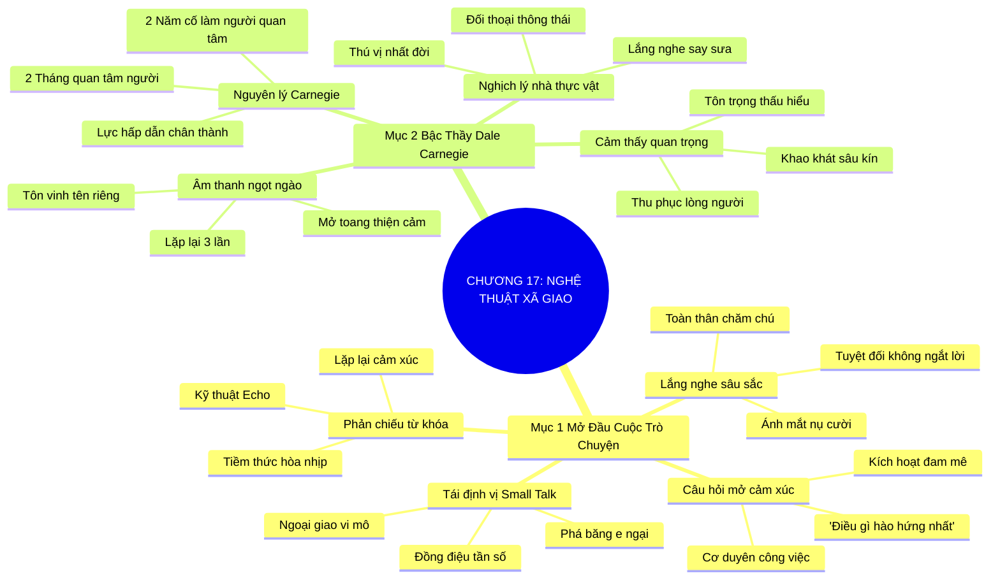

# SƠ ĐỒ TƯ DUY TRỰC QUAN: CHƯƠNG 17: NGHỆ THUẬT NÓI CHUYỆN XÃ GIAO (THE ART OF SMALL TALK)
* **Thuộc phần**: Phần 2: Bộ Kỹ Năng Thực Chiến (The Skill Set)
* **Tác phẩm**: Đừng Bao Giờ Đi Ăn Một Mình (Never Eat Alone) - Keith Ferrazzi
* **Chuẩn hóa**: Document Structure-Anchored v2.4 (Không nhãn meta thừa, phản ánh 100% cấu trúc tài liệu)

---

## 🌳 SƠ ĐỒ TƯ DUY MERMAID (4-5 TẦNG CHI TIẾT)

---

## 🧬 BẢNG PHÂN CẤP TRUY HỒI CHỦ ĐỘNG (ACTIVE RECALL HIERARCHY)
Cấu trúc hóa tri thức theo các nhánh tài liệu phục vụ ôn tập nhanh và khắc sâu trí nhớ:

| 📑 Nhánh Mục Tài Liệu | 🔑 Từ Khóa Vàng / Khái Niệm | 📝 Nội Dung Truy Hồi Chủ Động (Active Recall) |
| :--- | :--- | :--- |
| Mục 1: Bí Quyết Mở Đầu Cuộc Trò Chuyện | **Tái định vị Small Talk** | Nói chuyện xã giao là nghi thức ngoại giao vi mô giúp phá vỡ lớp băng e ngại ban đầu. |
| Mục 1: Bí Quyết Mở Đầu Cuộc Trò Chuyện | **Lắng nghe sâu sắc** | Lắng nghe bằng toàn bộ cơ thể và ánh mắt; người lắng nghe là người đối thoại cuốn hút nhất. |
| Mục 1: Bí Quyết Mở Đầu Cuộc Trò Chuyện | **Câu hỏi mở & Echo** | Đặt câu hỏi khơi gợi đam mê và phản chiếu từ khóa cảm xúc để tạo sự đồng điệu tâm hồn. |
| Mục 2: Hồ Sơ Bậc Thầy Dale Carnegie | **Nguyên lý Carnegie** | Quan tâm chân thành đến người khác trong 2 tháng sẽ kết bạn nhiều hơn 2 năm cố gây chú ý. |
| Mục 2: Hồ Sơ Bậc Thầy Dale Carnegie | **Nghịch lý nhà thực vật** | Im lặng lắng nghe say sưa biến bạn thành người đối thoại tuyệt vời nhất trong mắt họ. |
| Mục 2: Hồ Sơ Bậc Thầy Dale Carnegie | **Tên riêng & Tầm quan trọng** | Ghi nhớ tên riêng và làm cho người khác cảm thấy họ thực sự quan trọng một cách chân thành. |

---

## ⚡ BẢNG NEO TRÍ NHỚ NHANH (MEMORY ANCHOR CHEAT SHEET)
Tóm tắt cô đọng các công thức và quy tắc hành động của chương:

| 📑 Phần/Mục Tài Liệu | 📌 Khái Niệm Cốt Lõi | ⚖️ Nguyên Lý Vàng | 🚀 Hành Động Chuyển Hóa Ngay |
| :--- | :--- | :--- | :--- |
| Mục 1: Mở đầu cuộc trò chuyện | **Lắng nghe sâu sắc** | Lắng nghe toàn thân và không ngắt lời đối phương | Tạo sự tin cậy và gắn kết cảm xúc tức thì |
| Mục 1: Mở đầu cuộc trò chuyện | **Câu hỏi mở cảm xúc** | Hỏi về niềm đam mê và cơ duyên công việc | Khai mở những câu chuyện sâu sắc |
| Mục 2: Bậc thầy Dale Carnegie | **Nguyên lý Carnegie** | Quan tâm chân thành đến người khác trước | Lực hấp dẫn kết bạn mạnh nhất |
| Mục 2: Bậc thầy Dale Carnegie | **Tôn vinh tên riêng** | Ghi nhớ và gọi tên đối tác trong cuộc gặp | Âm thanh êm ái mở toang mọi cánh cửa |

