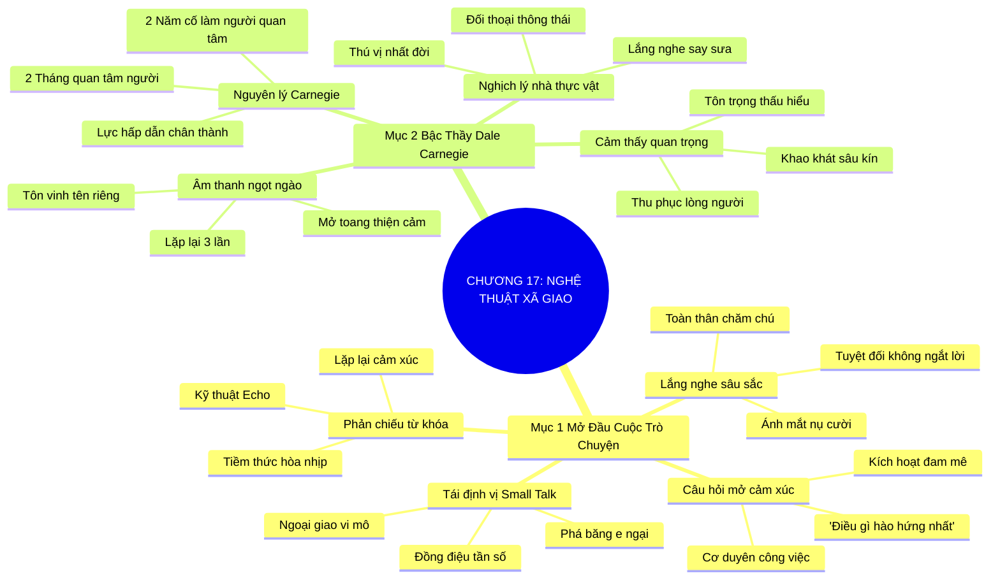

# TÓM TẮT CHƯƠNG SÁCH: CHƯƠNG 17: NGHỆ THUẬT NÓI CHUYỆN XÃ GIAO (THE ART OF SMALL TALK)
* **Thuộc phần**: Phần 2: Bộ Kỹ Năng Thực Chiến (The Skill Set)
* **Tác giả**: Keith Ferrazzi (với Tahl Raz)
* **Chuẩn hóa cấu trúc**: Document Structure-Anchored v2.4

---

## 🌟 THÔNG ĐIỆP CỐT LÕI (CORE MESSAGE)
> Chìa khóa vạn năng thu phục lòng người: Nói chuyện xã giao không phải là nói hay mà là lắng nghe sâu sắc bằng cả trái tim như bậc thầy Dale Carnegie—quan tâm chân thành đến người khác trong 2 tháng sẽ kết bạn nhiều hơn 2 năm cố làm người khác quan tâm mình.

---

## 📊 LƯỢC ĐỒ PHÂN BỔ CẤU TRÚC TÀI LIỆU
Bảng đối chiếu tỷ lệ và cấu trúc luận điểm bám sát các đề mục thực tế trong tài liệu:

| 📑 Đề Mục Trong Tài Liệu Gốc | 🎯 Số Lượng Luận Điểm Chuyên Sâu |
| :--- | :---: |
| Mục 1: Bí Quyết Làm Chủ Nghệ Thuật Mở Đầu Cuộc Trò Chuyện (Mastering Small Talk) | 4 |
| Mục 2: Hồ Sơ Đại Sảnh Danh Vọng Nhà Kết Nối: Bậc Thầy Dale Carnegie (Connectors Hall of Fame Profile Dale Carnegie) | 4 |
| **Tổng cộng toàn chương** | **8 Luận Điểm** |

---

## 💡 HỆ THỐNG LUẬN ĐIỂM QUAN TRỌNG (KEY TAKEAWAYS)

#### 📑 PHẦN: MỤC 1: BÍ QUYẾT LÀM CHỦ NGHỆ THUẬT MỞ ĐẦU CUỘC TRÒ CHUYỆN (MASTERING SMALL TALK)

##### 1. Tái định vị giá trị của trò chuyện xã giao (Small Talk)
* **Phân Tích Chuyên Sâu**: Nhiều người coi thường trò chuyện xã giao là nông cạn và vô bổ. Nhưng thực chất, đó là nghi thức ngoại giao quan trọng nhất của nhân loại: là chiếc chìa khóa vạn năng giúp phá vỡ lớp băng e ngại ban đầu, thăm dò tâm lý và thiết lập tần số đồng điệu cảm xúc trước khi tiến vào các cuộc đối thoại kinh doanh sâu sắc.
* **Công Cụ / Phương Pháp Đi Kèm**: Nhận thức ngoại giao vi mô (Micro-Diplomacy Awareness), Phá băng cảm xúc.
* **Ví Dụ Thực Tế Ứng Dụng**: Dành 5 phút đầu nói về chuyến bay hoặc sở thích ẩm thực địa phương giúp khách hàng thư giãn và mở lòng trước khi đàm phán hợp đồng.

##### 2. Sức mạnh tối thượng của lắng nghe sâu sắc (Active Listening)
* **Phân Tích Chuyên Sâu**: Bí quyết trò chuyện lôi cuốn không nằm ở việc thao thao bất tuyệt khoe khoang kiến thức, mà nằm ở khả năng lắng nghe trọn vẹn. Lắng nghe bằng toàn bộ cơ thể: ánh mắt chăm chú, nụ cười ấm áp, cái gật đầu đồng cảm và tuyệt đối không bao giờ ngắt lời đối phương.
* **Công Cụ / Phương Pháp Đi Kèm**: Kỹ thuật lắng nghe toàn thân (Whole-Body Active Listening Protocol: Ánh mắt, gật đầu, đồng cảm).
* **Ví Dụ Thực Tế Ứng Dụng**: Ngồi lắng nghe đối tác say sưa kể về niềm tự hào khi xây dựng nhà máy đầu tiên mà không hề nhìn vào điện thoại.

##### 3. Nghệ thuật đặt câu hỏi mở khơi nguồn cảm xúc
* **Phân Tích Chuyên Sâu**: Thay vì những câu hỏi khô khan đóng kín như 'Anh làm nghề gì?', hãy đặt những câu hỏi mở kích hoạt niềm đam mê: 'Điều gì khiến anh hào hứng nhất trong công việc hiện tại?' hoặc 'Cơ duyên kỳ diệu nào đã đưa anh đến với lĩnh vực này?'. Câu hỏi hay sẽ mở ra những câu chuyện tuyệt vời.
* **Công Cụ / Phương Pháp Đi Kèm**: Bộ câu hỏi mở khơi gợi cảm xúc (Open-Ended Passion Questions).
* **Ví Dụ Thực Tế Ứng Dụng**: 'Nếu không bị giới hạn về thời gian và tài chính, dự án mơ ước tiếp theo của chị là gì?'

##### 4. Kỹ thuật lặp lại từ khóa cảm xúc (Echo Technique)
* **Phân Tích Chuyên Sâu**: Khi đối phương chia sẻ, hãy khéo léo lặp lại 2-3 từ khóa cảm xúc cuối câu của họ dưới dạng câu hỏi xác nhận nhẹ nhàng. Điều này chứng minh cho tiềm thức của họ thấy bạn đang hoàn toàn hòa nhịp và đồng điệu với dòng chảy suy nghĩ của họ.
* **Công Cụ / Phương Pháp Đi Kèm**: Kỹ thuật phản chiếu ngôn từ (Verbal Mirroring / Echo Technique - Chris Voss / Dale Carnegie).
* **Ví Dụ Thực Tế Ứng Dụng**: Đối tác: 'Tuần qua áp lực dự án thực sự quá khủng khiếp'. Bạn: 'Quá khủng khiếp sao anh? Điều gì gây căng thẳng nhất vậy anh?'

#### 📑 PHẦN: MỤC 2: HỒ SƠ ĐẠI SẢNH DANH VỌNG NHÀ KẾT NỐI: BẬC THẦY DALE CARNEGIE (CONNECTORS HALL OF FAME PROFILE DALE CARNEGIE)

##### 5. Nguyên lý bất biến của bậc thầy 'Đắc Nhân Tâm'
* **Phân Tích Chuyên Sâu**: Triết lý vĩ đại của Dale Carnegie đúc kết suốt một thế kỷ: 'Bạn có thể kết bạn được với nhiều người hơn trong vòng 2 tháng bằng cách thực sự quan tâm đến họ, hơn là trong 2 năm trời cố gắng làm cho người khác quan tâm đến bạn'. Sự quan tâm chân thành là lực hấp dẫn mạnh nhất hành tinh.
* **Công Cụ / Phương Pháp Đi Kèm**: Nguyên lý Carnegie (The Carnegie Principle of Genuine Interest).
* **Ví Dụ Thực Tế Ứng Dụng**: Tập trung tìm hiểu xem đối tác cần gì và thích gì thay vì phát danh thiếp và kể về thành tích công ty mình.

##### 6. Câu chuyện nhà thực vật học và nghệ thuật im lặng
* **Phân Tích Chuyên Sâu**: Trong một bữa tiệc tối, Dale Carnegie ngồi nghe một nhà thực vật học say sưa nói về các loài hoa rừng suốt nhiều giờ mà hầu như không nói gì về bản thân. Cuối buổi, nhà khoa học hết lời ca ngợi Carnegie là 'người đối thoại thông minh và thú vị nhất đời tôi'. Im lặng lắng nghe chân thành chính là đỉnh cao của sự thông thái.
* **Công Cụ / Phương Pháp Đi Kèm**: Nghệ thuật đối thoại bằng im lặng (The Botanist Paradox: Người biết lắng nghe là người đối thoại xuất sắc nhất).
* **Ví Dụ Thực Tế Ứng Dụng**: Để khách hàng chia sẻ hết những trăn trở và nguyện vọng của họ suốt 45 phút, chỉ đặt câu hỏi gợi mở, và chốt hợp đồng ngay sau đó.

##### 7. Âm thanh ngọt ngào nhất thế gian: Tên riêng của mỗi người
* **Phân Tích Chuyên Sâu**: Theo Dale Carnegie, tên của một người là âm thanh êm ái và quan trọng nhất đối với họ trong bất kỳ ngôn ngữ nào. Việc ghi nhớ và gọi tên đối phương một cách trân trọng trong cuộc đối thoại sẽ ngay lập tức mở rộng cánh cửa thiện cảm của họ.
* **Công Cụ / Phương Pháp Đi Kèm**: Nghi thức tôn vinh danh xưng (The Name Honor Protocol: Lặp lại tên 3 lần khi mới quen).
* **Ví Dụ Thực Tế Ứng Dụng**: 'Rất vui được gặp anh Tuấn; như anh Tuấn vừa chia sẻ...; cảm ơn anh Tuấn rất nhiều'.

##### 8. Làm cho người khác cảm thấy họ quan trọng một cách chân thành
* **Phân Tích Chuyên Sâu**: Khao khát sâu kín nhất trong bản chất con người là khao khát được công nhận và cảm thấy mình quan trọng. Khi bạn mang lại cho người khác cảm giác được tôn trọng, thấu hiểu và nâng tầm giá trị bản thân, bạn nắm giữ chìa khóa vàng thu phục mọi lòng người.
* **Công Cụ / Phương Pháp Đi Kèm**: Nguyên tắc nuôi dưỡng lòng tự trọng (Validation of Importance Principle).
* **Ví Dụ Thực Tế Ứng Dụng**: Chân thành ghi nhận sự đóng góp thầm lặng của một thành viên trong nhóm trước tập thể ban giám đốc.

---

## 🎯 KẾ HOẠCH HÀNH ĐỘNG TOÀN DIỆN (ACTION PLAN)
### ⚡ Cấp độ 1: Thói quen vi mô (Micro-habits < 2 phút mỗi ngày)
- [ ] Thực hành quy tắc lắng nghe: không ngắt lời người khác trong suốt ngày hôm nay
- [ ] Sử dụng 2 câu hỏi mở khơi gợi đam mê trong cuộc trò chuyện tiếp theo
- [ ] Nhắc tên người đối thoại ít nhất 2 lần một cách tự nhiên trong cuộc gọi tới
- [ ] Áp dụng kỹ thuật phản chiếu từ khóa cảm xúc (Echo) khi nghe đối tác chia sẻ
- [ ] Để người khác nói 70% thời lượng trong các cuộc trò chuyện xã giao tuần này

### 📅 Cấp độ 2: Thói quen tuần & Dự án ngắn hạn (Weekly Habits)
- [ ] Cất điện thoại vào túi và duy trì giao tiếp bằng mắt khi trò chuyện trực tiếp
- [ ] Đọc lại cuốn sách kinh điển 'Đắc Nhân Tâm' của Dale Carnegie
- [ ] Tìm kiếm 1 điểm đáng khen ngợi chân thành ở đồng nghiệp và nói với họ hôm nay
- [ ] Thay thế câu hỏi 'Anh làm nghề gì?' bằng 'Điều gì làm anh hào hứng nhất hiện nay?'
- [ ] Gật đầu và mỉm cười đồng cảm khi lắng nghe người khác kể chuyện

### 🚀 Cấp độ 3: Chiến lược chuyển hóa dài hạn (Long-term Strategy)
- [ ] Tránh tuyệt đối việc cướp lời để khoe khoang thành tích bản thân
- [ ] Ghi nhớ tên của nhân viên phục vụ bàn hoặc nhân viên lễ tân khi tiếp xúc
- [ ] Đặt câu hỏi đào sâu về sở thích đặc biệt của đối tác (câu cá, làm vườn, vẽ tranh)
- [ ] Tự nhắc nhở bản thân: Người biết lắng nghe là người đối thoại lôi cuốn nhất
- [ ] Viết nhật ký cuối ngày ghi nhận những điều thú vị bạn học được từ người khác

---

## ❓ BỘ CÂU HỎI TỰ VẤN & PHẢN TƯ SUY NGẪM (REFLECTION QUESTIONS)
### Nhóm 1: Nhận thức thực tại & Thói quen hiện tại
1. Tỷ lệ thời gian bạn nói so với bạn lắng nghe trong các cuộc đối thoại thường là bao nhiêu?
2. Tại sao câu chuyện về nhà thực vật học của Dale Carnegie lại gây chấn động tâm thức người đọc?
3. Bạn cảm thấy thế nào khi đang hào hứng kể chuyện mà người đối diện lại liếc nhìn điện thoại?
4. Cảm giác của bạn ra sao khi một người mới quen nhớ chính xác và gọi tên bạn rất ấm áp?
5. Những câu hỏi mở nào bạn thấy có sức mạnh khơi mở tâm sự của người khác tốt nhất?

### Nhóm 2: Thách thức tâm lý & Rào cản nội tâm
6. Tại sao khao khát được cảm thấy mình quan trọng lại là động lực sâu kín nhất của con người?
7. Làm sao để việc khen ngợi người khác luôn giữ được sự chân thành mà không biến thành nịnh bợ?
8. Bạn có thường xuyên ngắt lời người khác khi họ đang nói không, và làm sao kiềm chế điều đó?
9. Ngôn ngữ cơ thể của bạn (ánh mắt, tư thế) thể hiện mức độ chú tâm lắng nghe như thế nào?
10. Khi ai đó chia sẻ về một chủ đề bạn hoàn toàn xa lạ, bạn làm gì để duy trì cuộc đối thoại?

### Nhóm 3: Chiến lược hành động & Ứng dụng thực tế
11. Bạn học được điều gì về nhân cách của một người thông qua cách họ trò chuyện xã giao?
12. Làm thế nào để áp dụng kỹ thuật phản chiếu từ khóa (Echo) một cách tự nhiên không máy móc?
13. Tại sao cố gắng làm cho người khác quan tâm đến mình lại là con đường kết nối thất bại?
14. Bạn có cảm thấy việc im lặng lắng nghe đòi hỏi nhiều bản lĩnh hơn là nói năng lưu loát?
15. Một cuộc trò chuyện xã giao xuất sắc đã từng mang lại cho bạn mối quan hệ lớn nào?

### Nhóm 4: Chuyển hóa tư duy & Tầm nhìn dài hạn
16. Bạn nhớ được tên của bao nhiêu người mới gặp trong một sự kiện đông người?
17. Làm sao để chuyển từ một câu chuyện xã giao đời thường sang một chủ đề hợp tác công việc?
18. Dale Carnegie đã thay đổi cách nhìn nhận của bạn về nghệ thuật thu phục lòng người ra sao?
19. Khi bạn khiến người đối diện cảm thấy họ được lắng nghe trọn vẹn, điều kỳ diệu gì sẽ xảy ra?
20. Ai là người bạn sẽ thực hành kỹ năng lắng nghe sâu sắc 100% không ngắt lời vào ngày mai?

---

## 🧠 SƠ ĐỒ TƯ DUY TRỰC QUAN (MINDMAP)

