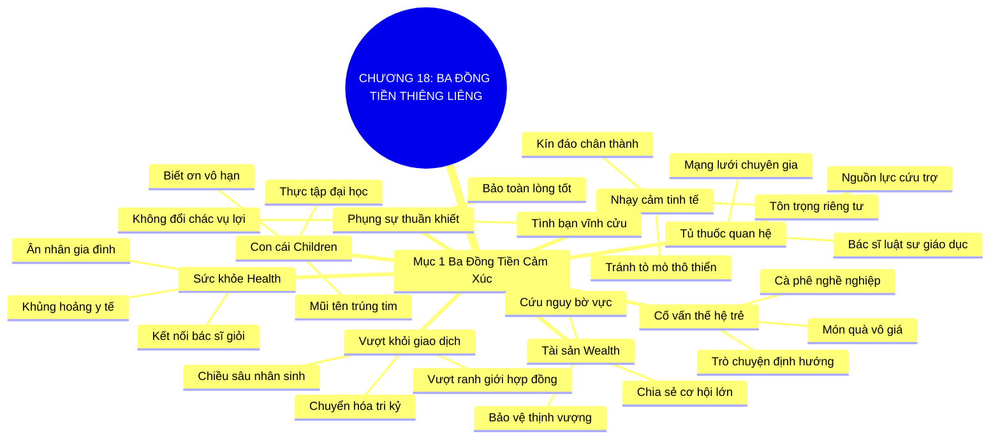

# SƠ ĐỒ TƯ DUY TRỰC QUAN: CHƯƠNG 18: SỨC KHỎE, TÀI SẢN VÀ CON CÁI (HEALTH, WEALTH, AND CHILDREN)
* **Thuộc phần**: Phần 3: Biến Liên Kết Thành Tri Kỷ (Turning Connections into Compatriots)
* **Tác phẩm**: Đừng Bao Giờ Đi Ăn Một Mình (Never Eat Alone) - Keith Ferrazzi
* **Chuẩn hóa**: Document Structure-Anchored v2.4 (Không nhãn meta thừa, phản ánh 100% cấu trúc tài liệu)

---

## 🌳 SƠ ĐỒ TƯ DUY MERMAID (4-5 TẦNG CHI TIẾT)

---

## 🧬 BẢNG PHÂN CẤP TRUY HỒI CHỦ ĐỘNG (ACTIVE RECALL HIERARCHY)
Cấu trúc hóa tri thức theo các nhánh tài liệu phục vụ ôn tập nhanh và khắc sâu trí nhớ:

| 📑 Nhánh Mục Tài Liệu | 🔑 Từ Khóa Vàng / Khái Niệm | 📝 Nội Dung Truy Hồi Chủ Động (Active Recall) |
| :--- | :--- | :--- |
| Mục 1: Ba Đồng Tiền Tình Cảm Gắn Kết Sâu Sắc | **Vượt khỏi giao dịch** | Để biến liên kết thành tri kỷ, phải chạm tới các giá trị thiêng liêng vượt trên tiền bạc. |
| Mục 1: Ba Đồng Tiền Tình Cảm Gắn Kết Sâu Sắc | **Đồng tiền Sức khỏe** | Hỗ trợ khi bạo bệnh và kết nối bác sĩ giỏi biến bạn thành ân nhân trọn đời của gia đình họ. |
| Mục 1: Ba Đồng Tiền Tình Cảm Gắn Kết Sâu Sắc | **Đồng tiền Tài sản** | Hào phóng chia sẻ cơ hội làm giàu chân chính và bảo vệ thịnh vượng tài chính cho đối tác. |
| Mục 1: Ba Đồng Tiền Tình Cảm Gắn Kết Sâu Sắc | **Đồng tiền Con cái** | Giúp đỡ tương lai học tập và nghề nghiệp của con cái chiếm trọn trái tim của bậc cha mẹ. |
| Mục 1: Ba Đồng Tiền Tình Cảm Gắn Kết Sâu Sắc | **Tủ thuốc quan hệ** | Xây dựng sẵn danh bạ các chuyên gia hàng đầu để sẵn sàng cứu trợ mạng lưới khi cấp bách. |
| Mục 1: Ba Đồng Tiền Tình Cảm Gắn Kết Sâu Sắc | **Phụng sự thuần khiết** | Tuyệt đối không toan tính đổi chác hợp đồng khi giúp đỡ những điều thiêng liêng. |

---

## ⚡ BẢNG NEO TRÍ NHỚ NHANH (MEMORY ANCHOR CHEAT SHEET)
Tóm tắt cô đọng các công thức và quy tắc hành động của chương:

| 📑 Phần/Mục Tài Liệu | 📌 Khái Niệm Cốt Lõi | ⚖️ Nguyên Lý Vàng | 🚀 Hành Động Chuyển Hóa Ngay |
| :--- | :--- | :--- | :--- |
| Mục 1: Ba đồng tiền thiêng liêng | **Sức khỏe (Health)** | Kết nối y tế và đồng hành lúc bạo bệnh | Trở thành ân nhân gia đình suốt đời |
| Mục 1: Ba đồng tiền thiêng liêng | **Tài sản (Wealth)** | Chia sẻ cơ hội kinh doanh chân chính | Trao sự an tâm và thịnh vượng bền vững |
| Mục 1: Ba đồng tiền thiêng liêng | **Con cái (Children)** | Hỗ trợ thực tập, du học và định hướng nghề | Chiếm trọn lòng biết ơn sâu sắc của cha mẹ |
| Mục 1: Ba đồng tiền thiêng liêng | **Phụng sự thuần khiết** | Giúp đỡ vô điều kiện không màng đổi chác | Kiến tạo tình bạn tri kỷ bất biến |

