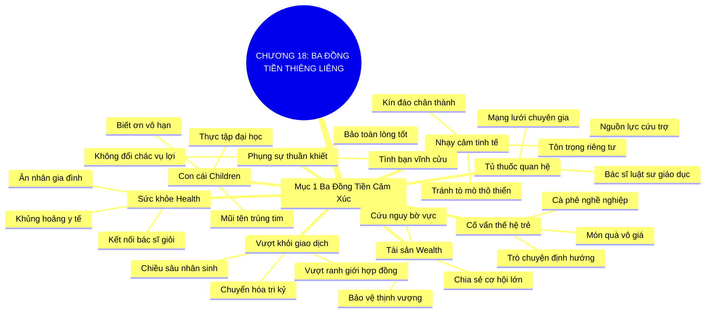

# TÓM TẮT CHƯƠNG SÁCH: CHƯƠNG 18: SỨC KHỎE, TÀI SẢN VÀ CON CÁI (HEALTH, WEALTH, AND CHILDREN)
* **Thuộc phần**: Phần 3: Biến Liên Kết Thành Tri Kỷ (Turning Connections into Compatriots)
* **Tác giả**: Keith Ferrazzi (với Tahl Raz)
* **Chuẩn hóa cấu trúc**: Document Structure-Anchored v2.4

---

## 🌟 THÔNG ĐIỆP CỐT LÕI (CORE MESSAGE)
> Chạm tới 3 mối quan tâm thiêng liêng nhất của đời người: Giúp đỡ chân thành về Sức khỏe (kết nối bác sĩ), Tài sản (chia sẻ cơ hội thịnh vượng) và Con cái (mở ra tương lai học tập) sẽ chuyển hóa đối tác kinh doanh thông thường thành tri kỷ gắn kết suốt đời.

---

## 📊 LƯỢC ĐỒ PHÂN BỔ CẤU TRÚC TÀI LIỆU
Bảng đối chiếu tỷ lệ và cấu trúc luận điểm bám sát các đề mục thực tế trong tài liệu:

| 📑 Đề Mục Trong Tài Liệu Gốc | 🎯 Số Lượng Luận Điểm Chuyên Sâu |
| :--- | :---: |
| Mục 1: Ba Đồng Tiền Tình Cảm Gắn Kết Sâu Sắc Nhất (The Three Sacred Currencies) | 8 |
| **Tổng cộng toàn chương** | **8 Luận Điểm** |

---

## 💡 HỆ THỐNG LUẬN ĐIỂM QUAN TRỌNG (KEY TAKEAWAYS)

#### 📑 PHẦN: MỤC 1: BA ĐỒNG TIỀN TÌNH CẢM GẮN KẾT SÂU SẮC NHẤT (THE THREE SACRED CURRENCIES)

##### 1. Vượt khỏi ranh giới giao dịch để chạm vào chiều sâu nhân sinh
* **Phân Tích Chuyên Sâu**: Các mối quan hệ kinh doanh thuần túy dựa trên lợi ích hợp đồng thường rất mong manh và dễ tan vỡ khi thị trường biến động. Để biến một người quen thành tri kỷ (compatriot), bạn phải chạm tới những điều thiêng liêng và riêng tư nhất trong cuộc đời họ: nơi danh vị và tiền bạc không còn là thước đo.
* **Công Cụ / Phương Pháp Đi Kèm**: Chuyển dịch từ giao dịch sang tri kỷ (Transactional to Compatriot Shift), Nhận thức giá trị nhân sinh.
* **Ví Dụ Thực Tế Ứng Dụng**: Khi đối tác gặp biến cố gia đình, việc đến thăm và hỗ trợ thực sự tạo ra tình bạn gắn kết sâu sắc hơn 10 hợp đồng thương mại.

##### 2. Đồng tiền cảm xúc thứ nhất: Sức khỏe (Health)
* **Phân Tích Chuyên Sâu**: Khi một người hoặc người thân của họ đối mặt với bạo bệnh hoặc khủng hoảng y tế, mọi toan tính danh vọng lập tức trở nên vô nghĩa. Nếu bạn có thể kết nối họ với bác sĩ chuyên khoa giỏi, tìm kiếm chuyên gia đầu ngành hoặc túc trực động viên tinh thần trong giờ phút ngặt nghèo, bạn đã trở thành ân nhân suốt đời của gia đình họ.
* **Công Cụ / Phương Pháp Đi Kèm**: Mạng lưới hỗ trợ y tế khẩn cấp (Medical Rolodex / Healthcare Bridge), Sự hiện diện đồng cảm.
* **Ví Dụ Thực Tế Ứng Dụng**: Keith Ferrazzi từng kết nối mẹ của một CEO tập đoàn lớn với bác sĩ phẫu thuật tim mạch hàng đầu, cứu sống bà và tạo nên tình tri kỷ trọn đời.

##### 3. Đồng tiền cảm xúc thứ hai: Tài sản và Thịnh vượng (Wealth)
* **Phân Tích Chuyên Sâu**: Ai cũng khao khát bảo vệ và gia tăng sự thịnh vượng tài chính cho gia đình mình. Khi bạn hào phóng chia sẻ một cơ hội kinh doanh chân chính, giới thiệu một khách hàng lớn mà bạn không phục vụ hết, hoặc cảnh báo trước một rủi ro đầu tư, bạn trao cho họ sự an tâm tài chính bền vững.
* **Công Cụ / Phương Pháp Đi Kèm**: Hào phóng cơ hội tài chính (Financial Abundance Sharing), Chia sẻ nguồn lực giá trị.
* **Ví Dụ Thực Tế Ứng Dụng**: Chủ động giới thiệu một dự án lớn cho người bạn đang gặp khó khăn tài chính để giúp công ty của họ vượt qua bờ vực phá sản.

##### 4. Đồng tiền cảm xúc thứ ba: Con cái (Children) - Mũi tên trúng đích trái tim
* **Phân Tích Chuyên Sâu**: Bậc làm cha làm mẹ luôn yêu thương con cái hơn chính bản thân mình. Giúp con của đối tác tìm được một suất thực tập hè ý nghĩa, viết thư giới thiệu vào trường đại học danh tiếng, hoặc hướng dẫn định hướng nghề nghiệp cho đứa trẻ sẽ chiếm trọn lòng biết ơn vô hạn của phụ huynh.
* **Công Cụ / Phương Pháp Đi Kèm**: Chiến lược nâng đỡ thế hệ kế tiếp (Next-Generation Mentorship Bridge), Thư giới thiệu uy tín.
* **Ví Dụ Thực Tế Ứng Dụng**: Kết nối con trai một đối tác vào thực tập tại công ty công nghệ kỳ lân, khiến vị đối tác xúc động và ủng hộ mọi dự án của bạn.

##### 5. Sự nhạy cảm tinh tế và tôn trọng ranh giới riêng tư
* **Phân Tích Chuyên Sâu**: Sức khỏe, tài sản và con cái là những chủ đề cực kỳ nhạy cảm. Bạn không được can thiệp thô bạo hay tò mò tọc mạch; chỉ mở lời giúp đỡ khi đối phương chủ động chia sẻ hoặc khi biến cố hiển hiện rõ ràng, luôn giữ thái độ tôn trọng và kín đáo.
* **Công Cụ / Phương Pháp Đi Kèm**: Ranh giới can thiệp tinh tế (Discretion & Privacy Boundary), Lắng nghe thấu cảm không phán xét.
* **Ví Dụ Thực Tế Ứng Dụng**: Gửi một tin nhắn riêng tư kín đáo hỏi thăm và đề nghị kết nối chuyên gia y tế thay vì bàn tán công khai.

##### 6. Xây dựng 'Tủ thuốc quan hệ' gồm các chuyên gia hàng đầu
* **Phân Tích Chuyên Sâu**: Một nhà kết nối xuất chúng luôn chủ động xây dựng mối quan hệ thân thiết với các bác sĩ giỏi, chuyên gia tài chính uy tín và các nhà giáo dục xuất sắc, để khi bạn bè gặp khó khăn, bạn lập tức có nguồn lực quý giá để chuyển giao.
* **Công Cụ / Phương Pháp Đi Kèm**: Mạng lưới chuyên gia cứu trợ (The Emergency Expert Rolodex: Bác sĩ, Luật sư, Cố vấn giáo dục).
* **Ví Dụ Thực Tế Ứng Dụng**: Lưu giữ danh sách liên lạc trực tiếp của 5 bác sĩ chuyên khoa đầu ngành để hỗ trợ mạng lưới bạn bè khi cần cấp cứu.

##### 7. Đầu tư thời gian làm người cố vấn cho con cái của bạn bè
* **Phân Tích Chuyên Sâu**: Thanh thiếu niên thường ngại chia sẻ với cha mẹ nhưng lại rất hào hứng học hỏi từ những người thành đạt ngoài xã hội. Dành 1 giờ uống cà phê định hướng nghề nghiệp cho con của đối tác là món quà vô giá mà không khoản tiền nào mua được.
* **Công Cụ / Phương Pháp Đi Kèm**: Cố vấn thế hệ trẻ (Youth Mentorship Session), Buổi trò chuyện định hướng nghề nghiệp.
* **Ví Dụ Thực Tế Ứng Dụng**: Dành chiều thứ Bảy chia sẻ kinh nghiệm học tập và du học cho con gái của một đối tác chiến lược.

##### 8. Nguyên lý nhân quả: Sự giúp đỡ không toan tính vụ lợi
* **Phân Tích Chuyên Sâu**: Tuyệt đối không bao giờ giúp đỡ về sức khỏe hay con cái với ý định 'đổi chác' hợp đồng kinh tế sau này. Mọi sự toan tính vụ lợi trong những việc thiêng liêng sẽ làm vấy bẩn lòng tốt và phá hủy hoàn toàn tình tri kỷ.
* **Công Cụ / Phương Pháp Đi Kèm**: Tâm thế phụng sự thuần khiết (Pure Altruism Invariance).
* **Ví Dụ Thực Tế Ứng Dụng**: Giúp đỡ vô điều kiện và không bao giờ nhắc lại ơn nghĩa khi thảo luận về các vấn đề kinh doanh sau đó.

---

## 🎯 KẾ HOẠCH HÀNH ĐỘNG TOÀN DIỆN (ACTION PLAN)
### ⚡ Cấp độ 1: Thói quen vi mô (Micro-habits < 2 phút mỗi ngày)
- [ ] Xây dựng danh bạ liên lạc của ít nhất 3 bác sĩ chuyên khoa giỏi bạn quen biết
- [ ] Hỏi thăm tình hình sức khỏe của một đối tác đang trong quá trình hồi phục bệnh tật
- [ ] Đề nghị viết thư giới thiệu hoặc tìm chỗ thực tập hè cho con của một người bạn
- [ ] Dành 30 phút chia sẻ kinh nghiệm định hướng nghề nghiệp cho một bạn trẻ trong mạng lưới
- [ ] Chia sẻ một cơ hội hợp tác kinh doanh tốt cho một người bạn đang cần bứt phá

### 📅 Cấp độ 2: Thói quen tuần & Dự án ngắn hạn (Weekly Habits)
- [ ] Ghi nhớ tên, lứa tuổi và sở thích của con cái các đối tác quan trọng
- [ ] Tặng một cuốn sách giáo dục hay hoặc tài liệu học tập cho con của đồng nghiệp
- [ ] Giữ thái độ kín đáo và tế nhị tuyệt đối khi nghe chia sẻ về bệnh tật gia đình
- [ ] Tìm hiểu xem có ai trong mạng lưới đang gặp khó khăn tài chính cần tư vấn pháp lý không
- [ ] Túc trực gửi tin nhắn động viên một người bạn đang chăm sóc người thân tại bệnh viện

### 🚀 Cấp độ 3: Chiến lược chuyển hóa dài hạn (Long-term Strategy)
- [ ] Kết nối một chuyên gia dinh dưỡng giỏi cho người bạn đang muốn cải thiện sức khỏe
- [ ] Chủ động giúp đỡ người khác mà không mong đợi bất kỳ sự trả ơn thương mại nào
- [ ] Hướng dẫn kỹ năng viết CV chuyên nghiệp cho con của một đối tác cũ
- [ ] Ghi chú các cột mốc thi đại học hoặc tốt nghiệp của con cái bạn bè vào lịch
- [ ] Rà soát lại 3 'đồng tiền tình cảm' xem bạn đã từng trao đi những giá trị nào

---

## ❓ BỘ CÂU HỎI TỰ VẤN & PHẢN TƯ SUY NGẪM (REFLECTION QUESTIONS)
### Nhóm 1: Nhận thức thực tại & Thói quen hiện tại
1. Tại sao sức khỏe, tài sản và con cái lại được gọi là 3 đồng tiền tình cảm thiêng liêng nhất?
2. Khi gia đình gặp khủng hoảng y tế, bạn cảm thấy biết ơn ai nhất, và tại sao?
3. Bạn đã bao giờ giúp đỡ con cái của một đối tác hoặc người bạn chưa, kết quả ra sao?
4. Cảm giác của các bậc cha mẹ thế nào khi có người chân thành nâng đỡ tương lai con họ?
5. Làm thế nào để mở lời giúp đỡ về sức khỏe mà không tỏ ra soi mói hay bất lịch sự?

### Nhóm 2: Thách thức tâm lý & Rào cản nội tâm
6. Bạn có những mối quan hệ thân thiết nào với giới y bác sĩ hoặc chuyên gia giáo dục không?
7. Tại sao việc toan tính đổi chác hợp đồng khi giúp đỡ việc thiêng liêng lại là sai lầm tự sát?
8. Một cơ hội làm giàu chân chính bạn từng chia sẻ cho bạn bè đã thay đổi tình bạn ra sao?
9. Bạn cảm nhận ranh giới giữa một 'đối tác làm ăn' và một 'người bạn tri kỷ' nằm ở đâu?
10. Khi một đối tác chia sẻ về áp lực học hành của con họ, bạn có thể giúp được điều gì?

### Nhóm 3: Chiến lược hành động & Ứng dụng thực tế
11. Bạn có nhớ được ước mơ nghề nghiệp của con cái 3 người bạn thân nhất của mình không?
12. Làm sao để xây dựng một 'tủ thuốc quan hệ' gồm những chuyên gia cứu trợ sẵn sàng giúp đỡ?
13. Bạn đã từng được ai đó giúp đỡ trong giờ phút ngặt nghèo về tài chính hoặc sức khỏe chưa?
14. Lòng biết ơn từ những sự giúp đỡ thiêng liêng có sức bền bỉ qua bao nhiêu năm tháng?
15. Làm thế nào để con cái của đối tác cảm thấy thoải mái và tự nhiên khi trò chuyện với bạn?

### Nhóm 4: Chuyển hóa tư duy & Tầm nhìn dài hạn
16. Tại sao tiền bạc hay quà cáp đắt tiền không thể mua được sự gắn kết của 3 đồng tiền cảm xúc?
17. Bạn xử lý thế nào nếu lời đề nghị giúp đỡ của bạn bị đối phương từ chối vì ngại ngùng?
18. Việc phụng sự không toan tính đã mang lại sự bình an nội tâm cho bạn như thế nào?
19. Tình tri kỷ được tôi luyện qua những biến cố lớn trong đời có giá trị gì đối với sự nghiệp?
20. Ai trong mạng lưới của bạn đang cần sự giúp đỡ về sức khỏe, con cái hoặc tài sản tuần này?

---

## 🧠 SƠ ĐỒ TƯ DUY TRỰC QUAN (MINDMAP)

