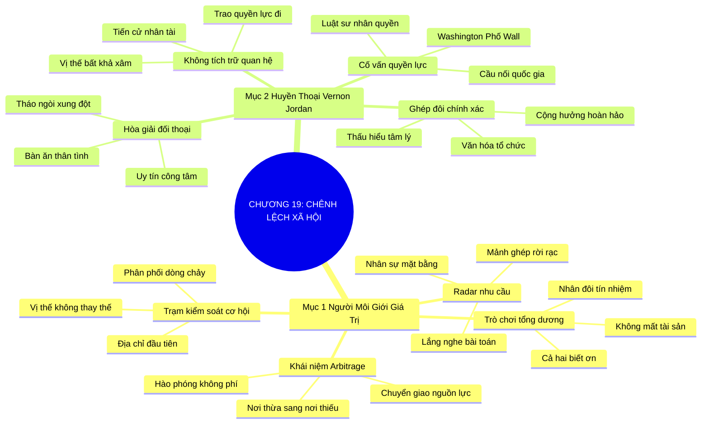

# SƠ ĐỒ TƯ DUY TRỰC QUAN: CHƯƠNG 19: KINH DOANH CHÊNH LỆCH XÃ HỘI (SOCIAL ARBITRAGE)
* **Thuộc phần**: Phần 3: Biến Liên Kết Thành Tri Kỷ (Turning Connections into Compatriots)
* **Tác phẩm**: Đừng Bao Giờ Đi Ăn Một Mình (Never Eat Alone) - Keith Ferrazzi
* **Chuẩn hóa**: Document Structure-Anchored v2.4 (Không nhãn meta thừa, phản ánh 100% cấu trúc tài liệu)

---

## 🌳 SƠ ĐỒ TƯ DUY MERMAID (4-5 TẦNG CHI TIẾT)

---

## 🧬 BẢNG PHÂN CẤP TRUY HỒI CHỦ ĐỘNG (ACTIVE RECALL HIERARCHY)
Cấu trúc hóa tri thức theo các nhánh tài liệu phục vụ ôn tập nhanh và khắc sâu trí nhớ:

| 📑 Nhánh Mục Tài Liệu | 🔑 Từ Khóa Vàng / Khái Niệm | 📝 Nội Dung Truy Hồi Chủ Động (Active Recall) |
| :--- | :--- | :--- |
| Mục 1: Trở Thành Người Môi Giới Giá Trị Và Cơ Hội | **Khái niệm Social Arbitrage** | Chuyển giao nguồn lực, tri thức, nhân tài từ nơi dư thừa sang nơi khao khát một cách hào phóng. |
| Mục 1: Trở Thành Người Môi Giới Giá Trị Và Cơ Hội | **Radar nhu cầu** | Lắng nghe các bài toán khó của bạn bè để tìm kiếm mảnh ghép bổ trợ chính xác. |
| Mục 1: Trở Thành Người Môi Giới Giá Trị Và Cơ Hội | **Trò chơi tổng dương** | Kết nối người khác thành công giúp nhân đôi uy tín và vốn xã hội của bạn mà không tốn chi phí. |
| Mục 2: Hồ Sơ Bậc Thầy Vernon Jordan | **Cầu nối quyền lực** | Vernon Jordan kết nối Washington và Phố Wall bằng sự thấu cảm và uy tín đạo đức tối cao. |
| Mục 2: Hồ Sơ Bậc Thầy Vernon Jordan | **Hòa giải xung đột** | Dàn xếp các tranh chấp lớn nhất bằng các bữa ăn trưa thân tình và sự công tâm. |
| Mục 2: Hồ Sơ Bậc Thầy Vernon Jordan | **Không tích trữ quan hệ** | Liên tục trao cơ hội và quyền lực cho người khác tạo nên vị thế bất khả xâm phạm trọn đời. |

---

## ⚡ BẢNG NEO TRÍ NHỚ NHANH (MEMORY ANCHOR CHEAT SHEET)
Tóm tắt cô đọng các công thức và quy tắc hành động của chương:

| 📑 Phần/Mục Tài Liệu | 📌 Khái Niệm Cốt Lõi | ⚖️ Nguyên Lý Vàng | 🚀 Hành Động Chuyển Hóa Ngay |
| :--- | :--- | :--- | :--- |
| Mục 1: Môi giới giá trị | **Social Arbitrage** | Chuyển giao cơ hội từ nơi thừa sang nơi thiếu | Trở thành trung tâm điều phối giá trị xã hội |
| Mục 1: Môi giới giá trị | **Trò chơi tổng dương** | Giúp người khác thành công để nhân đôi tín nhiệm | Kiến tạo vốn xã hội bền vững |
| Mục 2: Bậc thầy Vernon Jordan | **Bài học Vernon Jordan** | Kết nối đỉnh cao quyền lực bằng phụng sự | Xây dựng chiếc cầu nối Washington - Phố Wall |
| Mục 2: Bậc thầy Vernon Jordan | **Trao quyền hào phóng** | Không giữ rịt quan hệ, liên tục chia sẻ cơ hội | Tạo dựng uy tín bất khả lay chuyển |

