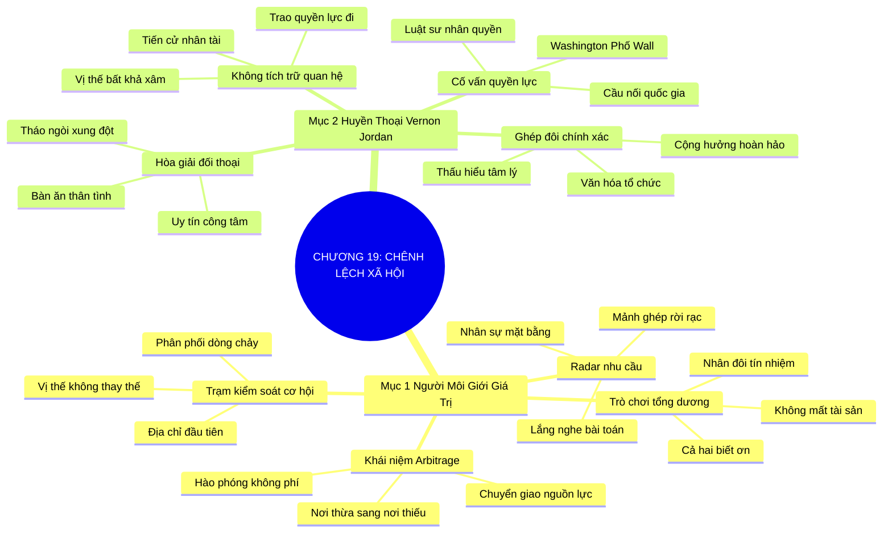

# TÓM TẮT CHƯƠNG SÁCH: CHƯƠNG 19: KINH DOANH CHÊNH LỆCH XÃ HỘI (SOCIAL ARBITRAGE)
* **Thuộc phần**: Phần 3: Biến Liên Kết Thành Tri Kỷ (Turning Connections into Compatriots)
* **Tác giả**: Keith Ferrazzi (với Tahl Raz)
* **Chuẩn hóa cấu trúc**: Document Structure-Anchored v2.4

---

## 🌟 THÔNG ĐIỆP CỐT LÕI (CORE MESSAGE)
> Trở thành trung tâm điều phối giá trị và cơ hội: Chuyển giao nguồn lực từ nơi dư thừa sang nơi khao khát như luật sư huyền thoại Vernon Jordan sẽ biến bạn thành người môi giới xã hội không thể thiếu của cộng đồng.

---

## 📊 LƯỢC ĐỒ PHÂN BỔ CẤU TRÚC TÀI LIỆU
Bảng đối chiếu tỷ lệ và cấu trúc luận điểm bám sát các đề mục thực tế trong tài liệu:

| 📑 Đề Mục Trong Tài Liệu Gốc | 🎯 Số Lượng Luận Điểm Chuyên Sâu |
| :--- | :---: |
| Mục 1: Trở Thành Người Môi Giới Giá Trị Và Cơ Hội (The Essence of Social Arbitrage) | 4 |
| Mục 2: Hồ Sơ Đại Sảnh Danh Vọng Nhà Kết Nối: Luật Sư Vernon Jordan (Connectors Hall of Fame Profile Vernon Jordan) | 4 |
| **Tổng cộng toàn chương** | **8 Luận Điểm** |

---

## 💡 HỆ THỐNG LUẬN ĐIỂM QUAN TRỌNG (KEY TAKEAWAYS)

#### 📑 PHẦN: MỤC 1: TRỞ THÀNH NGƯỜI MÔI GIỚI GIÁ TRỊ VÀ CƠ HỘI (THE ESSENCE OF SOCIAL ARBITRAGE)

##### 1. Khái niệm Kinh doanh chênh lệch xã hội (Social Arbitrage)
* **Phân Tích Chuyên Sâu**: Trong tài chính, kinh doanh chênh lệch giá (arbitrage) là mua rẻ ở một thị trường và bán đắt ở thị trường khác để kiếm lời. Trong nghệ thuật kết nối, Social Arbitrage là hành động hào phóng làm cầu nối chuyển giao tri thức, nhân tài và cơ hội từ nơi đang dư thừa tới nơi đang vô cùng khao khát mà không đòi hỏi bất kỳ khoản phí môi giới nào.
* **Công Cụ / Phương Pháp Đi Kèm**: Mô hình môi giới xã hội hào phóng (Social Arbitrage Model), Chuyển giao nguồn lực phi đối xứng.
* **Ví Dụ Thực Tế Ứng Dụng**: Biết một công ty đang khát giám đốc marketing và một người bạn xuất sắc vừa nghỉ việc, lập tức kết nối họ với nhau.

##### 2. Lắng nghe nhu cầu vi mô của mọi người xung quanh
* **Phân Tích Chuyên Sâu**: Để thực hiện chênh lệch xã hội, bạn phải luôn mở rộng tai và mắt trong mọi cuộc trò chuyện để phát hiện các nhu cầu chưa được đáp ứng: Người này cần tìm nhà xuất bản? Người kia cần thuê văn phòng? Người nọ cần đối tác logistic? Một chiếc cầu nối xuất sắc luôn thu thập các mảnh ghép rời rạc.
* **Công Cụ / Phương Pháp Đi Kèm**: Radar dò tìm nhu cầu kết nối (Connection Needs Radar), Ghi chép bài toán của đối tác.
* **Ví Dụ Thực Tế Ứng Dụng**: Lưu lại ghi chú: 'Anh Thắng cần tìm xưởng gia công cơ khí chính xác tại Bình Dương' để tìm kiếm mảnh ghép kết nối.

##### 3. Định luật bảo toàn và gia tăng giá trị xã hội
* **Phân Tích Chuyên Sâu**: Khi bạn kết nối hai người xa lạ lại với nhau để họ hợp tác tạo ra doanh thu và thành công, bạn không hề mất đi bất kỳ tài sản nào. Ngược lại, cả hai bên đều mang ơn bạn sâu sắc, và uy tín của bạn trong cộng đồng tăng lên gấp đôi. Đó là trò chơi có tổng dương (Positive-Sum Game) hoàn hảo.
* **Công Cụ / Phương Pháp Đi Kèm**: Trò chơi tổng dương trong kết nối (Positive-Sum Synergy), Nhân đôi vốn tín nhiệm.
* **Ví Dụ Thực Tế Ứng Dụng**: Hai đối tác sau khi được bạn kết nối đã ký hợp đồng 5 triệu đô và cùng quay lại mời bạn tham gia ban cố vấn chiến lược.

##### 4. Trở thành trung tâm phân phối cơ hội không thể thay thế
* **Phân Tích Chuyên Sâu**: Khi bạn liên tục mang lại giá trị cho mạng lưới, bạn trở thành người đầu tiên mà mọi người nghĩ đến mỗi khi họ có một cơ hội đầu tư béo bở hoặc cần tìm kiếm nhân sự cấp cao. Bạn trở thành 'trạm kiểm soát không lưu' của dòng chảy cơ hội.
* **Công Cụ / Phương Pháp Đi Kèm**: Vị thế trung tâm phân phối cơ hội (Opportunity Traffic Controller).
* **Ví Dụ Thực Tế Ứng Dụng**: Mọi doanh nhân trong hiệp hội đều gọi điện cho bạn trước khi đưa ra quyết định tuyển dụng nhân sự chủ chốt.

#### 📑 PHẦN: MỤC 2: HỒ SƠ ĐẠI SẢNH DANH VỌNG NHÀ KẾT NỐI: LUẬT SƯ VERNON JORDAN (CONNECTORS HALL OF FAME PROFILE VERNON JORDAN)

##### 5. Huyền thoại Vernon Jordan: Chiếc cầu nối quyền lực Washington - Phố Wall
* **Phân Tích Chuyên Sâu**: Vernon Jordan từ một luật sư nhân quyền đã trở thành cố vấn thân cận của nhiều đời Tổng thống Mỹ (Bill Clinton) và thành viên HĐQT của hàng chục tập đoàn lớn. Ông là bậc thầy tối cao về kinh doanh chênh lệch xã hội ở cấp độ quốc gia.
* **Công Cụ / Phương Pháp Đi Kèm**: Năng lực liên minh quyền lực đỉnh cao (Apex Coalition Building), Bài học Vernon Jordan.
* **Ví Dụ Thực Tế Ứng Dụng**: Vernon Jordan kết nối các nhà lãnh đạo chính trị cấp cao với các định chế tài chính phố Wall chỉ bằng một vài cuộc gọi ngắn.

##### 6. Sức mạnh phi thường của giải quyết bất đồng bằng đối thoại thân tình
* **Phân Tích Chuyên Sâu**: Vernon Jordan có khả năng tháo ngòi những xung đột chính trị và kinh tế phức tạp nhất chỉ bằng các cuộc ăn trưa thân tình. Uy tín, sự công tâm và trí tuệ sâu sắc của ông khiến cả hai phe đối lập đều hoàn toàn tin tưởng ngồi lại thương thảo.
* **Công Cụ / Phương Pháp Đi Kèm**: Nghệ thuật hòa giải mâu thuẫn bằng uy tín (Conflict Mediation Through Trust).
* **Ví Dụ Thực Tế Ứng Dụng**: Dàn xếp các thương vụ sáp nhập tập đoàn trị giá hàng tỷ đô la bằng cách tạo không gian đối thoại tôn trọng lẫn nhau.

##### 7. Nguyên tắc phụng sự không tích trữ quan hệ cho riêng mình
* **Phân Tích Chuyên Sâu**: Kẻ tầm thường giữ rịt các mối quan hệ vì sợ người khác 'cướp mất'. Vernon Jordan làm điều ngược lại: ông liên tục đem cơ hội và quyền lực trao cho những người xứng đáng, giới thiệu các bạn trẻ tài năng vào vị trí lãnh đạo. Chính sự hào phóng quyền lực đã tạo nên vị thế bất khả xâm phạm của ông.
* **Công Cụ / Phương Pháp Đi Kèm**: Trao quyền và chia sẻ cơ hội (Power Delegation & Amplification).
* **Ví Dụ Thực Tế Ứng Dụng**: Tiến cử các nhà hoạt động trẻ vào hội đồng quản trị các quỹ lớn để tạo đà phát triển cho thế hệ kế tiếp.

##### 8. Trí tuệ sắc bén và sự thấu cảm nhân văn đồng hành
* **Phân Tích Chuyên Sâu**: Để môi giới xã hội thành công, chỉ có quan hệ rộng là chưa đủ; bạn phải có sự thấu hiểu sâu sắc về tính cách, văn hóa tổ chức và động lực tâm lý của từng bên để ghép đôi chuẩn xác, tránh tạo ra những sự kết hợp gượng gạo.
* **Công Cụ / Phương Pháp Đi Kèm**: Kỹ thuật ghép đôi chính xác (Precision Matchmaking Intuition).
* **Ví Dụ Thực Tế Ứng Dụng**: Hiểu rõ phong cách lãnh đạo của hai bên trước khi giới thiệu họ vào một liên doanh chiến lược.

---

## 🎯 KẾ HOẠCH HÀNH ĐỘNG TOÀN DIỆN (ACTION PLAN)
### ⚡ Cấp độ 1: Thói quen vi mô (Micro-habits < 2 phút mỗi ngày)
- [ ] Chủ động kết nối 2 người bạn trong mạng lưới có nhu cầu bổ trợ cho nhau tuần này
- [ ] Soạn email giới thiệu nêu rõ lý do và giá trị cả hai bên có thể mang lại cho nhau
- [ ] Ghi lại 3 bài toán khó khăn mà bạn bè của bạn đang tìm kiếm lời giải
- [ ] Tìm kiếm trong danh bạ xem ai là người có thể giải quyết được các bài toán đó
- [ ] Tuyệt đối không đòi hỏi tiền hoa hồng hay phí môi giới khi kết nối bạn bè

### 📅 Cấp độ 2: Thói quen tuần & Dự án ngắn hạn (Weekly Habits)
- [ ] Tìm đọc tiểu sử và các bài phỏng vấn về luật sư huyền thoại Vernon Jordan
- [ ] Theo dõi tiến độ hợp tác của các cặp đôi bạn đã từng giới thiệu
- [ ] Tập trung lắng nghe những 'khoảng trống nguồn lực' trong mỗi cuộc trò chuyện
- [ ] Giới thiệu một nhà cung cấp dịch vụ xuất sắc cho một đối tác đang cần thuê ngoài
- [ ] Chia sẻ thông tin một khóa học hay học bổng giá trị cho một bạn trẻ tài năng

### 🚀 Cấp độ 3: Chiến lược chuyển hóa dài hạn (Long-term Strategy)
- [ ] Đóng vai trò người hòa giải khách quan nếu có hai đối tác xảy ra hiểu lầm
- [ ] Rèn luyện tư duy trò chơi tổng dương: thành công của người khác là niềm vui của mình
- [ ] Tránh tâm lý giữ khư khư mối quan hệ vì sợ bị mất vị thế
- [ ] Viết lời giới thiệu súc tích, làm nổi bật phẩm chất tốt nhất của từng người
- [ ] Tự đánh giá số lượng 'giá trị thặng dư xã hội' bạn đã kiến tạo cho cộng đồng tháng qua

---

## ❓ BỘ CÂU HỎI TỰ VẤN & PHẢN TƯ SUY NGẪM (REFLECTION QUESTIONS)
### Nhóm 1: Nhận thức thực tại & Thói quen hiện tại
1. Bạn hiểu thế nào về khái niệm 'Kinh doanh chênh lệch xã hội' (Social Arbitrage)?
2. Tại sao việc kết nối hai người khác thành công lại nhân đôi vốn tín nhiệm của chính bạn?
3. Bạn có đang giữ tâm lý sợ người khác 'cướp mất' mối quan hệ của mình không?
4. Vernon Jordan đã chứng minh điều gì về sức mạnh của việc hào phóng trao đi quyền lực?
5. Những nhu cầu nào bạn thấy các đối tác xung quanh hay gặp khó khăn tìm kiếm nhất?

### Nhóm 2: Thách thức tâm lý & Rào cản nội tâm
6. Khi đóng vai trò người mai mối quan hệ, bạn cần lưu ý điều gì để ghép đôi chuẩn xác?
7. Cảm giác của bạn ra sao khi nhận được lời cảm ơn từ hai người vừa ký hợp đồng nhờ bạn kết nối?
8. Làm sao để việc giới thiệu không bị xem là xen vào chuyện của người khác?
9. Tại sao những chiếc cầu nối xã hội hào phóng lại luôn là những người quyền lực nhất?
10. Bạn học được bài học gì từ cách hòa giải mâu thuẫn chính trị của Vernon Jordan?

### Nhóm 3: Chiến lược hành động & Ứng dụng thực tế
11. Có ai trong danh bạ của bạn đang sở hữu nguồn lực dư thừa mà người khác đang thèm khát?
12. Làm thế nào để một lời giới thiệu qua email tạo được sự tôn trọng và háo hức cho cả hai bên?
13. Bạn xử lý thế nào nếu hai người do bạn kết nối lại xảy ra tranh chấp sau này?
14. Sự khác biệt giữa một 'cò mồi kiếm chác' và một 'nhà môi giới xã hội chân chính' là gì?
15. Vị thế 'trạm kiểm soát không lưu cơ hội' mang lại những lợi ích chiến lược nào cho bạn?

### Nhóm 4: Chuyển hóa tư duy & Tầm nhìn dài hạn
16. Bạn có sẵn sàng giới thiệu một đối thủ cạnh tranh cho một dự án nếu họ thực sự phù hợp hơn?
17. Làm sao để duy trì sự công tâm và khách quan tuyệt đối trong mắt cộng đồng?
18. Một thương vụ kết nối thành công nhất bạn từng thực hiện cho người khác là gì?
19. Tại sao xã hội hiện đại lại trả công xứng đáng nhất cho những người biết điều phối giá trị?
20. Hai người đầu tiên bạn sẽ viết email kết nối với nhau trong ngày hôm nay là ai?

---

## 🧠 SƠ ĐỒ TƯ DUY TRỰC QUAN (MINDMAP)

