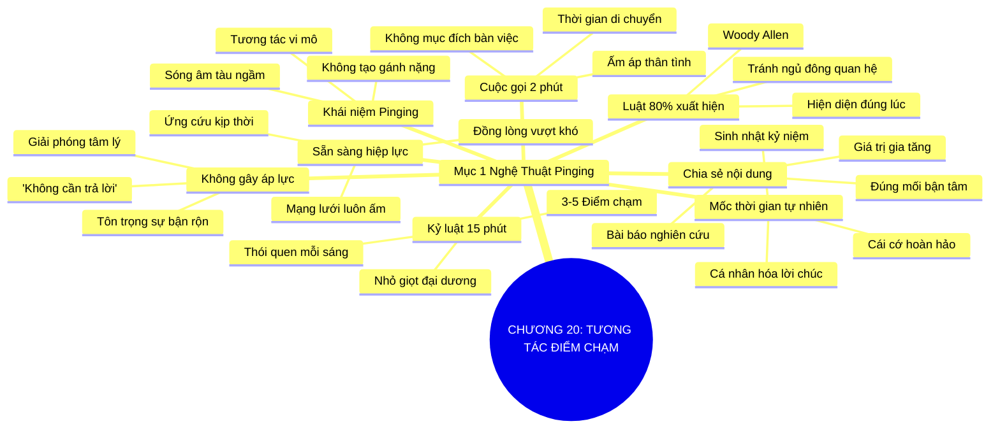

# SƠ ĐỒ TƯ DUY TRỰC QUAN: CHƯƠNG 20: TƯƠNG TÁC ĐIỂM CHẠM LIÊN TỤC (PINGING ALL THE TIME)
* **Thuộc phần**: Phần 3: Biến Liên Kết Thành Tri Kỷ (Turning Connections into Compatriots)
* **Tác phẩm**: Đừng Bao Giờ Đi Ăn Một Mình (Never Eat Alone) - Keith Ferrazzi
* **Chuẩn hóa**: Document Structure-Anchored v2.4 (Không nhãn meta thừa, phản ánh 100% cấu trúc tài liệu)

---

## 🌳 SƠ ĐỒ TƯ DUY MERMAID (4-5 TẦNG CHI TIẾT)

---

## 🧬 BẢNG PHÂN CẤP TRUY HỒI CHỦ ĐỘNG (ACTIVE RECALL HIERARCHY)
Cấu trúc hóa tri thức theo các nhánh tài liệu phục vụ ôn tập nhanh và khắc sâu trí nhớ:

| 📑 Nhánh Mục Tài Liệu | 🔑 Từ Khóa Vàng / Khái Niệm | 📝 Nội Dung Truy Hồi Chủ Động (Active Recall) |
| :--- | :--- | :--- |
| Mục 1: Nghệ Thuật Duy Trì Nhịp Thở Cho Mối Quan Hệ | **Luật 80% xuất hiện** | Thành công nằm ở sự hiện diện liên tục; không bao giờ để mối quan hệ rơi vào trạng thái ngủ đông. |
| Mục 1: Nghệ Thuật Duy Trì Nhịp Thở Cho Mối Quan Hệ | **Khái niệm Pinging** | Gửi các tín hiệu vi mô nhắc nhở sự quan tâm mà không gây áp lực thời gian cho người nhận. |
| Mục 1: Nghệ Thuật Duy Trì Nhịp Thở Cho Mối Quan Hệ | **Chia sẻ nội dung** | Gửi các bài báo, nghiên cứu hữu ích đúng vào chủ đề đối tác đang quan tâm để tạo giá trị. |
| Mục 1: Nghệ Thuật Duy Trì Nhịp Thở Cho Mối Quan Hệ | **Cuộc gọi 2 phút** | Tận dụng lúc lái xe gọi điện 120 giây chỉ để hỏi thăm và chúc ngày mới tràn đầy năng lượng. |
| Mục 1: Nghệ Thuật Duy Trì Nhịp Thở Cho Mối Quan Hệ | **Không gây áp lực** | Thêm câu 'Không cần trả lời lại nhé' để giải phóng áp lực tâm lý cho người bận rộn. |
| Mục 1: Nghệ Thuật Duy Trì Nhịp Thở Cho Mối Quan Hệ | **Kỷ luật 15 phút** | Dành 15 phút mỗi ngày gửi 3-5 tin nhắn ping để giữ toàn bộ mạng lưới luôn ở trạng thái sẵn sàng. |

---

## ⚡ BẢNG NEO TRÍ NHỚ NHANH (MEMORY ANCHOR CHEAT SHEET)
Tóm tắt cô đọng các công thức và quy tắc hành động của chương:

| 📑 Phần/Mục Tài Liệu | 📌 Khái Niệm Cốt Lõi | ⚖️ Nguyên Lý Vàng | 🚀 Hành Động Chuyển Hóa Ngay |
| :--- | :--- | :--- | :--- |
| Mục 1: Nghệ thuật Pinging | **Khái niệm Pinging** | Gửi tương tác vi mô nhẹ nhàng và tự nhiên | Duy trì sự hiện diện ấm áp liên tục |
| Mục 1: Nghệ thuật Pinging | **Chia sẻ nội dung** | Gửi bài báo hữu ích kèm lời nhắn quan tâm | Mang lại giá trị gia tăng tức thì |
| Mục 1: Nghệ thuật Pinging | **Cuộc gọi 2 phút** | Gọi hỏi thăm nhanh khi đang di chuyển | Tạo cảm xúc gắn kết không tốn thời gian |
| Mục 1: Nghệ thuật Pinging | **Kỷ luật 15 phút** | Gửi 3-5 tin nhắn ping mỗi sáng | Giữ toàn bộ mạng lưới luôn ấm áp sẵn sàng |

