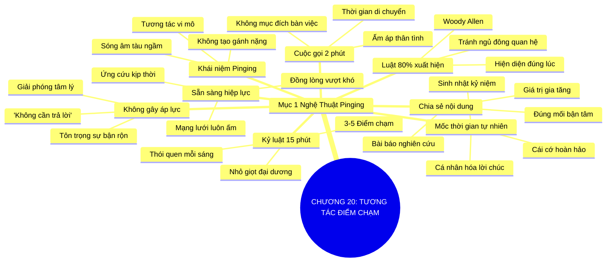

# TÓM TẮT CHƯƠNG SÁCH: CHƯƠNG 20: TƯƠNG TÁC ĐIỂM CHẠM LIÊN TỤC (PINGING ALL THE TIME)
* **Thuộc phần**: Phần 3: Biến Liên Kết Thành Tri Kỷ (Turning Connections into Compatriots)
* **Tác giả**: Keith Ferrazzi (với Tahl Raz)
* **Chuẩn hóa cấu trúc**: Document Structure-Anchored v2.4

---

## 🌟 THÔNG ĐIỆP CỐT LÕI (CORE MESSAGE)
> Duy trì nhịp thở ấm áp cho mối quan hệ: Kỹ thuật 'Pinging' với những tương tác vi mô (tin nhắn chúc mừng, chia sẻ bài báo hay, cuộc gọi 2 phút) giữ bạn luôn hiện diện ấm áp trong tâm trí mọi người mà không gây áp lực.

---

## 📊 LƯỢC ĐỒ PHÂN BỔ CẤU TRÚC TÀI LIỆU
Bảng đối chiếu tỷ lệ và cấu trúc luận điểm bám sát các đề mục thực tế trong tài liệu:

| 📑 Đề Mục Trong Tài Liệu Gốc | 🎯 Số Lượng Luận Điểm Chuyên Sâu |
| :--- | :---: |
| Mục 1: Nghệ Thuật Duy Trì Nhịp Thở Cho Mối Quan Hệ (The Art of Pinging) | 8 |
| **Tổng cộng toàn chương** | **8 Luận Điểm** |

---

## 💡 HỆ THỐNG LUẬN ĐIỂM QUAN TRỌNG (KEY TAKEAWAYS)

#### 📑 PHẦN: MỤC 1: NGHỆ THUẬT DUY TRÌ NHỊP THỞ CHO MỐI QUAN HỆ (THE ART OF PINGING)

##### 1. Quy luật 80% thành công là sự xuất hiện đúng lúc
* **Phân Tích Chuyên Sâu**: Đạo diễn Woody Allen từng nói: 'Tám mươi phần trăm của sự thành công chỉ đơn giản là việc bạn luôn xuất hiện'. Trong mạng lưới quan hệ, nếu bạn biến mất suốt một năm trời rồi đột ngột xuất hiện khi cần nhờ vả, bạn sẽ bị coi là kẻ cơ hội. Duy trì sự hiện diện ấm áp thường xuyên là điều kiện tiên quyết để giữ lửa tình bạn.
* **Công Cụ / Phương Pháp Đi Kèm**: Quy luật xuất hiện liên tục (Presence Law), Nhận diện rủi ro ngủ đông quan hệ.
* **Ví Dụ Thực Tế Ứng Dụng**: Không để bạn bè phải tự hỏi 'Dạo này anh ấy đi đâu mất tích', mà luôn duy trì tương tác nhẹ nhàng đều đặn.

##### 2. Khái niệm 'Pinging' - Tín hiệu sóng âm vi mô
* **Phân Tích Chuyên Sâu**: Mượn thuật ngữ phát sóng âm phản hồi trong kỹ thuật tàu ngầm, 'Pinging' là kỹ thuật gửi đi những tín hiệu tương tác ngắn, nhẹ nhàng và tự nhiên để nhắc nhở đối phương rằng bạn luôn quan tâm và nhớ đến họ mà không đòi hỏi họ phải mất nhiều thời gian hồi đáp.
* **Công Cụ / Phương Pháp Đi Kèm**: Khái niệm Pinging vi mô (Micro-Pinging Technique), Tương tác không tạo gánh nặng.
* **Ví Dụ Thực Tế Ứng Dụng**: Gửi một tin nhắn 1 câu: 'Chúc mừng sinh nhật bạn hiền, chúc bạn một tuổi mới rực rỡ thành công!' vào đúng ngày sinh nhật.

##### 3. Điểm chạm chia sẻ nội dung giá trị (Content Pinging)
* **Phân Tích Chuyên Sâu**: Khi đọc một bài báo hay, một bản nghiên cứu sâu sắc đúng vào lĩnh vực đối tác đang quan tâm, hãy gửi ngay đường link kèm lời nhắn: 'Chào anh Tuấn, sáng nay đọc bài này trên báo tôi nhớ ngay đến dự án anh đang làm, gửi anh đọc tham khảo nhé'. Đây là điểm chạm mang lại giá trị gia tăng tức thì.
* **Công Cụ / Phương Pháp Đi Kèm**: Điểm chạm nội dung cá nhân hóa (Value-Added Content Ping).
* **Ví Dụ Thực Tế Ứng Dụng**: Gửi bài phân tích thị trường bất động sản công nghiệp cho người bạn đang tìm đất mở xưởng.

##### 4. Cuộc gọi ngắn 2 phút trên đường di chuyển (The 2-Minute Drive Call)
* **Phân Tích Chuyên Sâu**: Tận dụng thời gian lái xe hoặc đi bộ giữa các cuộc họp để gọi một cuộc gọi 120 giây: 'Chào bạn tôi, tôi vừa đi ngang qua quận 7 và chợt nhớ đến bạn; chúc bạn một ngày làm việc tràn ngập năng lượng nhé!'. Một cuộc gọi nhanh không cần bàn công việc mang lại cảm xúc ấm áp vô bờ.
* **Công Cụ / Phương Pháp Đi Kèm**: Cuộc gọi 2 phút không mục đích (The 2-Minute Warmth Ping).
* **Ví Dụ Thực Tế Ứng Dụng**: Gọi điện cho một người bạn cũ chỉ để chào hỏi và hỏi thăm sức khỏe trước khi bắt đầu ngày làm việc.

##### 5. Tận dụng các mốc thời gian tự nhiên (Sinh nhật & Lễ tết)
* **Phân Tích Chuyên Sâu**: Sinh nhật, ngày kỷ niệm thành lập công ty hay các dịp lễ tết là những cái cớ hoàn hảo nhất để kích hoạt lại các mối quan hệ mà không hề gượng gạo. Một lời chúc riêng biệt có cá nhân hóa luôn vượt trội hàng ngàn tin nhắn gửi hàng loạt tự động.
* **Công Cụ / Phương Pháp Đi Kèm**: Lịch sự kiện cá nhân hóa (Milestone Calendar Tracking), Lời chúc riêng tư chân thành.
* **Ví Dụ Thực Tế Ứng Dụng**: Soạn tin nhắn riêng nhắc lại kỷ niệm chung gửi chúc mừng ngày doanh nhân cho đối tác.

##### 6. Quy tắc không gây áp lực thời gian cho người nhận
* **Phân Tích Chuyên Sâu**: Điểm mấu chốt của Pinging là sự nhẹ nhàng. Đừng bao giờ đặt những câu hỏi phức tạp đòi hỏi họ phải ngồi viết báo cáo trả lời; hãy kết thúc bằng câu: 'Chỉ gửi để bạn đọc giải trí, không cần trả lời thư này nhé!'. Điều này giải phóng hoàn toàn áp lực tâm lý cho người bận rộn.
* **Công Cụ / Phương Pháp Đi Kèm**: Điều khoản giải phóng nghĩa vụ (Zero-Obligation Disclaimer: 'No reply needed').
* **Ví Dụ Thực Tế Ứng Dụng**: Thêm ghi chú 'Bạn bận rộn không cần trả lời lại đâu nhé, chúc bạn cuối tuần vui' ở cuối email chia sẻ bài báo.

##### 7. Thiết lập hệ thống Pinging hàng ngày có kỷ luật
* **Phân Tích Chuyên Sâu**: Để duy trì mạng lưới hàng trăm người, bạn phải biến Pinging thành kỷ luật sinh hoạt: Mỗi ngày dành ra 15 phút (đầu giờ sáng hoặc cuối giờ chiều) để gửi 3-5 tin nhắn ping tới danh sách phân loại. Nhỏ giọt nhưng bền bỉ sẽ tạo nên đại dương quan hệ ấm áp.
* **Công Cụ / Phương Pháp Đi Kèm**: Kỷ luật 15 phút Pinging mỗi ngày (The 15-Minute Daily Ping Routine).
* **Ví Dụ Thực Tế Ứng Dụng**: Mỗi sáng trước 8h30 gửi 3 tin nhắn chúc mừng hoặc chia sẻ bài viết cho 3 người trong danh bạ.

##### 8. Chuyển hóa mạng lưới từ trạng thái lạnh sang trạng thái sẵn sàng hiệp lực
* **Phân Tích Chuyên Sâu**: Khi được chăm sóc bằng Pinging liên tục, toàn bộ mạng lưới của bạn luôn ở trạng thái 'ấm áp'. Đến khi bạn gặp khủng hoảng hay cần kêu gọi vốn đầu tư, chỉ cần một lời kêu gọi, hàng trăm người bạn sẽ sẵn sàng đồng lòng giúp đỡ vì sợi dây gắn kết chưa bao giờ bị đứt đoạn.
* **Công Cụ / Phương Pháp Đi Kèm**: Trạng thái sẵn sàng hiệp lực (Network Warmth Readiness State).
* **Ví Dụ Thực Tế Ứng Dụng**: Kêu gọi thành công chiến dịch thiện nguyện trong 12 giờ nhờ mạng lưới bạn bè luôn được giữ ấm quanh năm.

---

## 🎯 KẾ HOẠCH HÀNH ĐỘNG TOÀN DIỆN (ACTION PLAN)
### ⚡ Cấp độ 1: Thói quen vi mô (Micro-habits < 2 phút mỗi ngày)
- [ ] Dành 15 phút đầu giờ sáng hôm nay để gửi 3 tin nhắn Pinging hỏi thăm bạn bè
- [ ] Gửi một bài báo thú vị cho 1 đối tác kèm ghi chú: 'Không cần trả lời lại nhé'
- [ ] Thực hiện 1 cuộc gọi 2 phút khi đang lái xe hoặc đi bộ chỉ để gửi lời chúc tốt đẹp
- [ ] Kiểm tra lịch sinh nhật của bạn bè trên mạng xã hội và gửi lời chúc riêng biệt
- [ ] Thêm ghi chú 'No reply needed' khi chia sẻ thông tin cho các lãnh đạo bận rộn

### 📅 Cấp độ 2: Thói quen tuần & Dự án ngắn hạn (Weekly Habits)
- [ ] Lên danh sách 10 người bạn cũ đã lâu không liên lạc để ping nhẹ nhàng tuần này
- [ ] Chia sẻ một bức ảnh kỷ niệm ngày này năm xưa với một người bạn thân
- [ ] Chúc mừng ngay khi thấy đối tác vừa đăng tải tin vui về thành tựu công việc
- [ ] Tránh tuyệt đối việc biến mất 1 năm rồi bất ngờ gọi điện nhờ vả vay tiền/xin việc
- [ ] Cài đặt lời nhắc định kỳ trên điện thoại: '15 phút Pinging kết nối'

### 🚀 Cấp độ 3: Chiến lược chuyển hóa dài hạn (Long-term Strategy)
- [ ] Chụp lại một cuốn sách hay ở hiệu sách và gửi ảnh cho người bạn thích đọc sách
- [ ] Gửi một tin nhắn cảm ơn ngắn gọn đến một người thầy cũ nhân ngày làm việc bình thường
- [ ] Luôn giữ tâm thế vui tươi, ấm áp và không đòi hỏi sự đáp lại khi gửi tin nhắn ping
- [ ] Đánh giá lại danh sách Tier 1 xem ai đã hơn 30 ngày chưa nhận được điểm chạm nào
- [ ] Biến thói quen Pinging thành niềm vui sống mỗi ngày của bạn

---

## ❓ BỘ CÂU HỎI TỰ VẤN & PHẢN TƯ SUY NGẪM (REFLECTION QUESTIONS)
### Nhóm 1: Nhận thức thực tại & Thói quen hiện tại
1. Có bao nhiêu người bạn tốt mà bạn đã vô tình để 'ngủ đông' suốt hơn 1 năm qua?
2. Cảm giác của bạn thế nào khi một người bạn cũ bất ngờ gọi điện chỉ để nhờ vả việc cá nhân?
3. Tại sao Woody Allen lại nói 80% thành công chỉ là sự xuất hiện liên tục?
4. Một tin nhắn ping ngắn 30 giây có thể mang lại sức mạnh cảm xúc lớn đến mức nào?
5. Tại sao câu ghi chú 'Không cần trả lời lại nhé' lại khiến người bận rộn cảm thấy dễ chịu?

### Nhóm 2: Thách thức tâm lý & Rào cản nội tâm
6. Bạn có thói quen gọi những cuộc gọi 2 phút không mục đích khi đang di chuyển không?
7. Làm thế nào để việc gửi lời chúc mừng sinh nhật không bị hòa lẫn vào những tin nhắn rập khuôn?
8. Bạn cảm thấy ra sao khi một người bạn gửi cho bạn bài viết đúng vào đề tài bạn đang nghiên cứu?
9. Điều gì ngăn cản bạn dành ra 15 phút mỗi sáng để chăm sóc các mối quan hệ?
10. Khi mạng lưới của bạn luôn ở trạng thái 'ấm áp', công việc kinh doanh của bạn thuận lợi hơn thế nào?

### Nhóm 3: Chiến lược hành động & Ứng dụng thực tế
11. Bạn phân biệt thế nào giữa việc Pinging ấm áp và hành vi quấy rối người khác?
12. Làm sao để duy trì sự hiện diện với hàng trăm người mà không bị kiệt sức năng lượng?
13. Tần suất ping lý tưởng cho từng nhóm đối tượng (bạn thân, đối tác, người quen) là bao lâu?
14. Một điểm chạm bất ngờ nào bạn từng nhận được khiến bạn nhớ mãi không quên?
15. Tại sao việc chia sẻ tri thức và bài viết hay lại là hình thức ping tao nhã nhất?

### Nhóm 4: Chuyển hóa tư duy & Tầm nhìn dài hạn
16. Bạn có hệ thống nào để nhắc nhở ngày sinh nhật và các cột mốc quan trọng của bạn bè không?
17. Cảm xúc chân thành đóng vai trò gì trong việc tạo nên nhiệt lượng cho các tin nhắn ping?
18. Việc duy trì nhịp thở kết nối liên tục phản ánh sự kỷ luật bản thân của bạn ra sao?
19. Khi gặp khó khăn, bạn muốn tìm đến người luôn giữ liên lạc hay người cả năm mới gặp?
20. Ai là 3 người đầu tiên bạn sẽ gửi một tin nhắn ping ấm áp ngay sau khi đọc chương này?

---

## 🧠 SƠ ĐỒ TƯ DUY TRỰC QUAN (MINDMAP)

