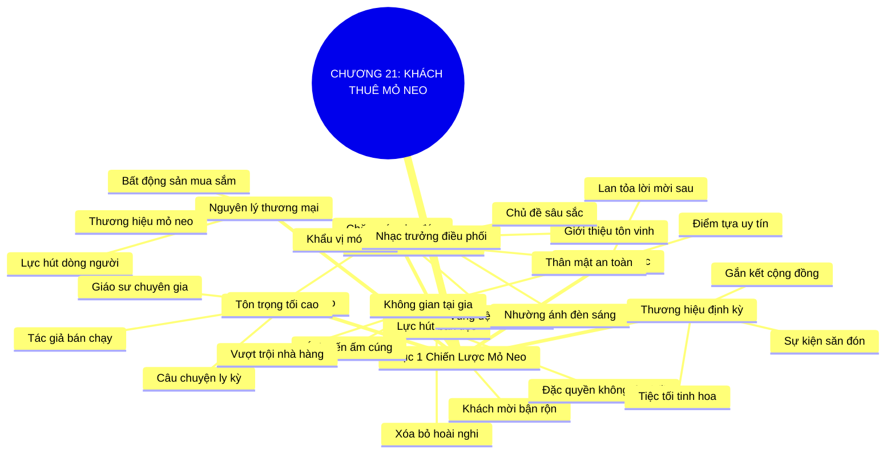

# SƠ ĐỒ TƯ DUY TRỰC QUAN: CHƯƠNG 21: TÌM KIẾM VÀ THIẾT LẬP KHÁCH THUÊ MỎ NEO (FIND ANCHOR TENANTS AND FEED THEM)
* **Thuộc phần**: Phần 3: Biến Liên Kết Thành Tri Kỷ (Turning Connections into Compatriots)
* **Tác phẩm**: Đừng Bao Giờ Đi Ăn Một Mình (Never Eat Alone) - Keith Ferrazzi
* **Chuẩn hóa**: Document Structure-Anchored v2.4 (Không nhãn meta thừa, phản ánh 100% cấu trúc tài liệu)

---

## 🌳 SƠ ĐỒ TƯ DUY MERMAID (4-5 TẦNG CHI TIẾT)

---

## 🧬 BẢNG PHÂN CẤP TRUY HỒI CHỦ ĐỘNG (ACTIVE RECALL HIERARCHY)
Cấu trúc hóa tri thức theo các nhánh tài liệu phục vụ ôn tập nhanh và khắc sâu trí nhớ:

| 📑 Nhánh Mục Tài Liệu | 🔑 Từ Khóa Vàng / Khái Niệm | 📝 Nội Dung Truy Hồi Chủ Động (Active Recall) |
| :--- | :--- | :--- |
| Mục 1: Chiến Lược Mỏ Neo Trong Nghệ Thuật Tiệc Tối | **Nguyên lý mỏ neo** | Mượn từ bất động sản thương mại: có được thương hiệu mỏ neo sẽ kéo theo toàn bộ khách hàng. |
| Mục 1: Chiến Lược Mỏ Neo Trong Nghệ Thuật Tiệc Tối | **Lực hút bàn tiệc** | Mời được nhân vật xuất chúng trước sẽ biến bữa tối thành sự kiện đặc quyền không thể chối từ. |
| Mục 1: Chiến Lược Mỏ Neo Trong Nghệ Thuật Tiệc Tối | **Quy trình 2 bước** | Bước 1: Tiếp cận và chốt lịch với nhân vật mỏ neo; Bước 2: Dùng uy tín đó gửi lời mời tới các khách khác. |
| Mục 1: Chiến Lược Mỏ Neo Trong Nghệ Thuật Tiệc Tối | **Chăm sóc mỏ neo** | Đối xử chu đáo, tôn trọng sở thích ẩm thực và bảo vệ họ khỏi sự làm phiền thương mại thô thiển. |
| Mục 1: Chiến Lược Mỏ Neo Trong Nghệ Thuật Tiệc Tối | **Nhạc trưởng điều phối** | Đóng vai trò người điều phối, khơi gợi chủ đề sâu sắc để mọi người cùng tỏa sáng quanh bàn ăn. |
| Mục 1: Chiến Lược Mỏ Neo Trong Nghệ Thuật Tiệc Tối | **Thương hiệu định kỳ** | Xây dựng chuỗi tiệc tối định kỳ tại nhà để xác lập vị thế trung tâm kết nối tinh hoa của cộng đồng. |

---

## ⚡ BẢNG NEO TRÍ NHỚ NHANH (MEMORY ANCHOR CHEAT SHEET)
Tóm tắt cô đọng các công thức và quy tắc hành động của chương:

| 📑 Phần/Mục Tài Liệu | 📌 Khái Niệm Cốt Lõi | ⚖️ Nguyên Lý Vàng | 🚀 Hành Động Chuyển Hóa Ngay |
| :--- | :--- | :--- | :--- |
| Mục 1: Chiến lược mỏ neo | **Nguyên lý mỏ neo** | Mời nhân vật danh tiếng trước để tạo lực hút | Biến bữa tiệc thành sự kiện đặc quyền |
| Mục 1: Chiến lược mỏ neo | **Quy trình 2 bước** | Chốt lịch mỏ neo rồi mới gửi lời mời tiếp theo | Tối ưu hóa tỷ lệ đồng ý của khách mời VIP |
| Mục 1: Chiến lược mỏ neo | **Không gian tại gia** | Nấu ăn và đón tiếp ấm cúng tại nhà riêng | Tạo sự thân mật gắn kết vượt xa nhà hàng |
| Mục 1: Chiến lược mỏ neo | **Nhạc trưởng tiệc tối** | Dẫn dắt đối thoại trí tuệ và tôn vinh khách mời | Khẳng định vị thế nhà kết nối lãnh đạo |

