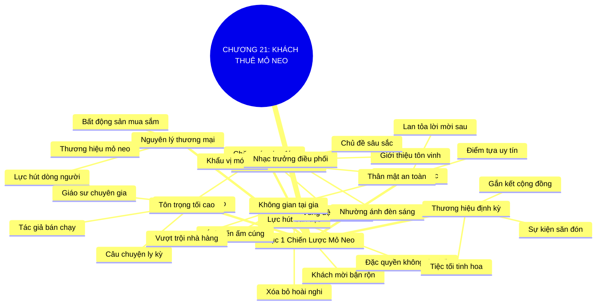

# TÓM TẮT CHƯƠNG SÁCH: CHƯƠNG 21: TÌM KIẾM VÀ THIẾT LẬP KHÁCH THUÊ MỎ NEO (FIND ANCHOR TENANTS AND FEED THEM)
* **Thuộc phần**: Phần 3: Biến Liên Kết Thành Tri Kỷ (Turning Connections into Compatriots)
* **Tác giả**: Keith Ferrazzi (với Tahl Raz)
* **Chuẩn hóa cấu trúc**: Document Structure-Anchored v2.4

---

## 🌟 THÔNG ĐIỆP CỐT LÕI (CORE MESSAGE)
> Sức hút của sự kiện tinh hoa: Áp dụng nguyên lý 'Khách thuê mỏ neo' (Anchor Tenants) của các trung tâm thương mại vào bàn tiệc tối—mời được 1-2 nhân vật kiệt xuất trước sẽ biến bữa tối của bạn thành đặc quyền không thể chối từ đối với mọi khách mời khác.

---

## 📊 LƯỢC ĐỒ PHÂN BỔ CẤU TRÚC TÀI LIỆU
Bảng đối chiếu tỷ lệ và cấu trúc luận điểm bám sát các đề mục thực tế trong tài liệu:

| 📑 Đề Mục Trong Tài Liệu Gốc | 🎯 Số Lượng Luận Điểm Chuyên Sâu |
| :--- | :---: |
| Mục 1: Chiến Lược Mỏ Neo Trong Nghệ Thuật Tổ Chức Tiệc Tối (The Anchor Tenant Strategy) | 8 |
| **Tổng cộng toàn chương** | **8 Luận Điểm** |

---

## 💡 HỆ THỐNG LUẬN ĐIỂM QUAN TRỌNG (KEY TAKEAWAYS)

#### 📑 PHẦN: MỤC 1: CHIẾN LƯỢC MỎ NEO TRONG NGHỆ THUẬT TỔ CHỨC TIỆC TỐI (THE ANCHOR TENANT STRATEGY)

##### 1. Nguyên lý Khách thuê mỏ neo từ bất động sản thương mại
* **Phân Tích Chuyên Sâu**: Trong phát triển trung tâm thương mại, một khu mua sắm không thể thu hút hàng trăm cửa hàng nhỏ nếu thiếu các 'Khách thuê mỏ neo' (Anchor Tenants)—như đại siêu thị Walmart hay rạp chiếu phim khổng lồ. Sự hiện diện của thương hiệu mỏ neo bảo chứng dòng khách hàng đông đúc và tạo lực hút tự nhiên kéo mọi gian hàng khác đến.
* **Công Cụ / Phương Pháp Đi Kèm**: Nguyên lý mỏ neo thương mại (Anchor Tenant Principle), Lực hấp dẫn hệ thống.
* **Ví Dụ Thực Tế Ứng Dụng**: Một trung tâm thương mại ký hợp đồng với một đại siêu thị nổi tiếng, ngay sau đó các thương hiệu thời trang tranh nhau thuê mặt bằng.

##### 2. Ứng dụng mỏ neo vào nghệ thuật tổ chức tiệc tối và sự kiện
* **Phân Tích Chuyên Sâu**: Những con người bận rộn và tài năng nhất luôn cân nhắc kỹ lưỡng: 'Tôi sẽ gặp ai ở bữa tối đó? Cuộc gặp có xứng đáng với 2 giờ quý giá của tôi không?'. Khi bạn có được sự nhận lời của một 'Nhân vật mỏ neo' danh tiếng, toàn bộ sự hoài nghi của các khách mời khác sẽ tan biến.
* **Công Cụ / Phương Pháp Đi Kèm**: Chiến lược mỏ neo bàn tiệc (Dinner Party Anchor Strategy), Định vị giá trị sự kiện.
* **Ví Dụ Thực Tế Ứng Dụng**: Khi mời bạn bè ăn tối, Keith nói: 'Tối thứ Sáu tuần tới tôi có mời giáo sư Michael từ Harvard đến dùng bữa, rất mong anh cùng tham gia'.

##### 3. Chân dung của một Nhân vật mỏ neo lý tưởng
* **Phân Tích Chuyên Sâu**: Khách thuê mỏ neo không nhất thiết phải là tỷ phú hay tổng thống; họ có thể là một tác giả sách bán chạy, một đạo diễn điện ảnh vừa đoạt giải, một giáo sư đại học có những công trình đột phá, hoặc một nhà thám hiểm với những câu chuyện ly kỳ. Tiêu chuẩn cốt lõi là họ có nội dung hấp dẫn và sức hút trí tuệ.
* **Công Cụ / Phương Pháp Đi Kèm**: Tiêu chí lựa chọn nhân vật mỏ neo (Anchor Persona Criteria: Uy tín, Câu chuyện lôi cuốn, Trí tuệ).
* **Ví Dụ Thực Tế Ứng Dụng**: Mời một chuyên gia nghiên cứu trí tuệ nhân tạo vừa trở về từ Thung lũng Silicon làm nhân vật mỏ neo cho bữa tối công nghệ.

##### 4. Quy trình 2 bước gửi lời mời thông minh
* **Phân Tích Chuyên Sâu**: Bước 1: Tập trung toàn bộ nguồn lực và sự chân thành để tiếp cận và chốt lịch hẹn với nhân vật mỏ neo trước; Bước 2: Dùng sự xác nhận của nhân vật mỏ neo làm điểm tựa uy tín để mời những vị khách bận rộn khác. Lời mời khi đó trở thành một 'lời mời đặc quyền' (Exclusive Invitation).
* **Công Cụ / Phương Pháp Đi Kèm**: Quy trình mời 2 bước (Two-Step Invitation Protocol: Chốt mỏ neo -> Lan tỏa lời mời).
* **Ví Dụ Thực Tế Ứng Dụng**: Sau khi vị CEO kỳ cựu đồng ý tham dự, gửi email mời 5 nhà sáng lập trẻ tham gia buổi đối thoại thân mật.

##### 5. Chăm sóc nhân vật mỏ neo bằng sự chu đáo tối cao
* **Phân Tích Chuyên Sâu**: Hãy đối xử với nhân vật mỏ neo bằng sự tôn trọng và chu đáo nhất: tìm hiểu kỹ món ăn họ thích, chuẩn bị chỗ ngồi thoải mái, đón tiếp nồng hậu và bảo vệ họ khỏi sự làm phiền quá mức của những kẻ bán hàng thô thiển.
* **Công Cụ / Phương Pháp Đi Kèm**: Quy chuẩn chăm sóc mỏ neo (Anchor Care Protocol), Tạo vùng đệm thoải mái.
* **Ví Dụ Thực Tế Ứng Dụng**: Chuẩn bị loại vang đỏ yêu thích của vị giáo sư và sắp xếp chỗ ngồi ở đầu bàn nơi họ có thể dễ dàng trò chuyện.

##### 6. Vai trò nhạc trưởng điều phối bản giao hưởng kết nối
* **Phân Tích Chuyên Sâu**: Trong bữa tiệc, bạn đóng vai trò là người nhạc trưởng: giới thiệu xuất sắc từng vị khách, khơi mào các chủ đề đối thoại sâu sắc và khéo léo nhường ánh đèn sân khấu cho nhân vật mỏ neo và các khách mời cùng tỏa sáng.
* **Công Cụ / Phương Pháp Đi Kèm**: Nghệ thuật điều phối tiệc tối (Dinner Conductor Artistry), Kỹ thuật điều phối dòng chảy hội thoại.
* **Ví Dụ Thực Tế Ứng Dụng**: Đặt câu hỏi gợi mở để nhân vật mỏ neo chia sẻ bài học thất bại xương máu, tạo không khí cởi mở cho cả bàn tiệc.

##### 7. Thiết kế không gian ấm cúng tại gia vượt trội nhà hàng
* **Phân Tích Chuyên Sâu**: Tổ chức tại nhà riêng với thức ăn tự nấu, ánh nến ấm áp và âm nhạc nhẹ nhàng mang lại cảm giác thân mật, an toàn mà không một nhà hàng sang trọng nào có thể sánh được. Đó là nơi những thỏa thuận triệu đô được định hình.
* **Công Cụ / Phương Pháp Đi Kèm**: Không gian kết nối tại gia (Home Intimacy Architecture), Tiếp đãi bằng trái tim.
* **Ví Dụ Thực Tế Ứng Dụng**: Tự tay nấu món pasta truyền thống mời các vị khách dùng bữa trong phòng ăn ấm cúng tại nhà.

##### 8. Xây dựng thương hiệu 'Bữa tối tinh hoa' định kỳ
* **Phân Tích Chuyên Sâu**: Khi bạn tổ chức thành công các bữa tối mỏ neo đều đặn mỗi tháng, các buổi tiệc của bạn sẽ trở thành thương hiệu uy tín trong giới. Mọi người sẽ mong mỏi nhận được lời mời từ bạn như một vinh dự đặc biệt.
* **Công Cụ / Phương Pháp Đi Kèm**: Thương hiệu tiệc tối định kỳ (Salon Dinner Series Brand), Nghi thức gắn kết cộng đồng.
* **Ví Dụ Thực Tế Ứng Dụng**: Thương hiệu 'Bữa tối thứ Sáu đầu tháng' của Keith trở thành điểm hẹn kết nối tinh hoa được săn đón nhất.

---

## 🎯 KẾ HOẠCH HÀNH ĐỘNG TOÀN DIỆN (ACTION PLAN)
### ⚡ Cấp độ 1: Thói quen vi mô (Micro-habits < 2 phút mỗi ngày)
- [ ] Xác định 2 'Nhân vật mỏ neo' tiềm năng trong mạng lưới của bạn (tác giả, chuyên gia, CEO)
- [ ] Lên kế hoạch tiếp cận và mời 1 nhân vật mỏ neo dùng bữa tối tại nhà hoặc nhà hàng ấm cúng
- [ ] Khóa ngày giờ chính xác với nhân vật mỏ neo trước khi gửi lời mời cho những người khác
- [ ] Lập danh sách 6-8 khách mời phù hợp có thể cộng hưởng giá trị với nhân vật mỏ neo
- [ ] Soạn lời mời nêu rõ sự tham gia của nhân vật mỏ neo như một điểm nhấn đặc quyền

### 📅 Cấp độ 2: Thói quen tuần & Dự án ngắn hạn (Weekly Habits)
- [ ] Tìm hiểu khẩu vị và sở thích ẩm thực của nhân vật mỏ neo để chuẩn bị thực đơn chu đáo
- [ ] Chuẩn bị không gian phòng ăn với ánh sáng vàng ấm áp và nhạc nền cổ điển nhẹ nhàng
- [ ] Luyện tập bài giới thiệu tôn vinh từng vị khách trong 30 giây đầu bữa tiệc
- [ ] Chuẩn bị sẵn 2 chủ đề đối thoại trí tuệ sâu sắc để dẫn dắt bàn tiệc
- [ ] Đảm bảo không khí bàn tiệc là sự chia sẻ văn hóa, tuyệt đối cấm bán hàng thô thiển

### 🚀 Cấp độ 3: Chiến lược chuyển hóa dài hạn (Long-term Strategy)
- [ ] Chụp một bức ảnh kỷ niệm ấm cúng của cả bàn tiệc vào cuối buổi
- [ ] Gửi email cảm ơn nhóm ngay sáng hôm sau, nhắc lại những ý tưởng tuyệt vời đã thảo luận
- [ ] Gửi một món quà nhỏ hoặc lời cảm ơn đặc biệt riêng cho nhân vật mỏ neo
- [ ] Đánh giá mức độ hài lòng và năng lượng kết nối của các khách mời
- [ ] Lên kế hoạch duy trì định kỳ mô hình tiệc tối mỏ neo mỗi quý một lần

---

## ❓ BỘ CÂU HỎI TỰ VẤN & PHẢN TƯ SUY NGẪM (REFLECTION QUESTIONS)
### Nhóm 1: Nhận thức thực tại & Thói quen hiện tại
1. Tại sao nguyên lý 'Khách thuê mỏ neo' lại có sức mạnh xoay chuyển quyết định của khách mời?
2. Ai là nhân vật trong mạng lưới của bạn có sức hút trí tuệ và uy tín đủ để làm mỏ neo?
3. Bạn đã bao giờ từ chối một lời mời tiệc tối chỉ vì không biết sẽ gặp ai ở đó chưa?
4. Cảm giác của bạn thế nào khi nhận được lời mời tham dự bữa tối với một nhân vật xuất chúng?
5. Làm thế nào để thuyết phục một nhân vật mỏ neo bận rộn đồng ý tham dự bữa tối tại nhà bạn?

### Nhóm 2: Thách thức tâm lý & Rào cản nội tâm
6. Bạn chuẩn bị những gì để nhân vật mỏ neo cảm thấy được tôn trọng và hoàn toàn thoải mái?
7. Tại sao một bữa tối tại nhà riêng lại tạo ra chiều sâu gắn kết vượt trội so với nhà hàng?
8. Làm sao để bạn đóng vai trò người nhạc trưởng mà không lấn át tiếng nói của các vị khách?
9. Những chủ đề đối thoại nào có sức mạnh kích hoạt sự hào hứng của cả bàn tiệc đa ngành?
10. Bạn xử lý thế nào nếu trong bàn tiệc có một người cố tình nói về bán hàng hoặc xin xỏ cơ hội?

### Nhóm 3: Chiến lược hành động & Ứng dụng thực tế
11. Lợi ích lớn nhất của bạn khi đứng ra tổ chức một bữa tiệc mỏ neo thành công là gì?
12. Làm sao để xây dựng bữa tiệc tối thành một 'thương hiệu định kỳ' được cộng đồng săn đón?
13. Bạn có sẵn sàng tự tay vào bếp nấu ăn để chiêu đãi những người bạn xuất chúng không?
14. Khi hai vị khách trong bữa tiệc tìm thấy tiếng nói chung và hợp tác, vị thế của bạn thay đổi ra sao?
15. Những sai lầm phổ biến nhất khiến một bữa tiệc tối thương mại trở nên ngột ngạt và thất bại là gì?

### Nhóm 4: Chuyển hóa tư duy & Tầm nhìn dài hạn
16. Âm nhạc, ánh sáng và cách bài trí bàn ăn ảnh hưởng như thế nào đến tâm lý cởi mở của khách?
17. Làm thế nào để theo dõi và duy trì tình bạn với nhân vật mỏ neo sau khi sự kiện kết thúc?
18. Việc tổ chức tiệc tối mỏ neo phản ánh năng lực lãnh đạo và điều phối của bạn như thế nào?
19. Một kỷ niệm tiệc tối ấm cúng nhất bạn từng tham dự đã để lại dấu ấn gì trong bạn?
20. Kế hoạch cụ thể của bạn để tổ chức bữa tiệc mỏ neo đầu tiên trong tháng tới là gì?

---

## 🧠 SƠ ĐỒ TƯ DUY TRỰC QUAN (MINDMAP)

