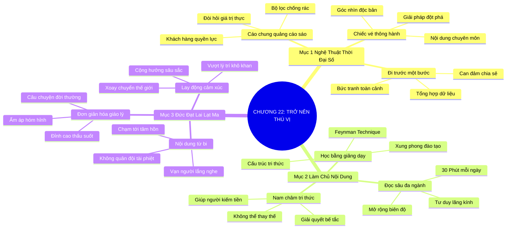

# SƠ ĐỒ TƯ DUY TRỰC QUAN: CHƯƠNG 22: TRỞ NÊN THÚ VỊ VÀ ĐẦU TƯ NỘI DUNG CHUYÊN MÔN (BE INTERESTING)
* **Thuộc phần**: Phần 4: Trao Đổi Và Đền Đáp (Trading Up and Giving Back)
* **Tác phẩm**: Đừng Bao Giờ Đi Ăn Một Mình (Never Eat Alone) - Keith Ferrazzi
* **Chuẩn hóa**: Document Structure-Anchored v2.4 (Không nhãn meta thừa, phản ánh 100% cấu trúc tài liệu)

---

## 🌳 SƠ ĐỒ TƯ DUY MERMAID (4-5 TẦNG CHI TIẾT)

---

## 🧬 BẢNG PHÂN CẤP TRUY HỒI CHỦ ĐỘNG (ACTIVE RECALL HIERARCHY)
Cấu trúc hóa tri thức theo các nhánh tài liệu phục vụ ôn tập nhanh và khắc sâu trí nhớ:

| 📑 Nhánh Mục Tài Liệu | 🔑 Từ Khóa Vàng / Khái Niệm | 📝 Nội Dung Truy Hồi Chủ Động (Active Recall) |
| :--- | :--- | :--- |
| Mục 1: Nghệ Thuật Trở Nên Thú Vị Trong Thời Đại Số | **Cáo chung tiếp thị sáo** | Khách hàng thời đại số có quyền lực tuyệt đối; chỉ có nội dung thực chất mới được lắng nghe. |
| Mục 1: Nghệ Thuật Trở Nên Thú Vị Trong Thời Đại Số | **Chiếc vé thông hành** | Kiến thức chuyên môn sâu mang góc nhìn độc bản là tấm vé duy nhất đưa bạn vào bàn tiệc đỉnh cao. |
| Mục 2: Bản Lĩnh Của Người Làm Chủ Nội Dung | **Học bằng giảng dạy** | Xung phong đào tạo cho đồng nghiệp buộc bộ não phải cấu trúc lại tri thức mạch lạc và sâu sắc. |
| Mục 2: Bản Lĩnh Của Người Làm Chủ Nội Dung | **Nam châm tri thức** | Liên tục cung cấp giải pháp hữu ích biến bạn thành người không thể thiếu trong mạng lưới. |
| Mục 3: Đại Sảnh Danh Vọng Đức Đạt Lai Lạt Ma | **Thông điệp từ bi** | Đức Đạt Lai Lạt Ma thu phục hàng triệu người nhờ thông điệp hòa bình và từ bi chạm tới trái tim. |
| Mục 3: Đại Sảnh Danh Vọng Đức Đạt Lai Lạt Ma | **Giản dị hóa tri thức** | Biến triết lý uyên thâm thành câu chuyện gần gũi là đỉnh cao của nghệ thuật kết nối cảm xúc. |

---

## ⚡ BẢNG NEO TRÍ NHỚ NHANH (MEMORY ANCHOR CHEAT SHEET)
Tóm tắt cô đọng các công thức và quy tắc hành động của chương:

| 📑 Phần/Mục Tài Liệu | 📌 Khái Niệm Cốt Lõi | ⚖️ Nguyên Lý Vàng | 🚀 Hành Động Chuyển Hóa Ngay |
| :--- | :--- | :--- | :--- |
| Mục 1: Thời đại số | **Vé thông hành nội dung** | Làm chủ kiến thức chuyên môn độc bản | Ngồi ngang hàng với các nhà lãnh đạo |
| Mục 2: Làm chủ nội dung | **Học bằng giảng dạy** | Xung phong đứng lớp đào tạo nội bộ | Cấu trúc hóa tri thức sâu sắc |
| Mục 2: Làm chủ nội dung | **Nam châm tri thức** | Đọc sách đa ngành và chia sẻ giải pháp | Trở thành người không thể thay thế |
| Mục 3: Đức Đạt Lai Lạt Ma | **Chạm tới trái tim** | Kể chuyện bằng cảm xúc và lòng chân thành | Lay động và dẫn dắt cộng đồng |

