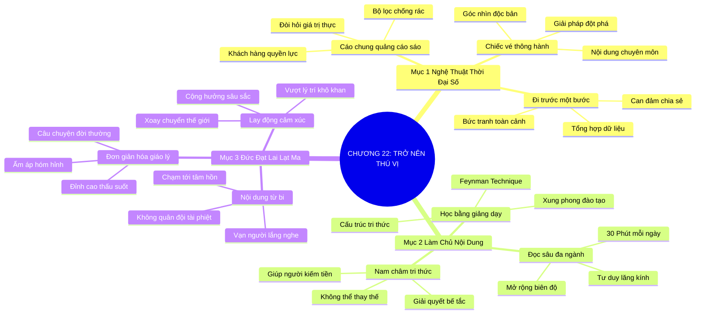

# TÓM TẮT CHƯƠNG SÁCH: CHƯƠNG 22: TRỞ NÊN THÚ VỊ VÀ ĐẦU TƯ NỘI DUNG CHUYÊN MÔN (BE INTERESTING)
* **Thuộc phần**: Phần 4: Trao Đổi Và Đền Đáp (Trading Up and Giving Back)
* **Tác giả**: Keith Ferrazzi (với Tahl Raz)
* **Chuẩn hóa cấu trúc**: Document Structure-Anchored v2.4

---

## 🌟 THÔNG ĐIỆP CỐT LÕI (CORE MESSAGE)
> Nội dung chuyên môn là tấm vé thông hành đỉnh cao: Trở thành chuyên gia sở hữu góc nhìn độc bản và biết truyền tải thông điệp bằng cảm xúc chạm tới trái tim như Đức Đạt Lai Lạt Ma sẽ biến bạn thành thỏi nam châm tri thức không thể thay thế.

---

## 📊 LƯỢC ĐỒ PHÂN BỔ CẤU TRÚC TÀI LIỆU
Bảng đối chiếu tỷ lệ và cấu trúc luận điểm bám sát các đề mục thực tế trong tài liệu:

| 📑 Đề Mục Trong Tài Liệu Gốc | 🎯 Số Lượng Luận Điểm Chuyên Sâu |
| :--- | :---: |
| Mục 1: Nghệ Thuật Trở Nên Thú Vị Trong Thời Đại Số | 3 |
| Mục 2: Bản Lĩnh Của Người Làm Chủ Nội Dung | 3 |
| Mục 3: Đại Sảnh Danh Vọng Kết Nối: Đức Đạt Lai Lạt Ma | 3 |
| **Tổng cộng toàn chương** | **9 Luận Điểm** |

---

## 💡 HỆ THỐNG LUẬN ĐIỂM QUAN TRỌNG (KEY TAKEAWAYS)

#### 📑 PHẦN: MỤC 1: NGHỆ THUẬT TRỞ NÊN THÚ VỊ TRONG THỜI ĐẠI SỐ

##### 1. Sự cáo chung của tiếp thị sáo rỗng trong kỷ nguyên số
* **Phân Tích Chuyên Sâu**: Thời kỳ tiếp thị một chiều đưa thông điệp quảng cáo chung chung lên truyền hình rồi ngồi chờ khách hàng đã vĩnh viễn chấm dứt. Khách hàng thời đại số có quyền lực tuyệt đối, sở hữu các bộ lọc chặn quảng cáo và luôn hoài nghi sâu sắc. Để tiếng nói được lắng nghe, bạn không thể dùng chiêu trò; bạn bắt buộc phải trở nên thực sự thú vị và mang lại giá trị thực chất.
* **Công Cụ / Phương Pháp Đi Kèm**: Nhận thức chuyển dịch kỷ nguyên số (Digital Era Attention Shift), Khử bỏ tiếp thị sáo rỗng.
* **Ví Dụ Thực Tế Ứng Dụng**: Người tiêu dùng lướt qua hàng trăm quảng cáo trên mạng nhưng dừng lại đọc một bài phân tích chuyên sâu giải thích nguyên nhân giá năng lượng tăng.

##### 2. Nội dung chuyên môn: Chiếc vé thông hành vào bàn đàm phán đỉnh cao
* **Phân Tích Chuyên Sâu**: Nội dung (Content) không phải là chuyện phiếm tán gẫu ngoài lề, mà là kiến thức chuyên môn sâu sắc mang góc nhìn độc bản của riêng bạn. Nội dung chính là giải pháp đột phá giúp tổ chức kiếm được tiền, tiết kiệm thời gian hoặc vượt qua khủng hoảng. Sở hữu nội dung độc đáo là tấm vé duy nhất đưa bạn ngồi ngang hàng với các nhà lãnh đạo xuất chúng.
* **Công Cụ / Phương Pháp Đi Kèm**: Tấm vé nội dung chuyên môn (The Intellectual Content Passport), Khung giải pháp đột phá.
* **Ví Dụ Thực Tế Ứng Dụng**: Một chuyên gia trẻ tuổi được mời tham gia họp bàn chiến lược cùng ban giám đốc nhờ bản đề xuất tái cấu trúc chuỗi cung ứng bằng dữ liệu lớn.

##### 3. Đi trước một bước trong việc tổng hợp và liên kết dữ liệu
* **Phân Tích Chuyên Sâu**: Bạn không cần phải là viện sĩ hàn lâm với hàng tá bằng cấp để trở thành người thú vị; bạn chỉ cần đi trước người khác một bước trong việc tổng hợp thông tin, quan sát thị trường và kết nối những dữ liệu rời rạc thành một bức tranh chiến lược rõ ràng.
* **Công Cụ / Phương Pháp Đi Kèm**: Năng lực tổng hợp tri thức (Knowledge Synthesis & Big-Picture Thinking).
* **Ví Dụ Thực Tế Ứng Dụng**: Đọc 5 báo cáo ngành khác nhau và đúc kết thành 3 xu hướng tiêu dùng chính cho cuộc họp sáng thứ Hai.

#### 📑 PHẦN: MỤC 2: BẢN LĨNH CỦA NGƯỜI LÀM CHỦ NỘI DUNG

##### 4. Biến mình thành chuyên gia thông qua việc giảng dạy và đào tạo
* **Phân Tích Chuyên Sâu**: Con đường ngắn nhất và vững chắc nhất để làm chủ tri thức là xung phong giảng dạy cho người khác. Khi bạn đứng lớp đào tạo cho đồng nghiệp và cấp trên về một công nghệ hoặc phương pháp mới, bạn buộc não bộ của mình phải cấu trúc lại toàn bộ kiến thức một cách mạch lạc và thấu đáo nhất.
* **Công Cụ / Phương Pháp Đi Kèm**: Phương pháp học bằng giảng dạy (Feynman Learning Technique / Peer Training Leadership).
* **Ví Dụ Thực Tế Ứng Dụng**: Keith Ferrazzi thời mới đi làm tại Deloitte luôn chủ động nghiên cứu các công nghệ internet mới nổi và xung phong tổ chức hội thảo đào tạo nội bộ cho toàn công ty.

##### 5. Thói quen đọc sâu và mở rộng biên độ hiểu biết mỗi ngày
* **Phân Tích Chuyên Sâu**: Những người dẫn đầu luôn là những người đọc nhiều nhất. Khi bạn không ngừng nạp vào những tư duy mới từ các lĩnh vực ngoài ngành (triết học, tâm lý, sinh học), bạn sẽ có khả năng nhìn thấu các vấn đề kinh doanh dưới lăng kính đa chiều mà đối thủ không thể có được.
* **Công Cụ / Phương Pháp Đi Kèm**: Chế độ đọc sách đa ngành (Interdisciplinary Reading Diet: 30 phút mỗi ngày).
* **Ví Dụ Thực Tế Ứng Dụng**: Duy trì thói quen đọc 1 cuốn sách chuyên môn mỗi tuần và ghi chép các ý tưởng ứng dụng vào công việc.

##### 6. Trở thành người không thể thiếu trong mạng lưới
* **Phân Tích Chuyên Sâu**: Khi bạn liên tục mang đến cho mạng lưới những thông tin giúp họ kiếm được nhiều tiền hơn, tránh được các rủi ro pháp lý hay giải quyết được bế tắc, bạn trở thành một 'thỏi nam châm tri thức'. Mọi người sẽ tự động tìm đến bạn và đưa bạn vào vòng tròn tin cậy.
* **Công Cụ / Phương Pháp Đi Kèm**: Vị thế thỏi nam châm tri thức (The Knowledge Magnet Positioning).
* **Ví Dụ Thực Tế Ứng Dụng**: Được các đối tác thường xuyên gọi điện xin ý kiến tư vấn trước khi đầu tư vào công nghệ mới.

#### 📑 PHẦN: MỤC 3: ĐẠI SẢNH DANH VỌNG KẾT NỐI: ĐỨC ĐẠT LAI LẠT MA

##### 7. Sức mạnh kết nối từ nội dung chạm tới trái tim
* **Phân Tích Chuyên Sâu**: Đức Đạt Lai Lạt Ma không có học vị kinh doanh, không chỉ huy quân đội hay nắm giữ tập đoàn tài chính, nhưng hàng vạn người thuộc mọi tôn giáo, sắc tộc đều say mê lắng nghe Ngài. Bí quyết của Ngài nằm ở nội dung thông điệp có sức mạnh phổ quát: lòng từ bi, sự an lạc nội tâm và tình bác ái giữa con người với con người.
* **Công Cụ / Phương Pháp Đi Kèm**: Thông điệp rung cảm phổ quát (Universal Compassion Messaging), Bài học Dalai Lama.
* **Ví Dụ Thực Tế Ứng Dụng**: Các buổi nói chuyện của Đức Đạt Lai Lạt Ma tại các trường đại học hàng đầu luôn kín chỗ vì chạm thẳng vào nhu cầu bình an tâm hồn của người nghe.

##### 8. Nghệ thuật biến triết lý uyên thâm thành câu chuyện giản dị
* **Phân Tích Chuyên Sâu**: Đức Đạt Lai Lạt Ma có khả năng chuyển hóa những giáo lý Phật pháp phức tạp nhất thành những câu chuyện đời thường, ấm áp và hóm hỉnh. Sự giản dị trong cách truyền tải chính là đỉnh cao của sự thấu suốt và là chiếc cầu nối tuyệt hảo tới mọi tâm hồn.
* **Công Cụ / Phương Pháp Đi Kèm**: Nghệ thuật giản dị hóa tri thức (Radical Simplicity Storytelling).
* **Ví Dụ Thực Tế Ứng Dụng**: Dùng câu chuyện về một nụ cười hay hơi thở để giải thích về bản chất của hạnh phúc và giải thoát.

##### 9. Thôi thúc hành động bằng cảm xúc chân thành thay vì lý trí khô khan
* **Phân Tích Chuyên Sâu**: Để lay động và dẫn dắt con người, bạn không thể chỉ sử dụng những lập luận lý trí và bảng biểu khô khan. Bạn phải chạm tới tầng cảm xúc sâu thẳm của họ. Một câu chuyện truyền cảm hứng sâu sắc kết hợp với một nội dung vững chắc chính là vũ khí kết nối vĩ đại nhất.
* **Công Cụ / Phương Pháp Đi Kèm**: Cộng hưởng cảm xúc đỉnh cao (Emotional Resonance Leadership).
* **Ví Dụ Thực Tế Ứng Dụng**: Truyền cảm hứng cho các nhà khoa học và chính trị gia cam kết hành động vì môi trường thông qua sự đồng cảm với nỗi khổ của muôn loài.

---

## 🎯 KẾ HOẠCH HÀNH ĐỘNG TOÀN DIỆN (ACTION PLAN)
### ⚡ Cấp độ 1: Thói quen vi mô (Micro-habits < 2 phút mỗi ngày)
- [ ] Chọn ra 1 chủ đề ngách tiên phong trong ngành để nghiên cứu sâu trong tháng này
- [ ] Xung phong tổ chức 1 buổi chia sẻ/đào tạo nội bộ 30 phút cho nhóm làm việc
- [ ] Dành 30 phút mỗi ngày đọc sách chuyên môn hoặc các bài nghiên cứu quốc tế
- [ ] Viết một bài tóm tắt 3 xu hướng lớn nhất của ngành bạn trong năm tới
- [ ] Luyện tập cách giải thích một khái niệm kỹ thuật phức tạp cho người ngoài ngành hiểu

### 📅 Cấp độ 2: Thói quen tuần & Dự án ngắn hạn (Weekly Habits)
- [ ] Chia sẻ một bài học thất bại xương máu và cách bạn vượt qua cho đồng nghiệp
- [ ] Tham gia một diễn đàn chuyên môn để đóng góp các câu trả lời chất lượng cao
- [ ] Đọc các bài giảng của Đức Đạt Lai Lạt Ma để học cách kể chuyện chạm tới cảm xúc
- [ ] Tránh tuyệt đối việc tham gia các cuộc buôn chuyện phiếm vô bổ tại công sở
- [ ] Đúc kết các số liệu khô khan trong báo cáo thành 1 câu chuyện thực tế sinh động

### 🚀 Cấp độ 3: Chiến lược chuyển hóa dài hạn (Long-term Strategy)
- [ ] Kết nối các kiến thức trái ngành vào bài thuyết trình dự án sắp tới
- [ ] Đặt mục tiêu trở thành chuyên gia Top 5 về mảng chuyên môn ngách tại công ty
- [ ] Gửi bài phân tích chuyên môn của bạn cho 3 người cố vấn để xin phản hồi
- [ ] Lắng nghe phản hồi của người nghe để liên tục tinh chỉnh nội dung ngày càng sắc bén
- [ ] Tự hỏi mỗi sáng: 'Hôm nay mình sẽ mang lại giá trị tri thức mới nào cho mạng lưới?'

---

## ❓ BỘ CÂU HỎI TỰ VẤN & PHẢN TƯ SUY NGẪM (REFLECTION QUESTIONS)
### Nhóm 1: Nhận thức thực tại & Thói quen hiện tại
1. Bạn đang được biết đến trong công ty và cộng đồng nhờ nội dung chuyên môn độc bản nào?
2. Tại sao các chiêu trò tiếp thị sáo rỗng lại hoàn toàn bất lực trong kỷ nguyên số?
3. Lần gần nhất bạn xung phong đứng lớp đào tạo hoặc thuyết trình cho người khác là khi nào?
4. Cảm giác của bạn thế nào khi giải thích một vấn đề chuyên môn phức tạp thành câu chuyện giản dị?
5. Đức Đạt Lai Lạt Ma đã dạy cho chúng ta bài học gì về sức mạnh của nội dung xuất phát từ trái tim?

### Nhóm 2: Thách thức tâm lý & Rào cản nội tâm
6. Bạn dành bao nhiêu giờ mỗi tuần để đọc sách và nạp thêm tri thức mới ngoài công việc?
7. Những thông tin hay dữ liệu nào bạn cung cấp khiến các đối tác cảm thấy hào hứng nhất?
8. Tại sao việc trở thành một 'thỏi nam châm tri thức' lại giúp bạn không bao giờ phải đi săn tìm danh thiếp?
9. Làm thế nào để cân bằng giữa việc nâng cao chuyên môn sâu và khả năng kết nối đa ngành?
10. Khi ai đó hỏi ý kiến bạn về một xu hướng mới trong ngành, bạn có đưa ra được góc nhìn độc đáo không?

### Nhóm 3: Chiến lược hành động & Ứng dụng thực tế
11. Bạn xử lý thế nào khi phát hiện kiến thức của mình đã bắt đầu lạc hậu so với thị trường?
12. Làm sao để câu chuyện của bạn chạm tới cảm xúc người nghe mà không biến thành ủy mị hay kịch cỡm?
13. Bạn có đang giam mình trong những việc sự vụ hàng ngày mà quên đầu tư nâng cấp nội dung?
14. Một chuyên gia thực thụ khác biệt với một kẻ 'chém gió' lý thuyết ở những điểm nào?
15. Tại sao sự thấu hiểu tâm lý con người lại quan trọng hơn các bảng biểu phân tích tài chính?

### Nhóm 4: Chuyển hóa tư duy & Tầm nhìn dài hạn
16. Bạn có sẵn sàng chia sẻ miễn phí những đúc kết chuyên môn giá trị nhất của mình cho cộng đồng?
17. Làm thế nào để xây dựng thói quen đọc sách đa ngành đều đặn giữa lịch trình bận rộn?
18. Việc sở hữu nội dung chuyên môn độc đáo mang lại sự tự tin cho bạn ra sao khi tiếp xúc nhân vật lớn?
19. Tại sao nói: 'Nội dung chính là chiếc vé thông hành duy nhất vào bàn đàm phán đỉnh cao'?
20. Kế hoạch cụ thể để bạn làm chủ một nội dung tiên phong trong 90 ngày tới là gì?

---

## 🧠 SƠ ĐỒ TƯ DUY TRỰC QUAN (MINDMAP)

