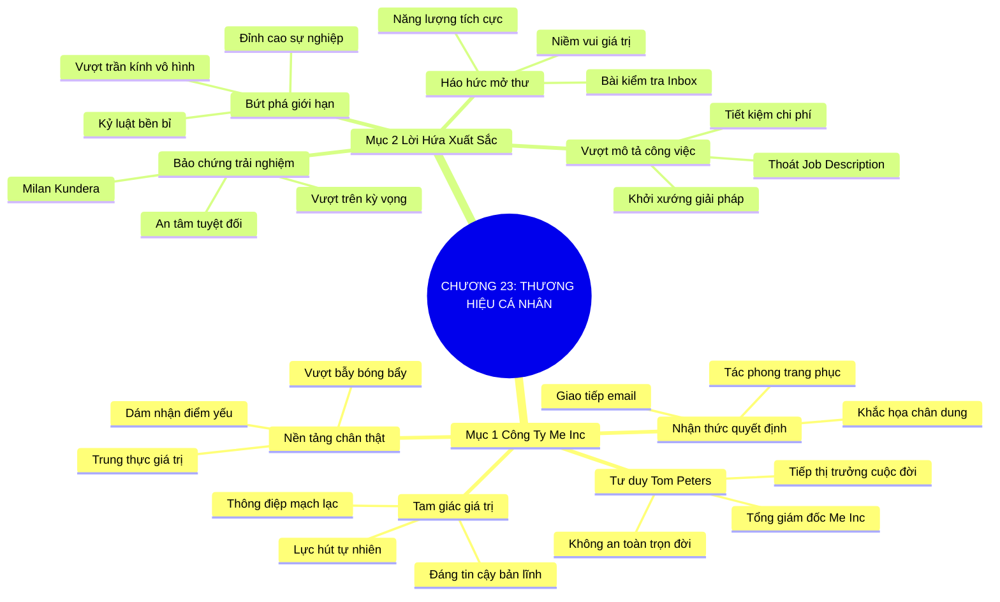

# SƠ ĐỒ TƯ DUY TRỰC QUAN: CHƯƠNG 23: XÂY DỰNG THƯƠNG HIỆU CÁ NHÂN (BUILD YOUR BRAND)
* **Thuộc phần**: Phần 4: Trao Đổi Và Đền Đáp (Trading Up and Giving Back)
* **Tác phẩm**: Đừng Bao Giờ Đi Ăn Một Mình (Never Eat Alone) - Keith Ferrazzi
* **Chuẩn hóa**: Document Structure-Anchored v2.4 (Không nhãn meta thừa, phản ánh 100% cấu trúc tài liệu)

---

## 🌳 SƠ ĐỒ TƯ DUY MERMAID (4-5 TẦNG CHI TIẾT)

---

## 🧬 BẢNG PHÂN CẤP TRUY HỒI CHỦ ĐỘNG (ACTIVE RECALL HIERARCHY)
Cấu trúc hóa tri thức theo các nhánh tài liệu phục vụ ôn tập nhanh và khắc sâu trí nhớ:

| 📑 Nhánh Mục Tài Liệu | 🔑 Từ Khóa Vàng / Khái Niệm | 📝 Nội Dung Truy Hồi Chủ Động (Active Recall) |
| :--- | :--- | :--- |
| Mục 1: Tổng Giám Đốc Của Công Ty Chính Tôi, Me Inc | **Tư duy Me Inc** | Mỗi người là CEO của công ty cuộc đời mình; phải chủ động làm tiếp thị trưởng cho thương hiệu bản thân. |
| Mục 1: Tổng Giám Đốc Của Công Ty Chính Tôi, Me Inc | **Nhận thức quyết định** | Tác phong, trang phục và chất lượng bàn giao hàng ngày liên tục định hình thương hiệu trong mắt người khác. |
| Mục 1: Tổng Giám Đốc Của Công Ty Chính Tôi, Me Inc | **Nền tảng chân thật** | Thương hiệu cá nhân mạnh mẽ nhất bắt nguồn từ sự chân thật và lòng kiên định với giá trị cốt lõi. |
| Mục 2: Lời Hứa Của Sự Xuất Sắc Và Bứt Phá Giới Hạn | **Bảo chứng trải nghiệm** | Thương hiệu thành công là lời bảo đảm tuyệt đối về một trải nghiệm hoàn hảo và kết quả vượt trội. |
| Mục 2: Lời Hứa Của Sự Xuất Sắc Và Bứt Phá Giới Hạn | **Vượt mô tả công việc** | Chủ động sáng tạo và cống hiến vượt ra ngoài bản mô tả công việc để tạo ra giá trị mới cho tổ chức. |
| Mục 2: Lời Hứa Của Sự Xuất Sắc Và Bứt Phá Giới Hạn | **Bứt phá giới hạn** | Sự xuất sắc bền bỉ và chữ tín thép sẽ tự động phá vỡ mọi trần kính vô hình trong sự nghiệp. |

---

## ⚡ BẢNG NEO TRÍ NHỚ NHANH (MEMORY ANCHOR CHEAT SHEET)
Tóm tắt cô đọng các công thức và quy tắc hành động của chương:

| 📑 Phần/Mục Tài Liệu | 📌 Khái Niệm Cốt Lõi | ⚖️ Nguyên Lý Vàng | 🚀 Hành Động Chuyển Hóa Ngay |
| :--- | :--- | :--- | :--- |
| Mục 1: Công ty Me Inc | **Tư duy Me Inc** | Xem bản thân là CEO của chính cuộc đời mình | Chủ động tiếp thị giá trị cá nhân |
| Mục 1: Công ty Me Inc | **Nhận thức quyết định** | Chăm chút từng điểm chạm: trang phục, email, tác phong | Khắc họa hình ảnh chuyên nghiệp vững chắc |
| Mục 2: Lời hứa xuất sắc | **Bảo chứng trải nghiệm** | Luôn bàn giao kết quả vượt trên sự kỳ vọng | Tạo sự an tâm tuyệt đối cho đối tác |
| Mục 2: Lời hứa xuất sắc | **Vượt mô tả công việc** | Khởi xướng giải pháp mới giúp tổ chức bứt phá | Mở rộng tầm ảnh hưởng và thăng tiến |

