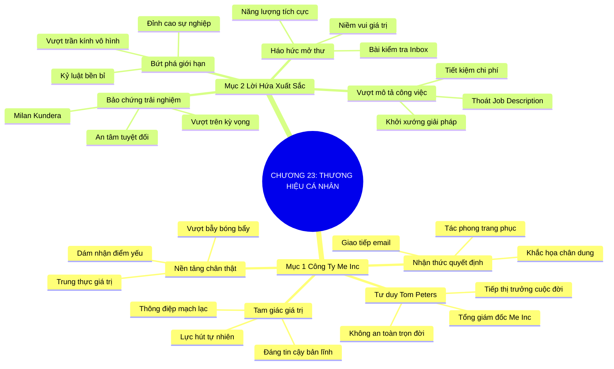

# TÓM TẮT CHƯƠNG SÁCH: CHƯƠNG 23: XÂY DỰNG THƯƠNG HIỆU CÁ NHÂN (BUILD YOUR BRAND)
* **Thuộc phần**: Phần 4: Trao Đổi Và Đền Đáp (Trading Up and Giving Back)
* **Tác giả**: Keith Ferrazzi (với Tahl Raz)
* **Chuẩn hóa cấu trúc**: Document Structure-Anchored v2.4

---

## 🌟 THÔNG ĐIỆP CỐT LÕI (CORE MESSAGE)
> Tổng giám đốc của Công ty Chính Tôi (Me Inc): Nhận thức quyết định thực tế—xây dựng thương hiệu cá nhân dựa trên sự chân thật và lời hứa bảo đảm về sự xuất sắc vượt trên kỳ vọng trong từng lần tiếp xúc.

---

## 📊 LƯỢC ĐỒ PHÂN BỔ CẤU TRÚC TÀI LIỆU
Bảng đối chiếu tỷ lệ và cấu trúc luận điểm bám sát các đề mục thực tế trong tài liệu:

| 📑 Đề Mục Trong Tài Liệu Gốc | 🎯 Số Lượng Luận Điểm Chuyên Sâu |
| :--- | :---: |
| Mục 1: Tổng Giám Đốc Của Công Ty Chính Tôi, Me Inc | 4 |
| Mục 2: Lời Hứa Của Sự Xuất Sắc Và Bứt Phá Giới Hạn | 4 |
| **Tổng cộng toàn chương** | **8 Luận Điểm** |

---

## 💡 HỆ THỐNG LUẬN ĐIỂM QUAN TRỌNG (KEY TAKEAWAYS)

#### 📑 PHẦN: MỤC 1: TỔNG GIÁM ĐỐC CỦA CÔNG TY CHÍNH TÔI, ME INC

##### 1. Tư duy 'Công ty Chính Tôi' (Me Inc) của Tom Peters
* **Phân Tích Chuyên Sâu**: Chuyên gia quản trị Tom Peters đã khẳng định: Dù bạn làm nghề gì hay ở độ tuổi nào, bạn luôn là Tổng Giám Đốc điều hành của chính công ty cuộc đời mình mang tên Me Inc. Trong thời đại kinh tế biến động, không còn cái gọi là công việc an toàn trọn đời; bạn bắt buộc phải là người tiếp thị trưởng cho thương hiệu mang tên chính bạn.
* **Công Cụ / Phương Pháp Đi Kèm**: Mô hình quản trị cuộc đời Me Inc (CEO of Me Inc Mindset - Tom Peters), Nhận diện rủi ro phụ thuộc tổ chức.
* **Ví Dụ Thực Tế Ứng Dụng**: Không xem mình là người làm công ăn lương thụ động; xem bản thân là một nhà cung cấp dịch vụ chuyên nghiệp độc lập đang hợp tác cùng công ty.

##### 2. Nhận thức quyết định thực tế (Perception Drives Reality)
* **Phân Tích Chuyên Sâu**: Tất cả những gì bạn lựa chọn mỗi ngày—từ phong cách trang phục, tác phong đi đứng, giọng điệu giao tiếp, cách trả lời email cho đến chất lượng công việc bạn bàn giao—đều đang liên tục khắc họa nên chân dung thương hiệu của bạn trong tâm trí người khác. Đừng để thương hiệu cá nhân của bạn hình thành một cách ngẫu nhiên và cẩu thả.
* **Công Cụ / Phương Pháp Đi Kèm**: Kiểm soát điểm chạm thương hiệu cá nhân (Personal Brand Touchpoints Audit).
* **Ví Dụ Thực Tế Ứng Dụng**: Luôn ăn mặc chỉn chu, phản hồi email đúng chuẩn mực và đúng giờ trong mọi cuộc họp để định vị sự chuyên nghiệp.

##### 3. Ba giá trị vô giá của một thương hiệu cá nhân mạnh mẽ
* **Phân Tích Chuyên Sâu**: Thương hiệu cá nhân mang lại 3 đòn bẩy lớn: 1. Định vị bạn là người đáng tin cậy, có bản lĩnh và hoàn toàn khác biệt giữa đám đông; 2. Truyền tải thông điệp mạch lạc về giá trị bạn có thể cống hiến; 3. Tạo ra lực hấp dẫn tự nhiên thu hút những người cùng chí hướng và các cơ hội lớn tự tìm đến bạn.
* **Công Cụ / Phương Pháp Đi Kèm**: Tam giác giá trị thương hiệu cá nhân (Credibility + Value Message + Natural Magnetism).
* **Ví Dụ Thực Tế Ứng Dụng**: Nhận được nhiều lời mời làm cố vấn hoặc hợp tác đầu tư mà không cần phải chủ động đi nộp hồ sơ xin việc.

##### 4. Nền tảng chân thật: Vũ khí tối thượng giữa đại dương thông tin
* **Phân Tích Chuyên Sâu**: Thương hiệu cá nhân không phải là vỏ bọc hào nhoáng giả tạo được tô vẽ bằng các thuật ngữ bóng bẩy. Thương hiệu mạnh nhất là thương hiệu được xây dựng trên sự chân thật (Authenticity): trung thực với giá trị cốt lõi, dám thừa nhận điểm yếu và kiên định với sứ mệnh phụng sự của mình.
* **Công Cụ / Phương Pháp Đi Kèm**: Tính xác thực thương hiệu (Brand Authenticity Core), Tránh bẫy vỏ bọc giả tạo.
* **Ví Dụ Thực Tế Ứng Dụng**: Dám chia sẻ về những bài học vấp ngã chân thực trên trang cá nhân thay vì chỉ khoe khoang sự giàu có hay thành công hoàn hảo.

#### 📑 PHẦN: MỤC 2: LỜI HỨA CỦA SỰ XUẤT SẮC VÀ BỨT PHÁ GIỚI HẠN

##### 5. Thương hiệu là lời bảo đảm tuyệt đối về một trải nghiệm hoàn hảo
* **Phân Tích Chuyên Sâu**: Nhà văn Milan Kundera từng nói sự tán tỉnh là lời hứa nhưng không có gì bảo đảm. Trái lại, một thương hiệu thành công chính là lời hứa và sự bảo đảm tuyệt đối về một trải nghiệm hoàn hảo. Đó là cảm giác an tâm tuyệt đối của khách hàng và sếp khi trao dự án cho bạn vì biết bạn chắc chắn sẽ tạo ra kết quả xuất sắc.
* **Công Cụ / Phương Pháp Đi Kèm**: Lời hứa thương hiệu bảo chứng (The Brand Promise of Excellence - Milan Kundera Insight).
* **Ví Dụ Thực Tế Ứng Dụng**: Bất kỳ tài liệu hay báo cáo nào mang tên bạn đều chuẩn chỉ đến từng dấu phẩy, không bao giờ để xảy ra sai sót ngớ ngẩn.

##### 6. Bức thư điện tử mà người khác luôn háo hức mở đọc
* **Phân Tích Chuyên Sâu**: Thước đo thành công của thương hiệu cá nhân trong giao tiếp hàng ngày là: Liệu khi thấy tên bạn xuất hiện trên màn hình điện thoại hay hộp thư đến, đối phương cảm thấy háo hức muốn mở ra ngay hay cảm thấy ngán ngẩm né tránh? Hãy biến mọi thông điệp của bạn thành niềm vui và giá trị cho người nhận.
* **Công Cụ / Phương Pháp Đi Kèm**: Bài kiểm tra hộp thư đến (The Inbox Anticipation Test).
* **Ví Dụ Thực Tế Ứng Dụng**: Mỗi email gửi đi đều chứa thông tin giá trị, súc tích và năng lượng tích cực, khiến đối tác luôn ưu tiên đọc đầu tiên.

##### 7. Vượt ra ngoài bản mô tả công việc chật hẹp (Job Description)
* **Phân Tích Chuyên Sâu**: Kẻ tầm thường chỉ làm đúng những gì được ghi trong bản mô tả công việc. Người kiến tạo thương hiệu đỉnh cao luôn tự hỏi: 'Làm thế nào để hoàn thành nhanh hơn, hiệu quả hơn và tiết kiệm hơn?'. Họ chủ động khởi xướng giải pháp sáng tạo và giải quyết những bài toán hóc búa của tổ chức.
* **Công Cụ / Phương Pháp Đi Kèm**: Tư duy vượt trên mong đợi (Over-Delivery Mindset), Mở rộng ranh giới trách nhiệm.
* **Ví Dụ Thực Tế Ứng Dụng**: Ngoài việc nộp báo cáo tuần, chủ động đề xuất giải pháp số hóa quy trình giúp tiết kiệm 15 giờ làm việc cho cả phòng ban.

##### 8. Phá vỡ mọi giới hạn vô hình bằng sự xuất sắc bền bỉ
* **Phân Tích Chuyên Sâu**: Khi bạn liên tục tạo ra kết quả vượt trên sự kỳ vọng và giữ vững chữ tín thép qua năm tháng, thương hiệu cá nhân của bạn sẽ tự động phá vỡ mọi trần kính và rào cản vô hình về tuổi tác hay xuất thân, đưa bạn vươn tới những đỉnh cao sự nghiệp.
* **Công Cụ / Phương Pháp Đi Kèm**: Bứt phá trần kính vô hình (Glass Ceiling Breakthrough), Kỷ luật xuất sắc bền bỉ.
* **Ví Dụ Thực Tế Ứng Dụng**: Được thăng chức vượt cấp nhờ chuỗi thành tích xuất sắc và sự tín nhiệm tuyệt đối từ các đối tác chiến lược.

---

## 🎯 KẾ HOẠCH HÀNH ĐỘNG TOÀN DIỆN (ACTION PLAN)
### ⚡ Cấp độ 1: Thói quen vi mô (Micro-habits < 2 phút mỗi ngày)
- [ ] Viết ra tuyên ngôn sứ mệnh 1 câu của thương hiệu 'Me Inc' của bạn
- [ ] Rà soát lại toàn bộ hồ sơ LinkedIn và mạng xã hội xem có phản ánh đúng giá trị bạn muốn định vị
- [ ] Nâng cấp chất lượng hình ảnh đại diện và tiểu sử chuyên môn trên các nền tảng số
- [ ] Áp dụng quy tắc kiểm tra hộp thư: kiểm tra kỹ từng email trước khi bấm gửi
- [ ] Chủ động nhận thêm 1 nhiệm vụ vượt ngoài bản mô tả công việc trong tuần này

### 📅 Cấp độ 2: Thói quen tuần & Dự án ngắn hạn (Weekly Habits)
- [ ] Đảm bảo bàn giao sản phẩm công việc trước thời hạn cam kết ít nhất 2 giờ
- [ ] Xác định 3 tính từ bạn muốn người khác nghĩ đến đầu tiên khi nhắc đến tên bạn
- [ ] Loại bỏ những bài đăng tiêu cực, than vãn hoặc vụn vặt trên mạng xã hội cá nhân
- [ ] Đọc bài viết kinh điển 'The Brand Called You' của Tom Peters
- [ ] Gửi bản đề xuất giải pháp cải tiến quy trình làm việc cho cấp trên

### 🚀 Cấp độ 3: Chiến lược chuyển hóa dài hạn (Long-term Strategy)
- [ ] Giữ tác phong ăn mặc chuyên nghiệp và chỉnh tề ngay cả trong các cuộc họp trực tuyến
- [ ] Đánh giá lại mức độ hài lòng của khách hàng và đồng nghiệp sau mỗi dự án
- [ ] Luyện tập cách giới thiệu bản thân trong 30 giây (Elevator Pitch) làm nổi bật giá trị cốt lõi
- [ ] Trung thực tuyệt đối về năng lực, không hứa suông những điều không thể làm được
- [ ] Xây dựng lời hứa thương hiệu cá nhân: Luôn mang lại kết quả vượt trên kỳ vọng

---

## ❓ BỘ CÂU HỎI TỰ VẤN & PHẢN TƯ SUY NGẪM (REFLECTION QUESTIONS)
### Nhóm 1: Nhận thức thực tại & Thói quen hiện tại
1. Nếu xem bạn là Tổng Giám Đốc của công ty 'Me Inc', công ty của bạn đang kinh doanh sản phẩm gì?
2. Ba tính từ đầu tiên mà đồng nghiệp và khách hàng nghĩ đến khi nhắc đến tên bạn là gì?
3. Bạn có đang để thương hiệu cá nhân hình thành tự phát hay có chiến lược chủ động?
4. Tại sao Tom Peters lại cho rằng thương hiệu cá nhân là phao cứu sinh duy nhất trong thời đại mới?
5. Cảm giác của người khác khi thấy tên bạn xuất hiện trong hộp thư đến là háo hức hay e ngại?

### Nhóm 2: Thách thức tâm lý & Rào cản nội tâm
6. Bạn đã từng làm điều gì vượt ra ngoài bản mô tả công việc chật hẹp để tạo ra đột phá chưa?
7. Lời hứa thương hiệu cá nhân của bạn đối với khách hàng và đồng nghiệp là gì?
8. Làm sao để xây dựng thương hiệu cá nhân dựa trên sự chân thật mà không trở nên khoe mẽ?
9. Những chi tiết nhỏ nhặt nào (tác phong, trang phục, email) đang làm giảm uy tín của bạn?
10. Khi xảy ra sai sót công việc, bạn bảo vệ thương hiệu cá nhân của mình bằng cách nào?

### Nhóm 3: Chiến lược hành động & Ứng dụng thực tế
11. Bạn có sẵn sàng từ chối những dự án đi ngược lại giá trị cốt lõi của thương hiệu bản thân không?
12. Làm thế nào để thương hiệu của bạn tạo ra lực hút tự nhiên kéo những cơ hội lớn tìm đến?
13. Bạn đã bao giờ nỗ lực bàn giao một sản phẩm vượt xa kỳ vọng ban đầu của khách hàng chưa?
14. Trần kính vô hình lớn nhất trong sự nghiệp hiện tại của bạn là gì, và làm sao bứt phá nó?
15. Sự khác biệt giữa một người làm việc chăm chỉ và một người có thương hiệu cá nhân mạnh là gì?

### Nhóm 4: Chuyển hóa tư duy & Tầm nhìn dài hạn
16. Bạn quản trị hình ảnh trên mạng xã hội như thế nào để phục vụ cho sự nghiệp dài hạn?
17. Một tấm gương về thương hiệu cá nhân xuất sắc mà bạn luôn ngưỡng mộ và học hỏi là ai?
18. Tại sao sự nhất quán trong hành động qua năm tháng lại là cốt lõi của uy tín thương hiệu?
19. Khi người khác giới thiệu bạn với một nhân vật cấp cao, họ sẽ nói câu gì về bạn?
20. Bước hành động cụ thể đầu tiên bạn sẽ làm để nâng cấp thương hiệu Me Inc trong tuần này là gì?

---

## 🧠 SƠ ĐỒ TƯ DUY TRỰC QUAN (MINDMAP)

