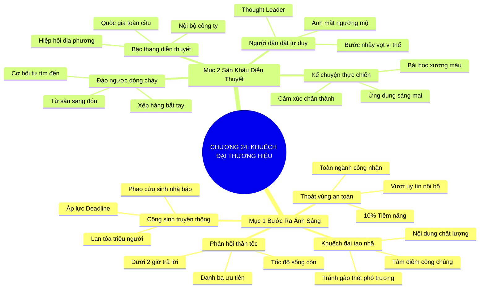

# SƠ ĐỒ TƯ DUY TRỰC QUAN: CHƯƠNG 24: LAN TỎA VÀ KHUẾCH ĐẠI THƯƠNG HIỆU (BROADCAST YOUR BRAND)
* **Thuộc phần**: Phần 4: Trao Đổi Và Đền Đáp (Trading Up and Giving Back)
* **Tác phẩm**: Đừng Bao Giờ Đi Ăn Một Mình (Never Eat Alone) - Keith Ferrazzi
* **Chuẩn hóa**: Document Structure-Anchored v2.4 (Không nhãn meta thừa, phản ánh 100% cấu trúc tài liệu)

---

## 🌳 SƠ ĐỒ TƯ DUY MERMAID (4-5 TẦNG CHI TIẾT)

---

## 🧬 BẢNG PHÂN CẤP TRUY HỒI CHỦ ĐỘNG (ACTIVE RECALL HIERARCHY)
Cấu trúc hóa tri thức theo các nhánh tài liệu phục vụ ôn tập nhanh và khắc sâu trí nhớ:

| 📑 Nhánh Mục Tài Liệu | 🔑 Từ Khóa Vàng / Khái Niệm | 📝 Nội Dung Truy Hồi Chủ Động (Active Recall) |
| :--- | :--- | :--- |
| Mục 1: Bước Ra Ánh Sáng Của Sự Công Nhận Rộng Rãi | **Thoát vùng an toàn** | Uy tín nội bộ chỉ khai thác 10% tiềm năng; cần bước ra ánh sáng để toàn ngành công nhận. |
| Mục 1: Bước Ra Ánh Sáng Của Sự Công Nhận Rộng Rãi | **Khuếch đại tao nhã** | Lan tỏa thương hiệu bằng cách chia sẻ các đúc kết chuyên môn sâu sắc thay vì phô trương. |
| Mục 1: Bước Ra Ánh Sáng Của Sự Công Nhận Rộng Rãi | **Cộng sinh truyền thông** | Chủ động cung cấp góc nhìn và số liệu cho nhà báo để họ trở thành kênh khuếch đại uy tín. |
| Mục 2: Diễn Thuyết Và Tạo Dựng Uy Tín Diễn Đàn Lớn | **Người dẫn dắt tư duy** | Đứng trên bục diễn giả tại hội nghị lớn lập tức định vị bạn là nhà lãnh đạo tư tưởng. |
| Mục 2: Diễn Thuyết Và Tạo Dựng Uy Tín Diễn Đàn Lớn | **Đảo ngược dòng chảy** | Chuyển từ vị thế đi săn tìm danh thiếp sang vị thế được mọi người xếp hàng tìm kiếm. |
| Mục 2: Diễn Thuyết Và Tạo Dựng Uy Tín Diễn Đàn Lớn | **Bậc thang diễn thuyết** | Tiến bước từng bước: từ hội thảo nội bộ, hiệp hội địa phương đến diễn đàn quốc tế. |

---

## ⚡ BẢNG NEO TRÍ NHỚ NHANH (MEMORY ANCHOR CHEAT SHEET)
Tóm tắt cô đọng các công thức và quy tắc hành động của chương:

| 📑 Phần/Mục Tài Liệu | 📌 Khái Niệm Cốt Lõi | ⚖️ Nguyên Lý Vàng | 🚀 Hành Động Chuyển Hóa Ngay |
| :--- | :--- | :--- | :--- |
| Mục 1: Bước ra ánh sáng | **Thoát vùng nội bộ** | Mở rộng tầm ảnh hưởng ra toàn ngành | Khai phá 90% tiềm năng sự nghiệp còn lại |
| Mục 1: Bước ra ánh sáng | **Cộng sinh truyền thông** | Cung cấp số liệu độc quyền cho báo chí | Khuếch đại thương hiệu tới hàng triệu độc giả |
| Mục 2: Sân khấu diễn thuyết | **Người dẫn dắt tư duy** | Đứng trên bục diễn giả hội nghị lớn | Định vị vị thế chuyên gia hàng đầu |
| Mục 2: Sân khấu diễn thuyết | **Kể chuyện thực chiến** | Lồng ghép bài học thất bại và công cụ thực tế | Truyền cảm hứng và thu hút cơ hội hợp tác |

