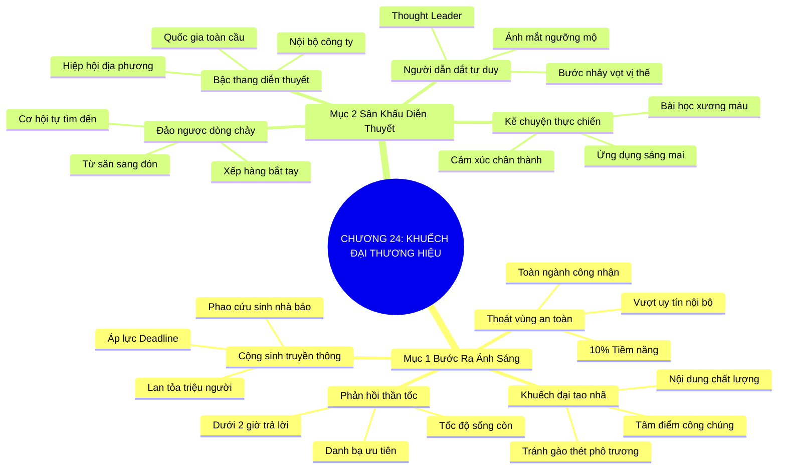

# TÓM TẮT CHƯƠNG SÁCH: CHƯƠNG 24: LAN TỎA VÀ KHUẾCH ĐẠI THƯƠNG HIỆU (BROADCAST YOUR BRAND)
* **Thuộc phần**: Phần 4: Trao Đổi Và Đền Đáp (Trading Up and Giving Back)
* **Tác giả**: Keith Ferrazzi (với Tahl Raz)
* **Chuẩn hóa cấu trúc**: Document Structure-Anchored v2.4

---

## 🌟 THÔNG ĐIỆP CỐT LÕI (CORE MESSAGE)
> Bước ra ánh sáng của sự công nhận rộng rãi: Xây dựng quan hệ cộng sinh với giới báo chí và đứng trên các sân khấu hội nghị lớn sẽ khuếch đại uy tín chuyên môn của bạn tới hàng triệu người.

---

## 📊 LƯỢC ĐỒ PHÂN BỔ CẤU TRÚC TÀI LIỆU
Bảng đối chiếu tỷ lệ và cấu trúc luận điểm bám sát các đề mục thực tế trong tài liệu:

| 📑 Đề Mục Trong Tài Liệu Gốc | 🎯 Số Lượng Luận Điểm Chuyên Sâu |
| :--- | :---: |
| Mục 1: Bước Ra Ánh Sáng Của Sự Công Nhận Rộng Rãi | 4 |
| Mục 2: Diễn Thuyết Và Tạo Dựng Uy Tín Trên Các Diễn Đàn Lớn | 4 |
| **Tổng cộng toàn chương** | **8 Luận Điểm** |

---

## 💡 HỆ THỐNG LUẬN ĐIỂM QUAN TRỌNG (KEY TAKEAWAYS)

#### 📑 PHẦN: MỤC 1: BƯỚC RA ÁNH SÁNG CỦA SỰ CÔNG NHẬN RỘNG RÃI

##### 1. Sự giới hạn khi chỉ có uy tín nội bộ khép kín
* **Phân Tích Chuyên Sâu**: Có chuyên môn giỏi và được công nhận trong nội bộ công ty mới chỉ là bước khởi đầu. Nếu thế giới bên ngoài không biết đến tài năng của bạn, bạn mới chỉ khai thác được 10% tiềm năng sự nghiệp. Đã đến lúc phải mở rộng tầm ảnh hưởng, bước ra ánh sáng và tìm kiếm sự công nhận trên toàn ngành.
* **Công Cụ / Phương Pháp Đi Kèm**: Chiến lược thoát khỏi vùng an toàn nội bộ (External Recognition Imperative).
* **Ví Dụ Thực Tế Ứng Dụng**: Một kỹ sư phần mềm xuất sắc nhưng chỉ được phòng ban biết đến, sau khi xuất hiện trên báo công nghệ lập tức nhận được tài trợ khởi nghiệp.

##### 2. Khuếch đại thông minh, nói không với phô trương kệch cỡm
* **Phân Tích Chuyên Sâu**: Lan tỏa thương hiệu không phải là đứng giữa ngã tư gào thét hay khoe mẽ kệch cỡm. Đó là nghệ thuật khuếch đại đỉnh cao: khéo léo biến những đúc kết chuyên môn sâu sắc thành tâm điểm thu hút sự quan tâm của công chúng và truyền thông một cách tao nhã.
* **Công Cụ / Phương Pháp Đi Kèm**: Khuếch đại tao nhã (Graceful Amplification Strategy), Đòn bẩy nội dung chất lượng cao.
* **Ví Dụ Thực Tế Ứng Dụng**: Chia sẻ bản báo cáo phân tích xu hướng tiêu dùng độc quyền thay vì tự viết bài ca ngợi bản thân.

##### 3. Xây dựng mối quan hệ cộng sinh chân thành với giới truyền thông
* **Phân Tích Chuyên Sâu**: Nhà báo và biên tập viên luôn chịu áp lực khủng khiếp về thời hạn nộp bài (deadline) và cơn đói thông tin hay. Khi bạn chủ động cung cấp cho họ những nguồn tin uy tín, các góc nhìn sắc bén và số liệu phân tích độc quyền, bạn trở thành 'phao cứu sinh' của họ, và họ sẽ giúp bạn lan tỏa thương hiệu đến hàng triệu người đọc.
* **Công Cụ / Phương Pháp Đi Kèm**: Mối quan hệ cộng sinh truyền thông (Media Symbiosis: Trở thành nguồn tin tin cậy).
* **Ví Dụ Thực Tế Ứng Dụng**: Trở thành chuyên gia quen thuộc được các phóng viên kinh tế gọi điện phỏng vấn mỗi khi thị trường chứng khoán có biến động.

##### 4. Duy trì sự sẵn sàng cung cấp phát ngôn chất lượng
* **Phân Tích Chuyên Sâu**: Tốc độ là yếu tố sống còn trong báo chí. Khi một nhà báo liên hệ xin ý kiến, khả năng phản hồi ngắn gọn, súc tích và đúng trọng tâm trong vòng 1-2 giờ sẽ khiến bạn trở thành cái tên đầu tiên trong danh bạ ưu tiên của họ.
* **Công Cụ / Phương Pháp Đi Kèm**: Quy trình phản hồi truyền thông thần tốc (The Rapid Media Response Drill: < 2 giờ).
* **Ví Dụ Thực Tế Ứng Dụng**: Gửi ngay 3 câu trả lời súc tích và số liệu liên quan cho phóng viên đang cần nộp bài trước 16h.

#### 📑 PHẦN: MỤC 2: DIỄN THUYẾT VÀ TẠO DỰNG UY TÍN TRÊN CÁC DIỄN ĐÀN LỚN

##### 5. Sân khấu diễn thuyết: Đòn bẩy định vị người dẫn dắt tư duy
* **Phân Tích Chuyên Sâu**: Đứng trên bục diễn giả tại các hội nghị lớn tạo ra một bước nhảy vọt về vị thế: Từ một người tham dự thông thường, bạn lập tức được định vị là 'người dẫn dắt tư duy' (Thought Leader) trong ngành. Mọi ánh mắt và sự ngưỡng mộ đều hướng về bạn.
* **Công Cụ / Phương Pháp Đi Kèm**: Vị thế người dẫn dắt tư duy (Thought Leader Positioning via Public Speaking).
* **Ví Dụ Thực Tế Ứng Dụng**: Sau bài phát biểu 20 phút tại Diễn đàn Chuyển đổi số Quốc gia, hàng chục CEO xếp hàng trao đổi danh thiếp với bạn.

##### 6. Đảo ngược dòng chảy kết nối: Từ đi săn sang được săn đón
* **Phân Tích Chuyên Sâu**: Thay vì phải vất vả đi gõ cửa làm quen từng người, vị thế diễn giả đảo ngược hoàn toàn thế cờ: Các nhà lãnh đạo, đối tác tiềm năng và giới báo chí sẽ chủ động tìm đến xếp hàng để bắt tay và đề nghị hợp tác với bạn.
* **Công Cụ / Phương Pháp Đi Kèm**: Đảo ngược dòng chảy cơ hội (Inbound Opportunity Attraction).
* **Ví Dụ Thực Tế Ứng Dụng**: Nhận được 5 lời mời hợp tác dự án ngay tại sảnh hội nghị sau bài tham luận ấn tượng.

##### 7. Lộ trình bậc thang chinh phục các sân khấu
* **Phân Tích Chuyên Sâu**: Đừng chờ đợi một lời mời từ các diễn đàn quốc tế lớn ngay từ đầu. Hãy bắt đầu từ các buổi hội thảo nội bộ công ty, các buổi chia sẻ chuyên đề tại hiệp hội địa phương, rồi nâng tầm lên các hội nghị quốc gia và toàn cầu.
* **Công Cụ / Phương Pháp Đi Kèm**: Bậc thang diễn thuyết lũy tiến (The Speaking Ladder: Nội bộ -> Địa phương -> Quốc gia -> Toàn cầu).
* **Ví Dụ Thực Tế Ứng Dụng**: Bắt đầu bằng buổi nói chuyện tại câu lạc bộ cựu sinh viên, sau đó được ban tổ chức đề cử lên diễn đàn công nghệ khu vực.

##### 8. Kể chuyện cảm xúc và trao đi bài học thực chiến có thể ứng dụng ngay
* **Phân Tích Chuyên Sâu**: Một bài nói chuyện xuất sắc không bao giờ là bài đọc luận văn khô khan. Hãy lồng ghép những câu chuyện thực tế đầy cảm xúc, chia sẻ những bài học thất bại xương máu và cung cấp các công cụ thực chiến mà khán giả có thể áp dụng ngay vào sáng hôm sau.
* **Công Cụ / Phương Pháp Đi Kèm**: Công thức bài thuyết trình đỉnh cao (Emotional Story + Hard Lessons + Immediate Takeaway Tools).
* **Ví Dụ Thực Tế Ứng Dụng**: Kể lại sai lầm suýt phá sản của dự án và cách tìm ra giải pháp, nhận được tràng pháo tay vang dội của cả khán phòng.

---

## 🎯 KẾ HOẠCH HÀNH ĐỘNG TOÀN DIỆN (ACTION PLAN)
### ⚡ Cấp độ 1: Thói quen vi mô (Micro-habits < 2 phút mỗi ngày)
- [ ] Xác định 3 nhà báo hoặc biên tập viên phụ trách lĩnh vực của bạn để kết nối
- [ ] Soạn một bản tóm tắt 1 trang về một xu hướng ngành gửi tặng phóng viên tham khảo
- [ ] Đăng ký tham gia phát biểu hoặc trình bày tại 1 hội thảo chuyên ngành trong quý tới
- [ ] Luyện tập bài thuyết trình 15 phút trước gương, tập trung vào câu chuyện thực tế
- [ ] Phản hồi nhanh chóng và chuyên nghiệp mỗi khi có yêu cầu phỏng vấn từ truyền thông

### 📅 Cấp độ 2: Thói quen tuần & Dự án ngắn hạn (Weekly Habits)
- [ ] Tự đề xuất một buổi chia sẻ kinh nghiệm chuyên môn tại hiệp hội doanh nghiệp địa phương
- [ ] Đọc các tài liệu hướng dẫn kỹ năng nói trước công chúng (TED Talks Guide)
- [ ] Chuẩn bị sẵn bộ hồ sơ diễn giả (Speaker One-Sheet: ảnh chân dung, chủ đề, thành tích)
- [ ] Ghi hình lại bài nói chuyện của mình để tự đánh giá và hoàn thiện ngôn ngữ cơ thể
- [ ] Đảm bảo bài thuyết trình tập trung vào việc trao giá trị cho khán giả, tuyệt đối không bán hàng

### 🚀 Cấp độ 3: Chiến lược chuyển hóa dài hạn (Long-term Strategy)
- [ ] Mời các phóng viên thân thiết tham dự buổi diễn thuyết của bạn tại sự kiện
- [ ] Chia sẻ các đoạn clip ngắn đắt giá từ bài nói chuyện lên mạng xã hội chuyên nghiệp
- [ ] Chuẩn bị sẵn danh thiếp số hoặc mã QR để kết nối nhanh với người nghe sau bài nói
- [ ] Dành 15 phút sau bài phát biểu để trò chuyện chân thành với những người nán lại
- [ ] Viết email cảm ơn ban tổ chức và khán giả đã tham dự phiên diễn thuyết

---

## ❓ BỘ CÂU HỎI TỰ VẤN & PHẢN TƯ SUY NGẪM (REFLECTION QUESTIONS)
### Nhóm 1: Nhận thức thực tại & Thói quen hiện tại
1. Uy tín của bạn hiện tại đang bị bó hẹp trong bốn bức tường công ty hay đã vươn ra toàn ngành?
2. Điều gì ngăn cản bạn bước lên bục diễn giả tại một hội nghị chuyên môn lớn?
3. Tại sao các nhà báo lại luôn cần những chuyên gia có góc nhìn sắc bén như bạn?
4. Cảm giác của bạn thế nào khi đứng trước hàng trăm người chia sẻ về đam mê nghề nghiệp?
5. Vị thế diễn giả thay đổi cách người khác nhìn nhận về năng lực của bạn ra sao?

### Nhóm 2: Thách thức tâm lý & Rào cản nội tâm
6. Làm sao để bài phát biểu không biến thành một màn quảng cáo bản thân hay công ty lộ liễu?
7. Những câu chuyện thất bại thực tế nào của bạn có sức mạnh truyền cảm hứng lớn nhất?
8. Bạn đã xây dựng được mối quan hệ thân thiết với nhà báo hoặc cơ quan truyền thông nào chưa?
9. Tốc độ phản hồi phỏng vấn của bạn có đáp ứng được áp lực thời hạn (deadline) của báo chí không?
10. Lộ trình từng bước để bạn từ một người vô danh trở thành diễn giả được săn đón là gì?

### Nhóm 3: Chiến lược hành động & Ứng dụng thực tế
11. Bạn xử lý nỗi sợ hãi khi nói trước đám đông bằng những phương pháp tâm lý nào?
12. Làm thế nào để chuyển hóa sự chú ý sau bài phát biểu thành những hợp đồng hợp tác thực tế?
13. Bạn có bộ tài liệu giới thiệu diễn giả chuyên nghiệp (Speaker One-Sheet) chưa?
14. Sự khác biệt giữa một bài thuyết trình lý thuyết hàn lâm và một bài nói chuyện truyền cảm hứng là gì?
15. Khi truyền thông đưa tin về bạn, bạn tận dụng điều đó như thế nào để phục vụ cộng đồng?

### Nhóm 4: Chuyển hóa tư duy & Tầm nhìn dài hạn
16. Bạn có sẵn sàng nói chuyện miễn phí cho các bạn sinh viên để rèn luyện kỹ năng sân khấu không?
17. Làm sao để giữ vững sự khiêm nhường khi bắt đầu nhận được sự tung hô của truyền thông?
18. Một bài phát biểu của ai từng làm thay đổi hoàn toàn nhận thức và cuộc đời bạn?
19. Tại sao nói: 'Diễn thuyết là cách nhanh nhất để biến từ kẻ đi săn thành người được săn đón'?
20. Hội nghị hoặc diễn đàn nào bạn sẽ đặt mục tiêu trở thành diễn giả trong năm nay?

---

## 🧠 SƠ ĐỒ TƯ DUY TRỰC QUAN (MINDMAP)

