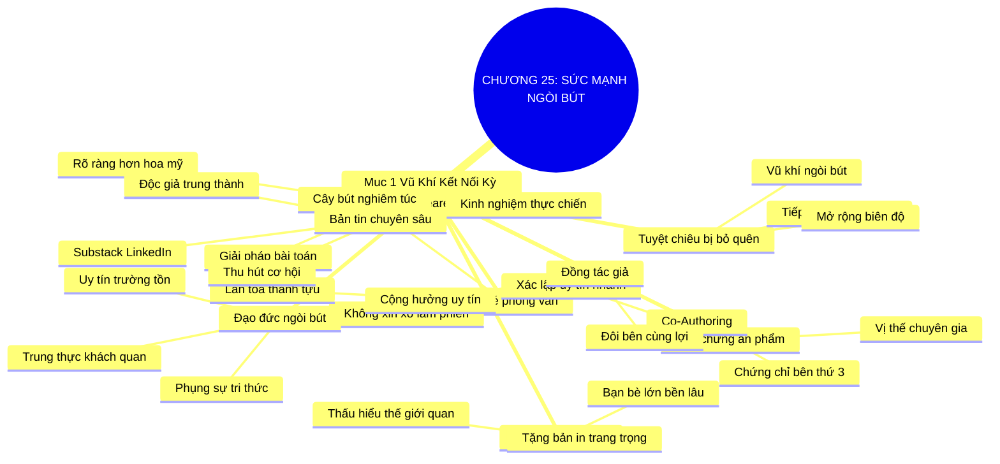

# SƠ ĐỒ TƯ DUY TRỰC QUAN: CHƯƠNG 25: SỨC MẠNH CỦA NGÒI BÚT VÀ VIẾT BÀI CHUYÊN GIA (THE WRITE STUFF)
* **Thuộc phần**: Phần 4: Trao Đổi Và Đền Đáp (Trading Up and Giving Back)
* **Tác phẩm**: Đừng Bao Giờ Đi Ăn Một Mình (Never Eat Alone) - Keith Ferrazzi
* **Chuẩn hóa**: Document Structure-Anchored v2.4 (Không nhãn meta thừa, phản ánh 100% cấu trúc tài liệu)

---

## 🌳 SƠ ĐỒ TƯ DUY MERMAID (4-5 TẦNG CHI TIẾT)

---

## 🧬 BẢNG PHÂN CẤP TRUY HỒI CHỦ ĐỘNG (ACTIVE RECALL HIERARCHY)
Cấu trúc hóa tri thức theo các nhánh tài liệu phục vụ ôn tập nhanh và khắc sâu trí nhớ:

| 📑 Nhánh Mục Tài Liệu | 🔑 Từ Khóa Vàng / Khái Niệm | 📝 Nội Dung Truy Hồi Chủ Động (Active Recall) |
| :--- | :--- | :--- |
| Mục 1: Vũ Khí Kết Nối Kỳ Diệu Dành Cho Bạn | **Tuyệt chiêu bị bỏ quên** | Viết bài chuyên môn là vũ khí mạnh nhất để mở toang cánh cửa tiếp cận các nhân vật quyền lực. |
| Mục 1: Vũ Khí Kết Nối Kỳ Diệu Dành Cho Bạn | **Xóa bẫy Shakespeare** | Không cần hoa mỹ; độc giả kinh doanh tìm kiếm sự rõ ràng, bài học thực tế và giải pháp cụ thể. |
| Mục 1: Vũ Khí Kết Nối Kỳ Diệu Dành Cho Bạn | **Chiếc vé phỏng vấn** | Đề nghị phỏng vấn biến bạn từ kẻ làm phiền thành người giúp họ lan tỏa thành tựu đến công chúng. |
| Mục 1: Vũ Khí Kết Nối Kỳ Diệu Dành Cho Bạn | **Chuyển hóa tri kỷ** | Cuộc phỏng vấn là cầu nối thấu hiểu sâu sắc; tặng bản in sau đó giúp tạo dựng tình bạn lâu dài. |
| Mục 1: Vũ Khí Kết Nối Kỳ Diệu Dành Cho Bạn | **Đồng tác giả chiến lược** | Viết chung bài với các chuyên gia đầu ngành giúp cộng hưởng uy tín và nguồn lực tri thức. |
| Mục 1: Vũ Khí Kết Nối Kỳ Diệu Dành Cho Bạn | **Đạo đức ngòi bút** | Giữ vững tính trung thực, khách quan và phụng sự độc giả là nền tảng bảo vệ uy tín bền vững. |

---

## ⚡ BẢNG NEO TRÍ NHỚ NHANH (MEMORY ANCHOR CHEAT SHEET)
Tóm tắt cô đọng các công thức và quy tắc hành động của chương:

| 📑 Phần/Mục Tài Liệu | 📌 Khái Niệm Cốt Lõi | ⚖️ Nguyên Lý Vàng | 🚀 Hành Động Chuyển Hóa Ngay |
| :--- | :--- | :--- | :--- |
| Mục 1: Sức mạnh ngòi bút | **Chiếc vé phỏng vấn** | Đề nghị phỏng vấn nhân vật lớn cho bài viết | Tiếp cận những người bận rộn nhất |
| Mục 1: Sức mạnh ngòi bút | **Xóa bẫy Shakespeare** | Tập trung chia sẻ giải pháp và kinh nghiệm thực | Viết đơn giản, súc tích và giá trị |
| Mục 1: Sức mạnh ngòi bút | **Đồng tác giả** | Viết chung bài với các chuyên gia uy tín | Nhân đôi tầm ảnh hưởng chuyên môn |
| Mục 1: Sức mạnh ngòi bút | **Chuyển hóa tri kỷ** | Gửi tặng bản in trang trọng sau phỏng vấn | Biến nhân vật phỏng vấn thành bạn tri kỷ |

