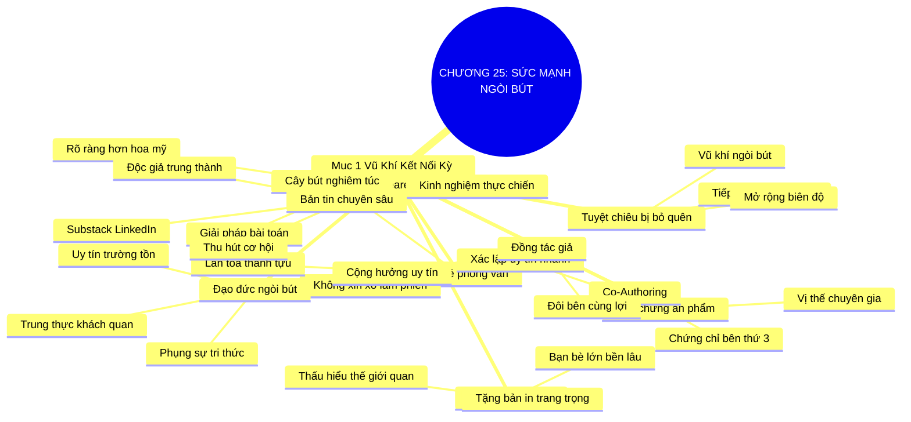

# TÓM TẮT CHƯƠNG SÁCH: CHƯƠNG 25: SỨC MẠNH CỦA NGÒI BÚT VÀ VIẾT BÀI CHUYÊN GIA (THE WRITE STUFF)
* **Thuộc phần**: Phần 4: Trao Đổi Và Đền Đáp (Trading Up and Giving Back)
* **Tác giả**: Keith Ferrazzi (với Tahl Raz)
* **Chuẩn hóa cấu trúc**: Document Structure-Anchored v2.4

---

## 🌟 THÔNG ĐIỆP CỐT LÕI (CORE MESSAGE)
> Vũ khí kết nối tối thượng mở mọi cánh cửa: Viết bài phân tích chuyên ngành hoặc phỏng vấn nhân vật lớn biến bạn từ kẻ xa lạ làm phiền thành đối tác truyền thông nghiêm túc, tạo dựng vị thế ngang hàng với người dẫn đầu.

---

## 📊 LƯỢC ĐỒ PHÂN BỔ CẤU TRÚC TÀI LIỆU
Bảng đối chiếu tỷ lệ và cấu trúc luận điểm bám sát các đề mục thực tế trong tài liệu:

| 📑 Đề Mục Trong Tài Liệu Gốc | 🎯 Số Lượng Luận Điểm Chuyên Sâu |
| :--- | :---: |
| Mục 1: Vũ Khí Kết Nối Kỳ Diệu Dành Cho Bạn (The Write Stuff) | 8 |
| **Tổng cộng toàn chương** | **8 Luận Điểm** |

---

## 💡 HỆ THỐNG LUẬN ĐIỂM QUAN TRỌNG (KEY TAKEAWAYS)

#### 📑 PHẦN: MỤC 1: VŨ KHÍ KẾT NỐI KỲ DIỆU DÀNH CHO BẠN (THE WRITE STUFF)

##### 1. Kỹ năng viết: Tuyệt chiêu kết nối mạng lưới thường bị bỏ quên
* **Phân Tích Chuyên Sâu**: Viết lách là một trong những vũ khí xây dựng mạng lưới có sức mạnh phi thường nhất nhưng lại ít được tận dụng đúng mức. Bằng cách diễn đạt tư duy chuyên môn thành ngôn từ trên các trang báo hay tạp chí chuyên ngành, bạn có thể tiếp cận được gần như bất kỳ nhân vật quyền lực nào trên thế giới.
* **Công Cụ / Phương Pháp Đi Kèm**: Vũ khí ngòi bút kết nối (The Writing Superweapon), Mở rộng biên độ tiếp cận.
* **Ví Dụ Thực Tế Ứng Dụng**: Keith Ferrazzi thường xuyên viết bài cho Harvard Business Review và Inc. Magazine để tiếp cận và phỏng vấn các CEO tập đoàn lớn.

##### 2. Xóa bỏ rào cản tâm lý 'Tôi không phải là Shakespeare'
* **Phân Tích Chuyên Sâu**: Bạn không cần phải là một đại thi hào hay nhà văn đạt giải văn học để viết bài chuyên môn. Trong thế giới kinh doanh hiện đại, độc giả không tìm kiếm sự hoa mỹ câu từ; họ tìm kiếm những góc nhìn thực tế, những bài học kinh nghiệm chân thực và những giải pháp cụ thể cho bài toán nghề nghiệp.
* **Công Cụ / Phương Pháp Đi Kèm**: Giải tỏa áp lực viết lách (Practical Business Writing Mindset: Rõ ràng > Hoa mỹ).
* **Ví Dụ Thực Tế Ứng Dụng**: Viết một bài chia sẻ ngắn 1.000 từ về cách tối ưu hóa chi phí quảng cáo số dựa trên kinh nghiệm thực chiến của cá nhân.

##### 3. Chiếc vé thông hành phỏng vấn: Chuyển đổi vị thế tiếp cận
* **Phân Tích Chuyên Sâu**: Khi bạn gọi điện cho một nhân vật nổi tiếng để xin gặp uống cà phê, họ có thể từ chối vì quá bận. Nhưng khi bạn liên hệ với tư cách là một cây bút muốn phỏng vấn họ cho một bài viết trên tạp chí uy tín, họ sẽ nhìn nhận bạn như một người đang giúp họ lan tỏa thành tựu và thông điệp đến công chúng. Cánh cửa lập tức mở toang.
* **Công Cụ / Phương Pháp Đi Kèm**: Chiến lược phỏng vấn nhân vật lớn (The Interview Access Strategy).
* **Ví Dụ Thực Tế Ứng Dụng**: 'Chào anh David, tôi đang thực hiện loạt bài viết cho tạp chí Diễn đàn Doanh nghiệp về tương lai ngành bán lẻ và rất mong được phỏng vấn anh 20 phút...'

##### 4. Xác lập sự hiện diện uy tín tức thì trên thương trường
* **Phân Tích Chuyên Sâu**: Một bài viết được đăng trên một ấn phẩm chuyên môn danh tiếng đóng vai trò như một chứng chỉ bảo đảm năng lực của bên thứ ba. Nó nâng tầm vị thế của bạn từ một người làm nghề vô danh thành một chuyên gia có tiếng nói được xã hội công nhận.
* **Công Cụ / Phương Pháp Đi Kèm**: Bảo chứng uy tín bằng ấn phẩm (Third-Party Editorial Validation).
* **Ví Dụ Thực Tế Ứng Dụng**: Đính kèm đường link bài viết phân tích trên báo Đầu Tư vào hồ sơ năng lực gửi khách hàng lớn.

##### 5. Từ cuộc phỏng vấn thuần túy sang mối quan hệ tri kỷ bền vững
* **Phân Tích Chuyên Sâu**: Cuộc phỏng vấn 30 phút là cơ hội vàng để bạn thấu hiểu sâu sắc thế giới quan của nhân vật lớn, lắng nghe trăn trở của họ và tìm ra điểm chung cảm xúc. Sau khi bài viết xuất bản, việc gửi tặng họ bản in trang trọng kèm lời cảm ơn chân thành sẽ biến họ thành một người bạn lớn trong mạng lưới của bạn.
* **Công Cụ / Phương Pháp Đi Kèm**: Quy trình chuyển hóa phỏng vấn thành quan hệ (Interview-to-Relationship Pipeline).
* **Ví Dụ Thực Tế Ứng Dụng**: Gửi một bản in đóng khung bài phỏng vấn trang trọng đến văn phòng của vị CEO kèm bức thư tay tri ân sâu sắc.

##### 6. Kỹ thuật đồng tác giả (Co-Authoring) cùng các chuyên gia đầu ngành
* **Phân Tích Chuyên Sâu**: Một chiến lược đỉnh cao là đề xuất viết chung bài viết với một giáo sư đại học hoặc một lãnh đạo cấp cao: Bạn đảm nhận phần nghiên cứu dữ liệu và soạn thảo khung nội dung, còn họ đóng góp góc nhìn chiến lược và tên tuổi bảo chứng. Cả hai bên đều cùng có lợi.
* **Công Cụ / Phương Pháp Đi Kèm**: Mô hình đồng tác giả chiến lược (Co-Authoring Synergy).
* **Ví Dụ Thực Tế Ứng Dụng**: Hợp tác với một chuyên gia kinh tế đầu ngành viết bài phân tích chính sách tiền tệ công bố trên tạp chí viện nghiên cứu.

##### 7. Tận dụng sự bùng nổ của truyền thông số và bản tin chuyên sâu (Newsletter)
* **Phân Tích Chuyên Sâu**: Ngày nay, bạn không cần phải đợi các tòa soạn phê duyệt; bạn có thể tự mình xuất bản bản tin chuyên sâu trên Substack, LinkedIn Articles hoặc Medium. Một bản tin định kỳ chất lượng cao sẽ tích lũy hàng ngàn độc giả trung thành và biến bạn thành trung tâm thu hút cơ hội.
* **Công Cụ / Phương Pháp Đi Kèm**: Bản tin chuyên môn cá nhân (Personal Thought Leadership Newsletter).
* **Ví Dụ Thực Tế Ứng Dụng**: Xây dựng bản tin email hàng tuần gửi cho 2.000 chuyên gia trong ngành chia sẻ các xu hướng công nghệ mới.

##### 8. Nguyên tắc phụng sự độc giả và đạo đức nghề bút
* **Phân Tích Chuyên Sâu**: Viết bài để kết nối không có nghĩa là viết những bài tâng bốc nịnh nọt rẻ tiền. Giá trị của ngòi bút nằm ở sự trung thực, khách quan và phụng sự lợi ích tri thức của độc giả. Giữ vững đạo đức ngòi bút là cách duy nhất để duy trì uy tín lâu dài.
* **Công Cụ / Phương Pháp Đi Kèm**: Chuẩn mực đạo đức ngòi bút (Journalistic Integrity & Reader-First Value).
* **Ví Dụ Thực Tế Ứng Dụng**: Luôn trích dẫn nguồn dữ liệu minh bạch và phân tích đa chiều cả cơ hội lẫn rủi ro trong bài viết.

---

## 🎯 KẾ HOẠCH HÀNH ĐỘNG TOÀN DIỆN (ACTION PLAN)
### ⚡ Cấp độ 1: Thói quen vi mô (Micro-habits < 2 phút mỗi ngày)
- [ ] Viết một bài viết chuyên môn 800 từ chia sẻ 1 bài học thực tế trong công việc tuần này
- [ ] Đăng tải bài viết lên LinkedIn Articles hoặc trang mạng xã hội chuyên môn của bạn
- [ ] Lên danh sách 3 nhân vật cấp cao trong ngành mà bạn muốn phỏng vấn viết bài
- [ ] Soạn email xin phỏng vấn 20 phút với góc tiếp cận là đưa họ lên bài báo chuyên môn
- [ ] Tìm hiểu các chuyên mục đóng góp ý kiến (Op-Ed/Contributed Articles) của 2 tạp chí ngành

### 📅 Cấp độ 2: Thói quen tuần & Dự án ngắn hạn (Weekly Habits)
- [ ] Gửi một đề xuất ý tưởng bài viết (Pitch) đến ban biên tập một trang tin kinh tế uy tín
- [ ] Gửi đường link bài viết của bạn cho 5 đối tác quan trọng kèm lời chúc ngắn gọn
- [ ] Đóng khung trang trọng bài viết đã xuất bản để gửi tặng nhân vật được phỏng vấn
- [ ] Thiết lập bản tin định kỳ hàng tháng (Newsletter) để duy trì kết nối với mạng lưới
- [ ] Đề xuất viết chung một bài nghiên cứu với một chuyên gia hoặc cấp trên của bạn

### 🚀 Cấp độ 3: Chiến lược chuyển hóa dài hạn (Long-term Strategy)
- [ ] Đọc các bài viết trên Harvard Business Review để học cách cấu trúc luận điểm mạch lạc
- [ ] Rèn luyện thói quen viết ít nhất 200 từ mỗi ngày vào cuốn sổ tay tư duy
- [ ] Tuyệt đối tránh viết những bài viết PR sáo rỗng chỉ toàn khen ngợi vô căn cứ
- [ ] Lắng nghe phản hồi của độc giả để liên tục cải thiện văn phong và góc nhìn
- [ ] Lưu giữ tất cả các bài viết đã xuất bản vào một trang Portfolio trực tuyến cá nhân

---

## ❓ BỘ CÂU HỎI TỰ VẤN & PHẢN TƯ SUY NGẪM (REFLECTION QUESTIONS)
### Nhóm 1: Nhận thức thực tại & Thói quen hiện tại
1. Lần gần nhất bạn viết và xuất bản một bài viết chia sẻ quan điểm chuyên môn là khi nào?
2. Nỗi sợ hãi lớn nhất ngăn cản bạn cầm bút viết bài chuyên ngành là gì?
3. Tại sao một lời đề nghị phỏng vấn viết bài lại dễ dàng được các nhân vật lớn chấp nhận hơn là xin gặp cà phê?
4. Cảm giác của bạn thế nào khi nhìn thấy tên mình xuất hiện trên một ấn phẩm báo chí uy tín?
5. Làm thế nào để chuyển hóa một cuộc phỏng vấn công việc thành một mối quan hệ bạn bè tri kỷ?

### Nhóm 2: Thách thức tâm lý & Rào cản nội tâm
6. Bạn có nghĩ rằng khả năng viết lách tốt là điều kiện bắt buộc để trở thành một nhà lãnh đạo xuất chúng?
7. Những chủ đề nào trong ngành của bạn hiện tại đang thiếu những bài phân tích sâu sắc?
8. Một bài viết đồng tác giả với một nhân vật tên tuổi có thể nâng tầm uy tín của bạn ra sao?
9. Sự khác biệt giữa một bài viết PR thương mại lộ liễu và một bài viết chia sẻ tri thức thực thụ là gì?
10. Bạn có đang duy trì một bản tin (newsletter) chuyên môn nào cho mạng lưới bạn bè không?

### Nhóm 3: Chiến lược hành động & Ứng dụng thực tế
11. Khi một nhân vật quyền lực đồng ý trả lời phỏng vấn, bạn chuẩn bị những câu hỏi gì để gây ấn tượng?
12. Làm sao để việc viết lách trở thành một niềm vui sáng tạo thay vì một nghĩa vụ áp lực?
13. Văn phong viết của bạn đã thực sự rõ ràng, gãy gọn và hướng tới lợi ích của độc giả chưa?
14. Bạn xử lý thế nào nếu bài viết của bạn bị ban biên tập từ chối hoặc yêu cầu sửa đổi nhiều lần?
15. Một bài viết xuất sắc của người khác từng truyền cảm hứng mạnh mẽ nhất cho bạn là gì?

### Nhóm 4: Chuyển hóa tư duy & Tầm nhìn dài hạn
16. Tại sao việc tặng bản in trang trọng sau phỏng vấn lại là một hành động ngoại giao đỉnh cao?
17. Làm thế nào để duy trì sự trung thực và tính khách quan trong các bài phân tích ngành?
18. Việc viết lách thường xuyên giúp bộ não của bạn cấu trúc lại tư duy kinh doanh như thế nào?
19. Bạn có tin rằng ngòi bút có thể đưa bạn bước vào những văn phòng quyền lực nhất thế giới?
20. Đề tài bài viết đầu tiên bạn sẽ bắt tay vào phác thảo dàn ý trong tối nay là gì?

---

## 🧠 SƠ ĐỒ TƯ DUY TRỰC QUAN (MINDMAP)

