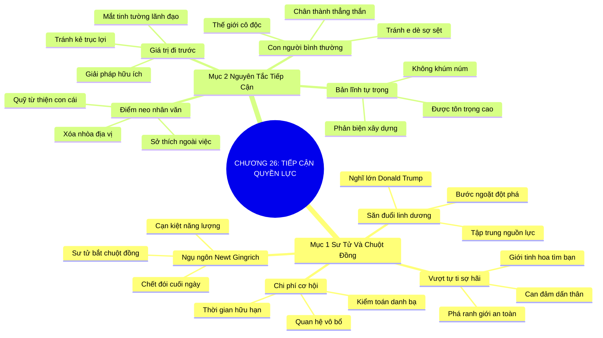

# SƠ ĐỒ TƯ DUY TRỰC QUAN: CHƯƠNG 26: TIẾP CẬN TẦNG LỚP QUYỀN LỰC (GETTING CLOSE TO POWER)
* **Thuộc phần**: Phần 4: Trao Đổi Và Đền Đáp (Trading Up and Giving Back)
* **Tác phẩm**: Đừng Bao Giờ Đi Ăn Một Mình (Never Eat Alone) - Keith Ferrazzi
* **Chuẩn hóa**: Document Structure-Anchored v2.4 (Không nhãn meta thừa, phản ánh 100% cấu trúc tài liệu)

---

## 🌳 SƠ ĐỒ TƯ DUY MERMAID (4-5 TẦNG CHI TIẾT)

---

## 🧬 BẢNG PHÂN CẤP TRUY HỒI CHỦ ĐỘNG (ACTIVE RECALL HIERARCHY)
Cấu trúc hóa tri thức theo các nhánh tài liệu phục vụ ôn tập nhanh và khắc sâu trí nhớ:

| 📑 Nhánh Mục Tài Liệu | 🔑 Từ Khóa Vàng / Khái Niệm | 📝 Nội Dung Truy Hồi Chủ Động (Active Recall) |
| :--- | :--- | :--- |
| Mục 1: Bài Học Chú Sư Tử Và Chú Chuột Đồng | **Ngụ ngôn chuột đồng** | Săn chuột đồng sẽ làm sư tử kiệt sức và chết đói; bắt buộc phải săn linh dương lớn để tồn tại. |
| Mục 1: Bài Học Chú Sư Tử Và Chú Chuột Đồng | **Tư duy nghĩ lớn** | Can đảm hướng tới những nhân vật có tầm ảnh hưởng lớn để tạo bước ngoặt đột phá cho sự nghiệp. |
| Mục 1: Bài Học Chú Sư Tử Và Chú Chuột Đồng | **Kiểm toán chi phí cơ hội** | Cắt giảm các cuộc gặp gỡ vô bổ an toàn để tập trung nguồn lực theo đuổi cơ hội chiến lược. |
| Mục 2: Nguyên Tắc Tiếp Cận Lãnh Đạo Đỉnh Cao | **Con người bình thường** | Người quyền lực khao khát những cuộc trò chuyện bình dị, chân thành trong thế giới cô độc của họ. |
| Mục 2: Nguyên Tắc Tiếp Cận Lãnh Đạo Đỉnh Cao | **Điểm neo nhân văn** | Kết nối qua sở thích ngoài công việc và mối quan tâm gia đình để xóa bỏ khoảng cách địa vị. |
| Mục 2: Nguyên Tắc Tiếp Cận Lãnh Đạo Đỉnh Cao | **Giá trị đi trước & Tự trọng** | Luôn mang lại giải pháp trước khi nhờ vả và giữ vững phong thái tự trọng, không khúm núm. |

---

## ⚡ BẢNG NEO TRÍ NHỚ NHANH (MEMORY ANCHOR CHEAT SHEET)
Tóm tắt cô đọng các công thức và quy tắc hành động của chương:

| 📑 Phần/Mục Tài Liệu | 📌 Khái Niệm Cốt Lõi | ⚖️ Nguyên Lý Vàng | 🚀 Hành Động Chuyển Hóa Ngay |
| :--- | :--- | :--- | :--- |
| Mục 1: Sư tử và chuột đồng | **Săn linh dương lớn** | Tập trung năng lượng vào các mối quan hệ đột phá | Ngừng lãng phí thời gian vào quan hệ vụn vặt |
| Mục 1: Sư tử và chuột đồng | **Vượt nỗi sợ quyền lực** | Tự tin bước ra khỏi vùng an toàn tâm lý | Định vị bản thân ngang hàng với cơ hội lớn |
| Mục 2: Nguyên tắc tiếp cận | **Con người bình thường** | Đối xử ấm áp, chân thành không e dè | Chạm vào thế giới cô độc của người quyền lực |
| Mục 2: Nguyên tắc tiếp cận | **Giá trị đi trước** | Mang giải pháp hữu ích trước khi xin giúp đỡ | Xây dựng sự tin cậy và tôn trọng bền lâu |

