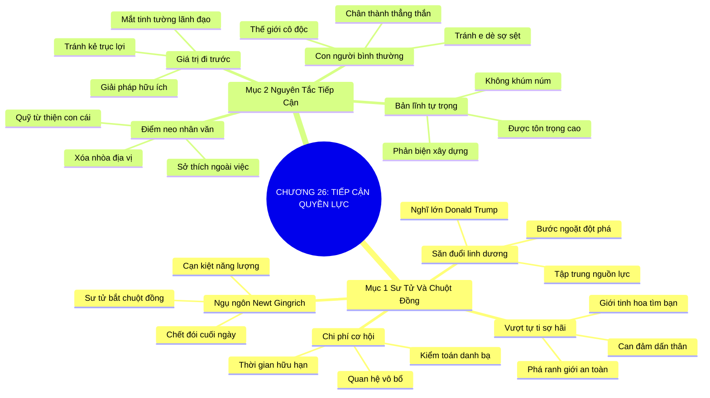

# TÓM TẮT CHƯƠNG SÁCH: CHƯƠNG 26: TIẾP CẬN TẦNG LỚP QUYỀN LỰC (GETTING CLOSE TO POWER)
* **Thuộc phần**: Phần 4: Trao Đổi Và Đền Đáp (Trading Up and Giving Back)
* **Tác giả**: Keith Ferrazzi (với Tahl Raz)
* **Chuẩn hóa cấu trúc**: Document Structure-Anchored v2.4

---

## 🌟 THÔNG ĐIỆP CỐT LÕI (CORE MESSAGE)
> Săn đuổi linh dương thay vì bắt chuột đồng: Can đảm hướng tới những nhân vật có tầm ảnh hưởng lớn nhất, đối xử với họ như con người bình thường và mang lại giá trị trước khi nhờ vả sẽ mở rộng vòng tay đón nhận bạn vào giới tinh hoa.

---

## 📊 LƯỢC ĐỒ PHÂN BỔ CẤU TRÚC TÀI LIỆU
Bảng đối chiếu tỷ lệ và cấu trúc luận điểm bám sát các đề mục thực tế trong tài liệu:

| 📑 Đề Mục Trong Tài Liệu Gốc | 🎯 Số Lượng Luận Điểm Chuyên Sâu |
| :--- | :---: |
| Mục 1: Bài Học Về Chú Sư Tử Và Chú Chuột Đồng | 4 |
| Mục 2: Nguyên Tắc Tiếp Cận Những Nhà Lãnh Đạo Đỉnh Cao | 4 |
| **Tổng cộng toàn chương** | **8 Luận Điểm** |

---

## 💡 HỆ THỐNG LUẬN ĐIỂM QUAN TRỌNG (KEY TAKEAWAYS)

#### 📑 PHẦN: MỤC 1: BÀI HỌC VỀ CHÚ SƯ TỬ VÀ CHÚ CHUỘT ĐỒNG

##### 1. Ngụ ngôn sâu sắc về chú sư tử và chú chuột đồng
* **Phân Tích Chuyên Sâu**: Chính trị gia Newt Gingrich từng chia sẻ ngụ ngôn: Sư tử có thể dễ dàng bắt chuột đồng suốt ngày, nhưng cuối ngày nó vẫn sẽ chết đói vì calo thu được từ chuột đồng không đủ bù đắp năng lượng đã bỏ ra. Sư tử bắt buộc phải săn đuổi những chú linh dương to lớn. Trong sự nghiệp, nếu bạn chỉ lãng phí thời gian và tuổi trẻ vào những mối quan hệ vụn vặt an toàn, bạn sẽ không bao giờ bứt phá được.
* **Công Cụ / Phương Pháp Đi Kèm**: Ngụ ngôn Sư tử và Chuột đồng (The Lion and Field Mice Parable - Newt Gingrich), Tối ưu hóa năng lượng chiến lược.
* **Ví Dụ Thực Tế Ứng Dụng**: Dành 80% thời gian xây dựng quan hệ với các lãnh đạo cấp cao thay vì giao lưu hời hợt với hàng trăm người không có tiếng nói quyết định.

##### 2. Tư duy nghĩ lớn để tạo bước ngoặt đột phá
* **Phân Tích Chuyên Sâu**: Đúng như tỷ phú Donald Trump từng nói: 'Đã mất công nghĩ, tại sao không nghĩ lớn?'. Việc tiếp cận một nhân vật tầm cỡ đòi hỏi sự chuẩn bị công phu tương đương, nhưng giá trị và bước ngoặt mà họ có thể mang lại cho cuộc đời và tổ chức của bạn thì lớn gấp hàng ngàn lần so với những tiếp xúc thông thường.
* **Công Cụ / Phương Pháp Đi Kèm**: Tư duy nghĩ lớn đột phá (Thinking Big Framework - Donald Trump Quote).
* **Ví Dụ Thực Tế Ứng Dụng**: Mạnh dạn gửi thư đề xuất hợp tác chiến lược lên Chủ tịch tập đoàn thay vì chỉ gặp nhân viên cấp dưới.

##### 3. Vượt qua hội chứng tự ti và ranh giới an toàn tâm lý
* **Phân Tích Chuyên Sâu**: Hầu hết mọi người tự giam mình trong 'vùng an toàn' vì nỗi sợ hãi vô căn cứ trước quyền lực. Họ nghĩ rằng những nhân vật lớn không bao giờ để mắt tới mình. Sự thật là giới tinh hoa luôn tìm kiếm những con người can đảm, tài năng và có tinh thần dấn thân để đồng hành.
* **Công Cụ / Phương Pháp Đi Kèm**: Phá vỡ hội chứng tự ti trước quyền lực (Overcoming Power Intimidation Complex).
* **Ví Dụ Thực Tế Ứng Dụng**: Chủ động bước tới chào hỏi và bắt tay một vị bộ trưởng tại hội nghị với phong thái đĩnh đạc và tự tin.

##### 4. Chi phí cơ hội của việc giao lưu thiếu mục tiêu
* **Phân Tích Chuyên Sâu**: Thời gian và năng lượng cảm xúc của mỗi người là hữu hạn. Việc tham gia vô số các buổi gặp gỡ vô bổ với những 'chú chuột đồng' sẽ làm cạn kiệt nguồn lực của bạn, khiến bạn không còn đủ sức lực để theo đuổi những cơ hội 'linh dương' đổi đời.
* **Công Cụ / Phương Pháp Đi Kèm**: Kiểm toán chi phí cơ hội quan hệ (Relationship Opportunity Cost Audit).
* **Ví Dụ Thực Tế Ứng Dụng**: Cắt giảm 5 buổi nhậu vô bổ mỗi tháng để tập trung chuẩn bị cho 1 buổi gặp gỡ đối tác chiến lược.

#### 📑 PHẦN: MỤC 2: NGUYÊN TẮC TIẾP CẬN NHỮNG NHÀ LÃNH ĐẠO ĐỈNH CAO

##### 5. Quy tắc 1: Đối xử với họ như những con người bình thường
* **Phân Tích Chuyên Sâu**: Những người quyền lực nhất thường phải sống trong một thế giới cô độc, nơi mọi người xung quanh luôn nhìn họ bằng ánh mắt e dè sợ sệt hoặc toan tính vụ lợi. Điều họ khao khát nhất chính là những cuộc trò chuyện chân thành, thẳng thắn và không toan tính từ những người bạn thực thụ dám nói thật.
* **Công Cụ / Phương Pháp Đi Kèm**: Đối xử bình đẳng nhân văn (Normalcy Protocol: Xem người quyền lực là con người bằng xương bằng thịt).
* **Ví Dụ Thực Tế Ứng Dụng**: Trò chuyện cởi mở về sở thích gia đình, thể thao với một tỷ phú thay vì run rẩy ca ngợi tài sản của họ.

##### 6. Quy tắc 2: Tìm hiểu sâu sắc mối quan tâm cá nhân ngoài công việc
* **Phân Tích Chuyên Sâu**: Họ có đam mê một quỹ từ thiện bảo vệ trẻ em không? Họ có thích chơi golf hay sưu tầm tranh không? Họ có trăn trở về việc học của con cái không? Khi bạn kết nối với họ trên nền tảng của các giá trị nhân văn và sở thích chung, khoảng cách về địa vị xã hội sẽ hoàn toàn biến mất.
* **Công Cụ / Phương Pháp Đi Kèm**: Điểm neo giá trị nhân văn ngoài công việc (Humanitarian & Passion Anchor).
* **Ví Dụ Thực Tế Ứng Dụng**: Gợi chuyện về dự án bảo tồn rừng mà vị chủ tịch tập đoàn đang tài trợ cá nhân trước khi bàn công việc.

##### 7. Quy tắc 3: Luôn mang lại giá trị trước khi nhờ vả
* **Phân Tích Chuyên Sâu**: Những nhà lãnh đạo đỉnh cao có đôi mắt vô cùng tinh tường; họ phát hiện ra một kẻ trục lợi hay kẻ nịnh hót chỉ sau vài giây giao tiếp. Nhưng nếu bạn xuất hiện với tư cách là người mang đến giải pháp giá trị, biết lắng nghe và sẵn lòng giúp họ đạt mục tiêu cao đẹp, họ sẽ dang tay đón nhận bạn.
* **Công Cụ / Phương Pháp Đi Kèm**: Nguyên tắc giá trị đi trước (Value-First Gateway to Power), Bộ lọc chống trục lợi.
* **Ví Dụ Thực Tế Ứng Dụng**: Mang đến một bản báo cáo phân tích rủi ro thị trường hữu ích giúp họ bảo vệ dự án trước khi xin một lời khuyên nghề nghiệp.

##### 8. Bản lĩnh độc lập và giữ vững lòng tự trọng nghề nghiệp
* **Phân Tích Chuyên Sâu**: Đừng bao giờ hạ thấp phẩm giá hay cúi mình khúm núm trước quyền lực. Giới tinh hoa chỉ tôn trọng những người có lòng tự trọng, có bản lĩnh độc lập và dám đưa ra những góc nhìn phản biện xây dựng.
* **Công Cụ / Phương Pháp Đi Kèm**: Bản lĩnh tự trọng chuyên nghiệp (Professional Self-Respect & Constructive Challenge).
* **Ví Dụ Thực Tế Ứng Dụng**: Điềm tĩnh chỉ ra một điểm nghẽn trong chiến lược của tập đoàn mà cấp dưới không dám nói thật với tổng giám đốc.

---

## 🎯 KẾ HOẠCH HÀNH ĐỘNG TOÀN DIỆN (ACTION PLAN)
### ⚡ Cấp độ 1: Thói quen vi mô (Micro-habits < 2 phút mỗi ngày)
- [ ] Xác định 1 'chú linh dương' mục tiêu: nhân vật quyền lực có thể tạo đột phá cho bạn
- [ ] Cắt giảm ít nhất 3 cuộc gặp gỡ vô bổ, không mang lại giá trị trong tuần tới
- [ ] Nghiên cứu kỹ lưỡng về các hoạt động từ thiện và sở thích của nhân vật mục tiêu
- [ ] Chuẩn bị một giải pháp hoặc thông tin giá trị độc quyền để gửi tặng họ trước
- [ ] Luyện tập phong thái giao tiếp điềm tĩnh, đĩnh đạc và tự tin trước gương

### 📅 Cấp độ 2: Thói quen tuần & Dự án ngắn hạn (Weekly Habits)
- [ ] Tuyệt đối tránh thái độ nịnh hót sáo rỗng hoặc khúm núm khi gặp lãnh đạo lớn
- [ ] Trò chuyện với nhân vật quyền lực về những chủ đề đời thường bình dị (gia đình, thể thao)
- [ ] Đọc cuốn sách về tư duy nghĩ lớn để nâng cấp tầm nhìn chiến lược của bản thân
- [ ] Tìm kiếm người bạn chung uy tín để bắc cầu giới thiệu đến nhân vật quyền lực
- [ ] Giữ vững lòng tự trọng và can đảm đưa ra ý kiến phản biện trung thực khi được hỏi

### 🚀 Cấp độ 3: Chiến lược chuyển hóa dài hạn (Long-term Strategy)
- [ ] Gửi lời chúc mừng ngắn gọn, lịch thiệp khi nhân vật mục tiêu đạt thành tựu mới
- [ ] Không bao giờ vội vàng nhờ vả hay xin xỏ trong những lần tiếp xúc đầu tiên
- [ ] Kiên trì nuôi dưỡng mối quan hệ trên nền tảng phụng sự và đóng góp giá trị lâu dài
- [ ] Tự đánh giá lại danh bạ: Bạn đang dành bao nhiêu thời gian cho 'chuột đồng'?
- [ ] Viết ra kế hoạch tiếp cận nhân vật quyền lực mục tiêu trong vòng 6 tháng tới

---

## ❓ BỘ CÂU HỎI TỰ VẤN & PHẢN TƯ SUY NGẪM (REFLECTION QUESTIONS)
### Nhóm 1: Nhận thức thực tại & Thói quen hiện tại
1. Bạn đang dành bao nhiêu phần trăm năng lượng cho những 'chú chuột đồng' vô bổ?
2. Tại sao câu chuyện ngụ ngôn của Newt Gingrich lại có sức mạnh cảnh tỉnh lớn như vậy?
3. Ai là 'chú linh dương' lớn nhất mà bạn khao khát được kết nối trong sự nghiệp?
4. Nỗi sợ hãi nào khiến bạn ngần ngại tiếp cận những người có vị thế xã hội cao hơn mình?
5. Tại sao những con người quyền lực nhất thế giới lại thường cảm thấy cô độc trong sâu thẳm?

### Nhóm 2: Thách thức tâm lý & Rào cản nội tâm
6. Cảm giác của họ ra sao khi có một người đối xử với họ như một con người bình thường, ấm áp?
7. Những kẻ nịnh hót và trục lợi cơ hội thường bộc lộ những dấu hiệu gì khiến lãnh đạo chán ghét?
8. Bạn có thể mang lại giá trị độc đáo nào cho một nhân vật đã có đầy đủ tiền bạc và quyền lực?
9. Làm sao để giữ vững lòng tự trọng và phong thái đĩnh đạc khi đứng trước tỷ phú hay chính khách?
10. Khi nào là thời điểm phù hợp để đưa ra lời đề nghị giúp đỡ hoặc hợp tác với người quyền lực?

### Nhóm 3: Chiến lược hành động & Ứng dụng thực tế
11. Bạn có dám thẳng thắn chỉ ra một sự thật mất lòng nhưng hữu ích cho một nhà lãnh đạo lớn không?
12. Làm thế nào để tìm ra những sở thích nhân văn chung với một người cách biệt thế hệ và địa vị?
13. Chi phí cơ hội của việc thiếu can đảm 'nghĩ lớn' trong sự nghiệp là gì?
14. Một mối quan hệ với nhân vật tầm cỡ có thể thay đổi vận mệnh của cả một doanh nghiệp ra sao?
15. Tại sao sự kiên trì và lòng trung thành lại là phẩm chất được giới quyền lực trân trọng nhất?

### Nhóm 4: Chuyển hóa tư duy & Tầm nhìn dài hạn
16. Bạn cảm nhận ranh giới giữa sự can đảm dấn thân và sự liều lĩnh thiếu tôn trọng nằm ở đâu?
17. Làm sao để xây dựng chiếc cầu nối trung gian tin cậy đưa bạn đến gặp người quyền lực?
18. Việc phụng sự những mục tiêu cao cả của người dẫn đầu mang lại ý nghĩa gì cho cuộc đời bạn?
19. Tại sao nói: 'Giới tinh hoa luôn khao khát những người bạn chân thành, không toan tính'?
20. Bước đầu tiên bạn sẽ làm trong tuần này để bắt đầu săn đuổi 'chú linh dương' của đời mình là gì?

---

## 🧠 SƠ ĐỒ TƯ DUY TRỰC QUAN (MINDMAP)

