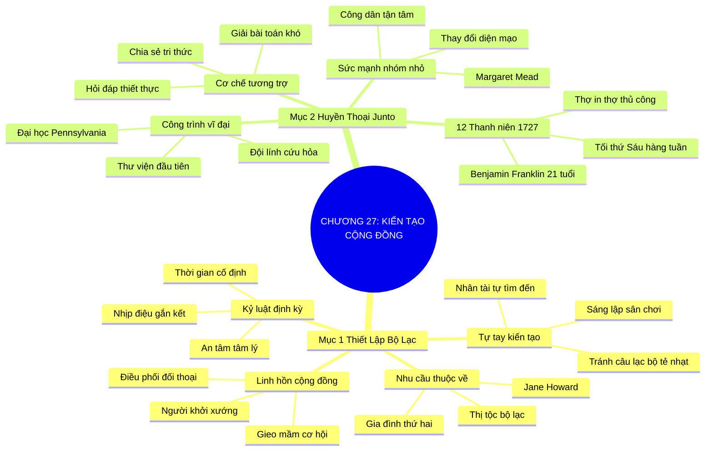

# SƠ ĐỒ TƯ DUY TRỰC QUAN: CHƯƠNG 27: KIẾN TẠO CỘNG ĐỒNG VÀ HỌ SẼ TÌM ĐẾN (BUILD IT AND THEY WILL COME)
* **Thuộc phần**: Phần 4: Trao Đổi Và Đền Đáp (Trading Up and Giving Back)
* **Tác phẩm**: Đừng Bao Giờ Đi Ăn Một Mình (Never Eat Alone) - Keith Ferrazzi
* **Chuẩn hóa**: Document Structure-Anchored v2.4 (Không nhãn meta thừa, phản ánh 100% cấu trúc tài liệu)

---

## 🌳 SƠ ĐỒ TƯ DUY MERMAID (4-5 TẦNG CHI TIẾT)

---

## 🧬 BẢNG PHÂN CẤP TRUY HỒI CHỦ ĐỘNG (ACTIVE RECALL HIERARCHY)
Cấu trúc hóa tri thức theo các nhánh tài liệu phục vụ ôn tập nhanh và khắc sâu trí nhớ:

| 📑 Nhánh Mục Tài Liệu | 🔑 Từ Khóa Vàng / Khái Niệm | 📝 Nội Dung Truy Hồi Chủ Động (Active Recall) |
| :--- | :--- | :--- |
| Mục 1: Tự Tay Thiết Lập Bộ Lạc Của Riêng Bạn | **Nhu cầu thuộc về** | Mọi con người đều khao khát thuộc về một bộ lạc chia sẻ chung giá trị và lý tưởng sống. |
| Mục 1: Tự Tay Thiết Lập Bộ Lạc Của Riêng Bạn | **Tự tay sáng lập** | Nếu không tìm thấy câu lạc bộ phù hợp, hãy tự mình kiến tạo sân chơi để nhân tài tìm đến. |
| Mục 1: Tự Tay Thiết Lập Bộ Lạc Của Riêng Bạn | **Linh hồn cộng đồng** | Người khởi xướng định kỳ nghiễm nhiên trở thành trung tâm điều phối mọi cơ hội và sáng kiến. |
| Mục 2: Bậc Thầy Benjamin Franklin Và Nhóm Junto | **Huyền thoại Junto** | Năm 21 tuổi, Franklin sáng lập nhóm Junto 12 người thợ thủ công sinh hoạt tối thứ Sáu hàng tuần. |
| Mục 2: Bậc Thầy Benjamin Franklin Và Nhóm Junto | **Cơ chế tương trợ** | Thảo luận triết học, đạo đức, kinh doanh và đồng lòng giải quyết khó khăn cho từng thành viên. |
| Mục 2: Bậc Thầy Benjamin Franklin Và Nhóm Junto | **Công trình vĩ đại** | Nhóm Junto nhỏ bé đã khai sinh ra thư viện, cứu hỏa, dân quân và đại học danh tiếng của nước Mỹ. |

---

## ⚡ BẢNG NEO TRÍ NHỚ NHANH (MEMORY ANCHOR CHEAT SHEET)
Tóm tắt cô đọng các công thức và quy tắc hành động của chương:

| 📑 Phần/Mục Tài Liệu | 📌 Khái Niệm Cốt Lõi | ⚖️ Nguyên Lý Vàng | 🚀 Hành Động Chuyển Hóa Ngay |
| :--- | :--- | :--- | :--- |
| Mục 1: Thiết lập bộ lạc | **Tự tay sáng lập** | Tạo ra sân chơi mới thay vì than phiền | Trở thành linh hồn của cộng đồng tinh hoa |
| Mục 1: Thiết lập bộ lạc | **Kỷ luật định kỳ** | Cố định lịch sinh hoạt hàng tuần/tháng | Xây dựng nhịp điệu gắn kết tâm lý sâu sắc |
| Mục 2: Huyền thoại Junto | **Mô hình Junto** | 12 người trẻ cùng chí hướng sinh hoạt đều đặn | Tương trợ lẫn nhau phát triển toàn diện |
| Mục 2: Huyền thoại Junto | **Sức mạnh nhóm nhỏ** | Từ nhóm nhỏ tạo nên các định chế xã hội lớn | Minh chứng cho sức mạnh của sự tâm huyết |

