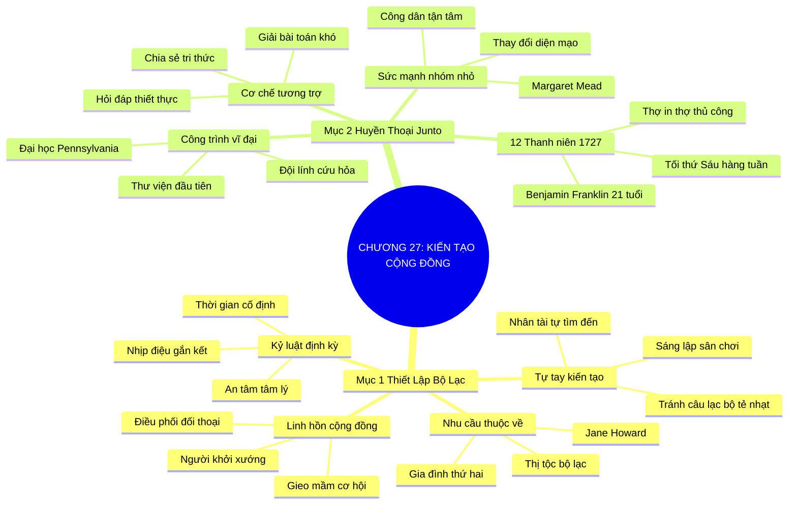

# TÓM TẮT CHƯƠNG SÁCH: CHƯƠNG 27: KIẾN TẠO CỘNG ĐỒNG VÀ HỌ SẼ TÌM ĐẾN (BUILD IT AND THEY WILL COME)
* **Thuộc phần**: Phần 4: Trao Đổi Và Đền Đáp (Trading Up and Giving Back)
* **Tác giả**: Keith Ferrazzi (với Tahl Raz)
* **Chuẩn hóa cấu trúc**: Document Structure-Anchored v2.4

---

## 🌟 THÔNG ĐIỆP CỐT LÕI (CORE MESSAGE)
> Tự tay thiết lập bộ lạc và sân chơi của riêng mình: Nếu không tìm thấy câu lạc bộ phù hợp, hãy tự mình sáng lập như Benjamin Franklin với nhóm Junto huyền thoại 12 thành viên để quy tụ nhân tài và làm thay đổi diện mạo cả một xã hội.

---

## 📊 LƯỢC ĐỒ PHÂN BỔ CẤU TRÚC TÀI LIỆU
Bảng đối chiếu tỷ lệ và cấu trúc luận điểm bám sát các đề mục thực tế trong tài liệu:

| 📑 Đề Mục Trong Tài Liệu Gốc | 🎯 Số Lượng Luận Điểm Chuyên Sâu |
| :--- | :---: |
| Mục 1: Tự Tay Thiết Lập Bộ Lạc Và Hội Nhóm Của Riêng Bạn | 4 |
| Mục 2: Đại Sảnh Danh Vọng Kết Nối: Bậc Thầy Benjamin Franklin Và Câu Lạc Bộ Junto | 4 |
| **Tổng cộng toàn chương** | **8 Luận Điểm** |

---

## 💡 HỆ THỐNG LUẬN ĐIỂM QUAN TRỌNG (KEY TAKEAWAYS)

#### 📑 PHẦN: MỤC 1: TỰ TAY THIẾT LẬP BỘ LẠC VÀ HỘI NHÓM CỦA RIÊNG BẠN

##### 1. Nhu cầu căn bản về một 'bộ lạc' thuộc về mình
* **Phân Tích Chuyên Sâu**: Dù bạn gọi đó là thị tộc, bộ lạc, mạng lưới hay gia đình thứ hai, mọi con người đều có nhu cầu tâm lý sâu sắc thuộc về một cộng đồng chia sẻ chung hệ giá trị. Quy tụ những bộ óc xuất chúng cùng chí hướng là điều có sức mạnh cộng hưởng to lớn nhất để vượt qua những khó khăn của cuộc đời.
* **Công Cụ / Phương Pháp Đi Kèm**: Lý thuyết bộ lạc xã hội (Tribal Belonging Theory - Jane Howard Quote), Nhu cầu gắn kết tâm lý.
* **Ví Dụ Thực Tế Ứng Dụng**: Tìm kiếm những người bạn cùng chung khát vọng khởi nghiệp để thành lập nhóm hỗ trợ vượt qua khủng hoảng.

##### 2. Sự tẻ nhạt của các câu lạc bộ sẵn có và tinh thần tự khởi tạo
* **Phân Tích Chuyên Sâu**: Phần lớn các hội quán truyền thống thường quá cứng nhắc, mang nặng tính hình thức đối phó hoặc không phản ánh đúng ngọn lửa nhiệt huyết của bạn. Thay vì ngồi than vãn hay gượng ép tham gia, giải pháp tối thượng là tự tay sáng lập ra câu lạc bộ của riêng bạn: 'Hãy kiến tạo sân chơi, và những con người tài năng nhất sẽ tự động tìm đến'.
* **Công Cụ / Phương Pháp Đi Kèm**: Tư duy nhà kiến tạo cộng đồng (The Community Founder Mindset), Sáng lập sân chơi mới.
* **Ví Dụ Thực Tế Ứng Dụng**: Keith Ferrazzi không tìm thấy câu lạc bộ doanh nhân cởi mở nên đã tự tổ chức các buổi gặp gỡ tối tại nhà riêng.

##### 3. Vị thế linh hồn và người điều phối cộng đồng
* **Phân Tích Chuyên Sâu**: Khi bạn là người đứng ra khởi xướng và tổ chức định kỳ, bạn nghiễm nhiên trở thành 'linh hồn' của bộ lạc đó. Bạn điều phối các cuộc trò chuyện, kết nối các thành viên và tạo ra bầu không khí chân tình. Mọi cơ hội kinh doanh và ý tưởng đột phá sẽ tự nhiên nảy mầm ngay trên mảnh đất do bạn gieo trồng.
* **Công Cụ / Phương Pháp Đi Kèm**: Vị thế linh hồn bộ lạc (Tribal Facilitator Positioning), Nuôi dưỡng văn hóa cộng đồng.
* **Ví Dụ Thực Tế Ứng Dụng**: Được các thành viên suy tôn làm trưởng nhóm và luôn là người đầu tiên được chia sẻ các cơ hội kinh doanh mới.

##### 4. Nguyên tắc sinh hoạt định kỳ và kỷ luật gắn kết
* **Phân Tích Chuyên Sâu**: Một cộng đồng chỉ tồn tại được khi có nhịp điệu sinh hoạt cố định (hàng tuần, hàng tháng). Sự đều đặn tạo nên thói quen và sự an tâm tâm lý cho các thành viên, biến những người xa lạ thành những người anh em đồng chí hướng.
* **Công Cụ / Phương Pháp Đi Kèm**: Nhịp điệu sinh hoạt định kỳ (The Cadence of Connection: Cố định thời gian, địa điểm).
* **Ví Dụ Thực Tế Ứng Dụng**: Duy trì buổi ăn sáng thứ Sáu hàng tuần lúc 7h sáng của nhóm doanh nhân trẻ suốt 3 năm liền không nghỉ.

#### 📑 PHẦN: MỤC 2: ĐẠI SẢNH DANH VỌNG KẾT NỐI: BẬC THẦY BENJAMIN FRANKLIN VÀ CÂU LẠC BỘ JUNTO

##### 5. Huyền thoại Junto: 12 thanh niên khởi nghiệp tại Philadelphia năm 1727
* **Phân Tích Chuyên Sâu**: Khi mới 21 tuổi, chưa có gia sản hay tên tuổi, Benjamin Franklin đã có quyết định làm thay đổi lịch sử nước Mỹ: Thành lập câu lạc bộ Junto gồm 12 người thợ thủ công, thợ in và tiểu thương trẻ tuổi có khát vọng hoàn thiện bản thân và tương trợ lẫn nhau vào mỗi tối thứ Sáu.
* **Công Cụ / Phương Pháp Đi Kèm**: Mô hình câu lạc bộ Junto (The Junto Mastermind Circle - Benjamin Franklin).
* **Ví Dụ Thực Tế Ứng Dụng**: 12 người trẻ họp nhau hàng tuần để thảo luận về triết học, đạo đức, khoa học và các cơ hội kinh doanh thực tế.

##### 6. Cơ chế hỏi đáp và tương trợ thiết thực giữa các thành viên
* **Phân Tích Chuyên Sâu**: Mỗi thành viên trong Junto có trách nhiệm chia sẻ những hiểu biết mới nhất và đặt ra các câu hỏi thực tế về những khó khăn trong công việc để cả nhóm cùng tìm giải pháp. Tinh thần đồng lòng giải quyết vấn đề đã nhân bội sức mạnh trí tuệ của từng cá nhân.
* **Công Cụ / Phương Pháp Đi Kèm**: Quy trình hỏi đáp tương trợ Junto (The Junto Collaborative Problem-Solving Protocol).
* **Ví Dụ Thực Tế Ứng Dụng**: Một thợ in gặp khó khăn về nguồn giấy được người bạn trong nhóm giới thiệu nhà cung cấp với giá ưu đãi.

##### 7. Từ nhóm nhỏ nảy mầm các công trình vĩ đại của nước Mỹ
* **Phân Tích Chuyên Sâu**: Chính từ mạng lưới Junta 12 người này, Franklin đã phát động và hiện thực hóa các định chế xã hội đầu tiên của nước Mỹ: Thư viện cho mượn sách đầu tiên (1731), đội cứu hỏa tình nguyện, lực lượng dân quân tự vệ và Trường Đại học Pennsylvania danh tiếng.
* **Công Cụ / Phương Pháp Đi Kèm**: Sức mạnh khuếch đại xã hội từ nhóm nhỏ (Micro-Group to Macro-Impact).
* **Ví Dụ Thực Tế Ứng Dụng**: Mỗi thành viên Junto góp sách cá nhân để tạo nên thư viện công cộng đầu tiên của thành phố Philadelphia.

##### 8. Bài học lịch sử: Đừng bao giờ coi thường sức mạnh một nhóm tâm huyết
* **Phân Tích Chuyên Sâu**: Đúng như nhà nhân học Margaret Mead từng nói: 'Đừng bao giờ nghi ngờ rằng một nhóm nhỏ những công dân tận tâm có thể thay đổi thế giới; thực tế đó là cách duy nhất thế giới từng được thay đổi'. Tập hợp và truyền cảm hứng cho một nhóm nhỏ là bệ phóng vĩ đại nhất của thuật lãnh đạo.
* **Công Cụ / Phương Pháp Đi Kèm**: Định luật Margaret Mead về nhóm tâm huyết (The Dedicated Minority Law).
* **Ví Dụ Thực Tế Ứng Dụng**: Một nhóm 5 nhà sáng lập trẻ kiên trì họp mặt cuối tuần xây dựng nên một nền tảng công nghệ phục vụ hàng triệu người.

---

## 🎯 KẾ HOẠCH HÀNH ĐỘNG TOÀN DIỆN (ACTION PLAN)
### ⚡ Cấp độ 1: Thói quen vi mô (Micro-habits < 2 phút mỗi ngày)
- [ ] Lên ý tưởng thành lập một nhóm 'Junto thời hiện đại' gồm 4-6 người cùng chí hướng
- [ ] Xác định tôn chỉ và tiêu chí lựa chọn thành viên: nhiệt huyết, cầu tiến, sẵn sàng chia sẻ
- [ ] Mời 3 người bạn xuất sắc đầu tiên cùng thảo luận ý tưởng thành lập câu lạc bộ
- [ ] Chọn một khung giờ cố định (ví dụ tối thứ Năm hoặc sáng thứ Bảy hàng tuần/tháng)
- [ ] Soạn bộ 5 câu hỏi định hướng thảo luận cho buổi sinh hoạt đầu tiên

### 📅 Cấp độ 2: Thói quen tuần & Dự án ngắn hạn (Weekly Habits)
- [ ] Tìm đọc cuốn tự truyện của Benjamin Franklin để học hỏi cách thức vận hành nhóm Junto
- [ ] Đảm bảo mỗi buổi gặp đều có phần: Chia sẻ tri thức mới + Cùng giải quyết 1 bài toán khó
- [ ] Giữ quy mô nhóm nhỏ gọn (tối đa 8-12 người) để đảm bảo chiều sâu đối thoại
- [ ] Đặt ra quy tắc bảo mật và cởi mở tuyệt đối trong mọi cuộc chia sẻ nội bộ
- [ ] Khuyến khích các thành viên hỗ trợ và kết nối đối tác cho nhau ngoài giờ sinh hoạt

### 🚀 Cấp độ 3: Chiến lược chuyển hóa dài hạn (Long-term Strategy)
- [ ] Tự tay chuẩn bị không gian họp mặt ấm cúng, có trà và đồ ăn nhẹ
- [ ] Tránh tuyệt đối việc biến câu lạc bộ thành nơi tán gẫu hoặc than vãn tiêu cực
- [ ] Đề xuất 1 dự án cộng đồng nhỏ để cả nhóm cùng chung tay thực hiện
- [ ] Đánh giá sự tiến bộ của từng thành viên sau mỗi chu kỳ 6 tháng sinh hoạt
- [ ] Kiên định duy trì lịch sinh hoạt dù có tuần chỉ có 2-3 người tham dự

---

## ❓ BỘ CÂU HỎI TỰ VẤN & PHẢN TƯ SUY NGẪM (REFLECTION QUESTIONS)
### Nhóm 1: Nhận thức thực tại & Thói quen hiện tại
1. Bạn đã tìm thấy 'bộ lạc' thực sự thuộc về mình chưa, hay bạn vẫn đang cô độc giữa đám đông?
2. Tại sao việc tự tay sáng lập một câu lạc bộ lại mang lại vị thế lãnh đạo tự nhiên cho bạn?
3. Câu chuyện của câu lạc bộ Junto 12 thành viên của Benjamin Franklin gợi mở điều gì cho bạn?
4. Những phẩm chất nào là quan trọng nhất khi bạn lựa chọn thành viên cho nhóm tinh hoa của mình?
5. Làm thế nào để duy trì ngọn lửa nhiệt huyết và kỷ luật sinh hoạt đều đặn qua nhiều năm?

### Nhóm 2: Thách thức tâm lý & Rào cản nội tâm
6. Cảm giác của bạn thế nào khi cùng một nhóm bạn tâm huyết giải quyết được bế tắc cho một thành viên?
7. Tại sao quy mô nhóm nhỏ (8-12 người) lại hiệu quả hơn các hội trường đông đúc hàng trăm người?
8. Một dự án cộng đồng chung có thể gắn kết các thành viên bền chặt đến mức nào?
9. Bạn xử lý thế nào nếu trong nhóm có một thành viên chỉ muốn nhận giá trị mà không chịu đóng góp?
10. Benjamin Franklin đã biến các buổi sinh hoạt tối thứ Sáu thành các định chế quốc gia như thế nào?

### Nhóm 3: Chiến lược hành động & Ứng dụng thực tế
11. Điều gì ngăn cản bạn gửi lời mời thành lập nhóm đến 3 người bạn xuất sắc ngay hôm nay?
12. Làm sao để tạo ra một không gian an toàn tâm lý nơi mọi người dám bộc lộ thất bại và xin giúp đỡ?
13. Văn hóa chia sẻ tri thức mang lại sự thịnh vượng chung cho cả nhóm ra sao?
14. Bạn muốn câu lạc bộ của mình được nhớ đến với những giá trị và thành tựu gì sau 5 năm?
15. Tại sao sự đều đặn về mặt thời gian và địa điểm lại là linh hồn của các tổ chức bền vững?

### Nhóm 4: Chuyển hóa tư duy & Tầm nhìn dài hạn
16. Bạn có sẵn sàng đầu tư công sức làm người phục vụ và điều phối cho nhóm của mình không?
17. Khi các thành viên trong nhóm thành công rực rỡ, vị thế cá nhân của bạn thay đổi ra sao?
18. Margaret Mead đã đúng như thế nào khi nói về sức mạnh của một nhóm nhỏ tận tâm?
19. Tinh thần Junto có thể áp dụng vào việc xây dựng văn hóa đội ngũ trong doanh nghiệp của bạn ra sao?
20. Ai là người đầu tiên bạn sẽ nhấc máy gọi để cùng bàn về việc sáng lập 'bộ lạc' vào tối nay?

---

## 🧠 SƠ ĐỒ TƯ DUY TRỰC QUAN (MINDMAP)

