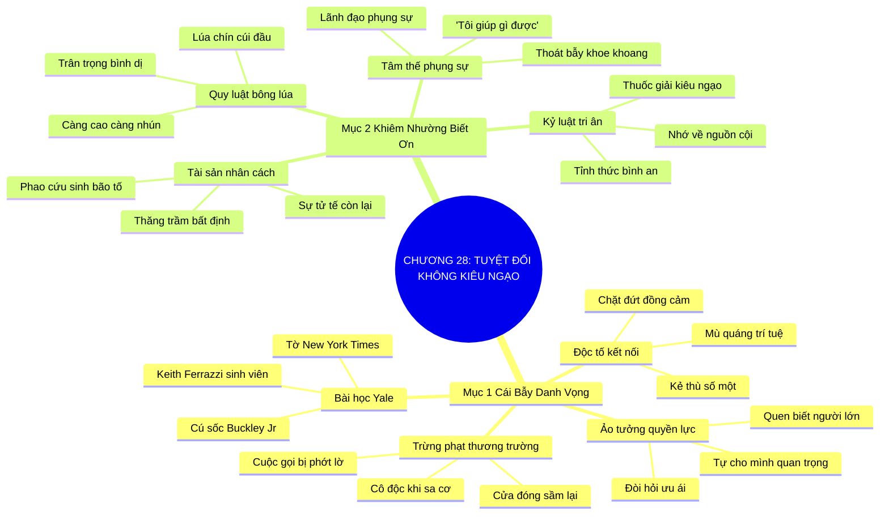

# SƠ ĐỒ TƯ DUY TRỰC QUAN: CHƯƠNG 28: TUYỆT ĐỐI KHÔNG BAO GIỜ KIÊU NGẠO (NEVER GIVE IN TO HUBRIS)
* **Thuộc phần**: Phần 4: Trao Đổi Và Đền Đáp (Trading Up and Giving Back)
* **Tác phẩm**: Đừng Bao Giờ Đi Ăn Một Mình (Never Eat Alone) - Keith Ferrazzi
* **Chuẩn hóa**: Document Structure-Anchored v2.4 (Không nhãn meta thừa, phản ánh 100% cấu trúc tài liệu)

---

## 🌳 SƠ ĐỒ TƯ DUY MERMAID (4-5 TẦNG CHI TIẾT)

---

## 🧬 BẢNG PHÂN CẤP TRUY HỒI CHỦ ĐỘNG (ACTIVE RECALL HIERARCHY)
Cấu trúc hóa tri thức theo các nhánh tài liệu phục vụ ôn tập nhanh và khắc sâu trí nhớ:

| 📑 Nhánh Mục Tài Liệu | 🔑 Từ Khóa Vàng / Khái Niệm | 📝 Nội Dung Truy Hồi Chủ Động (Active Recall) |
| :--- | :--- | :--- |
| Mục 1: Cái Bẫy Ngọt Ngào Của Danh Vọng Và Tự Mãn | **Ảo tưởng quyền lực** | Nguy cơ rơi vào ảo tưởng quyền lực vay mượn khi kết nối với những nhân vật tầm cỡ. |
| Mục 1: Cái Bẫy Ngọt Ngào Của Danh Vọng Và Tự Mãn | **Bài học Yale** | Cú vấp ngã cay đắng thời sinh viên của Keith Ferrazzi nhắc nhở về cái giá của sự ngạo mạn bồng bột. |
| Mục 1: Cái Bẫy Ngọt Ngào Của Danh Vọng Và Tự Mãn | **Độc tố kết nối** | Kiêu ngạo là kẻ thù số một làm tiêu tan mọi thiện cảm và sự tôn trọng của cộng đồng. |
| Mục 2: Giữ Vững Tâm Thế Khiêm Nhường Và Biết Ơn | **Quy luật bông lúa** | Càng leo lên vị trí cao hơn càng phải biết cúi mình thấp hơn và lắng nghe sâu sắc. |
| Mục 2: Giữ Vững Tâm Thế Khiêm Nhường Và Biết Ơn | **Phao cứu sinh nhân cách** | Khi danh vọng mất đi, nhân cách tử tế đã đối đãi với người khác là thứ duy nhất nâng đỡ bạn. |
| Mục 2: Giữ Vững Tâm Thế Khiêm Nhường Và Biết Ơn | **Tâm thế phụng sự** | Chuyển dịch trọng tâm từ khoe khoang quen biết sang nỗ lực phụng sự và giúp đỡ người khác. |

---

## ⚡ BẢNG NEO TRÍ NHỚ NHANH (MEMORY ANCHOR CHEAT SHEET)
Tóm tắt cô đọng các công thức và quy tắc hành động của chương:

| 📑 Phần/Mục Tài Liệu | 📌 Khái Niệm Cốt Lõi | ⚖️ Nguyên Lý Vàng | 🚀 Hành Động Chuyển Hóa Ngay |
| :--- | :--- | :--- | :--- |
| Mục 1: Cái bẫy danh vọng | **Ảo tưởng quyền lực** | Tránh ảo tưởng mình quan trọng vì quen người lớn | Giữ đôi chân đứng vững trên mặt đất |
| Mục 1: Cái bẫy danh vọng | **Bài học thức tỉnh** | Sự ngạo mạn luôn dẫn đến trừng phạt cay đắng | Tỉnh thức trước những lời tán tụng sáo rỗng |
| Mục 2: Khiêm nhường biết ơn | **Quy luật bông lúa** | Càng thành công càng cúi mình khiêm tốn | Trân trọng từng con người bình dị đồng hành |
| Mục 2: Khiêm nhường biết ơn | **Lãnh đạo phụng sự** | Hỏi: 'Tôi có thể giúp gì?' thay vì khoe khoang | Bảo vệ uy tín và sự gắn kết bền vững |

