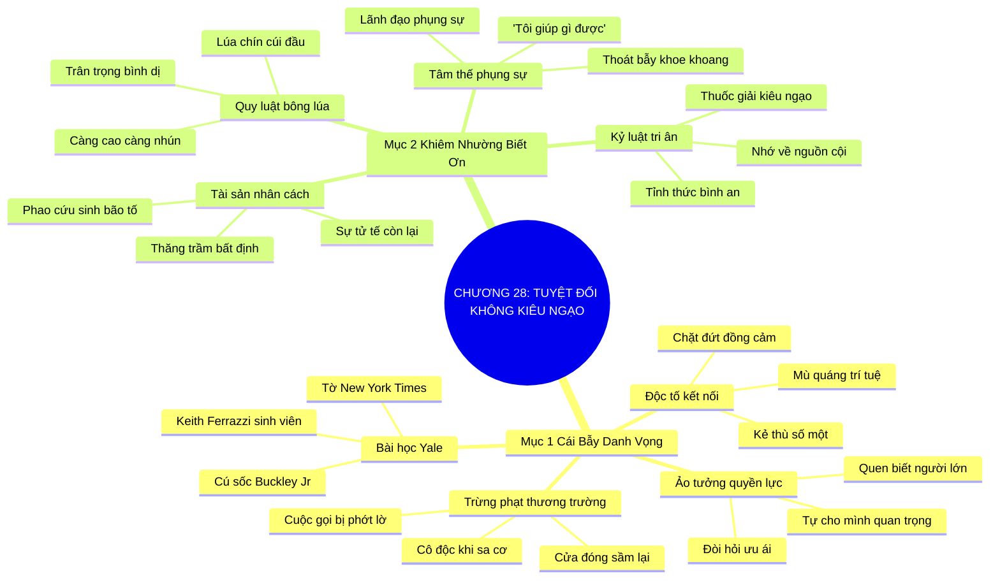

# TÓM TẮT CHƯƠNG SÁCH: CHƯƠNG 28: TUYỆT ĐỐI KHÔNG BAO GIỜ KIÊU NGẠO (NEVER GIVE IN TO HUBRIS)
* **Thuộc phần**: Phần 4: Trao Đổi Và Đền Đáp (Trading Up and Giving Back)
* **Tác giả**: Keith Ferrazzi (với Tahl Raz)
* **Chuẩn hóa cấu trúc**: Document Structure-Anchored v2.4

---

## 🌟 THÔNG ĐIỆP CỐT LÕI (CORE MESSAGE)
> Cái bẫy ngọt ngào của danh vọng: Khi ở đỉnh cao thành công, càng leo lên cao càng phải cúi mình thấp hơn; giữ vững sự khiêm nhường và lòng biết ơn là lá chắn bảo vệ nhân cách giúp bạn vượt qua mọi thăng trầm cuộc đời.

---

## 📊 LƯỢC ĐỒ PHÂN BỔ CẤU TRÚC TÀI LIỆU
Bảng đối chiếu tỷ lệ và cấu trúc luận điểm bám sát các đề mục thực tế trong tài liệu:

| 📑 Đề Mục Trong Tài Liệu Gốc | 🎯 Số Lượng Luận Điểm Chuyên Sâu |
| :--- | :---: |
| Mục 1: Cái Bẫy Ngọt Ngào Của Danh Vọng Và Sự Tự Mãn | 4 |
| Mục 2: Giữ Vững Tâm Thế Khiêm Nhường Và Biết Ơn | 4 |
| **Tổng cộng toàn chương** | **8 Luận Điểm** |

---

## 💡 HỆ THỐNG LUẬN ĐIỂM QUAN TRỌNG (KEY TAKEAWAYS)

#### 📑 PHẦN: MỤC 1: CÁI BẪY NGỌT NGÀO CỦA DANH VỌNG VÀ SỰ TỰ MÃN

##### 1. Hiện tượng tâm lý nguy hiểm khi kết nối với giới quyền lực
* **Phân Tích Chuyên Sâu**: Khi một người trẻ may mắn xây dựng được quan hệ với những nhân vật quyền lực hàng đầu, một ảo tưởng tâm lý nguy hiểm rất dễ xuất hiện: Họ bắt đầu cảm thấy bản thân mình cũng quan trọng và quyền lực như những người họ quen biết. Quán tính thành công khiến lòng tự kiêu len lỏi vào từng hành vi và bắt đầu đòi hỏi sự ưu ái từ người khác.
* **Công Cụ / Phương Pháp Đi Kèm**: Ảo tưởng quyền lực vay mượn (The Borrowed Power Illusion), Bẫy tự mãn Hubris.
* **Ví Dụ Thực Tế Ứng Dụng**: Khoe khoang số điện thoại của các bộ trưởng và tỏ thái độ hách dịch với nhân viên phục vụ.

##### 2. Bài học xương máu thời sinh viên Yale của Keith Ferrazzi
* **Phân Tích Chuyên Sâu**: Năm thứ hai tại Đại học Yale, Keith ra tranh cử Hội đồng thành phố và được báo New York Times phỏng vấn. Say men tung hô, ông đã phát biểu ngạo mạn làm tổn thương tượng đài truyền thông William F. Buckley Jr. Hậu quả là ông phải hứng chịu một đòn trừng phạt truyền thông đích đáng, khiến ông bừng tỉnh khỏi cơn mê muội của lòng kiêu hãnh.
* **Công Cụ / Phương Pháp Đi Kèm**: Cú sốc thức tỉnh lòng khiêm nhường (The Yale Awakening Shock - Buckley Incident).
* **Ví Dụ Thực Tế Ứng Dụng**: Lời phát biểu bồng bột ngạo mạn trên mặt báo quốc gia suýt nữa đã hủy hoại hoàn toàn tương lai chính trị và sự nghiệp của tác giả.

##### 3. Sự kiêu ngạo là kẻ thù số một của nghệ thuật kết nối
* **Phân Tích Chuyên Sâu**: Kiêu ngạo làm mù quáng trí tuệ và chặt đứt mọi sợi dây đồng cảm giữa người với người. Người kiêu ngạo chỉ muốn khoe khoang những người họ quen biết; họ không còn khả năng lắng nghe và phụng sự chân thành.
* **Công Cụ / Phương Pháp Đi Kèm**: Nhận diện độc tố kiêu ngạo (Hubris Toxicity in Networking).
* **Ví Dụ Thực Tế Ứng Dụng**: Khách hàng lập tức hủy hợp đồng khi thấy đối tác tỏ thái độ trịch thượng và coi thường ý kiến của cấp dưới.

##### 4. Sự trừng phạt tất yếu của thương trường đối với lòng tự mãn
* **Phân Tích Chuyên Sâu**: Thế giới kinh doanh luôn có cách trừng phạt những kẻ ngạo mạn một cách tàn nhẫn nhất. Những cánh cửa từng mở toang sẽ đột ngột đóng sầm lại, những cuộc gọi từng được nhấc máy ngay sẽ bị phớt lờ hoàn toàn khi danh tiếng bị vấy bẩn bởi sự trịch thượng.
* **Công Cụ / Phương Pháp Đi Kèm**: Quy luật phản lực xã hội đối với sự ngạo mạn (The Social Backlash Law).
* **Ví Dụ Thực Tế Ứng Dụng**: Nhiều lãnh đạo ngạo mạn khi mất chức đã hoàn toàn cô độc và không còn một người bạn nào sẵn lòng giúp đỡ.

#### 📑 PHẦN: MỤC 2: GIỮ VỮNG TÂM THẾ KHIÊM NHƯỜNG VÀ BIẾT ƠN

##### 5. Quy luật bông lúa: Càng lên cao càng cúi mình thấp hơn
* **Phân Tích Chuyên Sâu**: Giống như bông lúa chín trĩu hạt luôn cúi đầu, một nhà lãnh đạo và kết nối chân chính khi càng leo lên những nấc thang danh vọng cao hơn càng phải biết cúi mình thấp hơn, biết lắng nghe nhiều hơn và trân trọng từng con người bình dị đã đồng hành cùng mình.
* **Công Cụ / Phương Pháp Đi Kèm**: Triết lý bông lúa chín (The Ripe Rice Ear Humility Principle).
* **Ví Dụ Thực Tế Ứng Dụng**: Vị chủ tịch tập đoàn luôn chủ động cúi đầu chào hỏi và cảm ơn người nhân viên vệ sinh dọn phòng làm việc mỗi sáng.

##### 6. Nhân cách và sự chân thành: Phao cứu sinh duy nhất khi bão tố
* **Phân Tích Chuyên Sâu**: Cuộc đời luôn có những giai đoạn thăng trầm bất định. Khi tiền tài, chức vị và danh vọng mất đi sau một biến cố thị trường, thứ duy nhất còn ở lại nâng đỡ bạn chính là nhân cách, sự tử tế và lòng biết ơn mà bạn đã đối đãi với mọi người khi bạn ở đỉnh cao.
* **Công Cụ / Phương Pháp Đi Kèm**: Tài sản nhân cách bền vững (Character Asset as Ultimate Safety Net).
* **Ví Dụ Thực Tế Ứng Dụng**: Khi công ty phá sản, hàng chục đối tác cũ đã cùng nhau quyên góp vốn giúp người doanh nhân tử tế tái khởi nghiệp.

##### 7. Chuyển dịch câu hỏi trọng tâm từ khoe khoang sang phụng sự
* **Phân Tích Chuyên Sâu**: Thước đo của một nhà kết nối bậc thầy không phải là câu hỏi: 'Tôi quen biết những ai?' mà là câu hỏi: 'Tôi có thể làm gì để phụng sự và giúp đỡ những con người này tốt hơn mỗi ngày?'. Phụng sự là đỉnh cao của sự khiêm nhường thông thái.
* **Công Cụ / Phương Pháp Đi Kèm**: Câu hỏi định vị phụng sự (The Servant-Leadership Question).
* **Ví Dụ Thực Tế Ứng Dụng**: Bắt đầu mỗi ngày bằng việc tự hỏi: 'Hôm nay mình có thể giải quyết khó khăn nào cho đội ngũ và bạn bè?'

##### 8. Thực hành lòng biết ơn hàng ngày như một kỷ luật tâm thức
* **Phân Tích Chuyên Sâu**: Lòng biết ơn là liều thuốc giải độc duy nhất đối với sự kiêu ngạo. Thường xuyên gửi lời tri ân đến những người đã nâng đỡ bạn thời gian đầu lập nghiệp sẽ giữ cho tâm hồn bạn luôn tỉnh thức và bình an.
* **Công Cụ / Phương Pháp Đi Kèm**: Nhật ký tri ân nguồn cội (Gratitude Journaling for Roots).
* **Ví Dụ Thực Tế Ứng Dụng**: Mỗi dịp lễ tết đều viết thư cảm ơn gửi đến những người cố vấn đầu tiên đã dạy dỗ mình từ thuở hàn vi.

---

## 🎯 KẾ HOẠCH HÀNH ĐỘNG TOÀN DIỆN (ACTION PLAN)
### ⚡ Cấp độ 1: Thói quen vi mô (Micro-habits < 2 phút mỗi ngày)
- [ ] Viết lời cảm ơn chân thành đến 1 người đã nâng đỡ bạn thời kỳ khó khăn nhất
- [ ] Kiểm tra lại lời nói và hành vi xem có biểu hiện khoe khoang quan hệ tuần qua không
- [ ] Chủ động chào hỏi niềm nở và cảm ơn nhân viên bảo vệ, lễ tân công ty hôm nay
- [ ] Lắng nghe trọn vẹn ý kiến của một nhân viên mới mà không vội vàng phán xét
- [ ] Tự nhắc nhở: Uy tín của những người bạn quen biết không phải là năng lực của bạn

### 📅 Cấp độ 2: Thói quen tuần & Dự án ngắn hạn (Weekly Habits)
- [ ] Nhận trách nhiệm về mình khi dự án gặp sự cố thay vì đổ lỗi cho cấp dưới
- [ ] Thực hành nhường lời khen ngợi và hào quang thành công cho các thành viên trong nhóm
- [ ] Đọc lại bài học xương máu của Keith Ferrazzi với William F. Buckley Jr.
- [ ] Giữ tác phong ăn mặc và giao tiếp giản dị, khiêm tốn khi tiếp xúc với mọi người
- [ ] Không bao giờ sử dụng tên tuổi nhân vật lớn để đe dọa hoặc ép buộc người khác

### 🚀 Cấp độ 3: Chiến lược chuyển hóa dài hạn (Long-term Strategy)
- [ ] Viết nhật ký cuối ngày ghi lại 3 điều bạn biết ơn cuộc đời và đồng nghiệp
- [ ] Xin lỗi chân thành nếu nhận ra mình đã có thái độ trịch thượng với ai đó
- [ ] Tham gia một hoạt động thiện nguyện lao động chân tay để nhắc nhở bản thân về thực tại
- [ ] Đặt câu hỏi: 'Tôi có thể giúp gì cho anh?' thay vì kể về thành tích bản thân
- [ ] Giữ vững tâm thế học hỏi từ mọi người bạn gặp trên đường đời

---

## ❓ BỘ CÂU HỎI TỰ VẤN & PHẢN TƯ SUY NGẪM (REFLECTION QUESTIONS)
### Nhóm 1: Nhận thức thực tại & Thói quen hiện tại
1. Bạn đã bao giờ rơi vào ảo tưởng mình quan trọng chỉ vì quen biết một vài nhân vật lớn chưa?
2. Tại sao sự kiêu ngạo lại được xem là cái bẫy ngọt ngào và nguy hiểm nhất của thành công?
3. Bài học thất bại cay đắng thời sinh viên Yale của Keith Ferrazzi để lại suy ngẫm gì cho bạn?
4. Cảm giác của bạn thế nào khi chứng kiến một người liên tục khoe khoang số điện thoại của người nổi tiếng?
5. Tại sao hình ảnh 'bông lúa chín cúi đầu' lại là biểu tượng vĩ đại của người thành đạt?

### Nhóm 2: Thách thức tâm lý & Rào cản nội tâm
6. Khi danh tiếng, chức vụ và tiền bạc mất đi, điều gì sẽ thực sự ở lại bảo vệ bạn?
7. Làm thế nào để phân biệt giữa sự tự tin chính đáng và sự tự kiêu ngạo mạn?
8. Bạn đối xử với nhân viên phục vụ, tài xế hay lao công như thế nào khi không có ai nhìn thấy?
9. Lần gần nhất bạn chân thành nói lời xin lỗi một người cấp dưới là khi nào?
10. Tại sao việc chuyển đổi từ tư duy 'khoe quan hệ' sang 'tư duy phụng sự' lại giải phóng tâm hồn?

### Nhóm 3: Chiến lược hành động & Ứng dụng thực tế
11. Những dấu hiệu cảnh báo sớm nào cho thấy bạn đang bắt đầu rơi vào bẫy ngạo mạn?
12. Làm sao để giữ được sự khiêm nhường tuyệt đối giữa một môi trường ngập tràn sự tâng bốc nịnh nọt?
13. Bạn có nhớ và tri ân những người đã trao cho bạn cơ hội đầu tiên khi bạn còn trắng tay không?
14. Sự trừng phạt của thương trường đối với những kẻ tự mãn thường diễn ra theo cách thức nào?
15. Bạn cảm thấy thế nào khi nhường lại toàn bộ ánh hào quang thành công cho đội ngũ của mình?

### Nhóm 4: Chuyển hóa tư duy & Tầm nhìn dài hạn
16. Tại sao người thực sự quyền lực lại thường là những người giản dị và khiêm tốn nhất?
17. Làm thế nào để thực hành lòng biết ơn như một kỷ luật tâm thức hàng ngày?
18. Việc lắng nghe người khác với sự tôn trọng tuyệt đối phản ánh tầm vóc văn hóa của bạn ra sao?
19. Tại sao nói: 'Càng lên cao càng phải cúi mình thấp hơn' là bí quyết trường tồn của nhà lãnh đạo?
20. Hành động khiêm nhường cụ thể nhất bạn sẽ thực hiện ngay trong ngày hôm nay là gì?

---

## 🧠 SƠ ĐỒ TƯ DUY TRỰC QUAN (MINDMAP)

