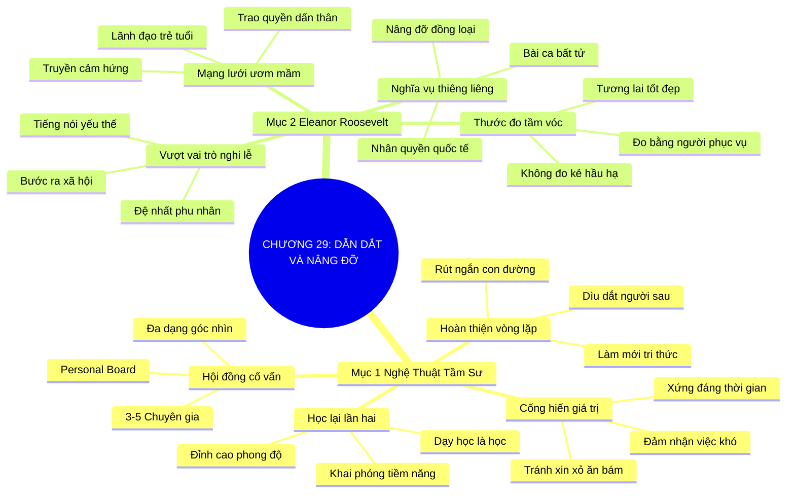

# SƠ ĐỒ TƯ DUY TRỰC QUAN: CHƯƠNG 29: TÌM NGƯỜI DẪN DẮT, DẪN DẮT NGƯỜI KHÁC (FIND MENTORS, FIND MENTEES, REPEAT)
* **Thuộc phần**: Phần 4: Trao Đổi Và Đền Đáp (Trading Up and Giving Back)
* **Tác phẩm**: Đừng Bao Giờ Đi Ăn Một Mình (Never Eat Alone) - Keith Ferrazzi
* **Chuẩn hóa**: Document Structure-Anchored v2.4 (Không nhãn meta thừa, phản ánh 100% cấu trúc tài liệu)

---

## 🌳 SƠ ĐỒ TƯ DUY MERMAID (4-5 TẦNG CHI TIẾT)

---

## 🧬 BẢNG PHÂN CẤP TRUY HỒI CHỦ ĐỘNG (ACTIVE RECALL HIERARCHY)
Cấu trúc hóa tri thức theo các nhánh tài liệu phục vụ ôn tập nhanh và khắc sâu trí nhớ:

| 📑 Nhánh Mục Tài Liệu | 🔑 Từ Khóa Vàng / Khái Niệm | 📝 Nội Dung Truy Hồi Chủ Động (Active Recall) |
| :--- | :--- | :--- |
| Mục 1: Nghệ Thuật Tầm Sư Học Đạo Và Dẫn Lối | **Học lại lần hai** | Dạy học là cách học sâu sắc nhất; ai cũng cần một người thầy cố vấn để chạm tới đỉnh cao. |
| Mục 1: Nghệ Thuật Tầm Sư Học Đạo Và Dẫn Lối | **Cống hiến giá trị** | Tiếp cận mentor bằng sự phụng sự và cống hiến giá trị chứ không phải thái độ xin xỏ cơ hội. |
| Mục 1: Nghệ Thuật Tầm Sư Học Đạo Và Dẫn Lối | **Hoàn thiện vòng lặp** | Chủ động dìu dắt thế hệ đi sau để hoàn thiện vòng tuần hoàn tri thức và làm mới bản thân. |
| Mục 2: Đại Sảnh Danh Vọng Eleanor Roosevelt | **Vượt vai trò nghi lễ** | Eleanor Roosevelt chủ động dấn thân phụng sự người nghèo khổ và phong trào dân quyền. |
| Mục 2: Đại Sảnh Danh Vọng Eleanor Roosevelt | **Nâng đỡ đồng loại** | Nghĩa vụ thiêng liêng nhất của con người trong xã hội tự do là tận tâm nâng đỡ đồng loại. |
| Mục 2: Đại Sảnh Danh Vọng Eleanor Roosevelt | **Thước đo tầm vóc** | Tầm vóc con người đo bằng số người họ đã tận tâm phục vụ và truyền cảm hứng. |

---

## ⚡ BẢNG NEO TRÍ NHỚ NHANH (MEMORY ANCHOR CHEAT SHEET)
Tóm tắt cô đọng các công thức và quy tắc hành động của chương:

| 📑 Phần/Mục Tài Liệu | 📌 Khái Niệm Cốt Lõi | ⚖️ Nguyên Lý Vàng | 🚀 Hành Động Chuyển Hóa Ngay |
| :--- | :--- | :--- | :--- |
| Mục 1: Nghệ thuật tầm sư | **Cống hiến giá trị** | Chủ động giúp đỡ mentor trước khi xin lời khuyên | Biến quan hệ cố vấn thành sự đồng hành bền vững |
| Mục 1: Nghệ thuật tầm sư | **Vòng lặp dìu dắt** | Học từ thầy rồi truyền dạy cho thế hệ sau | Làm mới và củng cố tri thức liên tục |
| Mục 2: Eleanor Roosevelt | **Nâng đỡ đồng loại** | Tận tâm phụng sự và bảo vệ người yếu thế | Xây dựng mạng lưới lãnh đạo trẻ phụng sự |
| Mục 2: Eleanor Roosevelt | **Thước đo tầm vóc** | Đo bằng số người bạn đã phục vụ và dìu dắt | Định nghĩa chân chính về sự vĩ đại |

