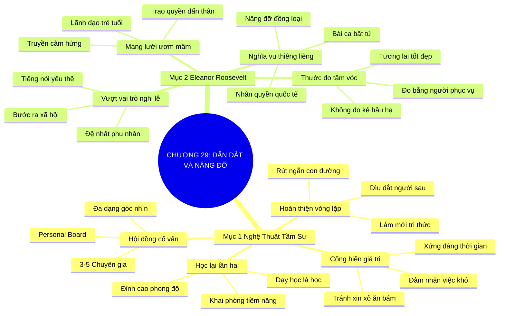

# TÓM TẮT CHƯƠNG SÁCH: CHƯƠNG 29: TÌM NGƯỜI DẪN DẮT, DẪN DẮT NGƯỜI KHÁC (FIND MENTORS, FIND MENTEES, REPEAT)
* **Thuộc phần**: Phần 4: Trao Đổi Và Đền Đáp (Trading Up and Giving Back)
* **Tác giả**: Keith Ferrazzi (với Tahl Raz)
* **Chuẩn hóa cấu trúc**: Document Structure-Anchored v2.4

---

## 🌟 THÔNG ĐIỆP CỐT LÕI (CORE MESSAGE)
> Vòng tròn kỳ diệu của sự nâng đỡ: Tầm sư học đạo bằng sự cống hiến giá trị, dìu dắt thế hệ kế tiếp để làm mới tri thức, và học tập biểu tượng Eleanor Roosevelt—tầm vóc con người đo bằng số người họ đã tận tâm phục vụ.

---

## 📊 LƯỢC ĐỒ PHÂN BỔ CẤU TRÚC TÀI LIỆU
Bảng đối chiếu tỷ lệ và cấu trúc luận điểm bám sát các đề mục thực tế trong tài liệu:

| 📑 Đề Mục Trong Tài Liệu Gốc | 🎯 Số Lượng Luận Điểm Chuyên Sâu |
| :--- | :---: |
| Mục 1: Nghệ Thuật Tầm Sư Học Đạo Và Dẫn Lối Cho Thế Hệ Kế Tiếp | 4 |
| Mục 2: Đại Sảnh Danh Vọng Kết Nối: Biểu Tượng Eleanor Roosevelt | 4 |
| **Tổng cộng toàn chương** | **8 Luận Điểm** |

---

## 💡 HỆ THỐNG LUẬN ĐIỂM QUAN TRỌNG (KEY TAKEAWAYS)

#### 📑 PHẦN: MỤC 1: NGHỆ THUẬT TẦM SƯ HỌC ĐẠO VÀ DẪN LỐI CHO THẾ HỆ KẾ TIẾP

##### 1. Chân lý 'Dạy học chính là học lại lần thứ hai'
* **Phân Tích Chuyên Sâu**: Triết gia H. J. Brown từng đúc kết chân lý bất hủ: Dạy học chính là học lại lần thứ hai. Những nhạc trưởng thiên tài, vận động viên Olympic hay các tổng giám đốc đẳng cấp thế giới đều không thể chạm tới đỉnh cao phong độ nếu thiếu một người thầy cố vấn (Mentor) tận tụy dẫn đường chỉ lối bên cạnh.
* **Công Cụ / Phương Pháp Đi Kèm**: Chân lý Mentor - Mentee (The Mentorship Imperative - H. J. Brown Quote).
* **Ví Dụ Thực Tế Ứng Dụng**: Các kỳ lân công nghệ Thung lũng Silicon luôn có các nhà sáng lập kỳ cựu đứng sau làm cố vấn chiến lược.

##### 2. Bản chất quan hệ Mentor: Đồng hành dựa trên cống hiến giá trị
* **Phân Tích Chuyên Sâu**: Tìm kiếm người cố vấn không phải là tìm người ban phát ân huệ hay xin xỏ việc làm. Đó là mối quan hệ đồng hành dựa trên sự tôn trọng và sẵn sàng cống hiến. Bạn phải chủ động mang lại giá trị cho người thầy: gánh vác những việc khó khăn, hỗ trợ nghiên cứu và chứng minh bằng hành động rằng thời gian họ đầu tư cho bạn là hoàn toàn xứng đáng.
* **Công Cụ / Phương Pháp Đi Kèm**: Nguyên tắc tầm sư chủ động (Value-Driven Mentee Protocol), Tránh tâm lý ăn bám.
* **Ví Dụ Thực Tế Ứng Dụng**: Tình nguyện làm trợ lý nghiên cứu không lương hàng đêm cho một giáo sư kinh tế để học hỏi tư duy chiến lược của ông.

##### 3. Hoàn thiện vòng tròn bằng việc dìu dắt thế hệ đi sau
* **Phân Tích Chuyên Sâu**: Vòng tròn tri thức chỉ thực sự hoàn thiện khi bạn chủ động trở thành người cố vấn cho những người trẻ tuổi hơn. Khi truyền dạy những bài học xương máu cho thế hệ kế tiếp, bạn không chỉ giúp họ rút ngắn con đường thành công mà chính bạn cũng đang củng cố, hệ thống hóa và làm mới lại toàn bộ kiến thức của bản thân.
* **Công Cụ / Phương Pháp Đi Kèm**: Vòng lặp hoàn thiện tri thức (The Complete Mentorship Loop: Learn -> Practice -> Teach).
* **Ví Dụ Thực Tế Ứng Dụng**: Dành 2 giờ mỗi tuần làm mentor cho các dự án khởi nghiệp sinh viên tại trường đại học cũ.

##### 4. Xây dựng 'Hội đồng cố vấn cá nhân' đa dạng (Personal Board of Advisors)
* **Phân Tích Chuyên Sâu**: Đừng chỉ dựa vào một người thầy duy nhất. Hãy xây dựng một 'Hội đồng cố vấn cá nhân' gồm 3-5 chuyên gia thuộc các lĩnh vực khác nhau: một người giỏi chuyên môn, một người thông thái về nhân sinh, một người am hiểu tài chính và một người trẻ tuổi am hiểu công nghệ mới.
* **Công Cụ / Phương Pháp Đi Kèm**: Hội đồng cố vấn cá nhân (Personal Board of Advisors - PBA Architecture).
* **Ví Dụ Thực Tế Ứng Dụng**: Định kỳ mỗi quý xin lời khuyên từ 4 người cố vấn khác nhau trước khi đưa ra quyết định chuyển đổi sự nghiệp.

#### 📑 PHẦN: MỤC 2: ĐẠI SẢNH DANH VỌNG KẾT NỐI: BIỂU TƯỢNG ELEANOR ROOSEVELT

##### 5. Biểu tượng Eleanor Roosevelt: Vượt khỏi vai trò nghi lễ
* **Phân Tích Chuyên Sâu**: Đệ nhất Phu nhân Eleanor Roosevelt là một trong những phụ nữ vĩ đại nhất thế kỷ 20. Không chấp nhận ngồi yên trong vai trò một phu nhân tổng thống mang tính nghi lễ, bà đã bước ra xã hội, trở thành tiếng nói của những người yếu thế, công nhân nghèo khổ và phong trào dân quyền.
* **Công Cụ / Phương Pháp Đi Kèm**: Hình mẫu lãnh đạo dấn thân (The Activist Leadership Model - Eleanor Roosevelt).
* **Ví Dụ Thực Tế Ứng Dụng**: Đi thị sát các mỏ than khắc nghiệt và các khu ổ chuột để lắng nghe trực tiếp nỗi khổ của người lao động.

##### 6. Mạng lưới truyền cảm hứng và ươm mầm lãnh đạo trẻ
* **Phân Tích Chuyên Sâu**: Bà xây dựng nên một mạng lưới rộng lớn gồm các nhà hoạt động xã hội, học giả và chính khách trẻ tuổi. Bà không ngừng truyền cảm hứng, bồi dưỡng và trao quyền để họ trở thành những nhà lãnh đạo tương lai của đất nước.
* **Công Cụ / Phương Pháp Đi Kèm**: Ươm mầm thế hệ lãnh đạo (Next-Gen Empowerment Network).
* **Ví Dụ Thực Tế Ứng Dụng**: Tổ chức các buổi gặp gỡ thường kỳ tại Nhà Trắng để các nhà hoạt động trẻ đối thoại trực tiếp với các nhà lập pháp.

##### 7. Nghĩa vụ thiêng liêng nhất: Nâng đỡ đồng loại
* **Phân Tích Chuyên Sâu**: Eleanor Roosevelt tin rằng vẻ đẹp và nghĩa vụ thiêng liêng nhất của một con người khi được sống trong một xã hội tự do chính là nghĩa vụ nâng đỡ đồng loại. Cuộc đời bà là bài ca bất tử về sự dâng hiến và kết nối vì những mục tiêu cao cả.
* **Công Cụ / Phương Pháp Đi Kèm**: Triết lý nâng đỡ đồng loại (The Human Uplift Duty).
* **Ví Dụ Thực Tế Ứng Dụng**: Chủ trì soạn thảo Tuyên ngôn Quốc tế Nhân quyền năm 1948, văn kiện lịch sử bảo vệ phẩm giá con người trên toàn cầu.

##### 8. Thước đo tầm vóc thực sự của một con người
* **Phân Tích Chuyên Sâu**: Bài học vĩnh cửu từ Eleanor Roosevelt: Tầm vóc thực sự của một con người không đo bằng số người phục vụ dưới trướng của họ, mà đo bằng số người mà họ đã tận tâm phục vụ, dìu dắt và truyền cảm hứng để cùng nhau vươn tới một tương lai tốt đẹp hơn.
* **Công Cụ / Phương Pháp Đi Kèm**: Thước đo tầm vóc phụng sự (The True Measure of Greatness Metric).
* **Ví Dụ Thực Tế Ứng Dụng**: Được hàng triệu người dân trên khắp thế giới tôn kính không phải vì quyền lực mà vì tấm lòng phụng sự vô bờ bến.

---

## 🎯 KẾ HOẠCH HÀNH ĐỘNG TOÀN DIỆN (ACTION PLAN)
### ⚡ Cấp độ 1: Thói quen vi mô (Micro-habits < 2 phút mỗi ngày)
- [ ] Xác định 1 người cố vấn (Mentor) lý tưởng bạn muốn học hỏi trong giai đoạn này
- [ ] Tìm hiểu những việc khó khăn người cố vấn đang đối mặt và đề nghị hỗ trợ cụ thể
- [ ] Nhận lời làm người cố vấn (Mentor) cho 1 bạn trẻ mới vào nghề hoặc sinh viên
- [ ] Lên danh sách 3-5 thành viên cho 'Hội đồng cố vấn cá nhân' của riêng bạn
- [ ] Chuẩn bị các câu hỏi cụ thể, sâu sắc trước mỗi buổi gặp gỡ người cố vấn

### 📅 Cấp độ 2: Thói quen tuần & Dự án ngắn hạn (Weekly Habits)
- [ ] Báo cáo kết quả và tiến độ áp dụng lời khuyên sau mỗi lần tham vấn
- [ ] Đọc tiểu sử và các bài phát biểu của Đệ nhất Phu nhân Eleanor Roosevelt
- [ ] Dành 1 buổi trong tháng để hỗ trợ một dự án cộng đồng giúp đỡ người yếu thế
- [ ] Không bao giờ lãng phí thời gian của người cố vấn bằng những câu hỏi chung chung
- [ ] Tạo điều kiện và trao cơ hội cho cấp dưới được thể hiện năng lực trước lãnh đạo

### 🚀 Cấp độ 3: Chiến lược chuyển hóa dài hạn (Long-term Strategy)
- [ ] Gửi quà tặng hoặc thiệp cảm ơn tri ân người thầy nhân ngày sinh nhật của họ
- [ ] Luyện tập cách lắng nghe những trăn trở của thế hệ trẻ với sự đồng cảm cao nhất
- [ ] Đánh giá lại mức độ tiến bộ của bản thân sau 1 năm có sự đồng hành của mentor
- [ ] Khuyến khích người được bạn dẫn dắt (Mentee) tiếp tục dìu dắt những người đi sau
- [ ] Tự hỏi mỗi tuần: 'Mình đã nâng đỡ được bao nhiêu người cùng tiến bước?'

---

## ❓ BỘ CÂU HỎI TỰ VẤN & PHẢN TƯ SUY NGẪM (REFLECTION QUESTIONS)
### Nhóm 1: Nhận thức thực tại & Thói quen hiện tại
1. Ai là người thầy cố vấn có tầm ảnh hưởng lớn nhất đối với những bước ngoặt trong đời bạn?
2. Tại sao câu nói 'Dạy học là học lại lần thứ hai' lại hoàn toàn chính xác trong sự nghiệp?
3. Bạn đã mang lại giá trị thiết thực nào cho người cố vấn của mình để đáp lại sự chỉ dẫn?
4. Cảm giác của bạn thế nào khi chứng kiến một người trẻ do bạn dìu dắt đạt được thành công lớn?
5. Hội đồng cố vấn cá nhân (PBA) của bạn hiện tại đã có đủ các góc nhìn đa dạng chưa?

### Nhóm 2: Thách thức tâm lý & Rào cản nội tâm
6. Eleanor Roosevelt đã để lại bài học gì về việc vượt qua các vai trò nghi lễ để dấn thân thực chất?
7. Tại sao tầm vóc của một người lại đo bằng số người họ phục vụ chứ không phải số người phục vụ họ?
8. Điều gì ngăn cản bạn chủ động tiếp cận và xin một người xuất chúng làm cố vấn?
9. Làm thế nào để một buổi gặp gỡ với mentor mang lại hiệu quả cao nhất trong thời gian ngắn?
10. Bạn xử lý thế nào khi nhận được lời khuyên từ mentor đi ngược lại suy nghĩ ban đầu của bạn?

### Nhóm 3: Chiến lược hành động & Ứng dụng thực tế
11. Có ai trong công ty hoặc cộng đồng đang khao khát được bạn dìu dắt và chia sẻ kinh nghiệm không?
12. Làm sao để duy trì mối quan hệ mentor - mentee bền vững qua nhiều năm tháng?
13. Sự khác biệt giữa một người sếp quản lý thông thường và một người thầy cố vấn là gì?
14. Khi một người mentee vượt qua cả năng lực của bạn, bạn cảm thấy ghen tị hay tự hào?
15. Eleanor Roosevelt đã xây dựng mạng lưới lãnh đạo trẻ để thay đổi xã hội như thế nào?

### Nhóm 4: Chuyển hóa tư duy & Tầm nhìn dài hạn
16. Tại sao việc phụng sự người yếu thế lại nâng tầm phẩm giá và uy tín xã hội của bạn?
17. Làm thế nào để cân đối thời gian giữa việc học hỏi từ mentor và việc giảng dạy cho mentee?
18. Một bài học sâu sắc nhất bạn từng học được từ chính người được bạn dìu dắt là gì?
19. Bạn muốn để lại di sản nâng đỡ con người như thế nào cho thế hệ mai sau?
20. Ai là người đầu tiên bạn sẽ liên hệ để ngỏ lời xin cố vấn hoặc đề nghị dìu dắt trong tuần này?

---

## 🧠 SƠ ĐỒ TƯ DUY TRỰC QUAN (MINDMAP)

