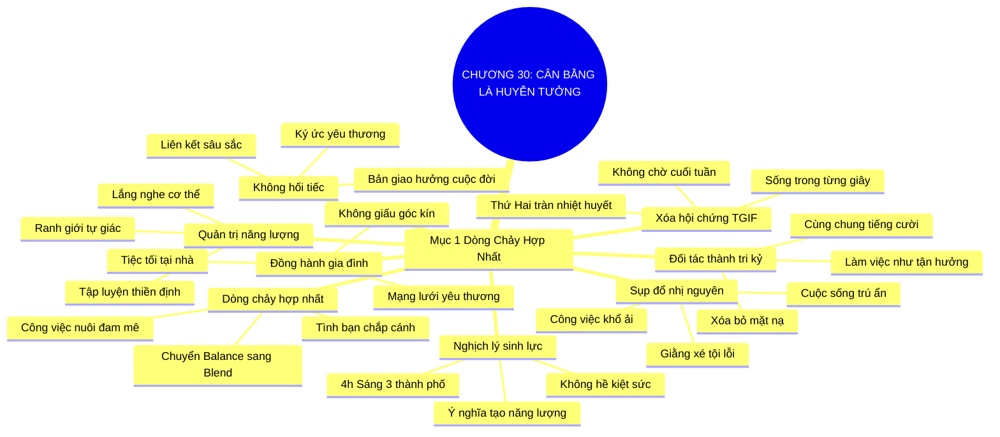

# SƠ ĐỒ TƯ DUY TRỰC QUAN: CHƯƠNG 30: SỰ CÂN BẰNG LÀ MỘT HUYỄN TƯỞNG (BALANCE IS BS)
* **Thuộc phần**: Phần 4: Trao Đổi Và Đền Đáp (Trading Up and Giving Back)
* **Tác phẩm**: Đừng Bao Giờ Đi Ăn Một Mình (Never Eat Alone) - Keith Ferrazzi
* **Chuẩn hóa**: Document Structure-Anchored v2.4 (Không nhãn meta thừa, phản ánh 100% cấu trúc tài liệu)

---

## 🌳 SƠ ĐỒ TƯ DUY MERMAID (4-5 TẦNG CHI TIẾT)

---

## 🧬 BẢNG PHÂN CẤP TRUY HỒI CHỦ ĐỘNG (ACTIVE RECALL HIERARCHY)
Cấu trúc hóa tri thức theo các nhánh tài liệu phục vụ ôn tập nhanh và khắc sâu trí nhớ:

| 📑 Nhánh Mục Tài Liệu | 🔑 Từ Khóa Vàng / Khái Niệm | 📝 Nội Dung Truy Hồi Chủ Động (Active Recall) |
| :--- | :--- | :--- |
| Mục 1: Hợp Nhất Đam Mê Và Sự Nghiệp Thành Một Dòng Chảy | **Sụp đổ nhị nguyên** | Cân bằng công việc - cuộc sống theo lối mòn tạo ra sự chia cắt và cảm giác tội lỗi liên miên. |
| Mục 1: Hợp Nhất Đam Mê Và Sự Nghiệp Thành Một Dòng Chảy | **Nghịch lý sinh lực** | Năng lượng dồi dào không đến từ việc nghỉ ngơi thụ động mà đến từ ý nghĩa và niềm đam mê công việc. |
| Mục 1: Hợp Nhất Đam Mê Và Sự Nghiệp Thành Một Dòng Chảy | **Đối tác thành tri kỷ** | Biến đồng nghiệp và đối tác thành bạn bè giúp xóa bỏ hoàn toàn ranh giới giữa làm việc và tận hưởng. |
| Mục 1: Hợp Nhất Đam Mê Và Sự Nghiệp Thành Một Dòng Chảy | **Xóa hội chứng TGIF** | Chấm dứt việc sống vật vờ chờ cuối tuần; tận hưởng niềm vui cống hiến trong từng khoảnh khắc. |
| Mục 1: Hợp Nhất Đam Mê Và Sự Nghiệp Thành Một Dòng Chảy | **Dòng chảy hợp nhất** | Hợp nhất mọi mảnh ghép cuộc đời thành một bản giao hưởng nơi công việc và tình bạn hòa quyện. |
| Mục 1: Hợp Nhất Đam Mê Và Sự Nghiệp Thành Một Dòng Chảy | **Đồng hành gia đình** | Tích hợp bạn đời và con cái vào các sinh hoạt mạng lưới để cùng chia sẻ yêu thương và giá trị. |

---

## ⚡ BẢNG NEO TRÍ NHỚ NHANH (MEMORY ANCHOR CHEAT SHEET)
Tóm tắt cô đọng các công thức và quy tắc hành động của chương:

| 📑 Phần/Mục Tài Liệu | 📌 Khái Niệm Cốt Lõi | ⚖️ Nguyên Lý Vàng | 🚀 Hành Động Chuyển Hóa Ngay |
| :--- | :--- | :--- | :--- |
| Mục 1: Dòng chảy hợp nhất | **Balance is BS** | Chấm dứt chia cắt công việc và đời sống | Giải phóng cảm giác giằng xé nội tâm |
| Mục 1: Dòng chảy hợp nhất | **Đối tác thành bạn bè** | Biến đồng nghiệp thành những người tri kỷ | Làm việc bằng niềm vui và sự chân thành |
| Mục 1: Dòng chảy hợp nhất | **Xóa bẫy TGIF** | Tận hưởng từng ngày trong tuần trọn vẹn | Tìm kiếm ý nghĩa trong từng hành động |
| Mục 1: Dòng chảy hợp nhất | **Tích hợp gia đình** | Đưa người thân cùng hòa nhập mạng lưới | Kiến tạo cuộc đời ngập tràn yêu thương |

