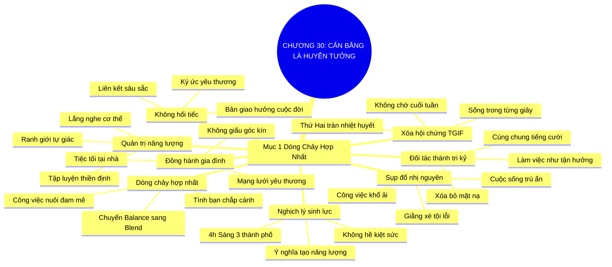

# TÓM TẮT CHƯƠNG SÁCH: CHƯƠNG 30: SỰ CÂN BẰNG LÀ MỘT HUYỄN TƯỞNG (BALANCE IS BS)
* **Thuộc phần**: Phần 4: Trao Đổi Và Đền Đáp (Trading Up and Giving Back)
* **Tác giả**: Keith Ferrazzi (với Tahl Raz)
* **Chuẩn hóa cấu trúc**: Document Structure-Anchored v2.4

---

## 🌟 THÔNG ĐIỆP CỐT LÕI (CORE MESSAGE)
> Chấm dứt cuộc chiến chia cắt giả tạo: Cân bằng công việc và cuộc sống theo kiểu cơ học là một huyễn tưởng—hãy hợp nhất đam mê, sự nghiệp và tình bạn thành một dòng chảy hài hòa duy nhất để tận hưởng cuộc sống trong từng giây phút cống hiến.

---

## 📊 LƯỢC ĐỒ PHÂN BỔ CẤU TRÚC TÀI LIỆU
Bảng đối chiếu tỷ lệ và cấu trúc luận điểm bám sát các đề mục thực tế trong tài liệu:

| 📑 Đề Mục Trong Tài Liệu Gốc | 🎯 Số Lượng Luận Điểm Chuyên Sâu |
| :--- | :---: |
| Mục 1: Hợp Nhất Đam Mê Và Sự Nghiệp Thành Một Dòng Chảy Hạnh Phúc | 8 |
| **Tổng cộng toàn chương** | **8 Luận Điểm** |

---

## 💡 HỆ THỐNG LUẬN ĐIỂM QUAN TRỌNG (KEY TAKEAWAYS)

#### 📑 PHẦN: MỤC 1: HỢP NHẤT ĐAM MÊ VÀ SỰ NGHIỆP THÀNH MỘT DÒNG CHẢY HẠNH PHÚC

##### 1. Sự sụp đổ của khái niệm cân bằng truyền thống (Balance is BS)
* **Phân Tích Chuyên Sâu**: Khái niệm 'cân bằng công việc - cuộc sống' (Work-Life Balance) theo lối mòn truyền thống giả định rằng công việc là gánh nặng đau khổ và cuộc sống là nơi trú ẩn hạnh phúc cần chia đều 50/50. Sự chia cắt nhân tạo này tạo ra cuộc giằng xé nội tâm đau đớn, khiến con người luôn cảm thấy tội lỗi và kiệt sức ở cả hai bờ chiến tuyến.
* **Công Cụ / Phương Pháp Đi Kèm**: Phê phán nhị nguyên công việc - cuộc sống (Work-Life Duality Critique), Giải phóng cảm giác tội lỗi.
* **Ví Dụ Thực Tế Ứng Dụng**: Ngồi làm việc thì lo lắng cho gia đình, khi ở bên gia đình lại bồn chồn nghĩ về các dự án dở dang.

##### 2. Nghịch lý lịch trình bận rộn nhưng tràn đầy sinh lực
* **Phân Tích Chuyên Sâu**: Keith Ferrazzi thức dậy lúc 4h sáng ở Los Angeles, bay qua 3 thành phố trong ngày, dự dạ tiệc tối và xử lý hàng trăm email nhưng không hề kiệt sức; ông tràn đầy niềm vui sống. Sinh lực không đến từ số giờ ngủ hay nghỉ ngơi thụ động, mà đến từ mức độ đam mê và ý nghĩa của những việc bạn làm.
* **Công Cụ / Phương Pháp Đi Kèm**: Nghịch lý sinh lực kết nối (The Energy Paradox: Ý nghĩa tạo ra sinh lực).
* **Ví Dụ Thực Tế Ứng Dụng**: Làm việc 14 tiếng với các cộng sự thân thiết tràn ngập tiếng cười mà không cảm thấy mệt mỏi.

##### 3. Biến đồng nghiệp và đối tác thành bạn bè tri kỷ
* **Phân Tích Chuyên Sâu**: Khi đối tác kinh doanh và đồng nghiệp cũng chính là những người bạn tri kỷ mà bạn yêu quý nhất, ranh giới giữa 'làm việc' và 'tận hưởng' hoàn toàn biến mất. Bạn không còn phải đeo mặt nạ công sở lạnh lùng; bạn được sống là chính mình trong mọi cuộc họp và bữa ăn thương mại.
* **Công Cụ / Phương Pháp Đi Kèm**: Hợp nhất đối tác thành bạn hữu (Colleagues to Compatriots Integration).
* **Ví Dụ Thực Tế Ứng Dụng**: Cùng đối tác và gia đình họ đi nghỉ mát chung, vừa tắm biển vừa thảo luận về chiến lược kinh doanh năm tới.

##### 4. Chấm dứt hội chứng chờ đợi ngày cuối tuần (Thank God It's Friday)
* **Phân Tích Chuyên Sâu**: Thảm kịch của cuộc đời là sống vật vờ từ thứ Hai đến thứ Sáu chỉ để mong chờ 2 ngày cuối tuần được sống. Khi hợp nhất công việc với đam mê, bạn đang sống, đang yêu thương, đang kết nối và cống hiến trọn vẹn trong từng giây phút của mỗi ngày.
* **Công Cụ / Phương Pháp Đi Kèm**: Xóa bỏ hội chứng TGIF (Eradicating the Weekend-Waiting Syndrome).
* **Ví Dụ Thực Tế Ứng Dụng**: Háo hức thức dậy vào sáng thứ Hai với ngọn lửa nhiệt huyết được gặp gỡ những người bạn đồng hành.

##### 5. Dòng chảy cuộc đời hợp nhất (Life Integration Flow)
* **Phân Tích Chuyên Sâu**: Thay vì tìm kiếm sự cân bằng tĩnh tại cơ học, hãy hướng tới 'Dòng chảy hợp nhất' (Integration): Công việc nuôi dưỡng đam mê, đam mê dẫn dắt các mối quan hệ, và tình bạn chắp cánh cho sự nghiệp thăng hoa. Mọi mảnh ghép hòa quyện thành một bản giao hưởng hoàn chỉnh.
* **Công Cụ / Phương Pháp Đi Kèm**: Mô hình dòng chảy hợp nhất (Life Integration Flow Model), Chuyển từ Balance sang Blend.
* **Ví Dụ Thực Tế Ứng Dụng**: Tổ chức hội thảo kết hợp hoạt động leo núi thể thao cho khách hàng, gắn kết công việc, sở thích và tình bạn.

##### 6. Lôi kéo gia đình vào vòng tròn kết nối xã hội
* **Phân Tích Chuyên Sâu**: Đừng giấu gia đình trong một góc kín tách biệt với thế giới sự nghiệp. Hãy đưa bạn đời và con cái cùng tham gia các bữa tiệc tối tại nhà, các chuyến công tác kết hợp du lịch để họ cùng hòa nhập và trở thành một phần của mạng lưới yêu thương.
* **Công Cụ / Phương Pháp Đi Kèm**: Tích hợp gia đình vào mạng lưới (Family-Network Integration Protocol).
* **Ví Dụ Thực Tế Ứng Dụng**: Con cái cùng phụ giúp chuẩn bị bàn tiệc và trò chuyện thân mật với các vị khách xuất chúng của cha mẹ.

##### 7. Bảo vệ năng lượng cá nhân bằng ranh giới của sự tự giác
* **Phân Tích Chuyên Sâu**: Hợp nhất không có nghĩa là để công việc xâm lấn và hủy hoại sức khỏe. Bạn phải lắng nghe cơ thể, biết cách tái tạo năng lượng tức thời thông qua thiền định, tập luyện thể thao và dinh dưỡng lành mạnh giữa các nhịp kết nối.
* **Công Cụ / Phương Pháp Đi Kèm**: Quản trị năng lượng cơ thể (Energy Renewal Habits: Tập luyện, giấc ngủ chất lượng).
* **Ví Dụ Thực Tế Ứng Dụng**: Dành 45 phút chạy bộ sáng sớm để thanh lọc tâm trí trước khi bắt đầu chuỗi cuộc hẹn trong ngày.

##### 8. Sống một cuộc đời không hối tiếc và tràn ngập ý nghĩa
* **Phân Tích Chuyên Sâu**: Khi nhìn lại cuộc đời, con người không bao giờ ước mình đã dành nhiều thời gian hơn để ngồi trong văn phòng trống rỗng. Họ chỉ nhớ về những người họ đã yêu thương, những mối liên kết sâu sắc họ đã kiến tạo và những giá trị họ đã để lại cho cuộc đời.
* **Công Cụ / Phương Pháp Đi Kèm**: Triết lý sống không hối tiếc (The No-Regrets Life Perspective).
* **Ví Dụ Thực Tế Ứng Dụng**: Mỗi ngày trôi qua đều trọn vẹn vì được bao bọc trong tình bằng hữu và những mục tiêu cao cả.

---

## 🎯 KẾ HOẠCH HÀNH ĐỘNG TOÀN DIỆN (ACTION PLAN)
### ⚡ Cấp độ 1: Thói quen vi mô (Micro-habits < 2 phút mỗi ngày)
- [ ] Rà soát lại xem bạn có đang phân tách công việc và cuộc sống thành hai thái cực đối lập
- [ ] Mời 1 người bạn thân thiết nhất trong công ty cùng đi ăn tối với gia đình bạn
- [ ] Lồng ghép một sở thích cá nhân (chạy bộ, đọc sách) vào một cuộc gặp gỡ đối tác
- [ ] Xóa bỏ thói quen than vãn 'Lại phải đi làm' vào mỗi sáng thứ Hai
- [ ] Đưa bạn đời hoặc con cái cùng tham gia một chuyến công tác kết hợp dã ngoại

### 📅 Cấp độ 2: Thói quen tuần & Dự án ngắn hạn (Weekly Habits)
- [ ] Dành 30-45 phút tập thể dục hoặc thiền định mỗi ngày để duy trì sinh lực đỉnh cao
- [ ] Biến một cuộc họp căng thẳng thành một buổi trao đổi cởi mở bên ly cà phê
- [ ] Tìm kiếm niềm vui và ý nghĩa trong từng nhiệm vụ nhỏ nhất bạn đang thực hiện
- [ ] Tự đánh giá mức độ hài lòng về sự hợp nhất giữa sự nghiệp và cuộc sống
- [ ] Không cảm thấy tội lỗi khi xử lý một công việc cấp bách vào cuối tuần nếu bạn thực sự yêu thích nó

### 🚀 Cấp độ 3: Chiến lược chuyển hóa dài hạn (Long-term Strategy)
- [ ] Đồng thời, không cảm thấy tội lỗi khi dành trọn một buổi chiều bên gia đình giữa tuần
- [ ] Xây dựng môi trường làm việc nơi mọi người được sống thật với cảm xúc của mình
- [ ] Chọn lựa những dự án kinh doanh thực sự mang lại niềm đam mê nội tại
- [ ] Ghi nhận những khoảnh khắc hạnh phúc giản dị diễn ra ngay trong giờ làm việc
- [ ] Hợp nhất các mảnh ghép cuộc đời thành một dòng chảy tràn ngập tình yêu thương

---

## ❓ BỘ CÂU HỎI TỰ VẤN & PHẢN TƯ SUY NGẪM (REFLECTION QUESTIONS)
### Nhóm 1: Nhận thức thực tại & Thói quen hiện tại
1. Bạn có đang cảm thấy mệt mỏi vì cố gắng 'cân bằng' 50/50 giữa công việc và cuộc sống?
2. Tại sao Keith Ferrazzi lại khẳng định rằng sự cân bằng theo lối mòn chỉ là huyễn tưởng?
3. Điều gì sẽ xảy ra nếu những người bạn làm việc cùng cũng chính là những người bạn yêu quý nhất?
4. Bạn có mắc phải hội chứng 'TGIF' (chờ đợi ngày thứ Sáu để được sống) không, tại sao?
5. Nguồn sinh lực thực sự của bạn đến từ đâu: số giờ nghỉ ngơi hay ý nghĩa của việc bạn làm?

### Nhóm 2: Thách thức tâm lý & Rào cản nội tâm
6. Làm thế nào để đưa gia đình cùng tham gia và đồng hành trên con đường sự nghiệp của bạn?
7. Cảm giác của bạn thế nào khi được sống là chính mình 100% ngay trong môi trường công sở?
8. Sự khác biệt giữa một 'kẻ cuồng công việc mù quáng' và một 'người sống trọn vẹn với đam mê' là gì?
9. Làm sao để quản trị năng lượng thể chất và tinh thần giữa một lịch trình kết nối dày đặc?
10. Khi công việc và đam mê hòa làm một, bạn định nghĩa 'nghỉ ngơi' như thế nào?

### Nhóm 3: Chiến lược hành động & Ứng dụng thực tế
11. Bạn có cảm thấy tội lỗi khi làm việc ngoài giờ hay khi nghỉ ngơi trong giờ làm việc không?
12. Những giá trị nào bạn không bao giờ đánh đổi dù trong bất kỳ hoàn cảnh công việc nào?
13. Một chuyến đi công tác kết hợp gia đình thành công nhất của bạn đã diễn ra ra sao?
14. Làm thế nào để biến các áp lực công việc thành những trải nghiệm phát triển cùng đồng đội?
15. Cuộc sống của bạn sẽ thay đổi thế nào nếu bạn xem mỗi ngày làm việc là một ngày hội ngộ bạn bè?

### Nhóm 4: Chuyển hóa tư duy & Tầm nhìn dài hạn
16. Bạn quản lý sự căng thẳng (stress) bằng sự hợp nhất tâm thức như thế nào?
17. Những hoạt động nào trong ngày mang lại cho bạn cảm giác thời gian ngưng đọng (Flow)?
18. Khi về già nhìn lại, bạn muốn thấy cuộc đời mình là hai nửa chia cắt hay một dòng chảy trọn vẹn?
19. Tại sao nói: 'Tình bạn chân chính là đôi cánh đưa sự nghiệp thăng hoa rực rỡ nhất'?
20. Thay đổi nhận thức đầu tiên bạn sẽ thực hiện để hợp nhất cuộc đời mình ngay hôm nay là gì?

---

## 🧠 SƠ ĐỒ TƯ DUY TRỰC QUAN (MINDMAP)

