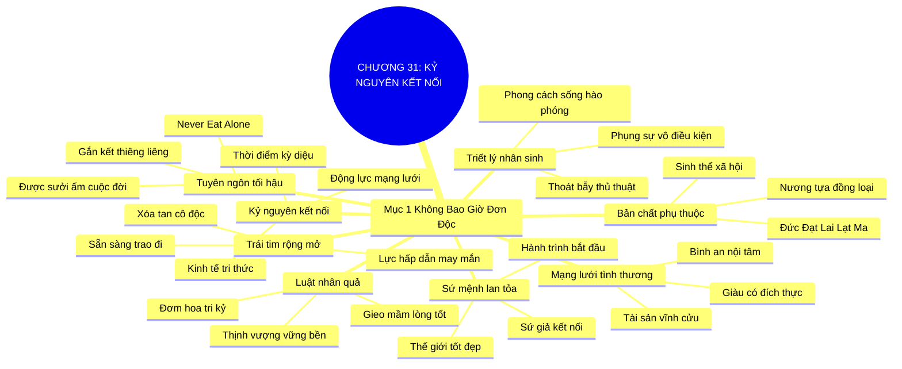

# SƠ ĐỒ TƯ DUY TRỰC QUAN: CHƯƠNG 31: CHÀO ĐÓN KỶ NGUYÊN KẾT NỐI TOÀN CẦU (WELCOME TO THE CONNECTED AGE)
* **Thuộc phần**: Phần 4: Trao Đổi Và Đền Đáp (Trading Up and Giving Back)
* **Tác phẩm**: Đừng Bao Giờ Đi Ăn Một Mình (Never Eat Alone) - Keith Ferrazzi
* **Chuẩn hóa**: Document Structure-Anchored v2.4 (Không nhãn meta thừa, phản ánh 100% cấu trúc tài liệu)

---

## 🌳 SƠ ĐỒ TƯ DUY MERMAID (4-5 TẦNG CHI TIẾT)

---

## 🧬 BẢNG PHÂN CẤP TRUY HỒI CHỦ ĐỘNG (ACTIVE RECALL HIERARCHY)
Cấu trúc hóa tri thức theo các nhánh tài liệu phục vụ ôn tập nhanh và khắc sâu trí nhớ:

| 📑 Nhánh Mục Tài Liệu | 🔑 Từ Khóa Vàng / Khái Niệm | 📝 Nội Dung Truy Hồi Chủ Động (Active Recall) |
| :--- | :--- | :--- |
| Mục 1: Chúng Ta Không Bao Giờ Đơn Độc Trên Thế Gian Này | **Bản chất phụ thuộc** | Con người là sinh thể xã hội lớn lên nhờ nương tựa vào nhau; hạnh phúc nảy nở từ sự gắn kết. |
| Mục 1: Chúng Ta Không Bao Giờ Đơn Độc Trên Thế Gian Này | **Kỷ nguyên kết nối** | Nền kinh tế tri thức vận hành dựa trên sự kết nối mạng lưới toàn cầu và phụ thuộc tương hỗ. |
| Mục 1: Chúng Ta Không Bao Giờ Đơn Độc Trên Thế Gian Này | **Triết lý nhân sinh** | Nghệ thuật kết nối không phải thủ thuật vụ lợi mà là phong cách sống sẻ chia và hào phóng. |
| Mục 1: Chúng Ta Không Bao Giờ Đơn Độc Trên Thế Gian Này | **Luật nhân quả** | Gieo mầm lòng tốt và phụng sự hôm nay sẽ gặt hái tình bạn tri kỷ và thịnh vượng vững bền. |
| Mục 1: Chúng Ta Không Bao Giờ Đơn Độc Trên Thế Gian Này | **Tuyên ngôn tối hậu** | Bạn không bao giờ phải ăn một mình vì cuộc đời luôn được sưởi ấm bởi tình yêu thương. |
| Mục 1: Chúng Ta Không Bao Giờ Đơn Độc Trên Thế Gian Này | **Sứ mệnh lan tỏa** | Trở thành sứ giả kết nối để cùng nhau kiến tạo một thế giới ấm áp, hạnh phúc và thịnh vượng. |

---

## ⚡ BẢNG NEO TRÍ NHỚ NHANH (MEMORY ANCHOR CHEAT SHEET)
Tóm tắt cô đọng các công thức và quy tắc hành động của chương:

| 📑 Phần/Mục Tài Liệu | 📌 Khái Niệm Cốt Lõi | ⚖️ Nguyên Lý Vàng | 🚀 Hành Động Chuyển Hóa Ngay |
| :--- | :--- | :--- | :--- |
| Mục 1: Kỷ nguyên kết nối | **Phụ thuộc tương hỗ** | Con người nương tựa vào đồng loại để tồn tại | Xây dựng hạnh phúc từ sự kết nối thiêng liêng |
| Mục 1: Kỷ nguyên kết nối | **Triết lý hào phóng** | Xem kết nối là phong cách sống phụng sự | Từ bỏ hoàn toàn các mánh khóe cơ hội |
| Mục 1: Kỷ nguyên kết nối | **Luật nhân quả** | Gieo lòng tốt gặt hái thịnh vượng bền lâu | Tin tưởng vào sự công bằng của cuộc đời |
| Mục 1: Kỷ nguyên kết nối | **Never Eat Alone** | Cuộc đời luôn được sưởi ấm bởi tình bằng hữu | Không bao giờ cô độc trên thế gian |

