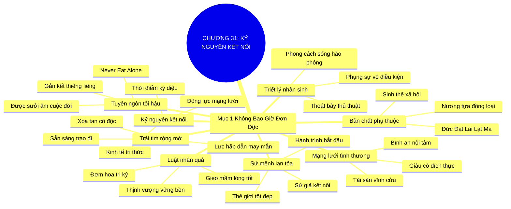

# TÓM TẮT CHƯƠNG SÁCH: CHƯƠNG 31: CHÀO ĐÓN KỶ NGUYÊN KẾT NỐI TOÀN CẦU (WELCOME TO THE CONNECTED AGE)
* **Thuộc phần**: Phần 4: Trao Đổi Và Đền Đáp (Trading Up and Giving Back)
* **Tác giả**: Keith Ferrazzi (với Tahl Raz)
* **Chuẩn hóa cấu trúc**: Document Structure-Anchored v2.4

---

## 🌟 THÔNG ĐIỆP CỐT LÕI (CORE MESSAGE)
> Chúng ta không bao giờ đơn độc trên thế gian này: Trong Kỷ nguyên Kết nối, nghệ thuật quan hệ không phải là thủ thuật vụ lợi mà là triết lý sống hào phóng—gieo hạt mầm yêu thương và sẻ chia hôm nay sẽ gặt hái tình tri kỷ và sự thịnh vượng bền vững muôn đời.

---

## 📊 LƯỢC ĐỒ PHÂN BỔ CẤU TRÚC TÀI LIỆU
Bảng đối chiếu tỷ lệ và cấu trúc luận điểm bám sát các đề mục thực tế trong tài liệu:

| 📑 Đề Mục Trong Tài Liệu Gốc | 🎯 Số Lượng Luận Điểm Chuyên Sâu |
| :--- | :---: |
| Mục 1: Chúng Ta Không Bao Giờ Đơn Độc Trên Thế Gian Này | 8 |
| **Tổng cộng toàn chương** | **8 Luận Điểm** |

---

## 💡 HỆ THỐNG LUẬN ĐIỂM QUAN TRỌNG (KEY TAKEAWAYS)

#### 📑 PHẦN: MỤC 1: CHÚNG TA KHÔNG BAO GIỜ ĐƠN ĐỘC TRÊN THẾ GIAN NÀY

##### 1. Chân lý về bản chất phụ thuộc lẫn nhau của loài người
* **Phân Tích Chuyên Sâu**: Đức Đạt Lai Lạt Ma đã khai sáng: Con người sinh ra là sinh thể xã hội, lớn khôn nhờ sự nương tựa vào đồng loại. Hiếm có khoảnh khắc nào trong đời mà chúng ta không thụ hưởng thành quả từ bàn tay và khối óc của người khác. Hạnh phúc đích thực nảy nở từ các mối liên kết thiêng liêng giữa người với người.
* **Công Cụ / Phương Pháp Đi Kèm**: Chân lý phụ thuộc tương hỗ (Interdependence Truth - Dalai Lama Insight), Bản chất xã hội của con người.
* **Ví Dụ Thực Tế Ứng Dụng**: Từ hạt cơm ta ăn, manh áo ta mặc đến chiếc máy tính ta dùng đều là kết tinh lao động của hàng triệu con người xa lạ.

##### 2. Kỷ nguyên kết nối toàn cầu (The Connected Age)
* **Phân Tích Chuyên Sâu**: Chưa bao giờ trong lịch sử nhân loại lại có một thời điểm thuận lợi và kỳ diệu để kết nối như hiện nay. Nền kinh tế tri thức hiện đại được định hình bởi mạng lưới và sự phụ thuộc lẫn nhau. Càng kết nối sâu rộng với thế giới, bạn càng mở ra nhiều cánh cửa để trao đi và đón nhận những điều kỳ diệu.
* **Công Cụ / Phương Pháp Đi Kèm**: Động lực Kỷ nguyên Kết nối (The Connected Age Dynamics), Sức mạnh mạng lưới tri thức.
* **Ví Dụ Thực Tế Ứng Dụng**: Một ý tưởng sáng tạo có thể tìm thấy cộng sự và nguồn vốn tài trợ từ khắp nơi trên thế giới chỉ sau một cú nhấp chuột.

##### 3. Tái định vị kết nối: Từ thủ thuật vụ lợi sang triết lý nhân sinh
* **Phân Tích Chuyên Sâu**: Nghệ thuật kết nối tuyệt đối không phải là tập hợp các mánh khóe hay thủ thuật ích kỷ để leo lên nấc thang danh vọng. Kết nối chính là một phong cách sống, một triết lý nhân văn sâu sắc về lòng hào phóng, sự thấu cảm và tinh thần phụng sự vô điều kiện.
* **Công Cụ / Phương Pháp Đi Kèm**: Triết lý sống hào phóng (Generosity as a Lifestyle), Khử bỏ mọi thủ thuật cơ hội.
* **Ví Dụ Thực Tế Ứng Dụng**: Giúp đỡ một người bạn khởi nghiệp bằng toàn bộ tâm huyết mà không hề đòi hỏi cổ phần hay hoa hồng.

##### 4. Luật nhân quả công bằng trong vũ trụ quan hệ
* **Phân Tích Chuyên Sâu**: Vũ trụ luôn vận hành theo luật nhân quả tuyệt đối công bằng. Những gì bạn chân thành gieo xuống mảnh đất lòng tốt hôm nay—sự lắng nghe, sự nâng đỡ, sự chia sẻ—sẽ đơm hoa kết trái thành những tình bạn tri kỷ, sự thịnh vượng vững bền và một cuộc đời ngập tràn ý nghĩa mai sau.
* **Công Cụ / Phương Pháp Đi Kèm**: Luật nhân quả trong kết nối (The Karmic Law of Networking / Positive Sowing).
* **Ví Dụ Thực Tế Ứng Dụng**: Một việc tốt thầm lặng bạn làm cách đây 10 năm bất ngờ quay lại cứu công ty bạn trong cơn đại dịch.

##### 5. Sức mạnh của trái tim rộng mở và sẵn sàng cho đi
* **Phân Tích Chuyên Sâu**: Khi bước ra thế giới với trái tim rộng mở và hai bàn tay sẵn sàng trao đi, bạn phá tan mọi nỗi sợ hãi về sự cô độc. Lòng hào phóng là thỏi nam châm mạnh nhất thu hút những tâm hồn cao quý và những điều may mắn đến với cuộc đời bạn.
* **Công Cụ / Phương Pháp Đi Kèm**: Tâm thế trái tim rộng mở (Open-Heart Generosity Posture).
* **Ví Dụ Thực Tế Ứng Dụng**: Luôn chủ động mỉm cười và chìa tay giúp đỡ những người xung quanh mỗi khi họ gặp bối rối.

##### 6. Lời tuyên ngôn tối hậu: 'Bạn không bao giờ phải ăn một mình'
* **Phân Tích Chuyên Sâu**: Tên cuốn sách chính là lời hứa thiêng liêng: Bạn không bao giờ phải ăn trưa một mình, bởi vì cuộc đời của bạn luôn được sưởi ấm và gắn kết cùng tất cả những con người tuyệt vời mà bạn đã yêu thương, trân trọng và giúp đỡ trên suốt chặng đường đời.
* **Công Cụ / Phương Pháp Đi Kèm**: Tuyên ngôn Never Eat Alone (The Universal Never Eat Alone Manifesto).
* **Ví Dụ Thực Tế Ứng Dụng**: Dù đặt chân đến bất kỳ thành phố nào trên thế giới, bạn luôn có những người bạn sẵn lòng mở cửa đón tiếp như người thân.

##### 7. Sự thịnh vượng bền vững bắt nguồn từ mạng lưới yêu thương
* **Phân Tích Chuyên Sâu**: Tiền tài có thể bị lạm phát bào mòn, danh vọng có thể bị thời gian xóa nhòa, nhưng một mạng lưới những người bạn tri kỷ yêu thương và tin tưởng nhau là tài sản vĩnh cửu không gì có thể đánh cắp. Đó là đỉnh cao của sự giàu có đích thực.
* **Công Cụ / Phương Pháp Đi Kèm**: Tài sản mạng lưới tình thương (The Loving Network as Ultimate Wealth).
* **Ví Dụ Thực Tế Ứng Dụng**: Sự bình an nội tâm khi biết rằng phía sau mình luôn có hàng trăm người bạn đồng lòng nâng đỡ.

##### 8. Sứ mệnh lan tỏa ngọn lửa kết nối nhân văn
* **Phân Tích Chuyên Sâu**: Khi khép lại cuốn sách này, hành trình thực sự của bạn mới bắt đầu. Hãy trở thành một sứ giả của sự kết nối, lan tỏa triết lý sống hào phóng này đến gia đình, tổ chức và cộng đồng để cùng nhau xây dựng một thế giới ấm áp, thịnh vượng và hạnh phúc hơn.
* **Công Cụ / Phương Pháp Đi Kèm**: Sứ mệnh người kết nối nhân văn (The Human Connector Mission Mandate).
* **Ví Dụ Thực Tế Ứng Dụng**: Truyền cảm hứng và hướng dẫn lại các nguyên lý kết nối chân thành cho thế hệ trẻ và đồng nghiệp.

---

## 🎯 KẾ HOẠCH HÀNH ĐỘNG TOÀN DIỆN (ACTION PLAN)
### ⚡ Cấp độ 1: Thói quen vi mô (Micro-habits < 2 phút mỗi ngày)
- [ ] Viết ra 3 điều bạn đã học được và cam kết thực hành từ cuốn sách này
- [ ] Gửi một tin nhắn cảm ơn chân thành đến 1 người đã luôn đồng hành cùng bạn suốt thời gian qua
- [ ] Lên kế hoạch cho bữa ăn trưa ngày mai: tuyệt đối không ngồi ăn một mình
- [ ] Trao đi một sự giúp đỡ vô điều kiện cho một người xa lạ hoặc người mới quen
- [ ] Tặng cuốn sách 'Đừng Bao Giờ Đi Ăn Một Mình' cho một người bạn bạn yêu quý

### 📅 Cấp độ 2: Thói quen tuần & Dự án ngắn hạn (Weekly Habits)
- [ ] Nhìn nhận mọi cuộc tiếp xúc hàng ngày như một cơ hội để thực hành lòng hào phóng
- [ ] Rũ bỏ mọi toan tính vụ lợi và mánh khóe cơ hội khi giao tiếp với người khác
- [ ] Mở rộng vòng tay kết nối với những người có hoàn cảnh khó khăn hơn bạn
- [ ] Thực hành thói quen mỉm cười và chào đón thế giới với trái tim rộng mở mỗi sáng
- [ ] Xây dựng một kế hoạch kết nối mạng lưới (NAP) 3 năm cho cuộc đời bạn

### 🚀 Cấp độ 3: Chiến lược chuyển hóa dài hạn (Long-term Strategy)
- [ ] Giữ vững niềm tin tuyệt đối vào luật nhân quả công bằng trong các mối quan hệ
- [ ] Biến sự kết nối thành phong cách sống và văn hóa hàng ngày của bạn
- [ ] Nhắc nhở bản thân: Chúng ta không bao giờ đơn độc trên thế gian này
- [ ] Chia sẻ thông điệp yêu thương và gắn kết đến đội ngũ làm việc của bạn
- [ ] Bước ra thế giới với tâm thế sẵn sàng phụng sự và kiến tạo những điều kỳ diệu

---

## ❓ BỘ CÂU HỎI TỰ VẤN & PHẢN TƯ SUY NGẪM (REFLECTION QUESTIONS)
### Nhóm 1: Nhận thức thực tại & Thói quen hiện tại
1. Cảm xúc lớn nhất của bạn sau khi khép lại những trang cuối cùng của cuốn sách này là gì?
2. Đức Đạt Lai Lạt Ma đã dạy chúng ta bài học gì về sự phụ thuộc tương hỗ giữa con người?
3. Tại sao nói nghệ thuật kết nối là một phong cách sống nhân văn chứ không phải thủ thuật vụ lợi?
4. Bạn cảm nhận thế nào về quy luật nhân quả trong các mối quan hệ mà bạn từng trải qua?
5. Điều gì khiến một người dù sở hữu nhiều tiền tài nhưng vẫn cảm thấy cô độc tột cùng?

### Nhóm 2: Thách thức tâm lý & Rào cản nội tâm
6. Tại sao thông điệp 'Đừng bao giờ đi ăn một mình' lại có sức mạnh lay động hàng triệu độc giả?
7. Lòng hào phóng chân thành đã từng mang lại cho bạn những món quà bất ngờ nào trong đời?
8. Bạn định nghĩa thế nào về một 'mạng lưới yêu thương' đích thực?
9. Làm sao để vượt qua nỗi sợ bị người khác lợi dụng khi mình mở lòng giúp đỡ họ?
10. Sự khác biệt lớn nhất giữa Keith Ferrazzi trước và sau khi lĩnh hội triết lý kết nối là gì?

### Nhóm 3: Chiến lược hành động & Ứng dụng thực tế
11. Bạn có tin rằng bất kỳ ai bạn gặp trên đường đời đều có điều gì đó để bạn học hỏi?
12. Khi bạn cho đi mà không mong đền đáp, tâm hồn bạn cảm thấy nhẹ nhõm và tự do ra sao?
13. Kỷ nguyên kết nối toàn cầu mang lại những cơ hội và thách thức nào cho thế hệ trẻ hôm nay?
14. Làm thế nào để lan tỏa ngọn lửa kết nối nhân văn vào văn hóa doanh nghiệp của bạn?
15. Một hành động tử tế nhỏ bé bạn từng nhận được từ người lạ đã sưởi ấm trái tim bạn như thế nào?

### Nhóm 4: Chuyển hóa tư duy & Tầm nhìn dài hạn
16. Bạn muốn được mọi người nhớ đến như một người như thế nào sau khi rời khỏi thế gian này?
17. Tại sao sự giàu có thực sự của một con người lại được đo bằng chiều sâu của các mối quan hệ?
18. Bạn sẽ làm gì ngay ngày mai để đảm bảo mình sẽ 'không bao giờ phải ăn một mình'?
19. Niềm tin vào lòng tốt của con người có ý nghĩa như thế nào đối với sự bình an nội tâm của bạn?
20. Lời hứa thiêng liêng nhất bạn tự cam kết với bản thân sau khi hoàn thành cuốn sách này là gì?

---

## 🧠 SƠ ĐỒ TƯ DUY TRỰC QUAN (MINDMAP)

