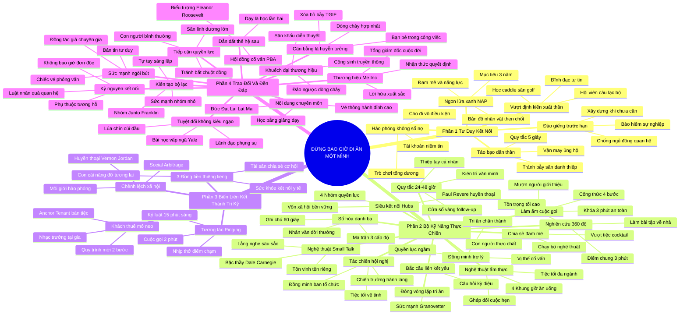

# SƠ ĐỒ TƯ DUY TOÀN DIỆN: ĐỪNG BAO GIỜ ĐI ĂN MỘT MÌNH (NEVER EAT ALONE)
* **Tác phẩm**: Đừng Bao Giờ Đi Ăn Một Mình (Never Eat Alone) - Keith Ferrazzi (với Tahl Raz)
* **Quy mô**: 4 Phần, 31 Chương, bao quát 100% cấu trúc tác phẩm
* **Chuẩn hóa**: Document Structure-Anchored v2.4 (Không nhãn meta thừa, trực quan hóa đỉnh cao)

---

## 🌳 SƠ ĐỒ TƯ DUY MASTER MERMAID

---

## 🧬 BẢNG PHÂN CẤP TRUY HỒI CHỦ ĐỘNG TOÀN DIỆN (MASTER ACTIVE RECALL HIERARCHY)
Hệ thống hóa toàn bộ 4 phần của cuốn sách phục vụ truy xuất nhanh và ôn tập định kỳ:

| 📑 Phần Sách | 🔑 Trụ Cột Tri Thức | 📝 Nội Dung Truy Hồi Chủ Động (Active Recall) |
| :--- | :--- | :--- |
| **Phần 1: Tư Duy Kết Nối (Mindset)** | Hào phóng vô điều kiện & Không sổ nợ | Kết nối không phải đổi chác vụ lợi; trao giá trị trước để xây dựng tài khoản niềm tin khổng lồ. |
| **Phần 1: Tư Duy Kết Nối (Mindset)** | Ngọn lửa xanh & Kế hoạch NAP | Tìm điểm giao thoa đam mê - năng lực và lập kế hoạch hành động 3 năm với các nhân vật then chốt. |
| **Phần 1: Tư Duy Kết Nối (Mindset)** | Đào giếng trước khi chết khát | Chủ động nuôi dưỡng quan hệ khi chưa cần để sẵn sàng nhận trợ lực khi bão tố ập đến. |
| **Phần 2: Kỹ Năng Thực Chiến (Skill Set)** | Bài tập về nhà & Điểm chung 3 phút | Nghiên cứu sâu sắc đời tư nhân văn của đối tác để phá vỡ lớp băng phòng thủ ngay từ đầu. |
| **Phần 2: Kỹ Năng Thực Chiến (Skill Set)** | Danh bạ 3 cấp độ & Ghi chú 60 giây | Số hóa danh bạ và dành 1 phút sau cuộc gặp ghi lại chi tiết con cái, sở thích vào điện thoại. |
| **Phần 2: Kỹ Năng Thực Chiến (Skill Set)** | Công thức 4 bước làm ấm cuộc gọi lạ | Mượn uy tín người bạn chung, nêu giá trị mang lại và cam kết 3 phút để mở khóa mọi rào cản. |
| **Phần 2: Kỹ Năng Thực Chiến (Skill Set)** | Vượt qua người gác cổng nghệ thuật | Tôn trọng trợ lý như đồng minh chiến lược và người cố vấn lịch trình của sếp. |
| **Phần 2: Kỹ Năng Thực Chiến (Skill Set)** | Tối ưu 4 khung giờ ẩm thực | Không bao giờ ăn một mình; tổ chức tiệc tối đa ngành để tạo sự va chạm góc nhìn sâu sắc. |
| **Phần 2: Kỹ Năng Thực Chiến (Skill Set)** | Theo dõi 24-48 giờ & Kiên trì văn minh | Gửi thông điệp cá nhân hóa ngay khi ấn tượng còn ấm; kiên trì lịch thiệp không tự ái. |
| **Phần 2: Kỹ Năng Thực Chiến (Skill Set)** | Biệt đội tác chiến hội nghị & Siêu kết nối | Khai thác sảnh hành lang, tổ chức tiệc vệ tinh và kết nối các nút mạng trung tâm (Paul Revere). |
| **Phần 2: Kỹ Năng Thực Chiến (Skill Set)** | Sức mạnh liên kết yếu & Nghệ thuật Small Talk | Khai thác bạn của bạn và lắng nghe toàn thân không ngắt lời theo triết lý Dale Carnegie. |
| **Phần 3: Biến Liên Kết Thành Tri Kỷ** | 3 Đồng tiền thiêng liêng | Chạm vào Sức khỏe, Tài sản và Con cái để chuyển hóa đối tác thành tri kỷ trọn đời. |
| **Phần 3: Biến Liên Kết Thành Tri Kỷ** | Social Arbitrage & Vernon Jordan | Làm trung tâm điều phối giá trị hào phóng, chuyển giao nguồn lực từ nơi thừa sang nơi thiếu. |
| **Phần 3: Biến Liên Kết Thành Tri Kỷ** | Tương tác Pinging & Khách thuê mỏ neo | Duy trì điểm chạm vi mô thường xuyên và mời nhân vật xuất chúng trước để tạo lực hút bàn tiệc. |
| **Phần 4: Trao Đổi Và Đền Đáp** | Nội dung chuyên môn & Thương hiệu Me Inc | Đầu tư tri thức độc bản, xem mình là CEO cuộc đời và bảo đảm sự xuất sắc vượt kỳ vọng. |
| **Phần 4: Trao Đổi Và Đền Đáp** | Báo chí, Diễn thuyết & Sức mạnh ngòi bút | Bước ra ánh sáng toàn ngành, viết bài phỏng vấn chuyên gia để ngồi ngang hàng người dẫn đầu. |
| **Phần 4: Trao Đổi Và Đền Đáp** | Săn linh dương & Tránh bẫy kiêu ngạo | Can đảm tiếp cận quyền lực bằng sự giản dị chân thành; càng thành công càng cúi mình khiêm tốn. |
| **Phần 4: Trao Đổi Và Đền Đáp** | Dẫn dắt thế hệ sau & Dòng chảy hợp nhất | Học hỏi từ mentor, dìu dắt mentee (Eleanor Roosevelt) và hợp nhất công việc - đam mê trọn vẹn. |

---

## ⚡ BẢNG NEO TRÍ NHỚ ĐẠI BẢN (MASTER MEMORY ANCHOR CHEAT SHEET)
Tóm tắt 10 nguyên lý vàng bất biến của tác phẩm Never Eat Alone:

| 📑 Trụ Cột Chiến Lược | 📌 Khái Niệm Cốt Lõi | ⚖️ Nguyên Lý Vàng | 🚀 Hành Động Chuyển Hóa Ngay |
| :--- | :--- | :--- | :--- |
| **Tư duy phụng sự** | Hào phóng không sổ nợ | Trao giá trị trước không toan tính | Giúp đỡ người khác đạt ước mơ mà không đòi hỏi ơn nghĩa |
| **Định hướng chiến lược** | Ngọn lửa xanh (Blue Flame) | Hợp nhất đam mê cháy bỏng và năng lực | Lập kế hoạch kết nối 3 năm (NAP) với nhân vật then chốt |
| **Chuẩn bị tiếp xúc** | Bài tập về nhà 360 độ | Nghiên cứu đời tư nhân văn trước cuộc gặp | Tìm điểm chung trong 3 phút đầu để phá vỡ phòng thủ |
| **Hệ thống hóa dữ liệu** | Danh bạ 3 cấp độ | Số hóa quan hệ và ghi chú tức thì | Dành 60 giây sau cuộc họp ghi lại thông tin gia đình đối tác |
| **Giao tiếp chủ động** | Làm ấm cuộc gọi 4 bước | Mượn uy tín người bạn chung mở đầu | Cam kết thời gian 3 phút và đề xuất cà phê 15 phút nhẹ nhàng |
| **Ngoại giao đồng minh** | Tôn trọng người gác cổng | Trợ lý là đồng minh chiến lược tối cao | Hỏi xin lời khuyên của trợ lý về thời điểm tiếp cận sếp |
| **Nếp sống kết nối** | Đừng bao giờ đi ăn một mình | Bữa ăn là cỗ máy kết nối không nghỉ | Điền kín lịch ăn trưa và tổ chức tiệc tối đa ngành tại nhà |
| **Chăm sóc bền bỉ** | Cửa sổ vàng 24-48 giờ | Gặp gỡ là gieo hạt, theo dõi là tưới nước | Gửi thiệp viết tay hoặc email cá nhân hóa trong 24 giờ |
| **Đòn bẩy nhân văn** | 3 Đồng tiền thiêng liêng | Chạm vào Sức khỏe, Tài sản và Con cái | Giúp đỡ tương lai con cái và hỗ trợ y tế lúc bạo bệnh |
| **Tầm vóc lãnh đạo** | Phụng sự và Khiêm nhường | Càng lên cao càng cúi mình thấp hơn | Dìu dắt thế hệ đi sau và học tập biểu tượng Eleanor Roosevelt |
