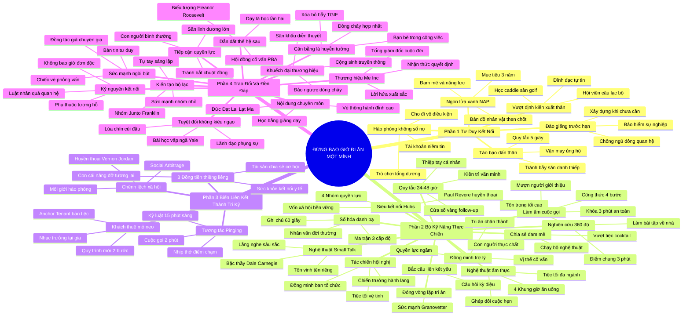

# TỔNG TỔNG QUAN TÁC PHẨM: ĐỪNG BAO GIỜ ĐI ĂN MỘT MÌNH (NEVER EAT ALONE)
* **Tác giả**: Keith Ferrazzi (với Tahl Raz)
* **Thể loại**: Phát triển bản thân, Xây dựng quan hệ, Lãnh đạo & Kinh doanh
* **Quy mô tác phẩm**: 4 Phần, 31 Chương chuyên sâu
* **Chuẩn hóa cấu trúc**: Document Structure-Anchored v2.4

---

## 🌟 THÔNG ĐIỆP CỐT LÕI TOÀN TÁC PHẨM (MASTER CORE MESSAGE)
> Thành công trong sự nghiệp và hạnh phúc trong cuộc sống không phải là trò chơi có tổng bằng không (Zero-Sum Game) của những kẻ cạnh tranh đơn độc, mà là kết quả của lòng hào phóng vô điều kiện và mạng lưới liên minh chiến lược: Khi bạn bước ra thế giới với tâm thế phụng sự, liên tục gieo mầm giá trị và giúp người khác đạt được ước mơ trước khi nhờ vả, vũ trụ sẽ vận hành luật nhân quả để nâng đỡ bạn tới những đỉnh cao rực rỡ nhất—bởi vì bạn sẽ không bao giờ phải cô độc trên thế gian này.

---

## 📊 LƯỢC ĐỒ PHÂN BỔ CẤU TRÚC TÀI LIỆU TOÀN TÁC PHẨM
Bảng tổng hợp đối chiếu 4 phần và 31 chương sách bám sát cấu trúc nguyên bản:

| 📑 Phần & Cấu Trúc Đề Mục | 🎯 Trọng Tâm Chiến Lược | 📌 Số Chương |
| :--- | :--- | :---: |
| **Phần 1: Tư Duy Kết Nối (The Mindset)** | Xây dựng tâm thế hào phóng vô điều kiện, sứ mệnh ngọn lửa xanh (Blue Flame) và lòng can đảm dấn thân | Chương 1 – 6 (6 Chương) |
| **Phần 2: Bộ Kỹ Năng Thực Chiến (The Skill Set)** | Làm bài tập về nhà, số hóa danh bạ, làm ấm cuộc gọi lạ, nghệ thuật vượt qua người gác cổng và tối ưu bữa ăn | Chương 7 – 17 (11 Chương) |
| **Phần 3: Biến Liên Kết Thành Tri Kỷ (Turning Connections into Compatriots)** | Ba đồng tiền thiêng liêng (Sức khỏe, Tài sản, Con cái), kinh doanh chênh lệch xã hội và chiến lược mỏ neo | Chương 18 – 21 (4 Chương) |
| **Phần 4: Trao Đổi Và Đền Đáp (Trading Up and Giving Back)** | Nội dung chuyên môn, thương hiệu Me Inc, diễn thuyết, ngòi bút, tiếp cận quyền lực, nhóm Junto và sự khiêm nhường | Chương 22 – 31 (10 Chương) |
| **Tổng cộng toàn bộ tác phẩm** | **Toàn diện 4 trụ cột kiến tạo mạng lưới quyền lực và nhân văn** | **31 Chương** |

---

## 💡 HỆ THỐNG LUẬN ĐIỂM QUAN TRỌNG TOÀN TÁC PHẨM (KEY TAKEAWAYS)

#### 📑 PHẦN 1: TƯ DUY KẾT NỐI (THE MINDSET) - CHƯƠNG 1 ĐẾN 6
##### 1. Khởi Đầu Từ Caddie Sân Golf: Lòng Can Đảm Vượt Khỏi Định Kiến Xuất Thân
* **Phân Tích Chuyên Sâu**: Từ cậu bé nhặt bóng nghèo khó ở Youngstown, Keith Ferrazzi nhận ra giới thượng lưu không hề thông minh hơn người nghèo; họ chỉ sở hữu một mạng lưới nâng đỡ nhau. Vượt qua sự tự ti để trở thành 'hội viên câu lạc bộ' bắt đầu từ việc dám ước mơ và học hỏi phong thái đĩnh đạc của những người thành đạt.
* **Công Cụ / Phương Pháp Đi Kèm**: Tái định hình bản sắc cá nhân (Identity Reframing), Học hỏi qua quan sát (Shadow Observation).
* **Ví Dụ Thực Tế Ứng Dụng**: Quan sát cách các CEO trò chuyện và đối đãi tử tế với caddie để rút ra bài học ứng xử cho toàn bộ sự nghiệp sau này.

##### 2. Đừng Bao Giờ Giữ Sổ Ghi Nợ: Lòng Hào Phóng Vô Điều Kiện
* **Phân Tích Chuyên Sâu**: Nghệ thuật kết nối chân chính không phải là đổi chác sòng phẳng 'bánh ít đi bánh quy lại'. Người kết nối bậc thầy liên tục trao đi sự giúp đỡ trước mà không đòi hỏi đền đáp, xây dựng 'tài khoản niềm tin' xã hội khổng lồ luôn sẵn sàng sinh lời trong tương lai.
* **Công Cụ / Phương Pháp Đi Kèm**: Nguyên tắc tài khoản niềm tin (Emotional Bank Account), Cho đi không điều kiện (Generosity First).
* **Ví Dụ Thực Tế Ứng Dụng**: Hỗ trợ đồng nghiệp và đối tác kết nối cơ hội việc làm mà không hề đòi hoa hồng hay ơn nghĩa.

##### 3. Tìm Kiếm Ngọn Lửa Xanh (The Blue Flame) Và Lập Kế Hoạch Hành Động (NAP)
* **Phân Tích Chuyên Sâu**: Ngọn lửa xanh là điểm giao thoa giữa niềm đam mê cháy bỏng và năng lực vượt trội của bạn. Khi tìm ra ngọn lửa xanh, bạn chuyển hóa nó thành Kế hoạch Hành động Kết nối (Networking Action Plan - NAP) với mục tiêu 3 năm, 1 năm và danh sách các nhân vật then chốt cần kết nối.
* **Công Cụ / Phương Pháp Đi Kèm**: Mô hình ngọn lửa xanh (The Blue Flame Matrix), Bản kế hoạch hành động kết nối (NAP Framework).
* **Ví Dụ Thực Tế Ứng Dụng**: Lập danh sách 30 nhân vật then chốt trong ngành công nghệ cần tiếp cận để thực hiện mục tiêu trở thành giám đốc tiếp thị trong 3 năm.

##### 4. Đào Giếng Trước Khi Chết Khát: Xây Dựng Quan Hệ Khi Chưa Cần Đến
* **Phân Tích Chuyên Sâu**: Sai lầm chết người của đa số mọi người là chỉ tìm đến người khác khi bị sa thải hoặc cần vay tiền. Xây dựng mạng lưới là hành trình đào giếng bền bỉ khi trời chưa nắng hạn, tích lũy tình cảm để sẵn sàng đón nhận trợ lực khi giông bão ập đến.
* **Công Cụ / Phương Pháp Đi Kèm**: Quy tắc đào giếng liên tục (Dig Your Well Early), Duy trì nhịp độ quan hệ định kỳ.
* **Ví Dụ Thực Tế Ứng Dụng**: Định kỳ gọi điện hỏi thăm các cố vấn và đối tác cũ ngay cả khi công việc của bạn đang ở đỉnh cao thuận lợi.

##### 5. Thiên Tài Của Sự Táo Bạo: Vận May Ủng Hộ Người Dũng Cảm
* **Phân Tích Chuyên Sâu**: Khoảng cách giữa người bình thường và người xuất chúng chính là lòng can đảm dám nhấc máy gọi điện hoặc bước tới bắt tay một nhân vật lớn. Nỗi sợ bị từ chối chỉ là ảo tưởng tâm lý; chủ động đề xuất giá trị sẽ mở ra những cánh cửa tưởng chừng kiên cố nhất.
* **Công Cụ / Phương Pháp Đi Kèm**: Liệu pháp giải mẫn cảm từ chối (Rejection Therapy), Quy tắc 5 giây hành động.
* **Ví Dụ Thực Tế Ứng Dụng**: Gửi thư trực tiếp cho CEO tập đoàn hàng đầu đề xuất giải pháp marketing mới khi mới là sinh viên tốt nghiệp.

##### 6. Tránh Xa Cái Bẫy 'Kẻ Săn Danh Thiếp' (The Networking Jerk)
* **Phân Tích Chuyên Sâu**: Kẻ săn danh thiếp cơ hội chỉ quan tâm đến việc phát thật nhiều danh thiếp và tìm kiếm lợi ích ngắn hạn. Họ bị cộng đồng tinh hoa nhận diện và loại trừ ngay lập tức. Nghệ thuật kết nối đòi hỏi chiều sâu, sự chính trực và tấm lòng phụng sự như Katharine Graham.
* **Công Cụ / Phương Pháp Đi Kèm**: Bộ lọc chính trực kết nối (Integrity Filter), Tiêu chuẩn Katharine Graham.
* **Ví Dụ Thực Tế Ứng Dụng**: Tập trung xây dựng chiều sâu với 2-3 người bạn mới tại hội nghị thay vì chạy quanh phát 100 chiếc danh thiếp vô hồn.

---

#### 📑 PHẦN 2: BỘ KỸ NĂNG THỰC CHIẾN (THE SKILL SET) - CHƯƠNG 7 ĐẾN 17
##### 7. Chuẩn Bị Bài Tập Về Nhà 360 Độ Và Chạm Vào Điểm Chung
* **Phân Tích Chuyên Sâu**: Nghiên cứu kỹ lưỡng về đời sống, gia đình và sở thích của đối tác trước cuộc gặp là biểu hiện tối cao của sự tôn trọng. Tìm ra điểm giao thoa chung (Common Ground) trong 3 phút đầu sẽ làm tan chảy mọi rào cản phòng thủ thương trường.
* **Công Cụ / Phương Pháp Đi Kèm**: Hồ sơ nghiên cứu 360 độ (Pre-Meeting Dossier), Quy tắc phá băng cảm xúc 3 phút.
* **Ví Dụ Thực Tế Ứng Dụng**: Bắt đầu cuộc đàm phán bằng việc chúc mừng chiến thắng bóng đá của con trai đối tác thay vì mở số liệu khô khan.

##### 8. Quản Lý Danh Sách 3 Cấp Độ Và Ghi Chú Nhân Văn 60 Giây
* **Phân Tích Chuyên Sâu**: Não bộ không thể ghi nhớ hàng ngàn liên lạc; cần số hóa thành 3 cấp độ (Cấp 1: Thân cận hàng tháng, Cấp 2: Tiềm năng hàng quý, Cấp 3: Mở rộng hàng năm). Dành 1 phút ngay sau cuộc gặp để lưu lại thông tin con cái, sở thích vào danh bạ.
* **Công Cụ / Phương Pháp Đi Kèm**: Ma trận danh bạ 3 cấp độ (3-Tier Personal CRM), Quy tắc ghi chú nhân văn 60 giây.
* **Ví Dụ Thực Tế Ứng Dụng**: Hỏi thăm chuyến đi nghỉ mát của gia đình đối tác sau 4 tháng dựa trên ghi chú nhanh trong điện thoại.

##### 9. Công Thức 4 Bước Làm Ấm Cuộc Gọi Lạ (Warming The Cold Call)
* **Phân Tích Chuyên Sâu**: Không bao giờ gọi lạnh hoàn toàn; mượn uy tín người bạn chung để xóa tan 80% nghi ngại. Thực hiện công thức 4 bước: 1. Nêu tên & người bảo trợ (10 giây); 2. Nêu mệnh đề giá trị mang lại; 3. Cam kết thời gian 3 phút ngắn gọn; 4. Đưa ra đề xuất hẹn 15 phút nhẹ nhàng.
* **Công Cụ / Phương Pháp Đi Kèm**: Công thức cuộc gọi 4 bước (The 4-Step Call Formula), Cầu nối chuyển giao niềm tin.
* **Ví Dụ Thực Tế Ứng Dụng**: 'Chào anh Tuấn, tôi gọi theo lời khuyên của chị Lan bên ban chiến lược; tôi chỉ xin 3 phút chia sẻ giải pháp tối ưu vận hành...'

##### 10. Nghệ Thuật Biến Người Gác Cổng (Gatekeeper) Thành Đồng Minh
* **Phân Tích Chuyên Sâu**: Trợ lý điều hành là tai mắt và bộ não thứ hai của sếp. Chấm dứt mánh khóe qua mặt thô thiển; đối xử với trợ lý bằng sự tôn trọng tối cao, nhớ tên họ, đồng cảm với áp lực và đặt họ vào vai trò cố vấn chiến lược để tìm ra thời điểm tiếp cận sếp tốt nhất.
* **Công Cụ / Phương Pháp Đi Kèm**: Vị thế đồng minh trợ lý (Consultative Ally Positioning), Bản tóm tắt 1 trang cho trợ lý.
* **Ví Dụ Thực Tế Ứng Dụng**: Gửi thiệp cảm ơn và bánh ngọt tri ân người trợ lý đã vất vả sắp xếp lại lịch họp khẩn cấp cho bạn.

##### 11. Đừng Bao Giờ Đi Ăn Một Mình: Tối Ưu Hóa 4 Khung Giờ Ẩm Thực
* **Phân Tích Chuyên Sâu**: Tận dụng từng bữa ăn thường nhật để kết nối: Sáng (Chiến lược), Trưa (Khám phá thân mật), Chiều (Cà phê cập nhật nhanh), Tối (Tri kỷ sâu sắc). Tổ chức các bữa tiệc tối kết hợp nhiều vòng tròn quan hệ đa ngành để tạo sự va chạm góc nhìn đầy cảm hứng.
* **Công Cụ / Phương Pháp Đi Kèm**: Ma trận 4 khung giờ ẩm thực, Tiệc tối kết hợp đa ngành (Cross-Pollination Dinners).
* **Ví Dụ Thực Tế Ứng Dụng**: Mời một nghệ sĩ, một bác sĩ và một nhà sáng lập công nghệ cùng ăn tối tại nhà riêng để bàn luận về tương lai.

##### 12. Chia Sẻ Đam Mê Vượt Ngoài Phòng Họp Lạnh
* **Phân Tích Chuyên Sâu**: Vượt ra ngoài những buổi tiệc cocktail thương mại hời hợt; kết nối qua đam mê chung (chạy bộ, leo núi, ẩm thực, thiện nguyện) sẽ xóa bỏ mọi ranh giới chức danh, giúp nhìn thấy con người thực chất và xây dựng tình tri kỷ bền vững gấp trăm lần hợp đồng.
* **Công Cụ / Phương Pháp Đi Kèm**: Bảng kiểm kê 5 đam mê cốt lõi (Top 5 Passions Inventory), Hoạt động ngoại khóa tích hợp.
* **Ví Dụ Thực Tế Ứng Dụng**: Mời đối tác cùng tham gia giải chạy marathon sáng Chủ Nhật thay vì ngồi trong phòng họp ngột ngạt.

##### 13. Quy Tắc Vàng Theo Dõi 24-48 Giờ Và Sự Kiên Trì Văn Minh
* **Phân Tích Chuyên Sâu**: Gặp gỡ chỉ là gieo hạt, theo dõi (follow-up) mới là tưới nước. Luôn gửi thông điệp trong vòng 24-48 giờ với công thức 3 phần (Biết ơn + Điểm chung cá nhân + Cam kết tiếp theo). Kiên trì lịch thiệp sau 10 ngày nếu chưa nhận được phản hồi, tuyệt đối không suy diễn tự ái.
* **Công Cụ / Phương Pháp Đi Kèm**: Cửa sổ vàng 24-48h, Kiên trì lịch thiệp (Persistence with Grace), Thiệp viết tay cá nhân.
* **Ví Dụ Thực Tế Ứng Dụng**: Gửi bưu thiếp viết tay cảm ơn và gửi kèm cuốn sách đối tác đang tìm kiếm ngay sáng hôm sau cuộc gặp.

##### 14. Biệt Đội Tác Chiến Hội Nghị: Chiến Trường Hành Lang Và Tiệc Vệ Tinh
* **Phân Tích Chuyên Sâu**: Thay vì ngồi nghe thụ động, hãy biến mình thành 'Conference Commando': Nghiên cứu đại biểu trước 2 tuần, kết thân với ban tổ chức để nhận thông tin mật, dành 60% thời gian ở sảnh hành lang và tổ chức bữa tối vệ tinh riêng cho 8-10 nhân vật tinh hoa nhất.
* **Công Cụ / Phương Pháp Đi Kèm**: Kế hoạch tác chiến hội nghị (Pre-Conference Target List), Bữa tối vệ tinh VIP (Satellite Dinner).
* **Ví Dụ Thực Tế Ứng Dụng**: Đặt trước phòng ăn riêng gần địa điểm hội thảo Davos để chiêu đãi các CEO công nghệ hàng đầu.

##### 15. Kết Nối Với Các Siêu Kết Nối (Super-Connectors) & Bài Học Paul Revere
* **Phân Tích Chuyên Sâu**: Tiếp cận 4 nhóm nút mạng trung tâm (Nhà báo, PR/Headhunter, Chính trị gia, Quỹ đầu tư) để mở khóa toàn bộ hệ sinh thái. Bài học Paul Revere chiến thắng William Dawes nhờ tích lũy mạng lưới niềm tin xã hội sâu rộng suốt cuộc đời.
* **Công Cụ / Phương Pháp Đi Kèm**: Bản đồ 4 nhóm Siêu Kết Nối, Vốn xã hội tích lũy (Social Capital Accumulation).
* **Ví Dụ Thực Tế Ứng Dụng**: Cung cấp dữ liệu phân tích độc quyền cho một phóng viên kinh tế uy tín để họ khuếch đại uy tín của bạn.

##### 16. Kỹ Thuật Bắc Cầu (Bridging) Qua Sức Mạnh Của Những Mối Liên Kết Yếu
* **Phân Tích Chuyên Sâu**: Cơ hội đột phá hiếm khi đến từ bạn thân mà đến từ bạn của bạn (Weak Ties). Luôn hỏi câu hỏi kỳ diệu: 'Anh có quen ai trong mảng này...' ở cuối mỗi cuộc gặp, đồng thời luôn báo cáo kết quả và tri ân người bắc cầu để đóng vòng lặp thông tin.
* **Công Cụ / Phương Pháp Đi Kèm**: Kỹ thuật bắc cầu (Bridging Technique), Câu hỏi mở rộng biên giới, Quy trình đóng vòng lặp (Loop Closing).
* **Ví Dụ Thực Tế Ứng Dụng**: Tìm được đối tác đầu tư chiến lược thông qua lời giới thiệu của một người quen tình cờ gặp tại khóa học năm ngoái.

##### 17. Nghệ Thuật Nói Chuyện Xã Giao Và Bài Học Dale Carnegie
* **Phân Tích Chuyên Sâu**: Nói chuyện xã giao là nghi thức ngoại giao vi mô phá băng tâm lý. Bí quyết lôi cuốn là lắng nghe sâu sắc toàn thân và quan tâm chân thành đến người khác như bậc thầy Dale Carnegie—2 tháng quan tâm người khác kết bạn nhiều hơn 2 năm cố làm người khác quan tâm mình.
* **Công Cụ / Phương Pháp Đi Kèm**: Lắng nghe toàn thân (Active Listening), Kỹ thuật phản chiếu từ khóa (Echo), Tôn vinh tên riêng.
* **Ví Dụ Thực Tế Ứng Dụng**: Lắng nghe say sưa câu chuyện của nhà thực vật học suốt cả buổi tối và được ca ngợi là người đối thoại thông thái nhất.

---

#### 📑 PHẦN 3: BIẾN LIÊN KẾT THÀNH TRI KỶ (COMPATRIOTS) - CHƯƠNG 18 ĐẾN 21
##### 18. Ba Đồng Tiền Thiêng Liêng: Sức Khỏe, Tài Sản Và Con Cái
* **Phân Tích Chuyên Sâu**: Chuyển hóa đối tác thành tri kỷ bằng cách chạm vào 3 mối quan tâm thiêng liêng nhất: Giúp đỡ y tế khi bạo bệnh, chia sẻ cơ hội thịnh vượng chân chính, và nâng đỡ tương lai học tập/nghề nghiệp của con cái họ một cách vô điều kiện.
* **Công Cụ / Phương Pháp Đi Kèm**: Ba đồng tiền thiêng liêng (The 3 Sacred Currencies), Tủ thuốc quan hệ cứu trợ (Emergency Rolodex).
* **Ví Dụ Thực Tế Ứng Dụng**: Kết nối con gái của đối tác vào thực tập tại công ty công nghệ hàng đầu, chiếm trọn lòng biết ơn sâu sắc của cha mẹ.

##### 19. Kinh Doanh Chênh Lệch Xã Hội (Social Arbitrage) & Vernon Jordan
* **Phân Tích Chuyên Sâu**: Trở thành chiếc cầu nối hào phóng chuyển giao nguồn lực từ nơi thừa sang nơi thiếu. Bài học Vernon Jordan: liên tục trao quyền và chia sẻ cơ hội cho người khác để tạo dựng vị thế trung tâm điều phối giá trị bất khả xâm phạm.
* **Công Cụ / Phương Pháp Đi Kèm**: Mô hình Social Arbitrage, Radar dò tìm nhu cầu kết nối, Tư duy trò chơi tổng dương.
* **Ví Dụ Thực Tế Ứng Dụng**: Chủ động kết nối một kỹ sư công nghệ tài năng đang tìm việc với một nhà sáng lập đang khát nhân sự cấp cao.

##### 20. Nghệ Thuật Duy Trì Nhịp Thở Điểm Chạm Liên Tục (Pinging)
* **Phân Tích Chuyên Sâu**: 80% thành công là sự xuất hiện liên tục. Gửi những tín hiệu vi mô (tin nhắn chúc mừng, bài báo hay đúng mối bận tâm, cuộc gọi 2 phút khi lái xe) kèm ghi chú 'Không cần trả lời lại' để giữ toàn bộ mạng lưới luôn ấm áp sẵn sàng hiệp lực.
* **Công Cụ / Phương Pháp Đi Kèm**: Kỹ thuật Pinging vi mô, Cuộc gọi 2 phút (2-Minute Drive Call), Kỷ luật 15 phút mỗi sáng.
* **Ví Dụ Thực Tế Ứng Dụng**: Dành 15 phút đầu giờ sáng gửi 3 tin nhắn chia sẻ bài báo thú vị cho các đối tác quan trọng.

##### 21. Chiến Lược Khách Thuê Mỏ Neo (Anchor Tenants) Trong Tiệc Tối
* **Phân Tích Chuyên Sâu**: Mời được 1-2 nhân vật kiệt xuất có sức hút trí tuệ (tác giả sách, giáo sư, CEO) đồng ý tham dự trước sẽ biến bữa tối của bạn thành đặc quyền không thể chối từ đối với mọi khách mời khác. Đón tiếp ấm cúng tại nhà riêng và đóng vai trò nhạc trưởng điều phối.
* **Công Cụ / Phương Pháp Đi Kèm**: Nguyên lý mỏ neo tiệc tối (Anchor Tenant Strategy), Quy trình mời 2 bước, Đón tiếp tại gia (Home Hosting).
* **Ví Dụ Thực Tế Ứng Dụng**: Mời một giáo sư Harvard làm nhân vật mỏ neo, sau đó dễ dàng quy tụ 8 nhà sáng lập trẻ tham dự bữa tối đối thoại.

---

#### 📑 PHẦN 4: TRAO ĐỔI VÀ ĐỀN ĐÁP (TRADING UP & GIVING BACK) - CHƯƠNG 22 ĐẾN 31
##### 22. Trở Nên Thú Vị Bằng Nội Dung Chuyên Môn & Đức Đạt Lai Lạt Ma
* **Phân Tích Chuyên Sâu**: Nội dung chuyên môn sâu mang góc nhìn độc bản là tấm vé thông hành vào bàn tiệc đỉnh cao. Học hỏi Đức Đạt Lai Lạt Ma cách truyền tải những triết lý uyên thâm bằng câu chuyện giản dị và cảm xúc từ bi chạm tới trái tim con người.
* **Công Cụ / Phương Pháp Đi Kèm**: Tấm vé nội dung chuyên môn (Content Passport), Phương pháp học bằng giảng dạy (Feynman Learning).
* **Ví Dụ Thực Tế Ứng Dụng**: Xung phong đứng lớp đào tạo nội bộ về công nghệ mới để cấu trúc lại tri thức và khẳng định vị thế chuyên gia.

##### 23. Xây Dựng Thương Hiệu Cá Nhân: Tổng Giám Đốc Công Ty 'Me Inc'
* **Phân Tích Chuyên Sâu**: Mỗi người là CEO của công ty cuộc đời mình (Tom Peters). Nhận thức quyết định thực tế: chăm chút từng điểm chạm (trang phục, tác phong, email) và xây dựng thương hiệu dựa trên lời hứa bảo đảm về sự xuất sắc vượt trên kỳ vọng trong từng lần tiếp xúc.
* **Công Cụ / Phương Pháp Đi Kèm**: Mô hình Me Inc, Lời hứa thương hiệu xuất sắc (Brand Promise), Tư duy vượt mô tả công việc (Over-Delivery).
* **Ví Dụ Thực Tế Ứng Dụng**: Luôn nộp báo cáo trước hạn 2 giờ với chất lượng hoàn hảo và đề xuất thêm giải pháp tối ưu chi phí cho công ty.

##### 24. Khuếch Đại Thương Hiệu: Báo Chí Và Sân Khấu Diễn Thuyết
* **Phân Tích Chuyên Sâu**: Bước ra ánh sáng của sự công nhận toàn ngành bằng cách cộng sinh với giới truyền thông (cung cấp số liệu độc quyền) và đứng trên bục diễn giả hội nghị để đảo ngược dòng chảy kết nối từ 'đi săn' sang 'được săn đón'.
* **Công Cụ / Phương Pháp Đi Kèm**: Cộng sinh truyền thông (Media Symbiosis), Bậc thang diễn thuyết (Speaking Ladder), Kể chuyện thực chiến.
* **Ví Dụ Thực Tế Ứng Dụng**: Trình bày tham luận tại diễn đàn quốc gia và nhận được hàng chục lời mời hợp tác chiến lược ngay tại sảnh hội nghị.

##### 25. Sức Mạnh Ngòi Bút: Vũ Khí Mở Mọi Cánh Cửa Tiếp Cận
* **Phân Tích Chuyên Sâu**: Viết bài chuyên môn hoặc phỏng vấn nhân vật lớn biến bạn từ kẻ xa lạ làm phiền thành đối tác truyền thông nghiêm túc. Đề xuất viết chung bài (Co-authoring) hoặc xây dựng bản tin chuyên sâu (Newsletter) để xác lập vị thế chuyên gia hàng đầu.
* **Công Cụ / Phương Pháp Đi Kèm**: Chiếc vé phỏng vấn (Interview Access Strategy), Đồng tác giả chiến lược, Bản tin tư duy lãnh đạo.
* **Ví Dụ Thực Tế Ứng Dụng**: Đề nghị phỏng vấn một CEO tập đoàn lớn cho bài viết trên tạp chí kinh tế, từ đó xây dựng mối quan hệ bạn bè thân thiết.

##### 26. Tiếp Cận Tầng Lớp Quyền Lực: Săn Linh Dương Thay Vì Bắt Chuột Đồng
* **Phân Tích Chuyên Sâu**: Ngụ ngôn Newt Gingrich: Săn chuột đồng sẽ làm sư tử kiệt sức và chết đói; phải can đảm săn linh dương lớn. Tiếp cận người quyền lực bằng cách đối xử với họ như con người bình thường, chia sẻ sở thích nhân văn và luôn mang lại giá trị trước khi nhờ vả.
* **Công Cụ / Phương Pháp Đi Kèm**: Ngụ ngôn Sư tử và Chuột đồng, Đối xử bình đẳng nhân văn (Normalcy Protocol), Giá trị đi trước (Value-First).
* **Ví Dụ Thực Tế Ứng Dụng**: Chủ động gửi bản phân tích rủi ro thị trường hữu ích cho Chủ tịch tập đoàn trước khi xin một cuộc hẹn tư vấn.

##### 27. Kiến Tạo Bộ Lạc Của Riêng Bạn & Bậc Thầy Benjamin Franklin
* **Phân Tích Chuyên Sâu**: Nếu không tìm thấy câu lạc bộ phù hợp, hãy tự mình sáng lập sân chơi. Bài học nhóm Junto 12 thành viên của Benjamin Franklin năm 1727: Từ một nhóm nhỏ thợ thủ công tâm huyết sinh hoạt tối thứ Sáu đã khai sinh ra các định chế vĩ đại làm thay đổi diện mạo nước Mỹ.
* **Công Cụ / Phương Pháp Đi Kèm**: Mô hình Junto Mastermind Circle, Tự tay kiến tạo sân chơi (Community Founder), Định luật Margaret Mead.
* **Ví Dụ Thực Tế Ứng Dụng**: Sáng lập nhóm 6 người bạn cùng chí hướng gặp nhau sáng thứ Bảy hàng tuần để tương trợ giải quyết các bài toán kinh doanh.

##### 28. Tuyệt Đối Không Kiêu Ngạo: Bài Học Thức Tỉnh Từ Sự Tự Mãn
* **Phân Tích Chuyên Sâu**: Càng lên cao càng phải cúi mình thấp hơn như bông lúa chín. Bài học vấp ngã thời sinh viên Yale của Keith nhắc nhở về độc tố của sự kiêu ngạo. Khi danh vọng mất đi, nhân cách tử tế đã đối đãi với mọi người là thứ duy nhất nâng đỡ bạn.
* **Công Cụ / Phương Pháp Đi Kèm**: Triết lý bông lúa chín (Ripe Rice Ear Humility), Tài sản nhân cách bền vững, Tâm thế lãnh đạo phụng sự.
* **Ví Dụ Thực Tế Ứng Dụng**: Luôn cúi đầu chào hỏi và cảm ơn nhân viên lao công, bảo vệ mỗi ngày dù bạn đang giữ vị trí tổng giám đốc.

##### 29. Tìm Người Dẫn Dắt, Dìu Dắt Người Khác & Eleanor Roosevelt
* **Phân Tích Chuyên Sâu**: Tầm sư học đạo bằng sự cống hiến giá trị, dìu dắt thế hệ kế tiếp để làm mới tri thức và xây dựng Hội đồng cố vấn cá nhân. Học tập Eleanor Roosevelt: Tầm vóc con người đo bằng số người họ đã tận tâm phục vụ và truyền cảm hứng.
* **Công Cụ / Phương Pháp Đi Kèm**: Vòng tuần hoàn Mentorship, Hội đồng cố vấn cá nhân (PBA), Thước đo tầm vóc phụng sự.
* **Ví Dụ Thực Tế Ứng Dụng**: Dành 2 giờ mỗi tuần làm mentor hỗ trợ định hướng nghề nghiệp cho các sinh viên năm cuối trường cũ.

##### 30. Sự Cân Bằng Là Huyễn Tưởng: Dòng Chảy Cuộc Đời Hợp Nhất
* **Phân Tích Chuyên Sâu**: Chấm dứt việc chia cắt nhị nguyên giữa công việc và đời sống để loại bỏ cảm giác tội lỗi giằng xé. Khi biến đồng nghiệp thành bạn tri kỷ và lồng ghép đam mê vào sự nghiệp, bạn được sống trọn vẹn từng khoảnh khắc mà không cần chờ đến cuối tuần.
* **Công Cụ / Phương Pháp Đi Kèm**: Mô hình dòng chảy hợp nhất (Life Integration Flow), Chuyển từ Balance sang Blend, Xóa bỏ bẫy TGIF.
* **Ví Dụ Thực Tế Ứng Dụng**: Đưa gia đình cùng tham gia các chuyến công tác kết hợp dã ngoại và gắn kết cùng mạng lưới bạn bè.

##### 31. Chào Đón Kỷ Nguyên Kết Nối: Không Bao Giờ Đơn Độc Trên Thế Gian
* **Phân Tích Chuyên Sâu**: Lời tuyên ngôn tối hậu: Con người sinh ra là sinh thể xã hội nương tựa vào nhau. Nghệ thuật kết nối là triết lý sống nhân văn về lòng hào phóng. Gieo mầm yêu thương hôm nay sẽ gặt hái tình tri kỷ và thịnh vượng vững bền—bạn không bao giờ phải ăn một mình!
* **Công Cụ / Phương Pháp Đi Kèm**: Triết lý phụ thuộc tương hỗ (Dalai Lama Insight), Tuyên ngôn Never Eat Alone, Luật nhân quả quan hệ.
* **Ví Dụ Thực Tế Ứng Dụng**: Lan tỏa văn hóa kết nối nhân văn và chia sẻ cơ hội đến toàn bộ đội ngũ và cộng đồng xung quanh bạn.

---

## 🎯 KẾ HOẠCH HÀNH ĐỘNG CHUYỂN HÓA TOÀN DIỆN (MASTER ACTION PLAN)
### ⚡ Cấp độ 1: Thói quen vi mô hàng ngày (< 2 phút)
- [ ] Thực hiện quy tắc ghi chú nhân văn 60 giây ngay sau mỗi cuộc trò chuyện (lưu sở thích, tên con cái vào danh bạ)
- [ ] Dành 15 phút đầu giờ sáng gửi 3 tin nhắn Pinging chia sẻ bài báo hay hoặc lời chúc tốt đẹp tới đối tác
- [ ] Ghi nhớ và gọi tên người đối thoại ít nhất 2 lần trong mọi cuộc tiếp xúc hàng ngày
- [ ] Thêm ghi chú 'Không cần trả lời lại nhé' khi gửi thông tin giá trị để giải phóng áp lực cho người nhận
- [ ] Chủ động mỉm cười và chào hỏi niềm nở nhân viên bảo vệ, lễ tân tại các tòa nhà bạn đến làm việc
- [ ] Lắng nghe trọn vẹn không ngắt lời và phản chiếu từ khóa cảm xúc (Echo) khi người khác chia sẻ
- [ ] Gửi ngay thông điệp cảm ơn ngắn gọn trong vòng 24 giờ sau khi kết thúc bất kỳ cuộc gặp gỡ nào

### 📅 Cấp độ 2: Kỷ luật tuần & Dự án ngắn hạn (Weekly & Monthly Discipline)
- [ ] Điền kín lịch ăn trưa suốt tuần: tuyệt đối không ngồi ăn một mình trước màn hình máy tính
- [ ] Dành sáng thứ Sáu hàng tuần rà soát danh bạ Cấp 2 (Tiềm năng) và gửi tin nhắn hâm nóng quan hệ
- [ ] Chủ động viết 1 email kết nối 2 người bạn có nhu cầu bổ trợ cho nhau (Social Arbitrage) mỗi tuần
- [ ] Mời 1 đối tác cùng tham gia hoạt động thể thao hoặc sở thích ngoại khóa (chạy bộ, đạp xe, cà phê sách)
- [ ] Viết và xuất bản 1 bài viết chuyên môn 800 từ lên LinkedIn hoặc trang cá nhân mỗi tháng
- [ ] Đọc sách chuyên môn đa ngành ít nhất 30 phút mỗi ngày để nâng cấp vốn 'nội dung độc bản'
- [ ] Tổ chức một bữa tối ấm cúng tại gia với 4-6 người bạn từ các lĩnh vực đa dạng mỗi tháng

### 🚀 Cấp độ 3: Chiến lược kiến tạo cuộc đời dài hạn (Long-term Strategy)
- [ ] Lập Kế hoạch Hành động Kết nối (NAP) 3 năm với danh sách các nhân vật mục tiêu then chốt
- [ ] Thiết lập một câu lạc bộ Junto thời hiện đại gồm 6-8 thành viên tâm huyết sinh hoạt định kỳ
- [ ] Xây dựng 'Hội đồng cố vấn cá nhân' (PBA) gồm 3-5 chuyên gia đầu ngành để tham vấn định hướng lớn
- [ ] Nhận lời làm mentor dìu dắt ít nhất 1 bạn trẻ tiềm năng để hoàn thiện vòng tuần hoàn tri thức
- [ ] Xác định 'chú linh dương' mục tiêu và kiên trì tiếp cận trên nền tảng trao giá trị độc quyền đi trước
- [ ] Bước lên bục diễn giả tại các hội nghị ngành để định vị vị thế người dẫn dắt tư duy (Thought Leader)
- [ ] Hợp nhất công việc, đam mê và tình bạn thành một dòng chảy cuộc đời tràn ngập ý nghĩa và yêu thương

---

## ❓ BỘ CÂU HỎI TỰ VẤN ĐẠI BẢN TÂM THỨC (MASTER REFLECTION QUESTIONS)
### Nhóm 1: Nhận thức thực tại & Thói quen kết nối hiện tại
1. Bạn đang đối xử với các mối quan hệ như những cuộc đổi chác sòng phẳng hay là sự gieo mầm hào phóng?
2. Có bao nhiêu bữa trưa trong tuần qua bạn đã ngồi ăn một mình trong cô độc trước màn hình máy tính?
3. Bạn đang dành bao nhiêu thời gian cho những mối quan hệ an toàn vụn vặt thay vì dũng cảm săn đuổi 'linh dương'?
4. Danh bạ điện thoại của bạn hiện tại là một mớ hỗn độn hay đã được số hóa và phân tầng khoa học?
5. Lần gần nhất bạn chủ động liên lạc với một người bạn cũ mà hoàn toàn KHÔNG có mục đích nhờ vả là khi nào?

### Nhóm 2: Thách thức tâm lý & Rào cản nội tâm
6. Nỗi sợ bị từ chối khi thực hiện một cuộc gọi lạ (Cold Call) xuất phát từ điều gì trong tâm thức bạn?
7. Bạn có cảm thấy tự ti trước những người có vị thế xã hội, tiền bạc hoặc quyền lực cao hơn mình không?
8. Điều gì ngăn cản bạn bước ra ánh sáng để xuất bản bài viết chuyên môn hoặc đứng lên bục diễn giả?
9. Bạn có đang mắc phải cái bẫy tự mãn, ảo tưởng mình quan trọng khi quen biết một vài nhân vật lớn?
10. Tại sao bạn lại ngần ngại chia sẻ những vấp ngã và khó khăn thực sự của bản thân với những người xung quanh?

### Nhóm 3: Chiến lược hành động & Ứng dụng công cụ thực chiến
11. Ngọn lửa xanh (Blue Flame) giao thoa giữa niềm đam mê cháy bỏng và năng lực vượt trội của bạn là gì?
12. Ba người nằm trong danh sách 'Khách thuê mỏ neo' có thể giúp bạn quy tụ bàn tiệc tinh hoa là ai?
13. Bạn đã từng giúp đỡ con cái, sức khỏe hay tài sản của một đối tác để biến họ thành tri kỷ chưa?
14. Kế hoạch cụ thể để bạn biến người trợ lý của một đối tác quan trọng thành đồng minh thân cận là gì?
15. Bạn sẽ áp dụng công thức 4 bước nào để tiếp cận một nhân vật có tầm ảnh hưởng lớn trong tháng này?

### Nhóm 4: Chuyển hóa tư duy & Tầm nhìn nhân sinh dài hạn
16. Khi danh tiếng và chức vụ mất đi sau một biến cố, điều gì sẽ thực sự ở lại bảo vệ và nâng đỡ bạn?
17. Eleanor Roosevelt và Benjamin Franklin đã dạy cho bạn bài học gì về việc phụng sự và kiến tạo cộng đồng?
18. Bạn muốn cuộc đời mình là hai nửa giằng xé giữa công việc - cuộc sống hay là một dòng chảy hợp nhất hạnh phúc?
19. Tầm vóc thực sự của bạn sau khi rời khỏi thế gian này sẽ được đo bằng điều gì?
20. Lời hứa thiêng liêng nhất bạn tự cam kết với bản thân để không bao giờ phải 'đi ăn một mình' là gì?

---

## 🧠 SƠ ĐỒ TƯ DUY TỔNG THỂ MERMAID (MASTER MINDMAP)

