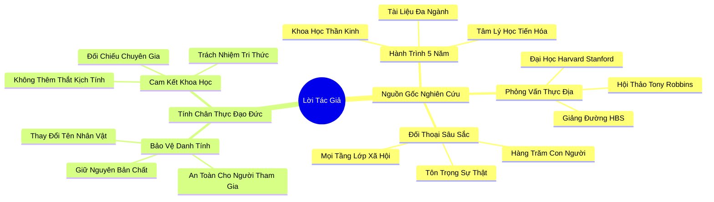

# 🗺️ BẢN ĐỒ TƯ DUY & BẢNG TRA CỨU NEO TRÍ NHỚ: LỜI TÁC GIẢ (AUTHOR'S NOTE)

---

## 1. HỆ THỐNG PHẢ HỆ TRI THỨC (ACTIVE RECALL HIERARCHY)

---

## 2. BẢNG TRA CỨU NEO TRÍ NHỚ SIÊU TỐC (MEMORY ANCHOR CHEAT SHEET)

| 📑 Phần/Mục Tài Liệu | Khái Niệm / Từ Khóa Vàng | Bản Chất Cốt Lõi | Cảnh Báo Sai Lầm Thường Gặp | Hành Động Ứng Dụng Đột Phá |
| :--- | :--- | :--- | :--- | :--- |
| **Phần 1: Nguồn gốc** | **Interdisciplinary Rigor** | Nghiên cứu đa ngành kết hợp khoa học thần kinh, tâm lý tiến hóa và thực địa. | Nhầm lẫn cuốn sách với các tác phẩm self-help truyền động lực hời hợt. | Tiếp cận các tri thức trong sách với tinh thần phản biện khoa học nghiêm túc. |
| **Phần 1: Nguồn gốc** | **In-Depth Narrative** | Phỏng vấn tự sự sâu sắc chạm vào tầng sâu trải nghiệm của hàng trăm cá nhân. | Đánh giá con người qua các con số thống kê vô hồn mà bỏ qua bối cảnh sống. | Lắng nghe câu chuyện của người khác với sự thấu cảm và tôn trọng tuyệt đối. |
| **Phần 2: Đạo đức** | **Ethical Anonymization** | Thay đổi danh tính để bảo vệ sự an toàn cho nhân vật trong khi giữ trọn vẹn bản chất sự thật. | Tiết lộ chuyện riêng tư của người khác khi chưa được họ đồng ý. | Luôn bảo mật thông tin cá nhân của người tâm sự với mình. |
| **Phần 2: Đạo đức** | **Scientific Integrity** | Cam kết tuyệt đối với tính chính xác của các trích dẫn và kết quả nghiên cứu khoa học. | Bóp méo hoặc cường điệu hóa dữ liệu để phục vụ cho quan điểm cá nhân. | Luôn đối chiếu với tài liệu gốc trước khi chia sẻ thông tin chuyên môn. |
